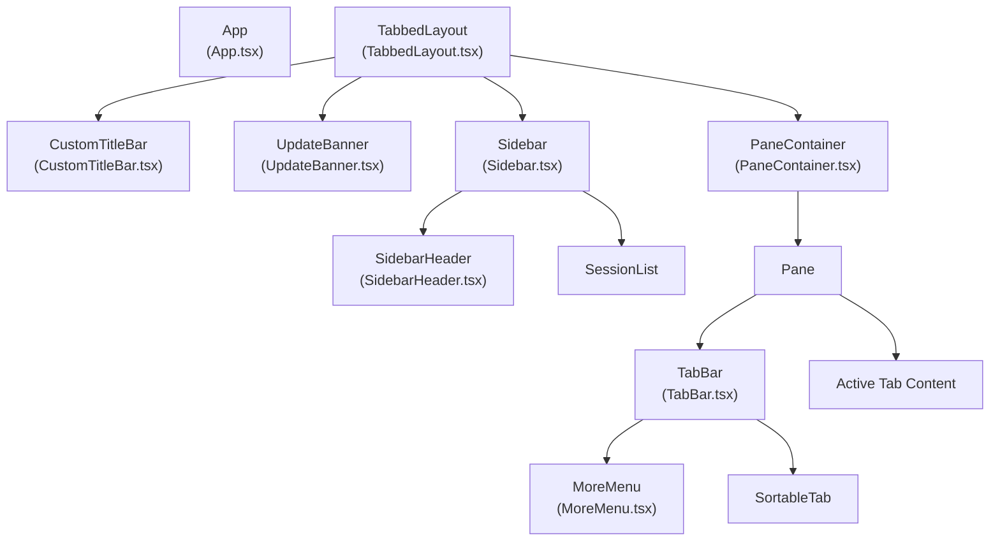
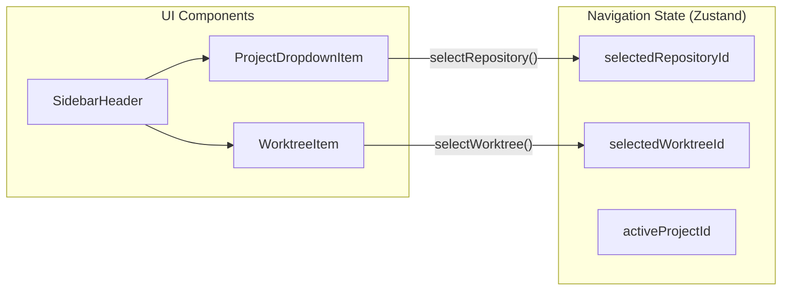

# 사용자 인터페이스

관련 소스 파일

다음 파일들은 이 위키 페이지를 생성하기 위한 컨텍스트로 사용되었습니다.

- [src/main/ipc/window.ts](src/main/ipc/window.ts)
- [src/renderer/api/index.ts](src/renderer/api/index.ts)
- [src/renderer/components/common/UpdateBanner.tsx](src/renderer/components/common/UpdateBanner.tsx)
- [src/renderer/components/layout/CustomTitleBar.tsx](src/renderer/components/layout/CustomTitleBar.tsx)
- [src/renderer/components/layout/MoreMenu.tsx](src/renderer/components/layout/MoreMenu.tsx)
- [src/renderer/components/layout/SidebarHeader.tsx](src/renderer/components/layout/SidebarHeader.tsx)
- [src/renderer/components/layout/TabBar.tsx](src/renderer/components/layout/TabBar.tsx)
- [src/renderer/components/layout/TabbedLayout.tsx](src/renderer/components/layout/TabbedLayout.tsx)
- [src/renderer/index.css](src/renderer/index.css)

## 목적과 범위

이 페이지는 React 컴포넌트, Zustand 상태 관리, 레이아웃 시스템, 사용자 상호작용 패턴을 포함한 claude-devtools의 renderer process UI 아키텍처를 문서화합니다. renderer process는 Node.js API에 직접 접근할 수 없는 격리된 브라우저 컨텍스트에서 실행되며, [IPC Communication Layer](#3.3)에 문서화된 preload bridge를 통해 main process와 통신합니다.

특정 UI 영역에 대한 자세한 내용은 하위 페이지를 참조하세요.
- [Application Shell](#9.1) — App 컴포넌트 초기화, 테마 시스템, 전역 이벤트 리스너.
- [Session Views](#9.2) — 세션 목록 렌더링, 페이지네이션, 상세 뷰, 대화 표시.
- [Command Palette](#9.3) — 검색 인터페이스, 세션 간 검색, 키보드 탐색, 결과 강조 표시.
- [Settings Interface](#9.4) — 설정 UI, SSH 프로필 관리, 알림 트리거 편집기.
- [Real-Time Updates](#9.5) — 파일 변경 처리, 낙관적 업데이트, 새로고침 메커니즘.

## 애플리케이션 아키텍처

renderer process는 TypeScript, Vite, Tailwind CSS로 구축된 React 18 애플리케이션입니다. 상태 관리는 slice 기반 아키텍처의 Zustand를 사용합니다. 모든 UI 컴포넌트는 `src/renderer/index.css`에 정의된 CSS custom properties를 통해 테마가 적용됩니다 [src/renderer/index.css:6-194]().

### 컴포넌트 계층

**출처:** [src/renderer/components/layout/TabbedLayout.tsx:23-52](), [src/renderer/components/layout/TabBar.tsx:29-200](), [src/renderer/components/layout/SidebarHeader.tsx:197-226]()

### 레이아웃과 창 관리

`TabbedLayout` 컴포넌트는 기본 구조 wrapper 역할을 합니다 [src/renderer/components/layout/TabbedLayout.tsx:23-52](). 이 컴포넌트는 `CommandPalette`, `UpdateBanner`, `WorkspaceIndicator` 같은 전역 요소를 관리합니다.

- **Custom Title Bar**: Windows와 Linux에서는 native frame이 숨겨져 있을 때 창 제어 버튼(최소화, 최대화, 닫기)을 제공하기 위해 `CustomTitleBar`가 렌더링됩니다 [src/renderer/components/layout/CustomTitleBar.tsx:23-33](). 이러한 제어 버튼은 `windowControls` IPC API를 통해 통신합니다 [src/main/ipc/window.ts:19-49]().
- **macOS Traffic Lights**: macOS에서는 레이아웃이 CSS 변수 `--macos-traffic-light-padding-left`를 사용해 native window controls를 위한 공간을 확보합니다 [src/renderer/components/layout/TabbedLayout.tsx:32-34]().
- **Sidebar**: 고정 280px 너비를 차지하며, 프로젝트/worktree 선택을 위한 `SidebarHeader`와 세션 목록을 포함합니다 [src/renderer/components/layout/TabbedLayout.tsx:43]().

**출처:** [src/renderer/components/layout/TabbedLayout.tsx:23-52](), [src/renderer/components/layout/CustomTitleBar.tsx:23-96](), [src/main/ipc/window.ts:19-49]()

## 탐색과 탭

UI는 다중 pane 탭 시스템을 사용합니다. 각 pane에는 `TabBar`와 활성 탭의 뷰(Dashboard, Session, Settings 또는 Search)를 렌더링하는 콘텐츠 영역이 포함됩니다.

### TabBar와 Pane 상호작용

`TabBar` 컴포넌트 [src/renderer/components/layout/TabBar.tsx:29-80]()는 다음을 관리합니다.
- **탭 전환**: 탭을 클릭하면 `setActiveTab`을 통해 해당 탭이 활성화됩니다 [src/renderer/components/layout/TabBar.tsx:187]().
- **다중 선택**: 범위 선택을 위한 Shift+click과 선택 토글을 위한 Cmd/Ctrl+click을 지원합니다 [src/renderer/components/layout/TabBar.tsx:153-190]().
- **드래그 앤 드롭**: `@dnd-kit`을 사용해 탭 순서를 변경하고 pane 간에 탭을 이동합니다 [src/renderer/components/layout/TabBar.tsx:118-125]().
- **컨텍스트 메뉴**: 탭 닫기 또는 세션 고정 같은 우클릭 작업을 제공합니다 [src/renderer/components/layout/TabBar.tsx:23-78]().

### More Menu

`MoreMenu` [src/renderer/components/layout/MoreMenu.tsx:32-204]()는 사용 빈도가 낮은 작업에 접근할 수 있게 하며, 다음 그룹으로 구성됩니다.
- **Search**: Command Palette를 트리거합니다 [src/renderer/components/layout/MoreMenu.tsx:85-96]().
- **Export**: 활성 세션을 Markdown, JSON 또는 Plain Text로 내보낼 수 있습니다 [src/renderer/components/layout/MoreMenu.tsx:98-122]().
- **Settings**: 설정 탭을 엽니다 [src/renderer/components/layout/MoreMenu.tsx:124-135]().

**출처:** [src/renderer/components/layout/TabBar.tsx:29-200](), [src/renderer/components/layout/MoreMenu.tsx:32-204]()

## 컨텍스트와 Worktree 선택

`SidebarHeader` [src/renderer/components/layout/SidebarHeader.tsx:197-226]()는 상위 수준의 탐색 컨텍스트를 관리합니다. 사용자는 이 컴포넌트를 통해 서로 다른 프로젝트와 해당 프로젝트 내 특정 Git worktree 사이를 전환할 수 있습니다.

**출처:** [src/renderer/components/layout/SidebarHeader.tsx:197-226](), [src/renderer/components/layout/SidebarHeader.tsx:99-139]()

## 상태와 API 통합

UI는 통합 Zustand store [src/renderer/store/index.ts:32-48]()에 의해 구동되며, 통합 `api` adapter [src/renderer/api/index.ts:59-68]()를 통해 backend와 상호작용합니다.

- **Unified API**: `api` proxy는 Electron에서 실행 중인지(`window.electronAPI` 사용) 또는 브라우저에서 실행 중인지(`HttpAPIClient` 사용)를 감지합니다 [src/renderer/api/index.ts:37-45]().
- **Real-Time Feedback**: `UpdateBanner` [src/renderer/components/common/UpdateBanner.tsx:10-90]()는 애플리케이션 업데이트 상태에 대한 즉각적인 피드백을 제공하며, 다운로드 진행률과 준비 완료 시 "Restart now" 프롬프트를 표시합니다 [src/renderer/components/common/UpdateBanner.tsx:34-78]().

**출처:** [src/renderer/api/index.ts:1-69](), [src/renderer/components/common/UpdateBanner.tsx:10-90]()

## 테마와 시각 언어

시각적 정체성은 dark(기본값)와 light 모드를 모두 지원하는 CSS 변수 세트로 정의됩니다 [src/renderer/index.css:6-206]().

| 영역 | 변수 예시 |
| :--- | :--- |
| **Surface** | `--color-surface`, `--color-surface-sidebar` |
| **Typography** | `--color-text`, `--color-text-muted` |
| **Messages** | `--chat-user-bg`, `--chat-ai-border` |
| **Blocks** | `--code-bg`, `--thinking-bg`, `--tool-call-bg` |
| **Feedback** | `--badge-error-bg`, `--warning-border` |

**출처:** [src/renderer/index.css:6-194]()
