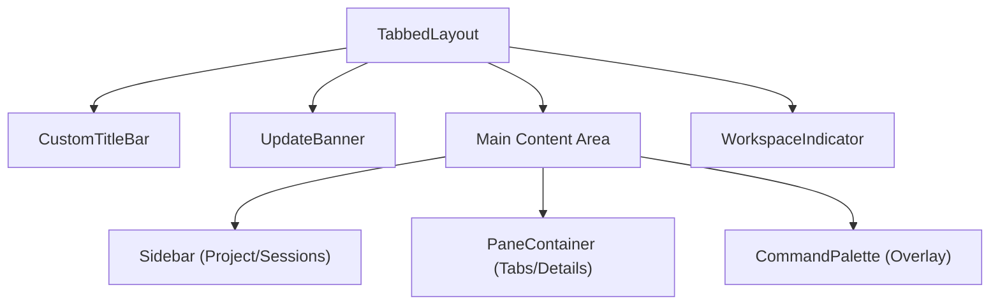
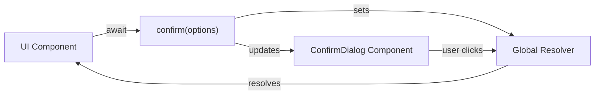

# 애플리케이션 셸

<details>
<summary>관련 소스 파일</summary>

다음 파일들은 이 위키 페이지를 생성하기 위한 컨텍스트로 사용되었습니다.

- [src/main/ipc/window.ts](src/main/ipc/window.ts)
- [src/renderer/App.tsx](src/renderer/App.tsx)
- [src/renderer/api/index.ts](src/renderer/api/index.ts)
- [src/renderer/components/common/ConfirmDialog.tsx](src/renderer/components/common/ConfirmDialog.tsx)
- [src/renderer/components/common/UpdateBanner.tsx](src/renderer/components/common/UpdateBanner.tsx)
- [src/renderer/components/layout/CustomTitleBar.tsx](src/renderer/components/layout/CustomTitleBar.tsx)
- [src/renderer/components/layout/SidebarHeader.tsx](src/renderer/components/layout/SidebarHeader.tsx)
- [src/renderer/components/layout/TabbedLayout.tsx](src/renderer/components/layout/TabbedLayout.tsx)
- [src/renderer/components/settings/components/SettingsSelect.tsx](src/renderer/components/settings/components/SettingsSelect.tsx)
- [src/renderer/components/settings/sections/ConnectionSection.tsx](src/renderer/components/settings/sections/ConnectionSection.tsx)
- [src/renderer/components/settings/sections/WorkspaceSection.tsx](src/renderer/components/settings/sections/WorkspaceSection.tsx)
- [src/renderer/hooks/useKeyboardShortcuts.ts](src/renderer/hooks/useKeyboardShortcuts.ts)
- [src/renderer/hooks/useTheme.ts](src/renderer/hooks/useTheme.ts)

</details>


## 목적과 범위

Application Shell은 renderer process를 초기화하고 조율하는 최상위 React 컴포넌트입니다. 테마 시스템, 컨텍스트 관리, 실시간 이벤트 리스너를 설정하고 핵심 UI 레이아웃을 렌더링합니다. 이 페이지에서는 초기화 순서, 컴포넌트 계층, 전역 이벤트 연결을 다룹니다.

**출처:** [src/renderer/App.tsx:1-51]()

## 컴포넌트 구조

`App` 컴포넌트는 [src/renderer/App.tsx:11-51]()에 정의되어 있으며 React 애플리케이션의 단일 진입점 역할을 합니다. 특정 순서로 초기화 작업을 수행하고, `ErrorBoundary`로 감싼 핵심 레이아웃 컴포넌트를 렌더링합니다.

### 컴포넌트 계층
셸은 활성 뷰와 관계없이 전역 유틸리티(예: 다이얼로그와 오버레이)에 계속 접근할 수 있도록 중첩 구조를 따릅니다.

| 컴포넌트 | 파일 경로 | 역할 |
|-----------|-----------|------|
| `App` | [src/renderer/App.tsx:11]() | 루트 초기화와 상태 조율. |
| `ErrorBoundary` | [src/renderer/components/common/ErrorBoundary.tsx]() | 렌더링 예외를 포착해 white-screen을 방지합니다. |
| `ContextSwitchOverlay` | [src/renderer/components/common/ContextSwitchOverlay.tsx]() | workspace 전환 중 전체 화면 로딩 상태를 표시합니다. |
| `TabbedLayout` | [src/renderer/components/layout/TabbedLayout.tsx:23]() | 메인 UI 컨테이너(Sidebar + Panes). |
| `ConfirmDialog` | [src/renderer/components/common/ConfirmDialog.tsx:69]() | 명령형 사용자 확인을 위한 singleton modal. |

**출처:** [src/renderer/App.tsx:44-50](), [src/renderer/components/layout/TabbedLayout.tsx:23-53]()

## 초기화 순서

`App` 컴포넌트는 사용자 상호작용 전에 환경을 준비하기 위해 여러 `useEffect` hook에서 초기화 로직을 실행합니다.

```mermaid
sequenceDiagram
    participant React
    participant App
    participant useTheme
    participant Store
    participant API
    participant DOM
    
    React->>App: Mount component
    App->>useTheme: useTheme() hook
    Note over useTheme: Apply CSS variables to :root
    
    App->>DOM: getElementById('splash')
    DOM-->>App: Splash Element
    App->>DOM: opacity = 0; setTimeout(300ms, remove())
    
    App->>Store: initializeContextSystem()
    Note over Store: Setup ServiceContextRegistry
    
    App->>API: api.ssh.onStatus(callback)
    Note over API: Listen for connection changes
    
    App->>Store: initializeNotificationListeners()
    Note over Store: Bind "file:change", "notification:new"
    
    App->>React: Render TabbedLayout
```

**출처:** [src/renderer/App.tsx:11-51]()

### 테마와 스플래시 화면
테마 시스템은 `useTheme()` hook [src/renderer/App.tsx:13]()을 통해 즉시 초기화되며, 이 hook은 CSS custom properties를 document root에 적용합니다. 동시에 기본 HTML에 정의된 splash screen은 opacity를 `0`으로 설정한 뒤 300ms 후 DOM에서 제거되어 사라집니다 [src/renderer/App.tsx:16-22]().

### 컨텍스트와 SSH 모니터링
셸은 `ServiceContextRegistry`를 준비하기 위해 `initializeContextSystem()` [src/renderer/App.tsx:26]()을 호출합니다. 또한 `api.ssh.onStatus`에 listener를 연결합니다 [src/renderer/App.tsx:32-35](). SSH 연결이 생성되거나 끊어지면 앱은 자동으로 `fetchAvailableContexts()`를 호출해 workspace 목록을 업데이트합니다.

**출처:** [src/renderer/App.tsx:25-36]()

### IPC 이벤트 리스너
`initializeNotificationListeners()` 함수 [src/renderer/App.tsx:40]()는 renderer를 main-process 이벤트에 연결합니다. 이를 통해 백그라운드 활동에 대한 실시간 UI 업데이트가 보장됩니다.

| IPC 채널 | 트리거 | 효과 |
|-------------|---------|--------|
| `notification:new` | 백그라운드 오류 감지 | notification store에 항목 추가 |
| `file:change` | Claude 세션 로그 업데이트 | `refreshSessionInPlace()` 트리거 |
| `context:changed` | 원격 컨텍스트 준비 완료 | `loadContextSnapshot()` 트리거 |

**출처:** [src/renderer/App.tsx:38-42]()

## 메인 레이아웃: TabbedLayout

`TabbedLayout` 컴포넌트 [src/renderer/components/layout/TabbedLayout.tsx:23]()는 애플리케이션의 시각적 구조를 정의합니다. sidebar와 multi-pane content area의 상위 수준 배치를 관리합니다.

### 시각적 아키텍처



**출처:** [src/renderer/components/layout/TabbedLayout.tsx:30-51]()

### 창 제어와 플랫폼 적응
셸은 서로 다른 운영체제와 표시 모드에 맞게 적응합니다.
- **macOS Traffic Lights:** 레이아웃은 현재 zoom factor를 기반으로 `trafficLightPadding`을 계산해 sidebar header가 native window controls와 겹치지 않도록 합니다 [src/renderer/components/layout/TabbedLayout.tsx:26-27]().
- **Windows/Linux Title Bar:** macOS가 아닌 플랫폼에서는 `CustomTitleBar` [src/renderer/components/layout/CustomTitleBar.tsx:23]()가 `windowControls` IPC API를 사용해 드래그 가능한 영역과 창 제어 버튼(최소화/최대화/닫기)을 제공합니다 [src/main/ipc/window.ts:19-49]().
- **Browser Mode:** `isElectronMode()`가 false이면 custom title bars와 native traffic light padding 같은 Electron 전용 UI가 비활성화됩니다 [src/renderer/api/index.ts:57]().

**출처:** [src/renderer/components/layout/TabbedLayout.tsx:26-36](), [src/renderer/components/layout/CustomTitleBar.tsx:17-21](), [src/main/ipc/window.ts:19-49]()

## 전역 유틸리티

### 명령형 확인 다이얼로그
셸에는 native `window.confirm()`을 대체하는 `ConfirmDialog` [src/renderer/components/common/ConfirmDialog.tsx:69]()가 포함되어 있습니다. 이 다이얼로그는 `Promise<boolean>`을 반환하는 exported `confirm()` 함수로 트리거됩니다.



**출처:** [src/renderer/components/common/ConfirmDialog.tsx:41-64]()

### 업데이트 시스템
셸은 애플리케이션 업데이트를 모니터링합니다. 다운로드가 시작되면 `UpdateBanner` [src/renderer/components/common/UpdateBanner.tsx:10]()가 레이아웃 상단에 나타나 진행률 표시줄을 보여줍니다. 다운로드가 완료되면 IPC를 통해 `app:relaunch`를 트리거하는 "Restart now" 버튼을 제공합니다 [src/main/ipc/window.ts:43-46]().

**출처:** [src/renderer/components/common/UpdateBanner.tsx:34-78](), [src/main/ipc/window.ts:43-46]()

### 키보드 단축키
`useKeyboardShortcuts` hook [src/renderer/hooks/useKeyboardShortcuts.ts:18]()은 전역 탐색을 처리하기 위해 셸 안에서 초기화됩니다.
- **Tab Management:** `Ctrl+Tab`(순환), `Cmd+W`(닫기) [src/renderer/hooks/useKeyboardShortcuts.ts:81-163]().
- **Pane Management:** `Cmd+\`(분할), `Cmd+Option+1-4`(포커스) [src/renderer/hooks/useKeyboardShortcuts.ts:109-138]().
- **Context Switching:** `Cmd+Shift+K`(workspace contexts 순환) [src/renderer/hooks/useKeyboardShortcuts.ts:217-221]().

**출처:** [src/renderer/hooks/useKeyboardShortcuts.ts:18-225]()
