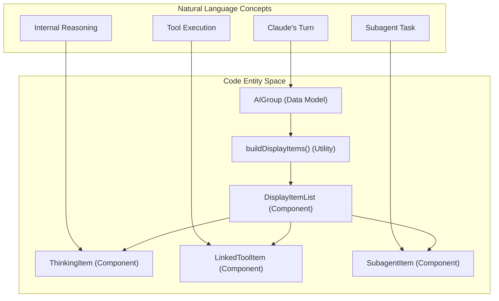
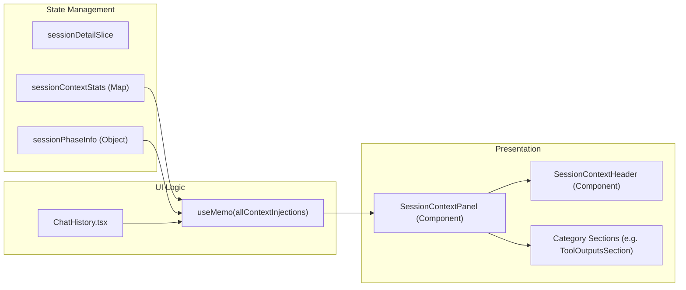

# 세션 뷰

관련 소스 파일

다음 파일들은 이 위키 페이지를 생성하기 위한 컨텍스트로 사용되었습니다.

- [src/main/services/discovery/ProjectScanner.ts](src/main/services/discovery/ProjectScanner.ts)
- [src/renderer/components/chat/ChatHistory.tsx](src/renderer/components/chat/ChatHistory.tsx)
- [src/renderer/components/chat/DisplayItemList.tsx](src/renderer/components/chat/DisplayItemList.tsx)
- [src/renderer/components/chat/SessionContextPanel/components/SessionContextHeader.tsx](src/renderer/components/chat/SessionContextPanel/components/SessionContextHeader.tsx)
- [src/renderer/components/chat/SessionContextPanel/index.tsx](src/renderer/components/chat/SessionContextPanel/index.tsx)
- [src/renderer/components/chat/SessionContextPanel/types.ts](src/renderer/components/chat/SessionContextPanel/types.ts)
- [src/renderer/components/chat/items/ExecutionTrace.tsx](src/renderer/components/chat/items/ExecutionTrace.tsx)
- [src/renderer/components/chat/items/LinkedToolItem.tsx](src/renderer/components/chat/items/LinkedToolItem.tsx)
- [src/renderer/components/chat/items/TextItem.tsx](src/renderer/components/chat/items/TextItem.tsx)
- [src/renderer/components/chat/items/ThinkingItem.tsx](src/renderer/components/chat/items/ThinkingItem.tsx)
- [src/renderer/components/sidebar/SessionItem.tsx](src/renderer/components/sidebar/SessionItem.tsx)
- [src/renderer/store/slices/projectSlice.ts](src/renderer/store/slices/projectSlice.ts)
- [src/renderer/store/slices/sessionSlice.ts](src/renderer/store/slices/sessionSlice.ts)
- [src/renderer/utils/displayItemBuilder.ts](src/renderer/utils/displayItemBuilder.ts)
- [test/renderer/store/sessionSlice.test.ts](test/renderer/store/sessionSlice.test.ts)
- [test/renderer/utils/displayItemBuilder.test.ts](test/renderer/utils/displayItemBuilder.test.ts)

## 목적과 범위

Session Views는 Claude Code 세션 데이터를 사용자에게 표시하는 기본 UI 컴포넌트입니다. 이 페이지는 세션 목록과 상세 뷰를 위한 **renderer-side 상태 관리와 UI 아키텍처**를 문서화하며, 페이지네이션, 탭별 데이터 격리, 대화 렌더링, 특수한 컨텍스트 주입 패널을 포함합니다.

backend 세션 발견과 파싱은 [Session Discovery & Parsing]()을 참조하세요. 일반적인 상태 관리 패턴은 [State Management]()를 참조하세요.

---

## 세션 목록 아키텍처

세션 목록(sidebar)은 선택된 프로젝트의 세션을 표시합니다. cursor 기반 페이지네이션, 고정된 세션, 로딩 깜박임 없는 실시간 업데이트를 지원합니다.

### 상태 구조
`sessionSlice`는 Zustand store에서 목록 상태를 관리합니다.

| 속성 | 타입 | 목적 |
|----------|------|---------|
| `sessions` | `Session[]` | 현재 로드된 세션 레코드 |
| `sessionsCursor` | `string \| null` | 다음 페이지를 위한 opaque cursor [src/renderer/store/slices/sessionSlice.ts:31]() |
| `sessionsHasMore` | `boolean` | 추가 페이지가 존재하는지 여부 [src/renderer/store/slices/sessionSlice.ts:32]() |
| `pinnedSessionIds` | `string[]` | 사용자가 고정한 세션 ID [src/renderer/store/slices/sessionSlice.ts:36]() |
| `sidebarMultiSelectActive` | `boolean` | 일괄 작업을 위한 상태 [src/renderer/store/slices/sessionSlice.ts:42]() |

**출처:** [src/renderer/store/slices/sessionSlice.ts:24-45]()

### 페이지네이션과 고정 세션
SSH를 통해 큰 기록을 처리하기 위해 세션은 cursor 기반 페이지네이션으로 가져옵니다. `fetchSessionsInitial`은 상태를 초기화하고 [src/renderer/store/slices/sessionSlice.ts:124-132](), `fetchSessionsMore`는 결과를 추가하고 cursor를 업데이트합니다 [src/renderer/store/slices/sessionSlice.ts:170-208]().

고정된 세션은 애플리케이션 config에 저장됩니다. 고정된 세션이 현재 페이지네이션 창 밖에 있으면, store는 해당 세션이 sidebar 상단에 나타나도록 ID로 명시적으로 가져옵니다 [src/renderer/store/slices/sessionSlice.ts:279-319]().

### 실시간 업데이트
파일 변경 이벤트가 새 세션이나 업데이트를 나타내면 `refreshSessionsInPlace`가 호출됩니다 [src/renderer/store/slices/sessionSlice.ts:210-248](). 이는 `projectRefreshGeneration` map을 사용해 최신 async response만 UI를 업데이트하도록 보장하며, 빠른 파일 변경 상황에서 "last-write-wins" 문제를 방지합니다 [src/renderer/store/slices/sessionSlice.ts:18]().

**출처:** [src/renderer/store/slices/sessionSlice.ts:18-248]()

---

## 세션 상세와 대화 표시

세션 상세 뷰는 원시 세션 "chunks"를 `UserGroup`과 `AIGroup` entity로 구성된 구조화된 대화로 변환합니다.

### 탭별 데이터 격리
서로 다른 탭이 같은 세션을 서로 다른 스크롤 위치에서 보는 multi-pane layout을 지원하기 위해, store는 `tabSessionData`를 사용합니다 [src/renderer/store/slices/sessionDetailSlice.ts:72](). 이는 탭 ID별로 `conversation`, `sessionContextStats`, `visibleAIGroupId`를 격리합니다 [src/renderer/store/slices/sessionDetailSlice.ts:46-70]().

### AI Group 렌더링
`AIGroup`은 Claude 응답의 한 turn을 나타냅니다. 이는 `AIGroupDisplayItem` 객체의 평탄한 시간순 목록을 사용해 렌더링됩니다 [src/renderer/utils/displayItemBuilder.ts:94-100]().

`buildDisplayItems` 함수는 의미적 단계를 UI item으로 매핑합니다.
1. **Thinking**: `ThinkingItem`으로 매핑됩니다 [src/renderer/utils/displayItemBuilder.ts:150-159]().
2. **Tool Calls**: tool call을 해당 결과와 연결하는 `LinkedToolItem`으로 매핑됩니다 [src/renderer/utils/displayItemBuilder.ts:161-176]().
3. **Subagents**: `SubagentItem`으로 매핑됩니다 [src/renderer/utils/displayItemBuilder.ts:182-192]().
4. **Teammate Messages**: 트리거한 `SendMessage` 호출과 파싱 및 연결됩니다 [src/renderer/utils/displayItemBuilder.ts:52-74]().

**출처:** [src/renderer/utils/displayItemBuilder.ts:1-205](), [src/renderer/components/chat/DisplayItemList.tsx:64-205]()

### 시스템-코드 매핑: 대화 렌더링
이 다이어그램은 대화의 자연어 개념을 렌더링에 사용되는 특정 React 컴포넌트와 utility function에 매핑합니다.

**출처:** [src/renderer/utils/displayItemBuilder.ts:94-205](), [src/renderer/components/chat/DisplayItemList.tsx:100-205]()

---

## 표시 컨텍스트 패널

`SessionContextPanel`은 대화의 특정 시점에 AI에 대해 현재 "in-context"인 모든 데이터를 전문적으로 보여주는 뷰를 제공합니다.

### 컨텍스트 컴포넌트
패널은 컨텍스트 주입을 접을 수 있는 섹션으로 분류합니다.
- **User Messages**: 사용자 입력 기록 [src/renderer/components/chat/SessionContextPanel/index.tsx:105-107]().
- **CLAUDE.md Files**: 전역, 프로젝트, 디렉터리 수준 규칙 [src/renderer/components/chat/SessionContextPanel/index.tsx:90-92]().
- **Mentioned Files**: 사용자가 명시적으로 읽거나 언급한 파일 [src/renderer/components/chat/SessionContextPanel/index.tsx:93-95]().
- **Tool Outputs**: 이전 tool execution의 결과 [src/renderer/components/chat/SessionContextPanel/index.tsx:96-98]().

### Phase 인식 컨텍스트
Claude Code는 컨텍스트 한계를 관리하기 위해 "compactions"(기록 요약)를 수행합니다. UI는 서로 다른 "Phases"에서 컨텍스트를 볼 수 있도록 지원합니다 [src/renderer/components/chat/SessionContextPanel/components/SessionContextHeader.tsx:119-157](). phase를 선택하면 `allContextInjections` 목록이 업데이트되어 해당 특정 과거 turn에서 모델에 정확히 무엇이 보였는지 표시합니다 [src/renderer/components/chat/ChatHistory.tsx:116-170]().

**출처:** [src/renderer/components/chat/SessionContextPanel/index.tsx:43-129](), [src/renderer/components/chat/ChatHistory.tsx:116-170]()

### 시스템-코드 매핑: 컨텍스트 패널 데이터 흐름
이 다이어그램은 원시 context injection data가 store에서 특수한 panel UI로 이동하는 방식을 추적합니다.

**출처:** [src/renderer/store/slices/sessionDetailSlice.ts:88-101](), [src/renderer/components/chat/ChatHistory.tsx:116-170](), [src/renderer/components/chat/SessionContextPanel/index.tsx:43-200]()

---

## 사용자 상호작용과 탐색

### 스크롤과 자동 스크롤
`ChatHistory` 컴포넌트는 대화 길이가 120개 item을 초과할 때 virtualization을 위해 `@tanstack/react-virtual`을 사용합니다 [src/renderer/components/chat/ChatHistory.tsx:40, 185](). 새 메시지가 도착할 때 뷰를 하단에 고정하기 위해 `useAutoScrollBottom`을 구현합니다 [src/renderer/components/chat/ChatHistory.tsx:3]().

### Deep Linking과 검색
UI는 특정 tool execution이나 AI group으로 이동하는 기능을 지원합니다. 검색 결과가 선택되면 `ChatHistory`는 `aiGroupRefs`와 `toolItemRefs`에 저장된 refs에서 `scrollToIndex` 또는 `scrollIntoView`를 사용해 해당 item에 포커스를 맞춥니다 [src/renderer/components/chat/ChatHistory.tsx:177-179, 323-350]().

### 컨텍스트 메뉴
sidebar의 `SessionItem`은 세션을 새 vertical/horizontal layout으로 열기 위해 pane을 분할하는 것 같은 고급 작업을 위한 context menu를 제공합니다 [src/renderer/components/sidebar/SessionItem.tsx:189-222]().

**출처:** [src/renderer/components/chat/ChatHistory.tsx:1-350](), [src/renderer/components/sidebar/SessionItem.tsx:133-225]()
