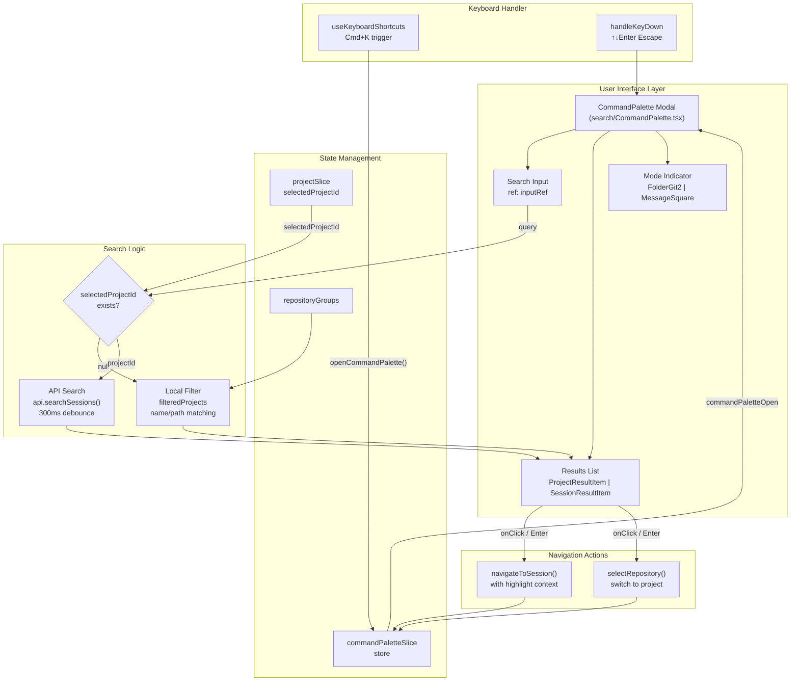
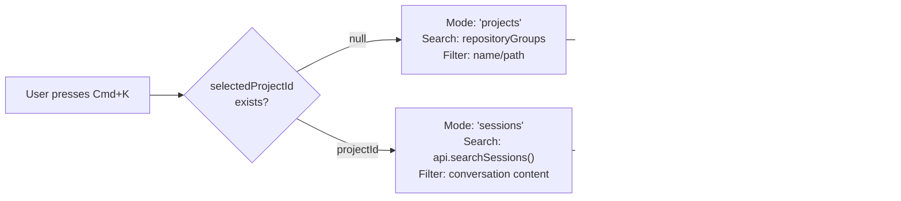
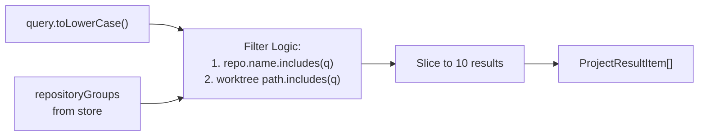
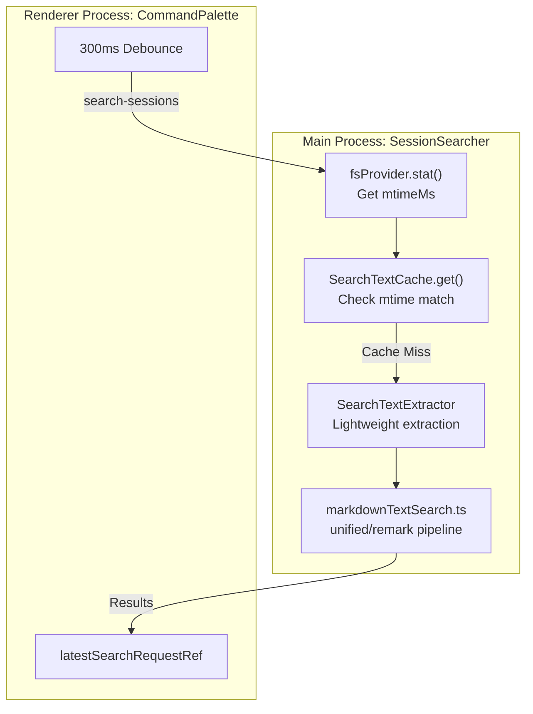
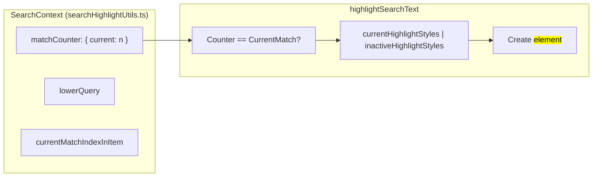
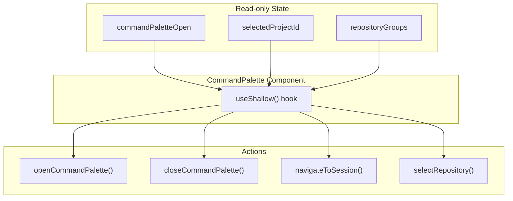

# Command Palette

관련 소스 파일

다음 파일들은 이 위키 페이지를 생성하기 위한 컨텍스트로 사용되었습니다.

- [src/main/http/search.ts](src/main/http/search.ts)
- [src/main/ipc/search.ts](src/main/ipc/search.ts)
- [src/main/services/discovery/SearchTextCache.ts](src/main/services/discovery/SearchTextCache.ts)
- [src/main/services/discovery/SessionSearcher.ts](src/main/services/discovery/SessionSearcher.ts)
- [src/renderer/components/chat/LastOutputDisplay.tsx](src/renderer/components/chat/LastOutputDisplay.tsx)
- [src/renderer/components/chat/searchHighlightUtils.ts](src/renderer/components/chat/searchHighlightUtils.ts)
- [src/renderer/components/search/CommandPalette.tsx](src/renderer/components/search/CommandPalette.tsx)
- [src/renderer/components/search/SearchBar.tsx](src/renderer/components/search/SearchBar.tsx)
- [src/renderer/store/slices/conversationSlice.ts](src/renderer/store/slices/conversationSlice.ts)
- [src/renderer/utils/keyboardUtils.ts](src/renderer/utils/keyboardUtils.ts)
- [src/shared/utils/markdownTextSearch.ts](src/shared/utils/markdownTextSearch.ts)
- [test/main/ipc/globalSearch.test.ts](test/main/ipc/globalSearch.test.ts)
- [test/main/services/discovery/SessionSearcher.test.ts](test/main/services/discovery/SessionSearcher.test.ts)
- [test/renderer/utils/keyboardUtils.test.ts](test/renderer/utils/keyboardUtils.test.ts)

Command Palette는 `Cmd+K`로 접근할 수 있는 Spotlight/Alfred 스타일의 전역 검색 인터페이스를 제공합니다. 이 인터페이스는 두 가지 별도 모드로 동작합니다. 프로젝트가 선택되지 않았을 때의 프로젝트 검색과, 선택된 프로젝트 내 세션 간 대화 검색입니다. 인터페이스는 키보드 탐색, debounce된 검색, 지능적인 결과 강조 표시를 구현합니다.

검색 결과로 이동하는 방법은 [Session Views](#9.2)를 참조하세요. 키보드 단축키 설정은 [Application Shell](#9.1)을 참조하세요.

---

## 아키텍처 개요

Command Palette는 컨텍스트 인식 동작을 갖춘 modal overlay로 구현됩니다. 검색 모드는 workspace 상태에 따라 자동으로 전환되며, 프로젝트 발견과 대화 콘텐츠 매칭에 서로 다른 검색 알고리즘을 사용합니다.

**출처:** [src/renderer/components/search/CommandPalette.tsx:1-189](), [src/renderer/store/slices/conversationSlice.ts:94-108]()

---

## 이중 모드 동작

Command Palette는 workspace 컨텍스트에 따라 두 검색 모드 사이를 자동으로 전환합니다. 이 방식은 모드 선택 UI의 필요성을 없애고 컨텍스트에 적합한 결과를 제공합니다.

### 모드 결정 로직

**출처:** [src/renderer/components/search/CommandPalette.tsx:157-189]()

| 모드 | 트리거 조건 | 데이터 소스 | 결과 타입 | 선택 시 동작 |
|------|------------------|-------------|-------------|------------------|
| `'projects'` | `selectedProjectId === null` | `repositoryGroups` (local filter) | `RepositoryGroup` | `selectRepository(repo.id)` |
| `'sessions'` | `selectedProjectId !== null` | `api.searchSessions()` (IPC call) | `SearchResult` | highlight context와 함께 `navigateToSession()` |

**출처:** [src/renderer/components/search/CommandPalette.tsx:189-206]()

---

## 프로젝트 검색 모드

프로젝트가 선택되지 않았을 때 palette는 client-side filtering을 사용해 발견된 모든 repository를 검색합니다. 이 모드는 server-side indexing 없이 빠른 프로젝트 전환을 가능하게 합니다.

### 필터링 구현

프로젝트 필터는 메모리에 있는 `repositoryGroups` 데이터에 대해 repository name과 path의 대소문자 구분 없는 부분 문자열 매칭을 수행합니다.

**출처:** [src/renderer/components/search/CommandPalette.tsx:192-206]()

### ProjectResultItem 컴포넌트

각 프로젝트 결과는 timestamp formatting과 함께 repository metadata를 표시합니다.

| 표시 요소 | 데이터 소스 | 형식 지정 |
|----------------|-------------|-----------|
| Repository name | `repo.name` | 잘린 text-sm |
| Worktree path | `repo.worktrees[0]?.path` | Monospace text-xs |
| Session count | `repo.totalSessions` | "{n} sessions" |
| Last activity | `repo.mostRecentSession` | suffix가 있는 `formatDistanceToNow()` |

**출처:** [src/renderer/components/search/CommandPalette.tsx:44-84]()

---

## 세션 검색 모드

프로젝트가 선택되면 palette는 server-side indexing을 사용해 세션 간 콘텐츠 검색을 수행합니다. 검색 query는 race condition을 방지하기 위해 debounce되고 취소 가능하게 처리됩니다.

### 검색 요청 흐름

backend 검색 로직은 `SessionSearcher`가 처리하며, 이 로직은 noise를 줄이기 위해 사용자 text와 마지막 AI output으로 match를 제한합니다.

**출처:** [src/main/services/discovery/SessionSearcher.ts:36-190](), [src/shared/utils/markdownTextSearch.ts:154-176]()

### 검색 성능(SSH 모드)

SSH 환경에서 `SessionSearcher`는 응답성을 유지하기 위해 staged breadth approach를 사용합니다.
- **Time Budget**: 검색은 4500ms로 제한됩니다 [src/main/services/discovery/SessionSearcher.ts:31]().
- **Staged Boundaries**: 최소 결과를 빠르게 찾기 위해 batch(40, 140, 320) 단위로 scan합니다 [src/main/services/discovery/SessionSearcher.ts:29-30]().
- **Partial Results**: budget 또는 최소 결과 수에 도달하면 `isPartial: true`를 반환합니다 [src/main/services/discovery/SessionSearcher.ts:179-185]().

**출처:** [src/main/services/discovery/SessionSearcher.ts:107-177]()

---

## Markdown 인식 검색

시스템은 Command Palette의 match count가 사용자가 렌더링된 chat에서 보는 것과 정확히 일치하도록 특수한 markdown 검색 pipeline을 사용합니다.

### 검색 파이프라인(`markdownTextSearch.ts`)

1. **Parsing**: `unified`, `remark-parse`, `remark-gfm`을 사용해 MDAST를 구축합니다 [src/shared/utils/markdownTextSearch.ts:29-46]().
2. **HAST Conversion**: MDAST를 HAST(Hypertext Abstract Syntax Tree)로 변환합니다 [src/shared/utils/markdownTextSearch.ts:112-113]().
3. **Selective Collection**: `HL_TAGS`의 text node(예: `p`, `li`, `code`)만 수집합니다 [src/shared/utils/markdownTextSearch.ts:91-104]().
4. **Segment Matching**: 숨겨진 syntax와 match되는 것을 피하기 위해 raw markdown string이 아니라 개별 text segment 안에서 query를 검색합니다 [src/shared/utils/markdownTextSearch.ts:165-174]().

**출처:** [src/shared/utils/markdownTextSearch.ts:74-140]()

---

## 키보드 탐색과 세션 내 검색

애플리케이션에는 Command Palette와 로직을 공유하지만 현재 대화에 초점을 맞추는 세션 내 검색 bar(`Cmd+F`)도 있습니다.

### 탐색 상태 머신(`conversationSlice.ts`)

store는 검색 match를 추적하고 탐색 action을 제공합니다.

| Action | 설명 |
|--------|-------------|
| `nextSearchResult` | `currentSearchIndex`를 증가시키고 `expandForCurrentSearchResult`를 호출합니다 [src/renderer/store/slices/conversationSlice.ts:104]() |
| `previousSearchResult`| wrap-around logic으로 index를 감소시킵니다 [src/renderer/store/slices/conversationSlice.ts:105]() |
| `expandForCurrentSearchResult` | match를 드러내기 위해 접힌 AI group 또는 subagent trace를 자동으로 펼칩니다 [src/renderer/store/slices/conversationSlice.ts:107]() |

**출처:** [src/renderer/store/slices/conversationSlice.ts:55-75]()

### 검색 컨텍스트 강조 표시

Match는 React tree가 순회될 때 match index를 추적하기 위해 mutable counter를 사용하는 `SearchContext`를 통해 렌더링됩니다.

**출처:** [src/renderer/components/chat/searchHighlightUtils.ts:33-113]()

---

## Store 통합

Command Palette는 상태 관리와 action dispatch를 위해 Zustand store slice와 통합됩니다.

### Store 의존성

**출처:** [src/renderer/components/search/CommandPalette.tsx:158-176]()

---

## 성능 최적화

1. **SearchTextCache**: main process의 LRU cache가 추출된 searchable entry를 저장하며, 파일 `mtimeMs`에 따라 무효화됩니다 [src/main/services/discovery/SearchTextCache.ts:20-50]().
2. **Segment Caching**: `markdownTextSearch.ts`는 반복 query 속도를 높이기 위해 가장 최근 markdown string 1000개의 parsed text segment를 cache합니다 [src/shared/utils/markdownTextSearch.ts:52-68]().
3. **Debounced Inputs**: `CommandPalette`와 `SearchBar` 모두 debouncing(200ms-300ms)을 사용해 매 keystroke마다 비용이 큰 re-parsing이 발생하지 않도록 합니다 [src/renderer/components/search/SearchBar.tsx:15](), [src/renderer/components/search/CommandPalette.tsx:216]().
4. **Shallow Selectors**: `LastOutputDisplay` 같은 컴포넌트에서 `useShallow`를 사용하면 특정 AI group에 search match가 포함될 때만 re-render가 발생합니다 [src/renderer/components/chat/LastOutputDisplay.tsx:44-53]().

**출처:** [src/main/services/discovery/SearchTextCache.ts:1-12](), [src/renderer/components/search/SearchBar.tsx:64-80]()
