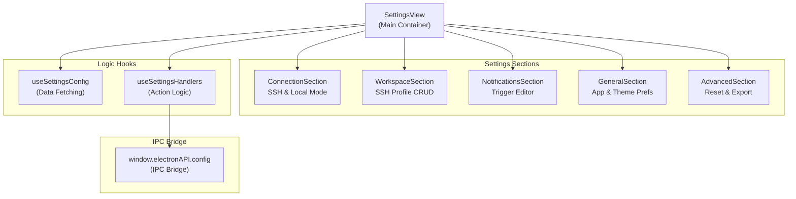
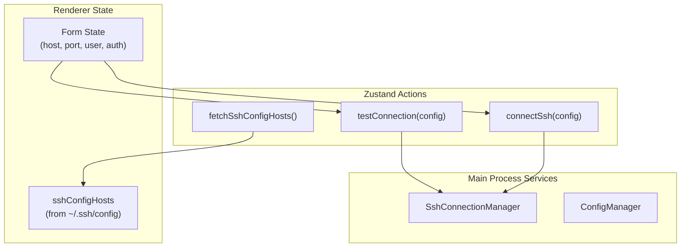

# 설정 인터페이스

관련 소스 파일

다음 파일들은 이 위키 페이지를 생성하기 위한 컨텍스트로 사용되었습니다.

- [src/main/ipc/configValidation.ts](src/main/ipc/configValidation.ts)
- [src/main/services/infrastructure/ConfigManager.ts](src/main/services/infrastructure/ConfigManager.ts)
- [src/renderer/App.tsx](src/renderer/App.tsx)
- [src/renderer/components/chat/SessionContextPanel/components/RankedInjectionList.tsx](src/renderer/components/chat/SessionContextPanel/components/RankedInjectionList.tsx)
- [src/renderer/components/common/ConfirmDialog.tsx](src/renderer/components/common/ConfirmDialog.tsx)
- [src/renderer/components/settings/SettingsTabs.tsx](src/renderer/components/settings/SettingsTabs.tsx)
- [src/renderer/components/settings/SettingsView.tsx](src/renderer/components/settings/SettingsView.tsx)
- [src/renderer/components/settings/components/SettingsSelect.tsx](src/renderer/components/settings/components/SettingsSelect.tsx)
- [src/renderer/components/settings/hooks/useSettingsConfig.ts](src/renderer/components/settings/hooks/useSettingsConfig.ts)
- [src/renderer/components/settings/hooks/useSettingsHandlers.ts](src/renderer/components/settings/hooks/useSettingsHandlers.ts)
- [src/renderer/components/settings/sections/ConnectionSection.tsx](src/renderer/components/settings/sections/ConnectionSection.tsx)
- [src/renderer/components/settings/sections/GeneralSection.tsx](src/renderer/components/settings/sections/GeneralSection.tsx)
- [src/renderer/components/settings/sections/WorkspaceSection.tsx](src/renderer/components/settings/sections/WorkspaceSection.tsx)
- [src/renderer/components/settings/sections/index.ts](src/renderer/components/settings/sections/index.ts)
- [src/renderer/components/sidebar/DateGroupedSessions.tsx](src/renderer/components/sidebar/DateGroupedSessions.tsx)
- [src/renderer/hooks/useKeyboardShortcuts.ts](src/renderer/hooks/useKeyboardShortcuts.ts)
- [src/shared/types/notifications.ts](src/shared/types/notifications.ts)

## 목적과 범위

Settings Interface는 claude-devtools를 위한 포괄적인 설정 UI를 제공하여 사용자가 애플리케이션 설정, SSH 연결, workspace profile, 알림 trigger를 관리할 수 있게 합니다. 이 페이지는 설정 패널을 구성하는 renderer-side UI 컴포넌트, configuration IPC layer와의 통합, form 상태 관리와 검증에 사용되는 패턴을 문서화합니다.

기반 configuration persistence와 관리는 [Configuration Management](7)를 참조하세요. 알림 trigger 평가 로직은 [Trigger System](6.2)을 참조하세요. SSH 연결 관리 서비스는 [SSH Connection Manager](5.1)를 참조하세요.

## 설정 패널 아키텍처

설정 인터페이스는 여러 section으로 구성되며, 각 section은 특정 configuration domain을 담당합니다. 설정은 `SettingsView` 컴포넌트를 통해 접근하며, 이 컴포넌트는 하위 section 탐색과 낙관적 상태 업데이트를 관리합니다.

### 컴포넌트 계층

**출처:** [src/renderer/components/settings/SettingsView.tsx:12-18](), [src/renderer/components/settings/SettingsView.tsx:124-165](), [src/renderer/components/settings/hooks/useSettingsHandlers.ts:29-55]()

## 연결 섹션

`ConnectionSection` 컴포넌트는 local Claude root path 선택과 SSH remote connection 관리를 위한 dual-mode 설정을 제공합니다. local config file에서 SSH host discovery를 처리하고 connection testing을 수행합니다.

### SSH 연결 관리

SSH 연결 form은 combobox(`~/.ssh/config`에서 채워짐)를 통한 host 선택, authentication method 선택, connection testing을 제공합니다.

**출처:** [src/renderer/components/settings/sections/ConnectionSection.tsx:37-46](), [src/renderer/components/settings/sections/ConnectionSection.tsx:162-169](), [src/renderer/components/settings/sections/ConnectionSection.tsx:171-181]()

#### 인증 방식 처리

form은 선택된 `SshAuthMethod`에 따라 동적으로 조정됩니다.

| 인증 방식 | 로직 | 컴포넌트 동작 |
|-------------|-------|--------------------|
| `auto` | `~/.ssh/config`에서 읽음 | 특정 credential field를 숨김 |
| `agent` | local SSH agent 사용 | 특정 credential field를 숨김 |
| `privateKey` | file path 사용 | `privateKeyPath` input 표시 |
| `password` | interactive password 사용 | `password` input 표시 |

**출처:** [src/renderer/components/settings/sections/ConnectionSection.tsx:29-34](), [src/renderer/components/settings/sections/ConnectionSection.tsx:162-169]()

## Workspace 섹션

`WorkspaceSection` 컴포넌트는 `SshConnectionProfile` entity에 대한 CRUD 작업을 제공합니다. 이러한 profile은 애플리케이션 configuration에 저장되며, 사용자가 여러 remote environment를 저장할 수 있게 합니다.

### Profile 데이터 흐름

1.  **Creation**: `handleAdd`는 `crypto.randomUUID()`를 통해 UUID를 생성하고 config의 `ssh.profiles` section을 업데이트합니다 [src/renderer/components/settings/sections/WorkspaceSection.tsx:103-119]().
2.  **Persistence**: 업데이트는 `api.config.update('ssh', ...)`를 통해 main process로 전송됩니다 [src/renderer/components/settings/sections/WorkspaceSection.tsx:114]().
3.  **Context Refresh**: profile이 추가되거나 수정된 후에는 multi-context switcher가 변경 사항을 반영하도록 `fetchAvailableContexts()`가 호출됩니다 [src/renderer/components/settings/sections/WorkspaceSection.tsx:118]().

**출처:** [src/renderer/components/settings/sections/WorkspaceSection.tsx:103-159]()

## 알림 Trigger 편집기

`NotificationsSection`(`useSettingsHandlers`를 통해 관리됨)은 사용자가 custom `NotificationTrigger` rule을 정의할 수 있게 합니다. 이러한 trigger는 Claude session log의 어떤 event(예: 특정 tool error 또는 token threshold)가 system notification을 생성하는지 결정합니다.

### Trigger 설정 모델

Trigger는 `TriggerMode`와 `TriggerContentType`으로 정의됩니다.

*   **error_status**: tool result의 `is_error` field에 대한 단순 boolean check [src/main/services/infrastructure/ConfigManager.ts:122]().
*   **content_match**: `file_path`, `command`, `thinking` 같은 특정 field에 대한 regex evaluation [src/main/services/infrastructure/ConfigManager.ts:157-161]().
*   **token_threshold**: `input`, `output`, `total` token에 대한 numerical comparison [src/main/services/infrastructure/ConfigManager.ts:163-167]().

**출처:** [src/main/services/infrastructure/ConfigManager.ts:133-176](), [src/shared/types/notifications.ts:151-194]()

## 일반 섹션

`GeneralSection`은 application-wide preference와 local environment setting을 관리합니다.

### Claude Root Path 관리

UI는 기본 Claude directory를 override할 수 있게 합니다. 이 path를 변경하면 UI에 stale session data가 남지 않도록 workspace reset이 트리거됩니다.

*   **WSL Integration**: Windows 사용자는 `api.config.findWslClaudeRoots()`를 사용해 WSL distribution 안의 Claude installation을 자동으로 발견할 수 있습니다 [src/renderer/components/settings/sections/GeneralSection.tsx:211]().
*   **Workspace Reset**: `resetWorkspaceForRootChange`는 root path가 수정될 때 Zustand store에서 열린 모든 tab, project, repository group을 지웁니다 [src/renderer/components/settings/sections/GeneralSection.tsx:100-121]().

**출처:** [src/renderer/components/settings/sections/GeneralSection.tsx:123-149](), [src/renderer/components/settings/sections/GeneralSection.tsx:151-182]()

## 상태 관리와 IPC

인터페이스는 반응성 좋은 UI를 보장하기 위해 설정에 낙관적 업데이트 패턴을 사용합니다.

### Configuration 검증

main process는 잘못된 data가 disk에 저장되는 것을 방지하기 위해 `configValidation.ts`를 사용하여 모든 configuration update에 대해 runtime validation을 수행합니다.

| Section | Validator Function | Validation Logic |
|---------|--------------------|------------------|
| `notifications` | `validateNotificationsSection` | snooze limit와 trigger structure 검증 [src/main/ipc/configValidation.ts:97-193]() |
| `general` | `validateGeneralSection` | theme enum과 path string 검증 [src/main/ipc/configValidation.ts:195-263]() |
| `ssh` | `validateSshSection` | port range와 auth method enum 검증 [src/main/ipc/configValidation.ts:316-398]() |

**출처:** [src/main/ipc/configValidation.ts:1-398]()

### 낙관적 업데이트

`useSettingsHandlers` hook은 trigger를 위한 낙관적 업데이트를 구현합니다. trigger가 업데이트되면 local `optimisticConfig` state가 즉시 수정됩니다. `api.config.updateTrigger`로의 IPC call이 실패하면 이전 configuration에 대한 reference를 사용해 state가 rollback됩니다 [src/renderer/components/settings/hooks/useSettingsHandlers.ts:182-209]().

**출처:** [src/renderer/components/settings/hooks/useSettingsHandlers.ts:182-209]()
