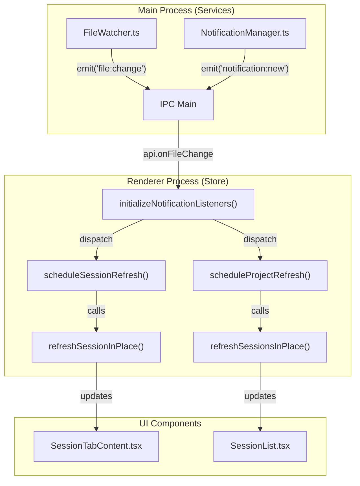
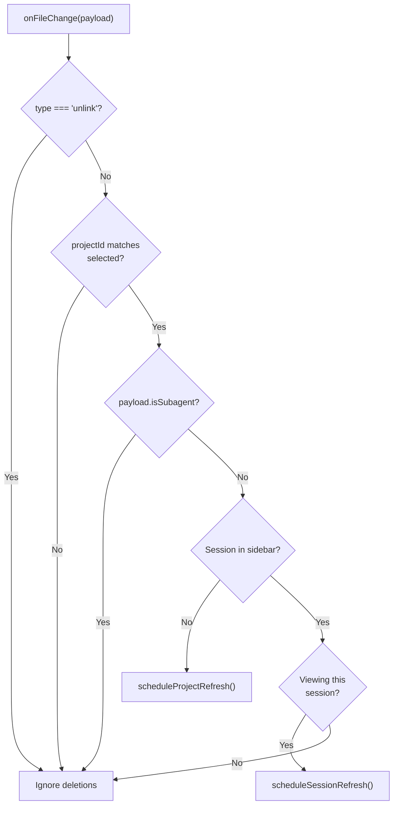
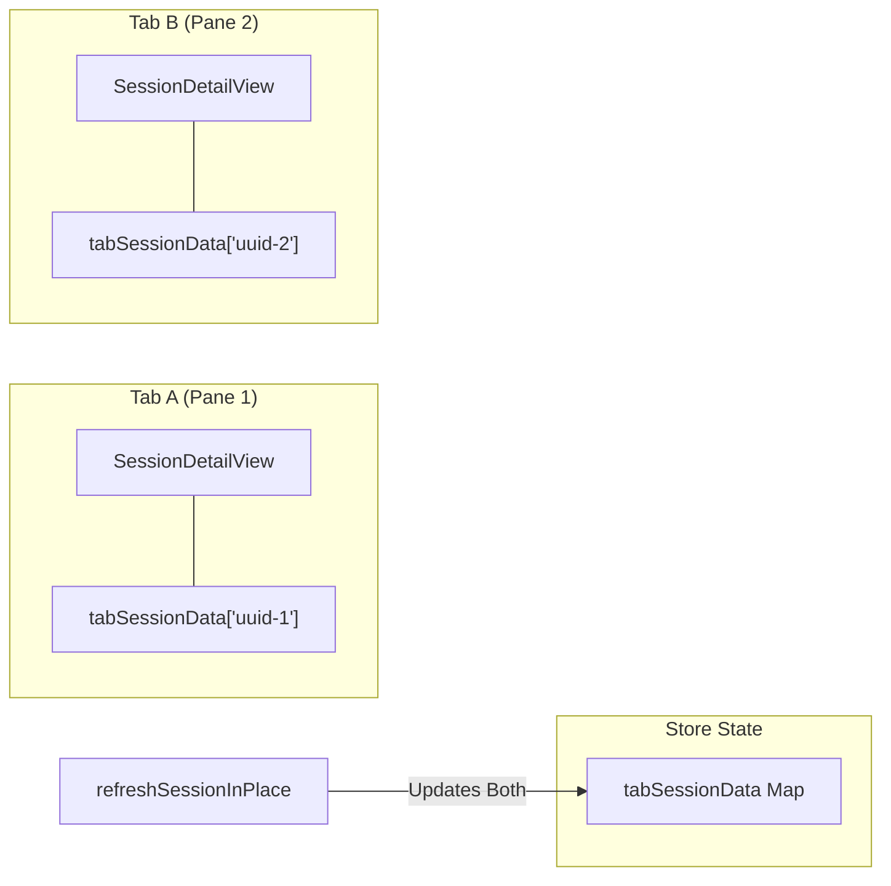

# 실시간 업데이트

관련 소스 파일

다음 파일들은 이 위키 페이지를 생성하기 위한 컨텍스트로 사용되었습니다.

- [src/main/services/discovery/ProjectPathResolver.ts](src/main/services/discovery/ProjectPathResolver.ts)
- [src/main/services/infrastructure/DataCache.ts](src/main/services/infrastructure/DataCache.ts)
- [src/main/services/infrastructure/FileSystemProvider.ts](src/main/services/infrastructure/FileSystemProvider.ts)
- [src/main/services/infrastructure/FileWatcher.ts](src/main/services/infrastructure/FileWatcher.ts)
- [src/main/services/infrastructure/SshFileSystemProvider.ts](src/main/services/infrastructure/SshFileSystemProvider.ts)
- [src/renderer/components/layout/PaneContent.tsx](src/renderer/components/layout/PaneContent.tsx)
- [src/renderer/components/layout/SortableTab.tsx](src/renderer/components/layout/SortableTab.tsx)
- [src/renderer/hooks/useAutoScrollBottom.ts](src/renderer/hooks/useAutoScrollBottom.ts)
- [src/renderer/store/slices/tabSlice.ts](src/renderer/store/slices/tabSlice.ts)
- [src/renderer/types/tabs.ts](src/renderer/types/tabs.ts)
- [test/renderer/store/tabSlice.test.ts](test/renderer/store/tabSlice.test.ts)

이 페이지는 claude-devtools가 filesystem 변경 사항과 UI를 실시간으로 동기화하는 방식을 문서화합니다. IPC event listener, debouncing/throttling 전략, in-place refresh 메커니즘, stale overwrite를 방지하기 위한 generation tracking, 업데이트 중 UI 상태 보존을 다룹니다.

전체 상태 관리 아키텍처에 대한 정보는 [State Management]()를 참조하세요. main process의 file watching infrastructure에 대한 정보는 [Project Scanner]()를 참조하세요.

---

## 개요

claude-devtools는 disk의 session file을 모니터링하고 file이 변경되면 UI를 자동으로 업데이트합니다. 시스템은 다층 접근 방식을 사용합니다.

1.  main process의 **File watchers**가 `fs.watch` 또는 SSH polling을 사용해 filesystem 변경을 감지합니다 [src/main/services/infrastructure/FileWatcher.ts:137-141]().
2.  **IPC event broadcasts**가 `onFileChange`와 `onTodoChange`를 통해 renderer process에 알립니다 [src/main/services/infrastructure/FileWatcher.ts:8-11]().
3.  **Throttled/debounced refresh handlers**가 renderer store에서 업데이트를 batch 처리합니다 [src/renderer/store/index.ts:66-100]().
4.  **In-place refresh methods**가 global loading state를 트리거하지 않고 데이터를 업데이트합니다 [src/renderer/store/slices/sessionDetailSlice.ts:448-450]().
5.  **Generation tracking**이 stale async response가 최신 데이터를 덮어쓰는 것을 방지합니다 [src/renderer/store/slices/sessionSlice.ts:220-224]().
6.  **UI state preservation**이 scroll position과 AI group expansion state를 유지합니다 [src/renderer/store/slices/sessionDetailSlice.ts:512-551]().

출처: [src/main/services/infrastructure/FileWatcher.ts:1-11](), [src/renderer/store/index.ts:62-100](), [src/renderer/store/slices/sessionDetailSlice.ts:448-592]()

---

## IPC 이벤트 리스너

`initializeNotificationListeners()` 함수는 애플리케이션 시작 시 모든 실시간 event listener를 설정합니다. 여러 event type에 대한 handler를 등록하고 cleanup function을 반환합니다 [src/renderer/store/index.ts:103-110]().

### 이벤트 흐름: Main에서 Renderer로

**다이어그램: 실시간 이벤트 라우팅**

출처: [src/main/services/infrastructure/FileWatcher.ts:54-55](), [src/renderer/store/index.ts:103-362](), [src/renderer/store/slices/sessionDetailSlice.ts:448-450]()

### 이벤트 타입

| 이벤트 | 출처 | Handler | 목적 |
| :--- | :--- | :--- | :--- |
| `file:change` | `FileWatcher` | `onFileChange` | Session file content 변경 또는 새 session 추가 [src/renderer/store/index.ts:208]() |
| `todo:change` | `FileWatcher` | `onTodoChange` | Task list file 업데이트 [src/renderer/store/index.ts:171]() |
| `notification:new` | `NotificationManager` | `onNew` | 새 error 감지 [src/renderer/store/index.ts:113]() |
| `ssh:status` | `SshConnectionManager` | `onStatus` | SSH connection state 변경 [src/renderer/store/index.ts:321]() |
| `context:changed` | `ServiceContextRegistry` | `onChanged` | Active context 전환(예: SSH disconnect) [src/renderer/store/index.ts:335]() |

출처: [src/renderer/store/index.ts:103-348]()

---

## 파일 변경 이벤트

`onFileChange` 이벤트는 새 session 감지, session content update, subagent event라는 세 가지 시나리오를 처리합니다 [src/renderer/store/index.ts:208-268]().

### 로직 흐름

**다이어그램: 파일 변경 처리 로직**

출처: [src/renderer/store/index.ts:208-268]()

---

## 새로고침 메커니즘

### Throttling vs Debouncing

시스템은 응답성과 성능의 균형을 맞추기 위해 서로 다른 timing strategy를 사용합니다 [src/renderer/store/index.ts:66-67]().

*   **Throttling (Session Content)**: `scheduleSessionRefresh`를 통해 150ms window를 사용합니다. 빠른 Claude Code output 중에도 output이 끝나기를 기다리지 않고 UI가 최대 150ms마다 한 번 업데이트되도록 보장합니다 [src/renderer/store/index.ts:74-87]().
*   **Debouncing (Project List)**: `scheduleProjectRefresh`를 통해 300ms trailing debounce를 사용합니다. 이는 여러 file addition(예: multi-agent session 시작 시)을 하나의 sidebar refresh로 묶습니다 [src/renderer/store/index.ts:89-100]().

출처: [src/renderer/store/index.ts:74-100]()

---

## In-Place Refresh 메서드

`refreshSessionInPlace`와 `refreshSessionsInPlace`는 모두 loading state를 설정하지 않고 데이터를 업데이트하여 실시간 업데이트 중 UI flicker를 방지합니다 [src/renderer/store/slices/sessionDetailSlice.ts:448-450]().

### refreshSessionInPlace 흐름

1.  **Coalescing**: 특정 `sessionId`에 대한 refresh가 이미 in-flight이면 request가 `pendingSessionRefreshes`에 queue됩니다 [src/renderer/store/slices/sessionDetailSlice.ts:456-460]().
2.  **Generation Tracking**: stale response를 무시하기 위해 `sessionRefreshGeneration`을 증가시킵니다 [src/renderer/store/slices/sessionDetailSlice.ts:465-467]().
3.  **Data Fetching**: `api.getSessionDetail`을 호출합니다 [src/renderer/store/slices/sessionDetailSlice.ts:474]().
4.  **UI Preservation**: state를 업데이트하기 전에 현재 visible AI group이 새 conversation data에 여전히 존재하는지 확인합니다 [src/renderer/store/slices/sessionDetailSlice.ts:512-520]().
5.  **Multi-Tab Sync**: `allTabs`를 순회하여 해당 session을 보고 있는 모든 tab의 `tabSessionData`를 업데이트합니다 [src/renderer/store/slices/sessionDetailSlice.ts:554-581]().

출처: [src/renderer/store/slices/sessionDetailSlice.ts:448-592]()

---

## UI 상태 보존

시스템은 업데이트 중 사용자 컨텍스트를 유지하여 인터페이스에서 거슬리는 jump가 발생하지 않도록 합니다.

### 자동 스크롤 관리

`useAutoScrollBottom` hook은 terminal emulator와 chat app에서 흔한 "follow-log" 동작을 관리합니다 [src/renderer/hooks/useAutoScrollBottom.ts:90-97]().

*   **Stick-to-bottom**: 사용자가 이미 하단에 있으면(100px threshold 이내) 새 content가 새 하단으로 smooth scroll을 트리거합니다 [src/renderer/hooks/useAutoScrollBottom.ts:147-154]().
*   **User override**: 사용자가 이전 message를 살펴보기 위해 위로 scroll하면 `isAtBottomRef`가 `false`가 되고 automatic scrolling이 일시 중지됩니다 [src/renderer/hooks/useAutoScrollBottom.ts:194-199]().
*   **Tab switching**: `resetKey`(일반적으로 `tabId`)는 session 간 전환 시 초기 scroll to bottom을 강제합니다 [src/renderer/hooks/useAutoScrollBottom.ts:230-240]().

출처: [src/renderer/hooks/useAutoScrollBottom.ts:116-245]()

### 탭 지속성

`PaneContent`가 inactive tab을 unmount하지 않고 CSS `display: none`을 사용하기 때문에 React state와 DOM state(예: scroll position)가 자연스럽게 보존됩니다 [src/renderer/components/layout/PaneContent.tsx:3-4](). 그러나 `tabSlice`도 더 복잡한 layout change에서 position이 유지되도록 `savedScrollTop`을 명시적으로 저장합니다 [src/renderer/store/slices/tabSlice.ts:53]().

출처: [src/renderer/components/layout/PaneContent.tsx:34-53](), [src/renderer/store/slices/tabSlice.ts:35-79]()

---

## Generation Tracking

Generation tracking은 asynchronous update의 race condition을 막는 주요 방어 수단입니다.

| 범위 | 변수 | 목적 |
| :--- | :--- | :--- |
| **Project** | `projectRefreshGeneration` | 사용자가 빠르게 전환할 경우 Project A 결과가 Project B를 덮어쓰는 것을 방지합니다 [src/renderer/store/slices/sessionSlice.ts:18](). |
| **Session** | `sessionRefreshGeneration` | 같은 file에 대한 여러 append가 순서대로 처리되도록 보장하는 session별 map [src/renderer/store/slices/sessionDetailSlice.ts:20](). |
| **Global Detail** | `sessionDetailFetchGeneration` | tab switching 중 사용되는 기본 `fetchSessionDetail` action을 보호합니다 [src/renderer/store/slices/sessionDetailSlice.ts:27](). |

출처: [src/renderer/store/slices/sessionSlice.ts:18-224](), [src/renderer/store/slices/sessionDetailSlice.ts:20-481]()

---

## 탭별 Session Data

`tabSessionData` 아키텍처는 여러 pane에서 같은 session을 독립적으로 상호작용할 수 있게 합니다 [src/renderer/store/slices/sessionDetailSlice.ts:46-57]().

**다이어그램: 탭별 데이터 격리**

`refreshSessionInPlace`가 완료되면 새 conversation을 한 번 계산한 다음 해당 `sessionId`와 연결된 모든 active tab의 entry를 업데이트합니다 [src/renderer/store/slices/sessionDetailSlice.ts:554-581]().

출처: [src/renderer/store/slices/sessionDetailSlice.ts:46-581]()
