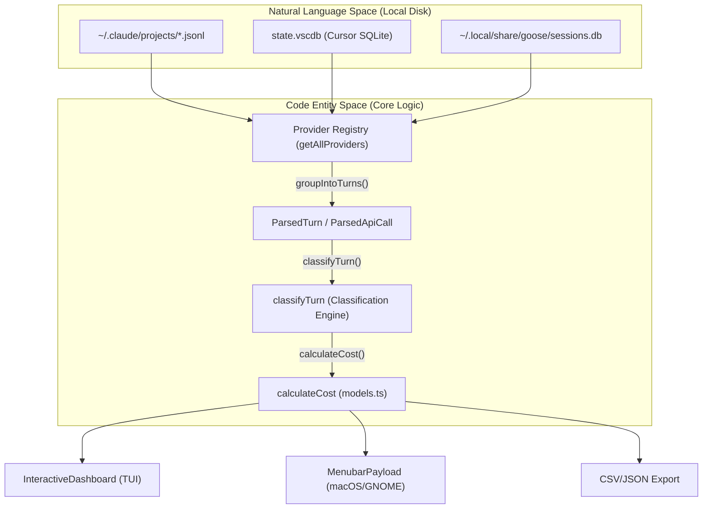
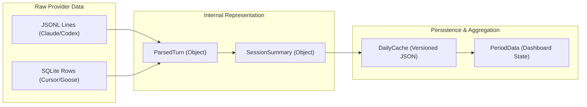

# CodeBurn 개요

관련 소스 파일

다음 파일들은 이 위키 페이지를 생성하기 위한 컨텍스트로 사용되었습니다.

- [.github/FUNDING.yml](.github/FUNDING.yml)
- [.gitignore](.gitignore)
- [CHANGELOG.md](CHANGELOG.md)
- [README.md](README.md)
- [assets/dashboard.jpg](assets/dashboard.jpg)
- [assets/logo.ico](assets/logo.ico)
- [assets/logo.png](assets/logo.png)
- [assets/menubar-0.8.0.png](assets/menubar-0.8.0.png)
- [package.json](package.json)

CodeBurn은 로컬 세션 데이터에서 AI 코딩 토큰 사용량과 비용을 직접 추적하고 분석하도록 설계된 개발자 중심 관측성 도구입니다. API 프록시나 외부 래퍼 없이도 작업, 도구, 모델, 프로젝트별로 토큰이 어디에 쓰이는지 깊이 있게 보여줍니다.

### 목적과 범위
CodeBurn의 핵심 목표는 **"내 AI 코딩 토큰은 어디로 가는가?"라는 질문에 답하는 것**입니다. 이를 위해 널리 쓰이는 AI 코딩 도구의 로컬 세션 로그를 파싱하고, 대화형 대시보드(TUI), macOS 메뉴 막대 애플리케이션, GNOME 셸 확장, 상세한 내보내기 기능을 제공합니다 [README.md:16-18]().

CodeBurn은 **원샷 성공률**(AI가 재시도 없이 단일 턴에서 작업을 완료하는 빈도) 같은 핵심 지표를 추적하고, 개발자가 AI 예산을 최적화할 수 있도록 **낭비 패턴**(예: 중복 파일 읽기 또는 과도하게 비대한 컨텍스트)을 식별합니다 [README.md:81-85]().

### 주요 기능
*   **다중 제공자 지원**: Claude Code, Cursor, GitHub Copilot, Codex, Goose, Roo Code를 포함한 18개 이상의 도구에서 데이터를 자동으로 발견하고 파싱합니다 [README.md:92-112](), [CHANGELOG.md:25-29]().
*   **세분화된 분석**: `TaskCategory`(예: 코딩, 테스트, 터미널 사용)와 특정 도구별로 비용을 분해합니다 [README.md:16-17]().
*   **비용 투명성**: LiteLLM 가격 데이터와 통합하여 수백 개 모델 전반에 대한 정확한 USD 추정치를 제공합니다 [README.md:18]().
*   **최적화 엔진**: 세션 기록을 스캔해 불필요한 읽기, 중복 읽기, 사용되지 않은 MCP 도구 컨텍스트 같은 "토큰 소모" 패턴을 감지합니다 [README.md:81-82](), [CHANGELOG.md:5-15]().
*   **크로스 플랫폼 인터페이스**: 실시간 모니터링을 위해 터미널 기반 대화형 대시보드, 네이티브 macOS 메뉴 막대 앱, GNOME 셸 확장을 제공합니다 [README.md:20-37]().

### 상위 수준 시스템 아키텍처

다음 다이어그램은 CodeBurn이 원시 세션 로그(자연어 공간)와 구조화된 분석(코드 엔터티 공간) 사이의 간극을 어떻게 연결하는지 보여줍니다.

**데이터 변환 파이프라인**

**출처**: [README.md:92-113](), [package.json:20-31](), [CHANGELOG.md:25-29](), [CHANGELOG.md:69-75]()

### 하위 시스템 관계

CodeBurn은 응집력 있는 경험을 제공하기 위해 서로 상호작용하는 여러 기능 계층으로 구성됩니다.

| 하위 시스템 | 주요 책임 | 핵심 코드 엔터티 |
| :--- | :--- | :--- |
| **수집** | 다양한 제공자의 원시 세션 파일을 찾고 읽습니다. | `discoverAllSessions`, `parseSessionFile` |
| **파싱** | 원시 로그를 표준화된 `ParsedTurn` 및 `Session` 객체로 변환합니다. | `groupIntoTurns`, `ParsedApiCall` |
| **분석** | 턴을 작업으로 분류하고 비용을 계산합니다. | `classifyTurn`, `calculateCost`, `TaskCategory` |
| **집계** | 보고와 캐싱을 위해 데이터를 기간별 버킷으로 나눕니다. | `aggregateProjectsIntoDays`, `DailyCache` |
| **프레젠테이션** | TUI, macOS Menubar, GNOME 확장 또는 파일 내보내기를 렌더링합니다. | `InteractiveDashboard`, `MenuBarContent`, `exportCsv` |

**논리적 엔터티 매핑**

**출처**: [CHANGELOG.md:75-76](), [CHANGELOG.md:18-19](), [README.md:121-125]()

### 탐색
더 깊은 기술적 내용을 보려면 다음 하위 페이지를 참조하세요.

*   **[시작하기](#1.1)**: `npm install -g codeburn`을 통한 설치, 사전 요구 사항(Node.js 22+), `~/.config/codeburn/config.json`의 초기 설정 [package.json:32-34](), [README.md:45-56]().
*   **[핵심 개념과 용어](#1.2)**: "원샷 비율", "턴", "ParsedApiCall", "낭비 패턴" 같은 도메인 특화 용어의 정의입니다.
*   **코어 아키텍처**: `Data Ingestion` 파이프라인, `Turn Classification` 엔진, `DailyCache` 영속성을 자세히 살펴봅니다.
*   **CLI 참조**: `codeburn optimize`, `codeburn compare`, `codeburn yield`, `codeburn status` 같은 명령 문서입니다 [README.md:68-86]().
*   **제공자 플러그인 시스템**: 18개 이상의 제공자(Claude, Cursor, Copilot, Goose 등)를 추출하고 중복 제거하는 방식에 대한 기술적 세부 정보입니다 [README.md:92-112]().
*   **macOS 메뉴 막대 애플리케이션**: `mac/` 디렉터리에 있는 Swift 기반 동반 앱의 아키텍처이며, heartbeat와 refresh 로직을 포함합니다 [CHANGELOG.md:20-22](), [CHANGELOG.md:54-66]().
*   **GNOME 셸 확장**: Linux 인디케이터와 `Gio`를 통한 CLI 통신 개요입니다.

**출처**: [package.json:1-60](), [README.md:1-125](), [CHANGELOG.md:1-98]()
