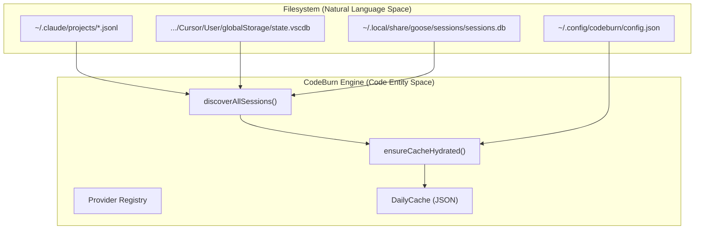
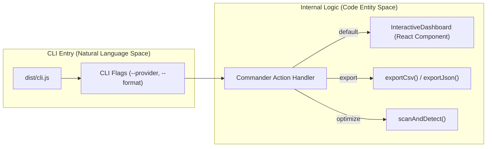

# 시작하기

<details>
<summary>관련 소스 파일</summary>

다음 파일들은 이 위키 페이지를 생성하기 위한 컨텍스트로 사용되었습니다.

- [CHANGELOG.md](CHANGELOG.md)
- [README.md](README.md)
- [assets/menubar-0.8.0.png](assets/menubar-0.8.0.png)
- [package-lock.json](package-lock.json)
- [package.json](package.json)
- [tsconfig.json](tsconfig.json)
- [tsup.config.ts](tsup.config.ts)

</details>


CodeBurn은 로컬 세션 로그에서 AI 토큰 소비와 비용을 직접 추적하도록 설계된 개발자 중심 관측성 도구입니다. API 프록시나 래퍼 없이도 Claude Code, Cursor, GitHub Copilot 같은 AI 코딩 어시스턴트가 여러 프로젝트, 모델, 작업 범주 전반에서 리소스를 어떻게 사용하는지 보여줍니다 [README.md:16-19]().

## 사전 요구 사항

CodeBurn을 실행하려면 환경이 다음 요구 사항을 충족해야 합니다.

*   **Node.js**: 버전 22 이상이 필요합니다 [package.json:32-34](). 프로젝트는 호환성을 위해 `node20`을 대상으로 하는 `tsup`으로 빌드되지만, 런타임 실행은 최신 Node 기능에 의존합니다 [tsup.config.ts:6-6]().
*   **운영 체제**: macOS, Linux 또는 Windows. `~/.claude` 같은 세션 로그 경로는 Unix 계열 시스템에서 표준이지만, CodeBurn은 Windows의 대응 경로도 자동으로 감지합니다 [README.md:113-113]().
*   **지원되는 AI 도구**: 지원되는 18개 제공자 중 최소 하나의 세션 데이터가 디스크에 있어야 합니다(예: Claude Code, Cursor, Goose 또는 Roo Code) [README.md:16-16, 92-111]().
*   **데이터베이스 드라이버**: Cursor와 OpenCode 지원에는 `better-sqlite3`가 필요하며, 일반적으로 선택적 의존성으로 설치됩니다 [README.md:43-43]().

## 설치

CodeBurn은 NPM, Homebrew를 통해 설치하거나 필요할 때 실행할 수 있습니다.

### 전역 설치
```bash
npm install -g codeburn
```
[README.md:47-49]()

### Homebrew (macOS/Linux)
```bash
brew tap getagentseal/codeburn
brew install codeburn
```
[README.md:51-56]()

### 일회성 실행
```bash
npx codeburn
# or
bunx codeburn
```
[README.md:58-64]()

## 첫 실행과 데이터 흐름

첫 실행 시 **CodeBurn은 제공자 세션 로그를 자동으로 검색**합니다. Claude Code의 `~/.claude/projects/`, Goose의 `~/.local/share/goose/sessions/` 같은 기본 디렉터리나 Cursor의 SQLite 데이터베이스를 스캔합니다 [README.md:92-111](). 

시스템은 이후 실행을 즉시 완료할 수 있도록 **Durable Daily Cache**(v4)를 사용합니다. 이 캐시는 `ensureCacheHydrated()`를 통해 채워지며, 손상을 방지하기 위해 원자적 파일 쓰기로 저장됩니다 [CHANGELOG.md:75-75, 84-84]().

### 데이터 수집 개요

출처: [README.md:92-111](), [CHANGELOG.md:75-75](), [CHANGELOG.md:84-84]()

## 설정

CodeBurn은 영구 설정을 JSON 구성 파일에 저장합니다.

*   **위치**: `~/.config/codeburn/config.json`
*   **Durable Cache 위치**: CodeBurn은 집계된 **일별 데이터를 저장하기 위해 버전이 지정된 캐시를 사용**하며, 스키마가 변경되면 자동으로 마이그레이션됩니다 [CHANGELOG.md:75-75]().

### 플랜과 통화
CodeBurn은 예산 사용률을 추적하기 위해 사용자가 구독 플랜(예: Claude Pro, Cursor Pro)을 설정할 수 있게 합니다 [README.md:86-86](). 또한 Frankfurter FX API를 사용한 통화 변환을 지원하여, 사용자가 선호하는 현지 통화로 비용이 표시되도록 합니다 [CHANGELOG.md:40-40, 61-61]().

## CLI 명령 둘러보기

CLI는 기본 인터페이스이며, 대화형 TUI(`ink`로 구축)와 구조화된 데이터 내보내기를 지원합니다.

### 주요 명령

| 명령 | 목적 |
| :--- | :--- |
| `codeburn` | 대화형 대시보드를 실행합니다(기본값: 7일 보기) [README.md:69-69]() |
| `codeburn today` | 현재 날짜의 사용량을 표시합니다 [README.md:70-70]() |
| `codeburn month` | 현재 달력 월의 사용량을 표시합니다 [README.md:71-71]() |
| `codeburn report` | 상세 보고서를 생성합니다(`--from`/`--to` 날짜 지원) [README.md:72-74]() |
| `codeburn optimize` | 낭비 요소(예: 사용되지 않은 MCP 도구, 세션 이상치)를 스캔합니다 [CHANGELOG.md:6-15, README.md:81-82]() |
| `codeburn compare` | 모델 성능과 비용을 나란히 비교합니다 [README.md:83-83]() |
| `codeburn export` | 데이터를 CSV 또는 JSON 형식으로 내보냅니다 [README.md:79-80]() |

### 필터링과 형식 지정
*   **제공자 필터링**: `--provider <name>`(예: `claude`, `cursor`, `goose`)을 사용하여 모든 명령의 범위를 제한합니다 [README.md:117-117]().
*   **JSON 출력**: 자동화 또는 `jq`로의 파이핑에는 `--format json`을 사용합니다 [README.md:75-75]().
*   **기간 제어**: `-p`(예: `30days`, `week`, `all`)를 사용하여 조회 기간을 설정합니다 [README.md:72-73, 85-85]().

### 명령 구현 흐름
CLI는 명령 라우팅에 `commander`를 사용하고 터미널 UI 렌더링에 `react`/`ink`를 활용합니다.


출처: [package.json:7-9, 45-51](), [README.md:68-86](), [CHANGELOG.md:75-75]()
