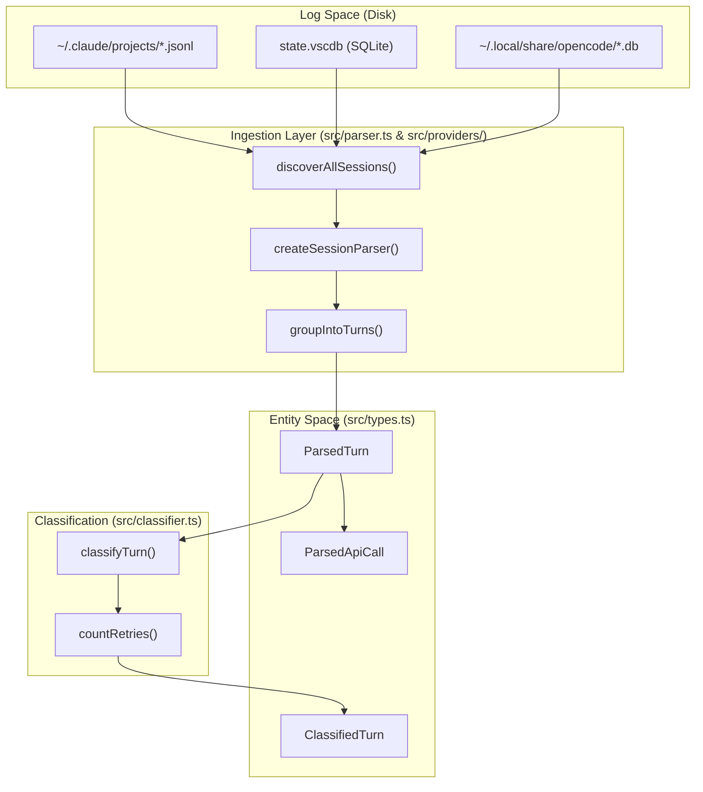
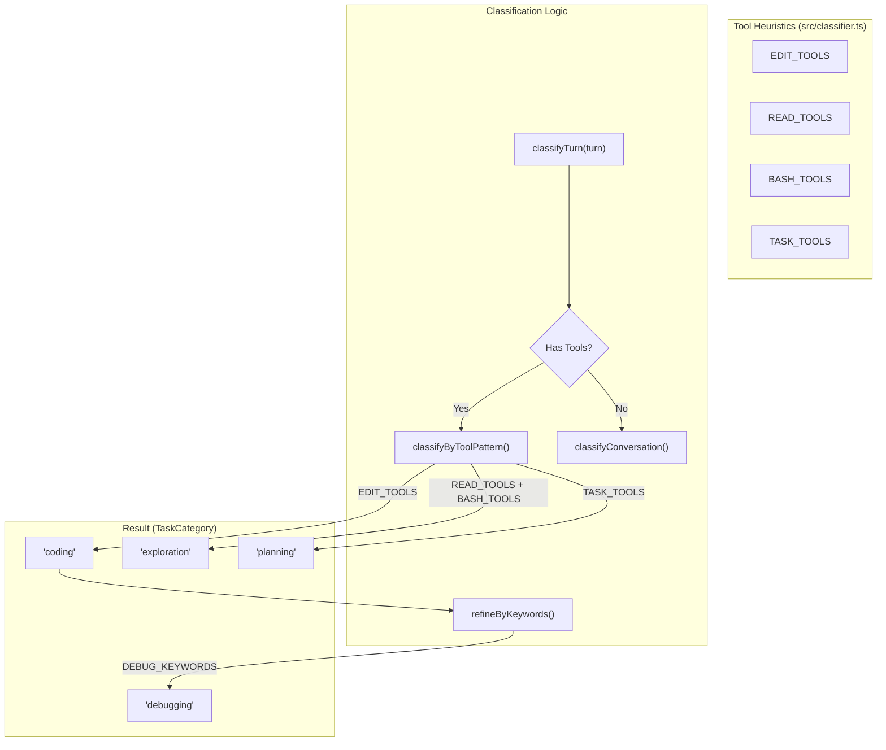

# 핵심 개념과 용어

관련 소스 파일

다음 파일들은 이 위키 페이지를 생성하기 위한 컨텍스트로 사용되었습니다.

- [src/classifier.ts](src/classifier.ts)
- [src/data/litellm-snapshot.json](src/data/litellm-snapshot.json)
- [src/parser.ts](src/parser.ts)
- [src/providers/antigravity.ts](src/providers/antigravity.ts)
- [src/providers/opencode.ts](src/providers/opencode.ts)
- [src/providers/types.ts](src/providers/types.ts)
- [src/types.ts](src/types.ts)

이 페이지는 CodeBurn 코드베이스 전반에서 사용되는 핵심 도메인 어휘와 기술 엔터티를 정의합니다. 원시 로그 수집부터 최종 대시보드 표시까지 이어지는 데이터 파이프라인을 탐색하려면 이러한 개념을 이해하는 것이 필수입니다.

## 목적과 범위

CodeBurn은 여러 AI 제공자의 로컬 세션 로그를 파싱하여 AI 코딩 지출에 대한 가시성을 제공하도록 설계되었습니다. API 프록시나 래퍼 없이도 원시의 이질적인 이벤트 스트림을 통합 데이터 모델로 변환하여 비용 분석, 작업 분류, 낭비 감지를 가능하게 합니다.

## 핵심 도메인 엔터티

시스템 아키텍처는 개발자와 AI 에이전트 간의 상호작용을 나타내는 엔터티 계층을 중심으로 구성됩니다.

### Provider
**Provider**는 AI 코딩 도구(예: Claude Code, Cursor, OpenCode)를 나타내는 플러그인 기반 추상화입니다. 각 제공자는 디스크에서 세션 파일을 발견하는 방법과 모델 및 도구의 표시 이름을 해석하는 방법을 정의하는 `Provider` 인터페이스를 구현합니다.
- **구현:** [src/providers/types.ts:32-39]()의 `Provider` 인터페이스.
- **레지스트리:** [src/providers/index.ts:15-20]()의 `getAllProviders`를 통해 관리됩니다.

### Session
**Session**은 특정 프로젝트 컨텍스트 안에서의 연속적인 상호작용을 나타냅니다. 코드베이스에서는 `SessionSummary` 타입으로 캡슐화됩니다. 여러 "Turn"을 집계하고 총비용, 토큰 사용량, 도구별 분석 같은 메타데이터를 제공합니다.
- **데이터 구조:** [src/types.ts:106-130]()의 `SessionSummary`.
- **소스:** 발견 과정에서 `SessionSource`로 표현됩니다 [src/providers/types.ts:1-5]().

### Turn
**Turn**은 **대화의 원자적 단위**이며, 하나의 사용자 프롬프트와 그 뒤에 이어지는 도구 호출을 포함한 어시스턴트 응답 시퀀스로 구성됩니다.
- **원시 형태:** `ParsedTurn` [src/types.ts:61-66]().
- **보강된 형태:** 범주 라벨, 재시도 횟수, 편집 플래그를 추가한 `ClassifiedTurn` [src/types.ts:99-104]().

### ParsedApiCall
**ParsedApiCall**은 Turn 안에서 **LLM과 이루어지는 단일 요청/응답 교환**을 나타냅니다. 에이전트가 루프 안에서 도구를 사용하는 경우(예: Read -> Edit -> Bash), 하나의 Turn에 여러 `ParsedApiCall` 엔터티가 포함될 수 있습니다.
- **속성:** `usage`(토큰), `costUSD`, 사용된 `tools`, 추출된 `bashCommands`, `deduplicationKey`를 포함합니다 [src/types.ts:68-82]().

### TaskCategory
**TaskCategory**는 분류 엔진이 Turn에 할당하는 라벨입니다. 상호작용의 의도(예: `coding`, `debugging`, `exploration`)를 식별합니다.
- **라벨:** `CATEGORY_LABELS`에 정의되어 있습니다 [src/types.ts:145-159]().
- **로직:** [src/classifier.ts:150-174]()의 `classifyTurn`으로 결정됩니다.

---

## 기술 개념과 지표

### 원샷 비율
특정 범주의 턴 중 재시도나 자체 수정 없이 성공적인 결과로 이어진 턴의 비율입니다. CodeBurn은 모델이 첫 시도에 "제대로 해내는" 지점과 반복 편집으로 토큰을 소모하는 지점을 사용자가 식별할 수 있도록 이 값을 추적합니다.
- **계산:** `categoryBreakdown`의 `oneShotTurns`를 통해 추적됩니다 [src/types.ts:122]().

### 캐시 적중률
전체 입력 토큰 대비 `cacheReadInputTokens`의 비율입니다. 이 지표는 프롬프트 캐싱의 효율성, 특히 Anthropic/Claude 제공자에서의 효율성을 이해하는 데 중요합니다.
- **소스:** `TokenUsage`에서 추출됩니다 [src/types.ts:1-9]().

### 낭비 패턴
`codeburn optimize` 명령은 **비용을 부풀리는 비효율적인 동작인 "낭비 패턴"을 세션에서 스캔**합니다.
- **불필요한 읽기:** 중간 편집 없이 같은 파일을 여러 번 읽는 경우입니다.
- **비대한 컨텍스트:** 매 턴마다 전송되는 대형 `CLAUDE.md` 또는 프로젝트 지침입니다.
- **고스트 에이전트:** 의미 있는 작업을 수행하지 않는 하위 에이전트를 생성하는 경우입니다.
- **구현:** `Agent`(spawn) [src/parser.ts:128]() 또는 `EnterPlanMode` [src/parser.ts:129]() 같은 도구 패턴으로 식별됩니다.

### 플랜과 예산
사용자는 예산 대비 지출을 추적하기 위해 월간 "Plan"을 정의할 수 있습니다.
- **예측:** 시스템은 최근 7일의 일별 비용 중앙값을 사용하여 월간 예상 지출을 계산합니다.
- **초기화일:** 청구 주기가 다시 시작되는 달의 날짜입니다.

---

## 데이터 흐름과 엔터티 매핑

다음 다이어그램은 원시 데이터가 애플리케이션에서 사용하는 내부 타입으로 변환되는 방식을 보여줍니다.

### 로그 수집에서 분류된 엔터티까지
이 다이어그램은 "자연어/로그 공간"과 "코드 엔터티 공간"을 연결합니다.

*출처: [src/parser.ts:5](), [src/parser.ts:161-204](), [src/types.ts:61-104](), [src/classifier.ts:150-174]()*

### Turn 분류 로직
이 다이어그램은 `classifyTurn`이 도구 사용 패턴을 `TaskCategory` 라벨에 매핑하는 방식을 보여줍니다.

*출처: [src/classifier.ts:18-22](), [src/classifier.ts:60-94](), [src/classifier.ts:96-111]()*

---

## 핵심 지표 요약 표

| 용어 | 정의 | 코드 참조 |
| :--- | :--- | :--- |
| **Input Tokens** | 모델로 전송된 토큰입니다(컨텍스트 포함). | `TokenUsage.inputTokens` [src/types.ts:2]() |
| **Output Tokens** | 모델이 생성한 토큰입니다. | `TokenUsage.outputTokens` [src/types.ts:3]() |
| **Cache Creation** | 캐시에 기록된 토큰입니다(비용이 높음). | `TokenUsage.cacheCreationInputTokens` [src/types.ts:4]() |
| **Cache Read** | 캐시에서 읽은 토큰입니다(저렴함). | `TokenUsage.cacheReadInputTokens` [src/types.ts:5]() |
| **Retries** | Edit -> Error -> Edit 루프로 감지된 항목입니다. | `countRetries()` [src/classifier.ts:124-144]() |
| **Reasoning Tokens** | 내부 "사고"(예: o1/R1)에 사용된 토큰입니다. | `TokenUsage.reasoningTokens` [src/types.ts:7]() |

*출처: [src/types.ts:1-9](), [src/classifier.ts:124-144](), [src/parser.ts:90-135]()*
