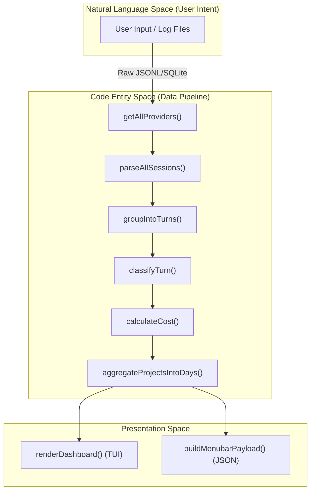
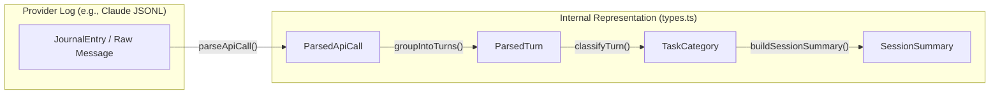

# 코어 아키텍처

관련 소스 파일

다음 파일들은 이 위키 페이지를 생성하기 위한 컨텍스트로 사용되었습니다.

- [CHANGELOG.md](CHANGELOG.md)
- [README.md](README.md)
- [assets/menubar-0.8.0.png](assets/menubar-0.8.0.png)
- [package.json](package.json)
- [src/cli.ts](src/cli.ts)

CodeBurn 아키텍처는 대용량의 파편화된 AI 제공자 로그를 구조화된 재무 및 운영 인사이트로 변환하도록 설계되었습니다. JSONL, SQLite 같은 원시 제공자별 형식의 데이터를 분석과 표시를 위한 통합 내부 표현으로 이동시키는 다단계 파이프라인으로 동작합니다.

## 엔드투엔드 데이터 파이프라인

파이프라인은 발견에서 프레젠테이션까지 선형으로 진행됩니다. `codeburn` 명령을 호출할 때마다, 또는 macOS 메뉴 막대 앱이 새로고침될 때마다 이러한 계층을 통과하는 처리가 트리거되며, 이는 종종 `hydrateCache`가 조정합니다 [src/cli.ts:27-36]().

### 1. 수집 및 발견
시스템은 로컬 파일시스템에서 세션 데이터를 식별합니다. `getAllProviders` 함수 [src/providers/index.ts:25-50]()는 지원되는 도구(예: Claude, Cursor, Copilot, Roo Code)의 레지스트리를 반환합니다. 각 제공자는 발견 메커니즘을 구현합니다. 예를 들어 Claude 제공자는 `~/.claude/projects/`를 스캔합니다 [src/providers/claude.ts:81-91]().

### 2. 파싱 및 정규화
`parseAllSessions` 함수 [src/parser.ts:241-285]()는 원시 파일을 `ParsedTurn` 객체 [src/types.ts:61-66]()로 변환하는 과정을 오케스트레이션합니다.
*   **중복 제거:** `deduplicationKey`(일반적으로 메시지 ID)를 사용하여 Desktop과 CLI 에이전트처럼 겹치는 소스의 로그가 중복 집계되지 않도록 합니다 [src/parser.ts:148-149]().
*   **그룹화:** `groupIntoTurns` 함수 [src/parser.ts:122-165]()는 사용자 메시지와 그 뒤에 이어지는 모든 어시스턴트 도구 호출/응답을 하나의 논리적 "Turn"으로 모읍니다.

자세한 내용은 [데이터 수집 및 파싱 파이프라인](#2.1)을 참조하세요.

### 3. 분류 및 비용 계산
파싱된 턴은 실행 가능한 인사이트를 제공하기 위해 메타데이터로 보강됩니다.
*   **분류:** `classifyTurn` [src/classifier.ts:14-55]()은 `str_replace_editor` 또는 `bash` 같은 도구 사용 패턴을 분석하여 `TaskCategory` [src/types.ts:83-97]()를 할당합니다.
*   **비용 계산:** 엔진은 LiteLLM 데이터 [src/models.ts:141-164]()를 사용해 모델 이름을 표준 가격 계층으로 해석하고, 입력, 출력, 캐시 적중을 고려하여 `calculateCost` [src/models.ts:238-278]()로 USD 비용을 계산합니다.

자세한 내용은 [Turn 분류 엔진](#2.2) 및 [가격 책정과 비용 계산](#2.3)을 참조하세요.

### 4. 집계 및 캐싱
수천 개의 세션 파일을 대상으로 높은 성능을 유지하기 위해 시스템은 세분화된 턴을 요약으로 축소합니다.
*   **프로젝트 요약:** 데이터는 프로젝트 경로별로 `ProjectSummary` 객체 [src/types.ts:123-129]()로 그룹화됩니다.
*   **시간 버킷화:** `aggregateProjectsIntoDays` [src/day-aggregator.ts:41-195]()는 시계열 차트를 위해 비용과 지표를 달력 날짜별로 버킷화합니다.
*   **영속성:** `DailyCache` [src/daily-cache.ts:22-38]()는 매 실행마다 과거 로그를 다시 파싱하지 않도록 버전이 지정된 집계 일별 데이터를 `~/.config/codeburn/cache/v4/`에 저장합니다.

자세한 내용은 [일별 집계와 캐싱](#2.4)을 참조하세요.

### 5. 프레젠테이션
마지막으로 데이터가 사용자에게 렌더링됩니다.
*   **CLI/TUI:** `codeburn report` 또는 `codeburn today` 같은 명령은 `renderDashboard` [src/dashboard.ts:16-18]()(React Ink 경유) 또는 `renderStatusBar` [src/format.ts:27-59]()를 사용합니다.
*   **JSON/Export:** macOS Menubar 앱 또는 외부 도구를 위해 `buildJsonReport` [src/cli.ts:115-195]()를 통해 데이터를 내보낼 수 있습니다.

---

## 아키텍처 다이어그램

### 파이프라인 흐름: 로그에서 대시보드까지
이 다이어그램은 주요 코드 엔터티를 통해 데이터가 흐르는 방식을 보여줍니다.

**출처:** [src/parser.ts:241-285](), [src/day-aggregator.ts:41-42](), [src/classifier.ts:14](), [src/models.ts:238](), [src/cli.ts:27-36]()

### 엔터티 매핑: 로그 데이터에서 내부 타입까지
이 다이어그램은 원시 제공자 데이터와 로직에 사용되는 내부 TypeScript 인터페이스 사이의 간극을 연결합니다.

**출처:** [src/parser.ts:77-120](), [src/parser.ts:122-165](), [src/parser.ts:167-239](), [src/types.ts:46-121]()

---

## 코어 컴포넌트 개요

| 계층 | 주요 책임 | 핵심 파일 |
| :--- | :--- | :--- |
| **Providers** | 18개 이상의 도구에 대한 파일 발견 및 원시 로그 추출입니다. | `src/providers/*` |
| **Parsing** | 원시 라인을 논리적 턴과 API 호출로 변환합니다. | `src/parser.ts` |
| **Classification** | 작업 유형(Coding, Debugging 등)을 식별합니다. | `src/classifier.ts` |
| **Economics** | 모델 가격(LiteLLM), 토큰 계산, FX를 처리합니다. | `src/models.ts`, `src/currency.ts` |
| **Aggregation** | 프로젝트, 일자, 모델별로 데이터를 요약합니다. | `src/day-aggregator.ts` |
| **Storage** | 계산된 총계를 디스크에 영속화합니다(DailyCache). | `src/daily-cache.ts` |
| **Config** | 사용자 설정, 플랜, 모델 별칭을 관리합니다. | `src/config.ts`, `src/plans.ts` |

**출처:** [src/parser.ts](), [src/classifier.ts](), [src/models.ts](), [src/day-aggregator.ts](), [src/daily-cache.ts](), [src/cli.ts]()
