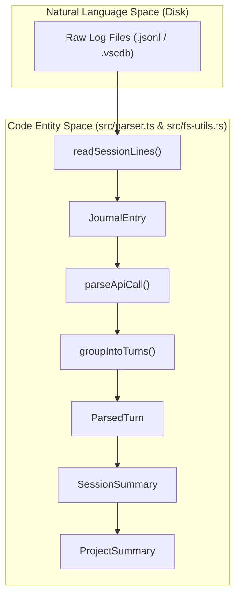
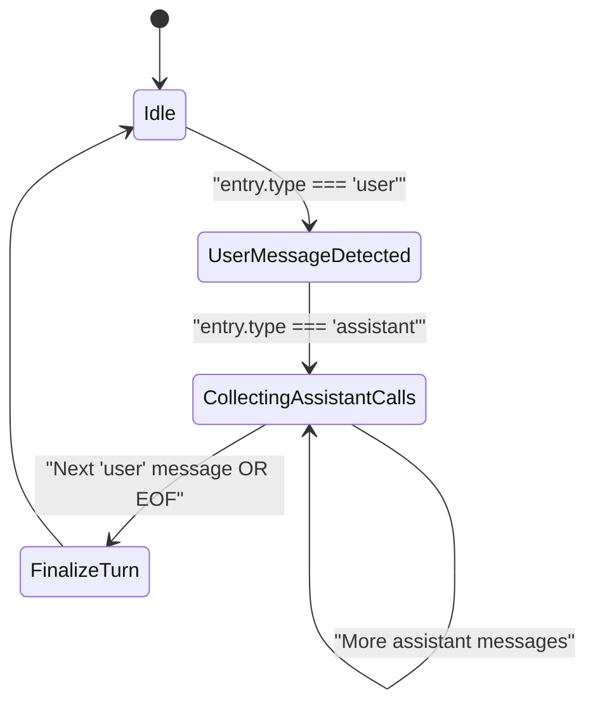

# 데이터 수집 및 파싱 파이프라인

관련 소스 파일

다음 파일들은 이 위키 페이지를 생성하기 위한 컨텍스트로 사용되었습니다.

- [src/cli-date.ts](src/cli-date.ts)
- [src/fs-utils.ts](src/fs-utils.ts)
- [src/parser.ts](src/parser.ts)
- [src/types.ts](src/types.ts)
- [tests/cli-date.test.ts](tests/cli-date.test.ts)
- [tests/date-range-filter.test.ts](tests/date-range-filter.test.ts)
- [tests/fs-utils.test.ts](tests/fs-utils.test.ts)
- [tests/mcp-coverage.test.ts](tests/mcp-coverage.test.ts)
- [tests/models.test.ts](tests/models.test.ts)
- [tests/parser-filter.test.ts](tests/parser-filter.test.ts)
- [tests/parser-mcp-inventory.test.ts](tests/parser-mcp-inventory.test.ts)

데이터 수집 및 파싱 파이프라인은 CodeBurn의 기반 하위 시스템입니다. 이 파이프라인은 여러 AI 제공자의 원시 로그 파일을 발견하고, 디스크에서 효율적으로 읽고, 메시지를 중복 제거하며, 구조화되지 않은 JSONL 또는 SQLite 데이터를 후속 분석을 위한 구조화된 `ParsedTurn` 및 `SessionSummary` 객체로 변환하는 역할을 담당합니다.

## 파이프라인 개요

파이프라인은 발견, 읽기, 파싱, 그룹화, 요약의 선형 순서로 동작합니다.

### 로직 흐름: 원시 데이터에서 프로젝트 요약까지

1.  **발견**: 시스템은 `discoverAllSessions`를 통해 **제공자별 로직을 사용하여 세션 파일을 식별**합니다 [src/parser.ts:5]().
2.  **읽기**: `createReadStream`을 사용해 메모리 사용량을 안정적으로 유지하는 `readSessionLines`의 메모리 인식 전략으로 디스크에서 파일을 읽습니다 [src/fs-utils.ts:79-104]().
3.  **파싱**: 원시 라인은 `parseJsonlLine`을 사용해 `JournalEntry` 객체로 변환됩니다 [src/parser.ts:29-35]().
4.  **그룹화**: 순차 항목은 `groupIntoTurns`를 통해 "Turns"(사용자 메시지 뒤에 하나 이상의 어시스턴트 응답/도구 호출이 이어지는 단위)로 그룹화됩니다 [src/parser.ts:161-204]().
5.  **분류**: 각 턴은 `classifyTurn`으로 분석되어 `TaskCategory`를 결정합니다 [src/parser.ts:22]().
6.  **요약**: 턴은 `SessionSummary`로 집계되고 최종적으로 `ProjectSummary` 객체로 집계됩니다 [src/types.ts:106-138]().

### 데이터 흐름 다이어그램

다음 다이어그램은 "자연어 공간"(사용자/어시스턴트 상호작용)에서 "코드 엔터티 공간"(내부 데이터 구조)으로의 전환을 매핑합니다.

"파이프라인 데이터 변환"

출처: [src/parser.ts:5-204](), [src/fs-utils.ts:79-104](), [src/types.ts:46-138]()

## 세션 발견 및 읽기

파이프라인은 제공자 레지스트리에서 `discoverAllSessions`를 호출하는 것으로 시작합니다 [src/parser.ts:5](). 이 함수는 원시 로그 경로를 반환하며, 이후 해당 로그는 `fs-utils` 모듈에서 처리됩니다.

### 메모리 인식 파일 읽기
대형 세션 로그를 처리할 때 OOM(Out of Memory) 오류를 방지하기 위해 CodeBurn은 계층화된 읽기 전략을 구현합니다.
*   **작은 파일(< 8MB)**: 최대 속도를 위해 `readFile`을 사용해 메모리로 직접 읽습니다 [src/fs-utils.ts:49]().
*   **큰 파일(8MB - 128MB)**: 메모리 사용량을 안정적으로 유지하기 위해 `createReadStream`과 `readline` 인터페이스를 사용하는 `readViaStream`으로 처리됩니다 [src/fs-utils.ts:26-32](), [src/fs-utils.ts:49]().
*   **초대형 파일(> 128MB)**: V8 힙을 보호하기 위해 `readSessionFile`은 `null`을 반환하며, `CODEBURN_VERBOSE`가 활성화된 경우 경고를 출력합니다 [src/fs-utils.ts:43-46]().
*   **스트리밍 제한**: 라인 단위 처리(예: `readSessionLines`)의 경우 더 높은 안전 한도인 2GB가 적용됩니다 [src/fs-utils.ts:16-17](), [src/fs-utils.ts:88-93]().

출처: [src/fs-utils.ts:8-17](), [src/fs-utils.ts:26-55](), [src/fs-utils.ts:79-104]()

## 파싱 및 그룹화 로직

원시 항목을 변환하는 핵심 로직은 `src/parser.ts`에 있습니다.

### API 호출 추출
`parseApiCall` 함수는 어시스턴트 메시지에서 다음을 포함한 메타데이터를 추출합니다.
*   **토큰 사용량**: `TokenUsage` 타입에 매핑되는 입력, 출력, 캐시 관련 토큰입니다 [src/parser.ts:96-104]().
*   **비용**: 모델별 가격과 사용 속도를 사용해 `calculateCost`로 계산됩니다 [src/parser.ts:108-116]().
*   **도구 사용량**: 코어 도구와 MCP(Model Context Protocol) 도구를 추출합니다 [src/parser.ts:125-126]().
*   **중복 제거**: 응답이 중복 집계되지 않도록 메시지 ID 또는 타임스탬프에서 `deduplicationKey`가 생성됩니다 [src/parser.ts:133]().

### Turn 그룹화(`groupIntoTurns`)
CodeBurn은 인간-AI 상호작용 주기를 반영하기 위해 **데이터를 "Turns"로 구성**합니다. 턴은 `user` 메시지를 만났을 때 시작됩니다 [src/parser.ts:169-170](). 이후의 모든 `assistant` 메시지와 관련 도구 호출은 다음 비어 있지 않은 `user` 메시지가 나타날 때까지 해당 턴에 수집됩니다 [src/parser.ts:172-179]().

"Turn 그룹화 로직"

출처: [src/parser.ts:161-204](), [src/types.ts:61-66]()

## 필터링 및 캐싱

### 날짜 범위 필터링
파이프라인은 `--from` 및 `--to` 플래그를 사용한 날짜별 세션 필터링을 지원합니다.
*   **경계 제약**: "All Time"은 다년간의 드문드문한 이력을 가진 제공자에서도 파싱 경로를 제한하기 위해 의도적으로 최근 6개월로 제한됩니다 [src/cli-date.ts:11-16]().
*   **포함 범위**: `parseDateRangeFlags` 함수는 `--to` 날짜가 하루 전체(23:59:59.999까지)를 포함하도록 보장합니다 [src/cli-date.ts:55-63]().
*   **검증**: 시작 날짜가 종료 날짜보다 뒤이면 오류를 던집니다 [src/cli-date.ts:65-67]().

### TTL 캐싱
`parseAllSessions`가 무거운 작업을 수행하지만, **결과는 캐시**됩니다. 파이프라인은 파싱 또는 가격 책정 로직의 변경이 오래된 데이터를 무효화하도록 버전이 지정된 캐시(예: `DailyCache`)를 준수합니다. `flushCodexCache`와 `flushAntigravityCache` 같은 제공자별 캐시도 관리됩니다 [src/parser.ts:6-7]().

### 프로젝트 필터링
`filterProjectsByName` 함수는 사용자가 분석 범위를 좁힐 수 있게 합니다. 프로젝트 이름과 파일 경로 모두에 대해 대소문자를 구분하지 않는 부분 문자열 일치를 지원합니다 [tests/parser-filter.test.ts:30-43]().

| 필터 유형 | 동작 | 코드 참조 |
| :--- | :--- | :--- |
| **Include** | OR 의미론(어떤 패턴이든 일치하면 포함) | [tests/parser-filter.test.ts:45-48]() |
| **Exclude** | AND-부정(어떤 패턴이든 일치하면 제거) | [tests/parser-filter.test.ts:50-53]() |
| **Path Match** | 절대 디렉터리 경로의 부분 문자열과 일치 | [tests/parser-filter.test.ts:55-58]() |

출처: [src/cli-date.ts:11-124](), [tests/parser-filter.test.ts:16-82](), [src/parser.ts:6-7]()
