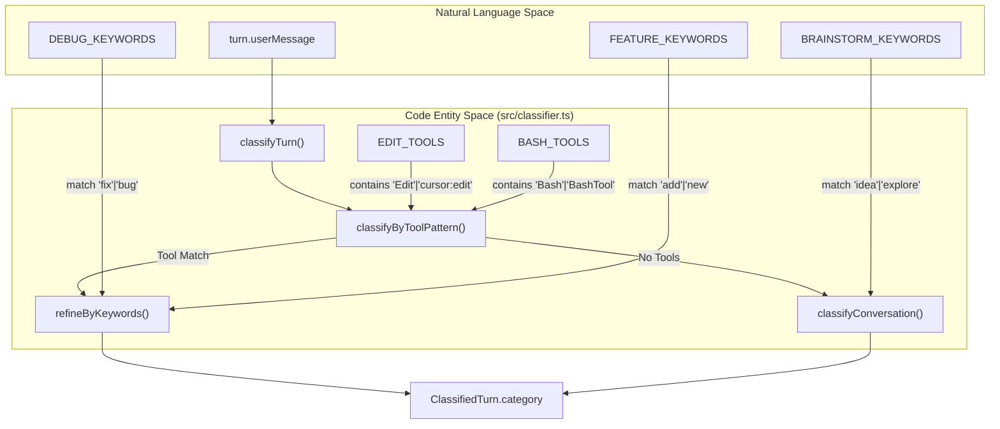
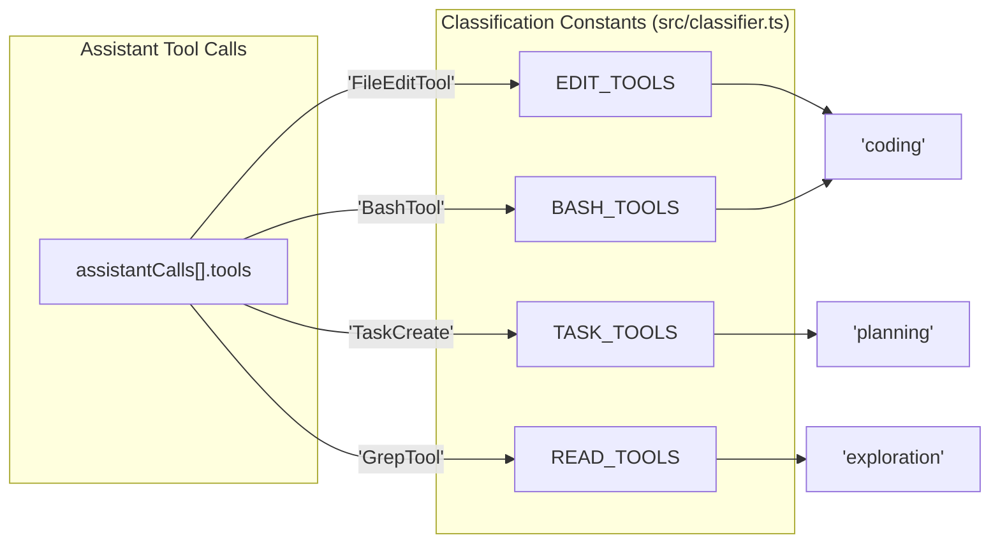
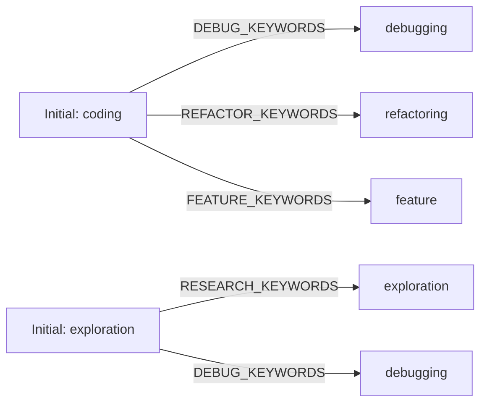

# Turn 분류 엔진

관련 소스 파일

다음 파일들은 이 위키 페이지를 생성하기 위한 컨텍스트로 사용되었습니다.

- [src/bash-utils.ts](src/bash-utils.ts)
- [src/classifier.ts](src/classifier.ts)
- [tests/bash-commands.test.ts](tests/bash-commands.test.ts)
- [tests/classifier.test.ts](tests/classifier.test.ts)
- [tests/dashboard.test.ts](tests/dashboard.test.ts)
- [tests/day-aggregator.test.ts](tests/day-aggregator.test.ts)

Turn 분류 엔진은 원시 `ParsedTurn`에 13개의 구체적인 `TaskCategory` 라벨 중 하나를 할당하여 `ClassifiedTurn`으로 변환하는 역할을 담당합니다. 이 분류는 도구 사용 패턴, 키워드 휴리스틱, 정규식 기반 명령 분석을 결합한 계층적 접근 방식을 사용하는 `classifyTurn` 함수가 수행합니다 [src/classifier.ts:150-174]().

### 분류 파이프라인

분류 과정은 fallback 중심 로직을 따릅니다.
1.  **도구 분석**: 턴에 도구 호출이 포함되어 있으면, 먼저 `classifyByToolPattern`을 통해 호출된 특정 도구(예: `Edit`, `Bash`, `Read`)를 기반으로 범주화합니다 [src/classifier.ts:158-159]().
2.  **키워드 세분화**: 도구를 통해 `coding` 또는 `exploration`으로 식별된 턴의 경우, 엔진은 `refineByKeywords`를 적용하여 `debugging` 또는 `refactoring` 같은 더 구체적인 라벨을 할당합니다 [src/classifier.ts:160-161]().
3.  **대화 휴리스틱**: 도구가 사용되지 않았거나 도구 패턴이 모호한 경우, 엔진은 정규식 패턴을 사용해 사용자의 자연어 메시지를 분석하는 `classifyConversation`으로 fallback합니다 [src/classifier.ts:156,162]().

### 자연어에서 코드 엔터티로의 매핑

다음 다이어그램은 코드의 자연어 패턴과 도구 식별자가 내부 작업 범주에 어떻게 매핑되는지 보여줍니다.

**Turn 분류 로직 흐름**

출처: [src/classifier.ts:8-11](), [src/classifier.ts:18-20](), [src/classifier.ts:150-164]()

**도구 식별자 매핑**

출처: [src/classifier.ts:18-22](), [src/classifier.ts:60-94]()

### 도구 패턴 매칭

엔진은 턴의 주요 의도를 판단하기 위해 여러 제공자(Claude, Cursor 등)가 사용하는 도구 이름 집합을 정의합니다.

| 도구 집합 | 멤버 | 주요 범주 |
| :--- | :--- | :--- |
| `EDIT_TOOLS` | `Edit`, `Write`, `FileEditTool`, `FileWriteTool`, `NotebookEdit`, `cursor:edit` | `coding` |
| `READ_TOOLS` | `Read`, `Grep`, `Glob`, `FileReadTool`, `GrepTool`, `GlobTool` | `exploration` |
| `BASH_TOOLS` | `Bash`, `BashTool`, `PowerShellTool` | `coding` / `testing` / `git` |
| `TASK_TOOLS` | `TaskCreate`, `TaskUpdate`, `TaskGet`, `TaskList`, `TaskOutput`, `TaskStop`, `TodoWrite` | `planning` |
| `SEARCH_TOOLS`| `WebSearch`, `WebFetch`, `ToolSearch` | `exploration` |

출처: [src/classifier.ts:18-22](), [src/classifier.ts:67-91]()

#### Bash 명령 세분화
`BASH_TOOLS`가 `EDIT_TOOLS` 없이 사용된 경우, 엔진은 특정 정규식 패턴으로 `userMessage`를 검사하여 인프라 작업과 코딩을 구분합니다.
*   **테스트**: `TEST_PATTERNS`와 일치합니다(예: `npm test`, `vitest`, `pytest`) [src/classifier.ts:77]().
*   **Git**: `GIT_PATTERNS`와 일치합니다(예: `git push`, `git commit`) [src/classifier.ts:78]().
*   **빌드/배포**: `BUILD_PATTERNS` 또는 `INSTALL_PATTERNS`와 일치합니다(예: `docker`, `npm install`, `deploy`) [src/classifier.ts:79-80]().

### 키워드 휴리스틱

파일 편집이나 터미널 실행이 포함된 턴의 경우, `refineByKeywords`가 세분화된 분류를 제공합니다 [src/classifier.ts:96-111]().

**키워드 세분화 매핑**

출처: [src/classifier.ts:96-111]()

### 재시도 감지

엔진은 각 턴의 `retries` 지표를 계산합니다. 재시도는 어시스턴트가 파일 편집을 시도한 뒤, bash 명령(테스트 또는 검증으로 추정)을 실행하고, 같은 턴에서 즉시 또 다른 파일 편집을 이어서 수행할 때 감지됩니다 [src/classifier.ts:124-144]().

*   **로직**: `assistantCalls` 배열 전반에서 `hasEdit` 및 `hasBash` 플래그의 시퀀스를 추적합니다 [src/classifier.ts:129-141]().
*   **증가**: 새 편집 도구가 발견될 때 `sawBashAfterEdit`가 true이면 `retries` 카운터가 증가합니다 [src/classifier.ts:134]().

### 13개 범주 라벨

`ClassifiedTurn.category`에 할당되는 최종 `TaskCategory`는 다음 중 하나입니다.

1.  `coding`: 일반적인 코드 수정 또는 터미널 중심 작업 [src/classifier.ts:83,86,118-119]().
2.  `debugging`: 버그 수정, 스택 트레이스 분석 또는 오류 해결 [src/classifier.ts:98,106,116]().
3.  `feature`: 새 기능 구현 또는 스캐폴딩 [src/classifier.ts:100,117]().
4.  `refactoring`: 기존 코드 정리, 이름 변경 또는 구조 재편 [src/classifier.ts:99]().
5.  `exploration`: 파일 읽기, 문서 검색 또는 로직 조사 [src/classifier.ts:85,88-89,105,115,120]().
6.  `testing`: 테스트 스위트 실행 또는 테스트 케이스 작성 [src/classifier.ts:77]().
7.  `git`: 버전 관리 작업 [src/classifier.ts:78]().
8.  `build/deploy`: 의존성 설치, 빌드 또는 배포 [src/classifier.ts:79-80]().
9.  `planning`: 작업/todo 도구 또는 에이전트 "plan mode" 사용 [src/classifier.ts:64,90]().
10. `delegation`: 하위 에이전트 생성 [src/classifier.ts:65]().
11. `brainstorming`: 상위 수준 아이디어 구상 및 전략 논의 [src/classifier.ts:114]().
12. `conversation`: 도구 사용이나 특정 기술적 의도가 없는 일반 대화 [src/classifier.ts:121]().
13. `general`: 일반적인 도구 사용(예: `Skill` 도구)에 대한 fallback [src/classifier.ts:91]().

출처: [src/classifier.ts:60-122](), [src/types.js:1]() (참고: `TaskCategory` 타입 정의).

### Bash 유틸리티 통합

분류 엔진은 복잡한 터미널 문자열을 파싱하기 위해 `src/bash-utils.ts`의 `extractBashCommands`에 의존합니다. 이 유틸리티는 다음을 수행합니다.
*   구분자에서 false positive를 피하기 위해 따옴표로 감싼 문자열을 제거합니다 [src/bash-utils.ts:4-5,12]().
*   `&&`, `;`, `|`로 명령을 분할합니다 [src/bash-utils.ts:14]().
*   환경 변수 할당(`NODE_ENV=test`)과 `cd`, `true`, `false` 같은 유틸리티 명령 등의 노이즈를 필터링합니다 [src/bash-utils.ts:37-40]().

출처: [src/bash-utils.ts:8-46](), [tests/bash-commands.test.ts:5-76]()
