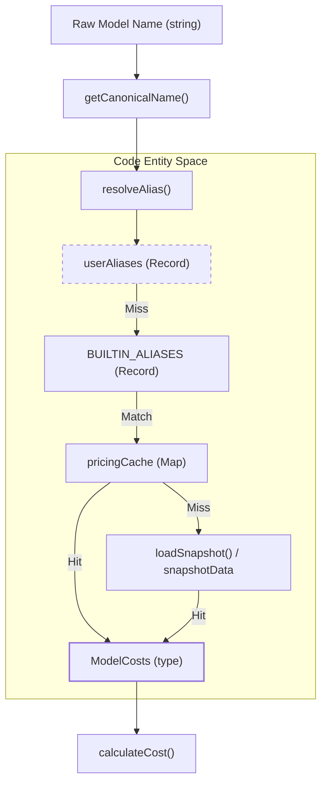
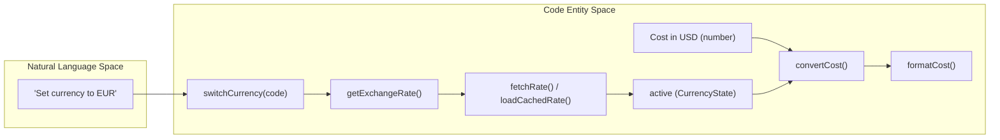

# 가격 책정과 비용 계산

관련 소스 파일

다음 파일들은 이 위키 페이지를 생성하기 위한 컨텍스트로 사용되었습니다.

- [scripts/bundle-litellm.mjs](scripts/bundle-litellm.mjs)
- [src/currency.ts](src/currency.ts)
- [src/day-aggregator.ts](src/day-aggregator.ts)
- [src/export.ts](src/export.ts)
- [src/format.ts](src/format.ts)
- [src/models.ts](src/models.ts)
- [src/providers/gemini.ts](src/providers/gemini.ts)
- [src/providers/goose.ts](src/providers/goose.ts)
- [src/providers/openclaw.ts](src/providers/openclaw.ts)
- [src/providers/qwen.ts](src/providers/qwen.ts)
- [tests/export.test.ts](tests/export.test.ts)
- [tests/minimax.test.ts](tests/minimax.test.ts)

CodeBurn의 가격 책정 엔진은 원시 토큰 수와 도구 사용량을 재무 지표로 변환하는 역할을 담당합니다. **LiteLLM의 실시간 데이터**, 오프라인 신뢰성을 위한 번들 스냅샷, 신생 모델을 위한 하드코딩된 fallback 요율, 사용자 정의 별칭을 결합하는 다계층 해석 전략을 활용합니다.

## 모델 비용 엔진(`models.ts`)

가격 책정 로직의 핵심은 `src/models.ts`에 있습니다. 이 파일은 원격 업데이트 가져오기부터 특정 상호작용의 최종 USD 비용 계산까지 가격 데이터의 생명주기를 관리합니다.

### 데이터 흐름과 해석

시스템은 모델 비용을 결정하기 위해 계층적 조회 전략을 사용합니다. `getModelCosts`가 호출되면 다음 소스를 순회합니다.

1.  **사용자 별칭**: `userAliases`(`setModelAliases`를 통해 채워짐)를 확인하며, 이는 다른 모든 조회보다 우선합니다 [src/models.ts:162-174]().
2.  **내장 별칭**: `BUILTIN_ALIASES`를 확인하여 `cursor-auto` 또는 `anthropic--claude-4.6-sonnet` 같은 제공자별 변형을 **표준 LiteLLM 이름으로 해석**합니다 [src/models.ts:127-160]().
3.  **가격 캐시**: 로컬 `litellm-pricing.json` 캐시 또는 번들된 `litellm-snapshot.json`에서 채워진 `pricingCache`를 검색합니다 [src/models.ts:34-50](), [src/models.ts:109-121]().

### 가격 해석 파이프라인

다음 다이어그램은 원시 모델 문자열(예: Gemini JSONL 로그 또는 Qwen 세션에서 온 문자열)이 `ModelCosts` 객체로 해석되는 방식을 보여줍니다.

**모델 해석 엔터티 매핑**

출처: [src/models.ts:6-13](), [src/models.ts:127-160](), [src/models.ts:170-180](), [src/models.ts:182-192]().

### 주요 함수

*   **`loadPricing()`**: 엔진을 초기화합니다. `~/.cache/codeburn/`의 `litellm-pricing.json`을 읽으려 시도하거나, 캐시가 24시간보다 오래된 경우 LiteLLM GitHub 저장소에서 가져옵니다 [src/models.ts:98-121]().
*   **`calculateCost()`**: 계산의 기본 진입점입니다. 입력 토큰, 출력 토큰, 캐시 쓰기, 캐시 읽기, 웹 검색 횟수를 받습니다. `claude-opus-4-7` 같은 모델에는 `fastMultiplier`를 적용합니다 [src/models.ts:29-32](), [src/models.ts:220-229]().
*   **`getCanonicalName()`**: 기본 모델 ID를 찾기 위해 버전 핀(예: `@20250929`), 날짜 접미사(예: `-20250514`), 제공자 접두사(예: `anthropic/`)를 제거합니다 [src/models.ts:175-180]().
*   **`parseLiteLLMEntry()`**: LiteLLM JSON 스키마를 내부 `ModelCosts` 구조에 매핑합니다. 명시적인 캐시 가격이 없는 경우 캐시 비용을 입력 비용의 1.25배(쓰기)와 0.1배(읽기)로 계산합니다 [src/models.ts:60-70]().

## 통화 변환(`currency.ts`)

CodeBurn은 모든 내부 계산을 USD로 수행하지만, `src/currency.ts`를 사용하여 사용자가 선호하는 통화로 데이터를 표시합니다.

### FX 환율 통합
시스템은 환율을 가져오기 위해 **Frankfurter API**를 사용합니다 [src/currency.ts:14](). 안정성을 보장하기 위해 다음을 수행합니다.
1.  **캐싱**: 환율은 24시간 동안 `~/.cache/codeburn/exchange-rate.json`에 캐시됩니다 [src/currency.ts:13](), [src/currency.ts:61-63]().
2.  **검증**: 가져온 환율은 `MIN_VALID_FX_RATE`(0.0001)와 `MAX_VALID_FX_RATE`(1,000,000)를 기준으로 검증됩니다 [src/currency.ts:17-25]().
3.  **형식 지정**: `formatCost`는 통화 값에 따라 소수점 정밀도를 조정합니다(예: 1 이상 값은 2자리, 센트 미만 값은 최대 4자리) [src/currency.ts:145-156]().

**통화 변환 로직**

출처: [src/currency.ts:7-11](), [src/currency.ts:110-119](), [src/currency.ts:139-156]().

## 비용 구성 요소와 집계

계산된 비용은 보고와 대시보드를 위해 여러 차원에 걸쳐 집계됩니다.

### 비용 구성 요소 표

| 구성 요소 | 코드 참조 | 설명 |
| :--- | :--- | :--- |
| **Input Tokens** | `inputCostPerToken` | 프롬프트 토큰의 기본 비용입니다. |
| **Output Tokens** | `outputCostPerToken` | 완성 토큰의 기본 비용입니다. |
| **Cache Write** | `cacheWriteCostPerToken` | 컨텍스트 캐시에 쓰는 비용입니다(기본값은 입력의 1.25배). |
| **Cache Read** | `cacheReadCostPerToken` | 캐시 적중에 대한 할인 비용입니다(기본값은 입력의 0.1배). |
| **Web Search** | `webSearchCostPerRequest` | 검색당 고정 요금입니다(기본값 $0.01) [src/models.ts:27](). |
| **Fast Mode** | `fastMultiplier` | 고속 변형 모델의 총액에 적용됩니다 [src/models.ts:228](). |

### 집계 로직(`day-aggregator.ts`)
`aggregateProjectsIntoDays` 함수는 세션과 턴을 순회하여 `DailyEntry` 객체를 빌드합니다. 비용은 턴에서 첫 번째 어시스턴트 호출의 타임스탬프를 기준으로 버킷화됩니다 [src/day-aggregator.ts:41-48](). 이후 이 데이터는 `src/export.ts`에서 일별, 모델별, 활동 기반 보고를 위한 CSV/JSON 행을 빌드하는 데 사용됩니다 [src/export.ts:46-137]().

출처: [src/models.ts:6-13](), [src/day-aggregator.ts:28-94](), [src/export.ts:46-80]().
