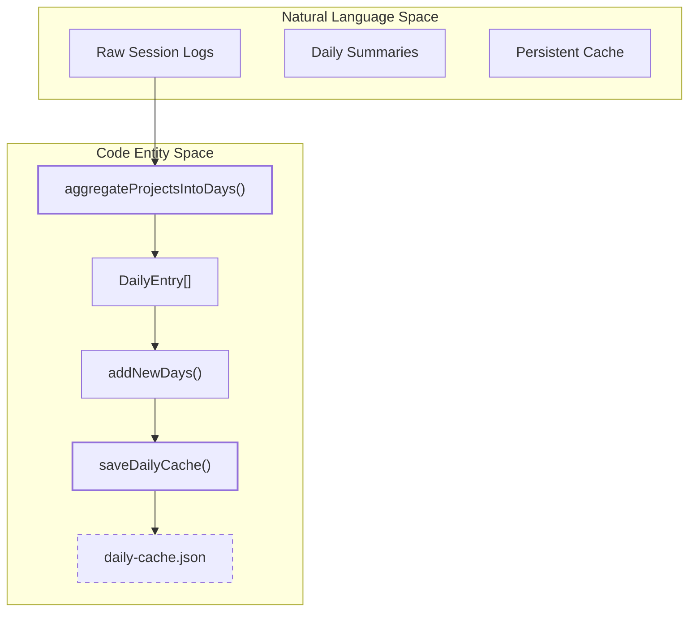
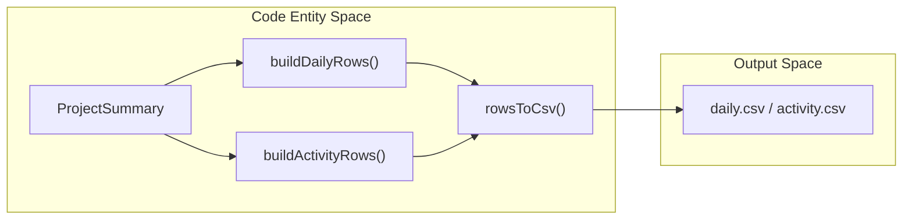

# 일별 집계와 캐싱

관련 소스 파일

다음 파일들은 이 위키 페이지를 생성하기 위한 컨텍스트로 사용되었습니다.

- [mac/Sources/CodeBurnMenubar/Theme/Theme.swift](mac/Sources/CodeBurnMenubar/Theme/Theme.swift)
- [mac/Sources/CodeBurnMenubar/Views/FindingsSection.swift](mac/Sources/CodeBurnMenubar/Views/FindingsSection.swift)
- [mac/Sources/CodeBurnMenubar/Views/HeroSection.swift](mac/Sources/CodeBurnMenubar/Views/HeroSection.swift)
- [src/currency.ts](src/currency.ts)
- [src/daily-cache.ts](src/daily-cache.ts)
- [src/day-aggregator.ts](src/day-aggregator.ts)
- [src/export.ts](src/export.ts)
- [src/format.ts](src/format.ts)
- [tests/classifier.test.ts](tests/classifier.test.ts)
- [tests/daily-cache.test.ts](tests/daily-cache.test.ts)
- [tests/dashboard.test.ts](tests/dashboard.test.ts)
- [tests/day-aggregator.test.ts](tests/day-aggregator.test.ts)
- [tests/export.test.ts](tests/export.test.ts)

일별 집계와 캐싱 시스템은 세션 데이터를 달력 기반 버킷으로 요약하기 위한 고성능 계층을 제공합니다. 세분화된 `ProjectSummary` 객체를 `DailyEntry` 레코드로 변환한 뒤, 버전이 지정된 JSON 캐시에 영속화하여 매번 수천 개의 원시 세션 파일을 다시 파싱하지 않고도 빠른 대시보드 렌더링과 과거 보고를 가능하게 합니다.

## 일별 집계 로직

집계 과정은 원시 세션 및 턴 데이터를 일별 통계로 변환합니다. 기본 진입점은 `aggregateProjectsIntoDays`이며, 이 함수는 모든 프로젝트와 세션을 순회하면서 날짜별로 지표를 버킷화합니다.

### 주요 함수
- **`dateKey(iso: string)`**: ISO 타임스탬프를 일별 버킷의 기본 키로 사용되는 `YYYY-MM-DD` 문자열로 변환하는 유틸리티입니다 [src/day-aggregator.ts:23-26]().
- **`aggregateProjectsIntoDays(projects: ProjectSummary[])`**: 핵심 변환 엔진입니다. 각 턴의 첫 번째 어시스턴트 호출 타임스탬프를 기준으로 모든 `assistantCall`과 `turn`을 특정 날짜에 매핑합니다 [src/day-aggregator.ts:28-94]().
- **`buildPeriodDataFromDays(days: DailyEntry[], label: string)`**: TUI 또는 macOS 메뉴 막대에서 사용할 수 있도록 일별 항목 범위를 하나의 `PeriodData` 객체(예: "Last 30 Days")로 롤업합니다 [src/day-aggregator.ts:96-143]().

### 집계 규칙
| 엔터티 | 날짜 귀속 로직 |
| :--- | :--- |
| **Sessions** | `session.firstTimestamp`의 날짜에 집계됩니다 [src/day-aggregator.ts:38-39](). |
| **Turns** | 해당 턴 안의 *첫 번째 어시스턴트 호출* 날짜에 귀속됩니다 [src/day-aggregator.ts:43-44](). |
| **Costs/Tokens** | 각 특정 `assistantCall.timestamp`를 기준으로 개별 합산됩니다 [src/day-aggregator.ts:61-69](). |
| **Categories** | Breakdown(turns, cost, editTurns, oneShotTurns)은 각 날짜 안에서 범주별로 저장됩니다 [src/day-aggregator.ts:53-58](). |

**출처:** [src/day-aggregator.ts:5-143](), [tests/day-aggregator.test.ts:42-201]()

## DailyCache 영속성 계층

CodeBurn은 집계된 일별 데이터를 `~/.cache/codeburn/daily-cache.json`에 있는 버전 지정 JSON 파일에 영속화합니다 [src/daily-cache.ts:41-47](). 이를 통해 "gap" 기간만 파싱하므로 과거 데이터의 비용 높은 재계산을 피할 수 있습니다.

### 데이터 흐름: 프로젝트에서 디스크까지
다음 다이어그램은 시스템이 원시 프로젝트 요약을 영속 캐시로 연결하는 방식을 보여줍니다.

**집계 및 영속성 데이터 흐름**

**출처:** [src/daily-cache.ts:12-39](), [src/day-aggregator.ts:28-94]()

### 원자적 쓰기와 잠금
동시 CLI 또는 Menubar 호출 중 데이터 손상을 방지하기 위해 캐시는 두 가지 안전 메커니즘을 구현합니다.

1.  **잠금 체인**: 모든 캐시 작업은 `withDailyCacheLock`을 통해 직렬화되며, 이 함수는 `lockChain` promise를 사용해 한 번에 하나의 프로세스만 캐시에 쓸 수 있도록 합니다 [src/daily-cache.ts:146-152]().
2.  **원자적 이름 변경**: `saveDailyCache` 함수는 임의 접미사가 붙은 임시 파일(예: `daily-cache.json.8f2a...tmp`)에 데이터를 쓰고, `handle.sync()`를 통해 `fsync`를 수행한 다음, 원자적 `rename`을 사용해 최종 목적지를 덮어씁니다 [src/daily-cache.ts:109-128]().

### 캐시 버전 관리와 마이그레이션
캐시에는 `DAILY_CACHE_VERSION`(현재 `4`)이 포함됩니다 [src/daily-cache.ts:8](). 
- **마이그레이션**: 캐시 파일이 버전 `2` 이상이면 `loadDailyCache`는 `migrateDays`를 통해 누락된 필드를 채워 데이터를 마이그레이션하려고 시도합니다 [src/daily-cache.ts:61-77](), [src/daily-cache.ts:90-100]().
- **무효화**: 버전이 `MIN_SUPPORTED_VERSION`(버전 `2`)보다 낮으면 시스템은 백업(예: `.bak`)을 만들고 `emptyCache`로 새로 시작합니다 [src/daily-cache.ts:79-82](), [src/daily-cache.ts:101-103]().

**출처:** [src/daily-cache.ts:8-107](), [src/daily-cache.ts:146-152](), [tests/daily-cache.test.ts:49-115]()

## 캐시 수화와 TTL

`ensureCacheHydrated` 함수는 원시 제공자 로그와 `DailyCache` 사이의 동기화를 관리합니다.

### 수화 로직
- **어제 무효화**: 시스템은 디스크에 아직 기록 중인 세션을 완전히 포착하기 위해 캐시에서 현재 "today"와 "yesterday"를 항상 폐기합니다 [src/daily-cache.ts:173-178]().
- **백필**: 캐시가 없으면 기본값으로 `BACKFILL_DAYS` 365일을 사용합니다 [src/daily-cache.ts:155](), [src/daily-cache.ts:186]().
- **간극 감지**: `gapStart`(`lastComputedDate` 다음 날)를 계산하고, `gapStart`와 `yesterdayEnd` 사이 범위에 대해서만 원시 세션을 파싱합니다 [src/daily-cache.ts:180-194]().

**출처:** [src/daily-cache.ts:154-197]()

## 내보내기 및 보고 통합

집계된 데이터는 CSV 및 JSON 보고서를 생성하기 위해 내보내기 엔진에서 사용됩니다.

### CSV 생성
`export.ts` 모듈은 `ProjectSummary[]`를 평면 `Row` 객체로 변환하는 `buildDailyRows`, `buildActivityRows`, `buildModelRows` 같은 함수를 제공합니다 [src/export.ts:46-137]().

**CSV 내보내기 엔터티 매핑**

### 보안 조치
- **CSV 인젝션 보호**: `escCsv` 함수는 수식 트리거 문자(`=`, `+`, `-`, `@`, `\t`, `\r`)로 시작하는 셀 앞에 작은따옴표를 붙여 정제합니다 [src/export.ts:8-14]().
- **통화 변환**: 모든 비용 관련 행은 표시를 위해 반올림되기 전에 `convertCost`를 사용해 USD에서 활성 통화로 변환됩니다 [src/export.ts:72](), [src/export.ts:100](), [src/export.ts:129]().

**출처:** [src/export.ts:8-137](), [src/currency.ts:139-143](), [tests/export.test.ts:116-154]()
