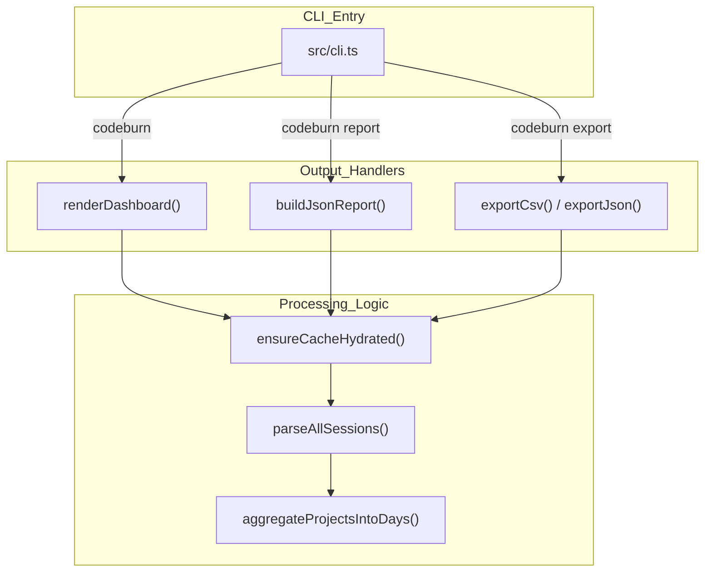
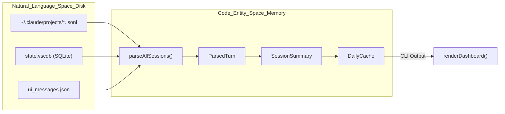

# CLI 참조

관련 소스 파일

다음 파일들은 이 위키 페이지를 생성하기 위한 컨텍스트로 사용되었습니다.

- [CHANGELOG.md](CHANGELOG.md)
- [package.json](package.json)
- [src/cli.ts](src/cli.ts)

`codeburn` CLI는 여러 제공자 전반의 AI 토큰 소비를 분석하기 위한 기본 인터페이스입니다. 실시간 대화형 터미널 대시보드부터 재무 보고를 위한 구조화된 데이터 내보내기까지 다양한 도구 모음을 제공합니다.

CLI는 지원되는 제공자(Claude, Cursor, Copilot 등)의 로컬 세션 로그를 읽고, 프로젝트별 비용, 도구 낭비, 모델 효율성 같은 실행 가능한 지표로 집계하여 동작합니다 [package.json:4]().

### 명령 개요

CLI는 `commander` 라이브러리를 사용해 빌드됩니다 [src/cli.ts:1](). 대부분의 명령은 제공자, 프로젝트, 날짜 범위에 대한 공통 필터링 플래그를 지원합니다.

| 명령 | 설명 |
|:---|:---|
| `codeburn` | **대화형 대시보드**를 실행합니다(기본 보기) [src/cli.ts:13](). |
| `codeburn report` | 상세 사용량 보고서를 생성합니다(TUI 또는 JSON) [src/cli.ts:77](). |
| `codeburn status` | 오늘과 이번 달의 간결한 한 줄 요약을 반환합니다 [src/cli.ts:7](). |
| `codeburn export` | 세션 데이터를 CSV 또는 JSON 파일로 내보냅니다 [src/cli.ts:3](). |
| `codeburn optimize` | "토큰 낭비"를 스캔하고 최적화 팁을 제공합니다 [src/cli.ts:15](). |
| `codeburn compare` | 여러 AI 모델 간 성능과 비용을 비교합니다 [src/cli.ts:16](). |
| `codeburn plan` | 구독 예산과 청구 주기를 관리합니다 [src/cli.ts:18](). |
| `codeburn currency` | 표시 통화(예: USD, EUR, GBP)를 설정합니다 [src/cli.ts:25](). |

---

### 전역 옵션 및 필터링

이 플래그들은 분석 범위를 좁히기 위해 거의 모든 `codeburn` 명령에 붙일 수 있습니다. 시간대와 모델 별칭 같은 전역 설정은 `preAction` 훅에서 처리됩니다 [src/cli.ts:96-113]().

*   **제공자 필터링**: `--provider <name>`(예: `claude`, `cursor`, `copilot`)은 세션 발견 과정을 필터링합니다 [src/cli.ts:80]().
*   **프로젝트 필터링**: 특정 디렉터리를 포함하려면 `--project <name>`을, 제외하려면 `--exclude <name>`을 사용합니다. 이 플래그들은 반복해서 사용할 수 있습니다 [src/cli.ts:77, 80]().
*   **날짜 범위**: 
    *   프리셋: `today`, `week`, `30days`, `month`, `all`(기본값은 최근 6개월) [src/cli.ts:14](), [CHANGELOG.md:18]().
    *   명시적 지정: `--from YYYY-MM-DD --to YYYY-MM-DD` [src/cli.ts:14]().
*   **시간대**: `--timezone <zone>`은 사용자 지정 IANA 시간대 그룹화를 허용합니다 [src/cli.ts:94]().

---

### 시스템 매핑: CLI에서 코드 엔터티까지

다음 다이어그램은 CLI 명령 실행을 데이터 처리를 담당하는 내부 TypeScript 클래스 및 함수에 매핑합니다.

**명령 실행 흐름**

출처: [src/cli.ts:13-17](), [src/cli.ts:115](), [src/parser.ts:5](), [src/day-aggregator.ts:11](), [src/daily-cache.ts:29-32]().

---

### 대화형 대시보드(TUI)

인자 없이 `codeburn`을 실행하면 대화형 대시보드가 시작됩니다. 이 대시보드는 `react-ink`를 사용하여 비용 개요, 프로젝트별 분석, 토큰 히트맵을 포함하는 반응형 터미널 인터페이스를 렌더링합니다 [src/cli.ts:13](), [package.json:48-49]().

*   **보기 모드**: 표준 대시보드, 최적화 보기, 모델 비교를 지원합니다 [src/cli.ts:13, 15, 16]().
*   **데이터 로딩**: 응답성을 보장하기 위해 캐시 수화를 사용하는 디바운스된 데이터 로딩 엔진을 사용합니다 [src/cli.ts:27-36]().

레이아웃 엔진과 키보드 단축키에 대한 자세한 내용은 [대화형 대시보드(TUI)](#3.1)를 참조하세요.

---

### 보고 및 내보내기

CodeBurn은 외부 분석을 위한 구조화된 데이터를 제공합니다. `report` 명령은 stdout 보기 또는 `jq`로의 파이핑을 위해 설계되었고, `export`는 실제 파일을 생성합니다.

*   **JSON 보고서**: `codeburn report --format json`은 `avgCostPerSession`, `cacheHitPercent`, `modelBreakdown`을 포함하는 포괄적인 객체를 반환합니다 [src/cli.ts:115-175]().
*   **CSV 내보내기**: `codeburn export`는 `escCsv`를 통해 CSV 인젝션에 대한 자동 보호가 적용된 CSV 파일을 생성합니다 [src/export.ts:3]().
*   **플랜 통합**: 구독 플랜이 활성화된 경우 보고서에는 `JsonPlanSummary`가 포함됩니다 [src/cli.ts:63-75]().

보고서 스키마와 내보내기 형식에 대한 자세한 내용은 [Report, Status, and Export Commands](#3.2)를 참조하세요.

---

### 최적화와 모델 비교

CLI에는 비용 절감과 모델 성능 평가를 위한 고급 엔진이 포함되어 있습니다.

*   **최적화**: `codeburn optimize`는 `scanAndDetect`를 트리거하여 "불필요한 읽기" 또는 "사용되지 않은 MCP" 서버 같은 낭비 패턴을 찾습니다 [src/cli.ts:15](), [CHANGELOG.md:6-14]().
*   **비교**: `codeburn compare`는 `aggregateModelStats`를 사용해 여러 모델의 원샷 성공률과 작업당 비용 같은 지표를 평가합니다 [src/cli.ts:16]().

낭비 감지 로직에 대한 자세한 내용은 [최적화 엔진(codeburn optimize)](#3.3)을 참조하세요. 모델 간 정면 비교 지표는 [모델 비교(codeburn compare)](#3.4)를 참조하세요.

---

### 구독과 통화

CodeBurn을 사용하면 실제 구독 한도(예: Claude Pro $20/mo) 대비 지출을 추적할 수 있습니다.

*   **플랜**: `codeburn plan`을 사용해 `PlanId`를 설정합니다. CLI는 "API Equivalent" 비용을 계산하여 정액 구독에서 얼마나 많은 가치를 얻고 있는지 보여줍니다 [src/cli.ts:18-20](), [src/cli.ts:67]().
*   **통화**: `codeburn currency`를 사용해 실시간 환율을 가져오고 `CurrencyState`를 통해 영속화합니다 [src/cli.ts:25, 112]().

청구 기간 계산과 FX 로직에 대한 자세한 내용은 [구독 플랜과 통화](#3.5)를 참조하세요.

---

### 데이터 파이프라인 아키텍처

이 다이어그램은 CLI가 원시 디스크 로그(자연어 공간/사용자 활동)와 구조화된 지표(코드 엔터티 공간) 사이의 간극을 어떻게 연결하는지 보여줍니다.

**데이터 변환 파이프라인**

출처: [src/parser.ts:5](), [src/types.ts:12](), [src/daily-cache.ts:10](), [src/dashboard.ts:13](), [CHANGELOG.md:71]().
