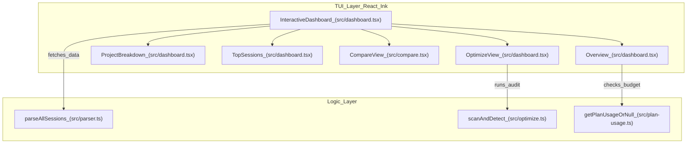
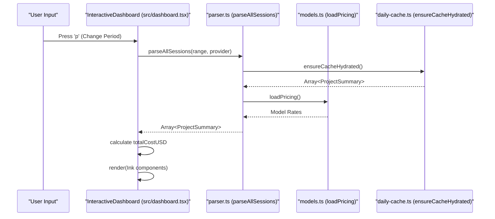

# 대화형 대시보드(TUI)

관련 소스 파일

다음 파일들은 이 위키 페이지를 생성하기 위한 컨텍스트로 사용되었습니다.

- [src/cli.ts](src/cli.ts)
- [src/dashboard.tsx](src/dashboard.tsx)

대화형 대시보드는 CodeBurn의 기본 터미널 사용자 인터페이스(TUI)이며, [React-Ink](https://github.com/vadimdemedes/ink)를 사용해 구축되었습니다. AI 사용량 데이터에 대한 실시간 탐색 가능 보기를 제공하며, 사용자가 표준 보고, 낭비 최적화, 모델 비교 모드 사이를 전환할 수 있게 합니다.

## 컴포넌트 아키텍처

대시보드는 세션 데이터, 보기 모드, 사용자 입력에 대한 전역 상태를 관리하는 `InteractiveDashboard` 컴포넌트에 의해 구동됩니다 [src/dashboard.tsx:189-191]().

### 데이터 흐름과 로딩
대시보드는 날짜 범위나 제공자 사이를 전환할 때 응답성을 보장하기 위해 디바운스된 데이터 로딩 전략을 사용합니다.

1.  **트리거**: 사용자가 키보드 입력으로 `period` 또는 `provider`를 변경합니다 [src/dashboard.tsx:238-251]().
2.  **디바운스**: `useEffect` 훅이 상태 안정화를 기다립니다 [src/dashboard.tsx:210-234]().
3.  **가져오기**: 파서 엔진의 `parseAllSessions`를 호출합니다 [src/dashboard.tsx:217-217]().
4.  **처리**: `projects` 상태를 업데이트하며, 이는 레이아웃의 재렌더링을 트리거합니다 [src/dashboard.tsx:220-220]().

### 시스템 컴포넌트 맵
다음 다이어그램은 TUI 논리 섹션을 구현 컴포넌트 및 데이터 소스에 매핑합니다.

**TUI 컴포넌트 연결**

출처: [src/dashboard.tsx:189-200](), [src/dashboard.tsx:155-187](), [src/dashboard.tsx:431-435](), [src/dashboard.tsx:379-382](), [src/compare.tsx:254-254](), [src/plan-usage.ts:41-41]().

## 레이아웃 엔진

대시보드는 터미널 너비에 따라 조정되는 동적 레이아웃 엔진을 사용합니다. 이 엔진은 90열의 `MIN_WIDE` 임계값을 정의합니다 [src/dashboard.tsx:22-22]().

*   **와이드 모드(>= 90 cols)**: `halfWidth` 계산을 사용해 2열 그리드를 렌더링합니다 [src/dashboard.tsx:107-108]().
*   **내로우 모드(< 90 cols)**: 단일 열 세로 스택을 렌더링합니다 [src/dashboard.tsx:108-108]().

`getLayout` 함수는 `process.env['COLUMNS']`를 읽거나 Ink의 `useWindowSize` 훅을 사용해 이러한 치수를 계산합니다 [src/dashboard.tsx:104-112]().

### 시각 요소
*   **HBar 차트**: 백분율 값에 따라 색상 그라데이션(파랑 -> 노랑 -> 빨강)을 생성하기 위해 `gradientColor`를 통한 3단계 선형 보간(`lerp`)을 사용하는 사용자 정의 가로 막대 차트 컴포넌트(`HBar`)입니다 [src/dashboard.tsx:85-96](), [src/dashboard.tsx:114-127]().
*   **Panel Chrome**: 내부 패딩을 위한 너비 오버헤드를 사용하며, 둥근 테두리와 제목이 있는 표준화된 컨테이너(`Panel`)입니다 [src/dashboard.tsx:131-138]().
*   **색상 팔레트**: TUI는 `PROVIDER_COLORS` [src/dashboard.tsx:50-57]() 및 `CATEGORY_COLORS` [src/dashboard.tsx:59-73]()처럼 특정 엔터티에 대해 정의된 상수를 사용합니다.

출처: [src/dashboard.tsx:22-22](), [src/dashboard.tsx:85-96](), [src/dashboard.tsx:104-112](), [src/dashboard.tsx:114-127]().

## 보기 모드

대시보드는 `v` 키로 전환되는 세 가지 기본 보기를 지원합니다 [src/dashboard.tsx:244-244]().

| 보기 | 컴포넌트 | 목적 |
| :--- | :--- | :--- |
| **Dashboard** | `InteractiveDashboard` | 프로젝트 비용, 상위 세션, 범주별 분석을 보여주는 기본 보기입니다. |
| **Optimize** | `OptimizeView` | "낭비"(예: 불필요한 읽기, 중복 컨텍스트)를 찾기 위해 `scanAndDetect` 엔진을 실행합니다 [src/dashboard.tsx:1020-1025](). |
| **Compare** | `CompareView` | 모델 간 정면 비교 지표(토큰 효율성, 속도, 비용)를 제공합니다 [src/compare.tsx:254-254](). |

### 플랜 진행률 막대
`Overview` 패널에는 구독 사용량을 시각화하는 `renderPlanBar` 함수가 포함됩니다 [src/dashboard.tsx:144-153]().
*   **예산 이내**: 100%까지 `▓` 및 `░` 문자를 사용해 음영 막대를 렌더링합니다 [src/dashboard.tsx:146-148]().
*   **예산 초과**: 사용량이 100%를 초과하면 전체 막대 뒤에 로그 스케일을 사용해 초과 규모를 나타내는 "chevrons"(`▶`)를 렌더링합니다 [src/dashboard.tsx:150-152]().

출처: [src/dashboard.tsx:20-20](), [src/dashboard.tsx:144-153](), [src/dashboard.tsx:1020-1025]().

## 키보드 탐색

대시보드는 Ink의 `useInput` 훅을 사용해 입력을 캡처합니다 [src/dashboard.tsx:238-251]().

| 키 | 동작 | 코드 참조 |
| :--- | :--- | :--- |
| `q` / `Esc` / `Ctrl+C` | 대시보드를 종료합니다 | [src/dashboard.tsx:240-240]() |
| `p` | 기간(Today, 7 Days, 30 Days, Month, All)을 순환합니다 | [src/dashboard.tsx:241-241]() |
| `r` | 제공자(Claude, Cursor, Codex 등)를 순환합니다 | [src/dashboard.tsx:242-242]() |
| `v` | 보기 전환(Dashboard -> Optimize -> Compare) | [src/dashboard.tsx:244-244]() |
| `↑` / `↓` | 프로젝트 목록 또는 세션 목록을 스크롤합니다 | [src/dashboard.tsx:246-247]() |

출처: [src/dashboard.tsx:238-251]().

## 구현 세부 정보

### 데이터 집계 파이프라인
렌더링 전에 대시보드는 원시 세션 데이터를 `ProjectSummary` 객체로 집계합니다.

**TUI 데이터 처리 흐름**

출처: [src/dashboard.tsx:210-234](), [src/cli.ts:27-36](), [src/parser.ts:7-7](), [src/models.ts:8-8]().

### 디바운스된 로딩
빠른 키보드 입력 중 UI 깜박임과 과도한 CPU 사용을 방지하기 위해 대시보드는 `loading` 상태와 최신 요청 ID를 추적하는 `ref`를 사용합니다 [src/dashboard.tsx:196-203]().

1.  필터가 변경되면 즉시 `setLoading(true)`가 호출됩니다 [src/dashboard.tsx:212-212]().
2.  `useEffect`가 비동기적으로 파서를 트리거합니다 [src/dashboard.tsx:217-217]().
3.  가장 최근 요청의 결과만(`reqIdRef`로 검증됨) 상태에 적용되어, 더 오래된 큰 데이터셋이 더 새로운 작은 데이터셋을 덮어쓰는 경쟁 상태를 방지합니다 [src/dashboard.tsx:218-222]().

출처: [src/dashboard.tsx:196-203](), [src/dashboard.tsx:210-234]().
