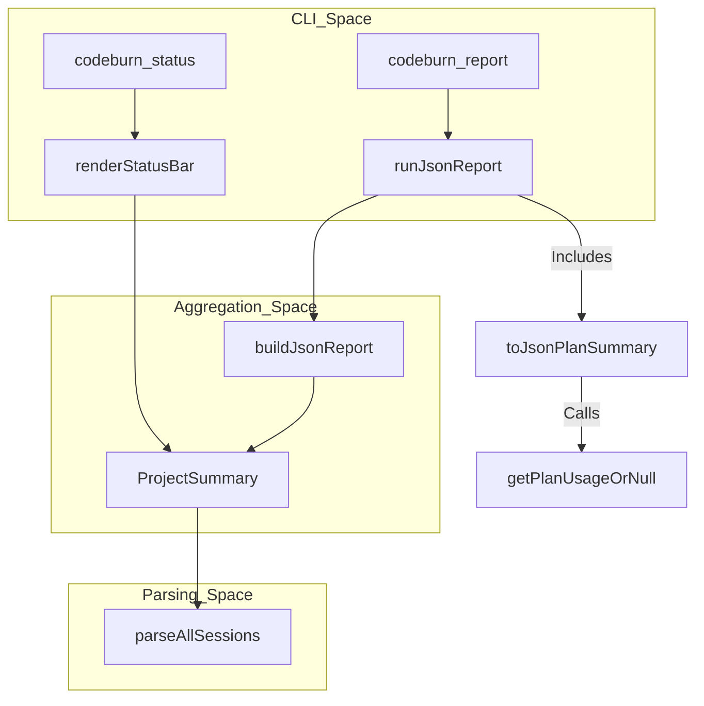

# Report, Status, Export 명령

<details>
<summary>관련 소스 파일</summary>

다음 파일들은 이 위키 페이지를 생성하기 위한 컨텍스트로 사용되었습니다.

- [src/cli.ts](src/cli.ts)
- [src/currency.ts](src/currency.ts)
- [src/day-aggregator.ts](src/day-aggregator.ts)
- [src/export.ts](src/export.ts)
- [src/format.ts](src/format.ts)
- [src/menubar-json.ts](src/menubar-json.ts)
- [tests/export.test.ts](tests/export.test.ts)
- [tests/menubar-json.test.ts](tests/menubar-json.test.ts)

</details>


CodeBurn CLI는 비대화형 데이터 조회, 보고, 구조화된 내보내기를 위한 명령 모음을 제공합니다. 이 명령들은 기반 파싱 및 집계 엔진을 활용하여 터미널 친화적 형식(TUI), 기계가 읽을 수 있는 JSON, 또는 외부 분석을 위한 이식 가능한 CSV 파일로 요약을 생성합니다.

## 보고 및 상태 명령

전체 대화형 대시보드에 들어가지 않고 사용량을 관찰하기 위한 기본 명령은 `codeburn report`, `codeburn status`, 기간별 바로가기인 `codeburn today`와 `codeburn month`입니다.

### JSON 보고(`codeburn report`)
`codeburn report` 명령은 비용 분석, 토큰 사용량, 플랜 상태를 포함하는 포괄적인 JSON 객체를 생성합니다.

*   **구현**: `runJsonReport` [src/cli.ts:77-87]()를 호출하며, 이는 `parseAllSessions` [src/parser.ts:5]()를 호출하고 `filterProjectsByName`을 사용해 결과를 필터링합니다.
*   **데이터 구조**: `buildJsonReport` 함수 [src/cli.ts:115-205]()는 다음을 포함하는 payload를 구성합니다.
    *   **집계값**: 총비용(USD), 총 API 호출 수, 세션 수 [src/cli.ts:119-121]().
    *   **토큰 지표**: 입력, 출력, 캐시 읽기/쓰기 토큰 [src/cli.ts:122-125]().
    *   **캐시 효율성**: `totalCacheRead / (totalInput + totalCacheRead)`로 계산되는 `cacheHitPercent` [src/cli.ts:128-129]().
    *   **분석 목록**: `daily`, `projects`, `models`, `categories` 목록 [src/cli.ts:143-183]().
*   **플랜 통합**: 구독 플랜이 설정되어 있으면 `toJsonPlanSummary`를 사용해 `plan` 요약을 추가합니다 [src/cli.ts:63-75]().

### 상태 표시줄(`codeburn status`)
`codeburn status` 명령과 그 별칭인 `today`, `month`는 최근 활동에 대한 상위 수준 요약을 제공합니다.

*   **로직**: `renderStatusBar` [src/format.ts:27-59]()를 사용해 프로젝트와 세션을 순회합니다.
*   **버킷화**: 비용은 턴의 첫 번째 어시스턴트 호출 타임스탬프를 기준으로 버킷화됩니다 [src/format.ts:43-45](). 이를 통해 자정을 걸치는 턴도 비용이 발생한 시점에 올바르게 귀속됩니다 [src/format.ts:39-42]().
*   **출력**: `chalk`를 사용한 터미널 형식 지정으로 "Today"와 "Month" 비용 및 호출 수를 보여주는 2열 레이아웃을 렌더링합니다 [src/format.ts:55]().

### 데이터 흐름: 보고 명령
이 다이어그램은 CLI 명령이 보고서를 생성하기 위해 파싱 및 집계 계층과 상호작용하는 방식을 보여줍니다.

| 컴포넌트 | 코드 엔터티 |
| :--- | :--- |
| **CLI 진입점** | `program.command('report')` [src/cli.ts:89-92]() |
| **JSON 빌더** | `buildJsonReport` [src/cli.ts:115]() |
| **상태 렌더러** | `renderStatusBar` [src/format.ts:27]() |
| **데이터 소스** | `parseAllSessions` [src/parser.ts:5]() |


출처: [src/cli.ts:63-205](), [src/format.ts:27-59](), [src/day-aggregator.ts:23-26]()

---

## 내보내기 엔진

`codeburn export` 명령을 사용하면 스**프레드시트나 외부 데이터베이스에서 사용할 수 있도록 데이터를 구조화된 형식으로 덤프**할 수 있습니다. JSON과 CSV 출력을 모두 지원합니다.

### CSV 내보내기 로직
내보내기 엔진은 데이터의 특정 차원(프로젝트, 모델, 도구 등)을 각각 나타내는 여러 CSV 파일이 들어 있는 디렉터리를 생성합니다.

*   **함수**: `exportCsv(periods: PeriodExport[], outputPath: string)` [src/export.ts:221-255]().
*   **파일 생성**: 폴더를 만들고 다음 파일로 채웁니다.
    *   `daily.csv`: 일별 비용 및 토큰 추세 [src/export.ts:46-80]().
    *   `projects.csv`: 프로젝트 경로별 비용 [src/export.ts:177-191]().
    *   `models.csv`: 모델별 토큰 사용량과 비용 [src/export.ts:106-137]().
    *   `activity.csv`: `TaskCategory`별 분석 [src/export.ts:82-104]().
    *   `tools.csv` 및 `shell-commands.csv`: MCP/Core 도구와 bash 명령의 사용 빈도 [src/export.ts:139-175]().
    *   `sessions.csv`: 세분화된 세션 수준 데이터 [src/export.ts:193-219]().

### 보안과 안전성
내보내기 엔진은 데이터 무결성과 시스템 보안을 위해 특정 보호 조치를 구현합니다.

*   **CSV 인젝션 보호**: `escCsv` 함수 [src/export.ts:8-14]()는 "CSV Injection"(Formula Injection)을 방지합니다. 문자열이 `=`, `+`, `-`, `@` 같은 문자로 시작하면 작은따옴표(`'`)를 접두사로 붙여 스프레드시트 소프트웨어가 실행 가능한 수식이 아니라 리터럴 텍스트로 처리하도록 합니다 [src/export.ts:9]().
*   **디렉터리 안전성**: 쓰기 전에 시스템은 경로를 해석하고 루트 또는 홈 디렉터리가 아닌지 확인하여 출력 경로가 중요한 시스템 디렉터리를 덮어쓰지 않도록 안전 검사를 수행합니다 [src/export.ts:222-225]().

### CSV 인젝션 보호 다이어그램
이 다이어그램은 내보내기 과정에서 사용되는 보안 로직을 매핑합니다.

| 컴포넌트 | 코드 엔터티 |
| :--- | :--- |
| **정제기** | `escCsv` [src/export.ts:8]() |
| **행 빌더** | `rowsToCsv` [src/export.ts:18]() |
| **악성 패턴** | `/^[\t\r=+\-@]/` [src/export.ts:9]() |

```mermaid
graph LR
    subgraph "Input_Data"
        D1["Project: '=SUM(1,2)'"]
        D2["Model: '+danger-model'"]
        D3["Command: '@malicious'"]
    end

    subgraph "escCsv_Logic"
        S1{"Starts_with_=, +, -, @, \t, \r?"}
        S1 -- "Yes" --> S2["Prefix_with_'"]
        S1 -- "No" --> S3["Keep_as_is"]
        S2 --> S4{"Contains_,_or_\"_or_\n?"}
        S3 --> S4
        S4 -- "Yes" --> S5["Wrap_in_double_quotes"]
        S4 -- "No" --> S6["Return_string"]
    end

    D1 --> S1
    D2 --> S1
    D3 --> S1
    S5 --> O["'\"'=SUM(1,2)\""]
    S6 --> O
```
출처: [src/export.ts:8-26](), [tests/export.test.ts:115-138]()

---

## 기술 구현 세부 정보

### PeriodExport 구조
`PeriodExport` 타입은 내보내기 함수의 입력을 정의하며, CLI가 여러 날짜 범위(예: "This Month"와 "Last 30 Days")를 단일 내보내기 작업에 전달할 수 있게 합니다 [src/export.ts:3, 221]().

### 통화와 비용 변환
모든 내보내기 및 보고 명령은 값이 사용자가 선호하는 통화로 표시되도록 `currency.ts` 모듈을 사용합니다.
*   **`convertCost`**: `buildDailyRows`, `buildActivityRows`, `buildModelRows`에서 반올림 전에 원시 USD 값을 변환하는 데 사용됩니다 [src/export.ts:72, 100, 129]().
*   **`round2`**: 재무적 명확성을 위해 숫자를 소수점 둘째 자리로 반올림하는 헬퍼 함수입니다 [src/export.ts:28-30]().
*   **`loadCurrency`**: Frankfurter API 또는 로컬 캐시에서 환율을 수화하기 위해 CLI pre-action 중 호출됩니다 [src/cli.ts:112](), [src/currency.ts:110-119]().

### 토큰 형식 지정
터미널 출력(TUI/Status)의 경우, `formatTokens` 함수 [src/format.ts:10-14]()는 원시 정수 대신 사람이 읽기 쉬운 문자열(예: `1.2M` 또는 `450K`)을 제공합니다.

### 디렉터리 처리
`exportCsv` 함수는 `mkdir(folder, { recursive: true })` [src/export.ts:227]()를 사용해 디렉터리를 재귀적으로 생성하고, 사용자가 제공한 상대 출력 경로를 처리하기 위해 `resolve`를 활용합니다 [src/export.ts:222]().

출처: [src/export.ts:1-255](), [src/format.ts:1-59](), [src/cli.ts:63-121](), [src/currency.ts:139-143]()
