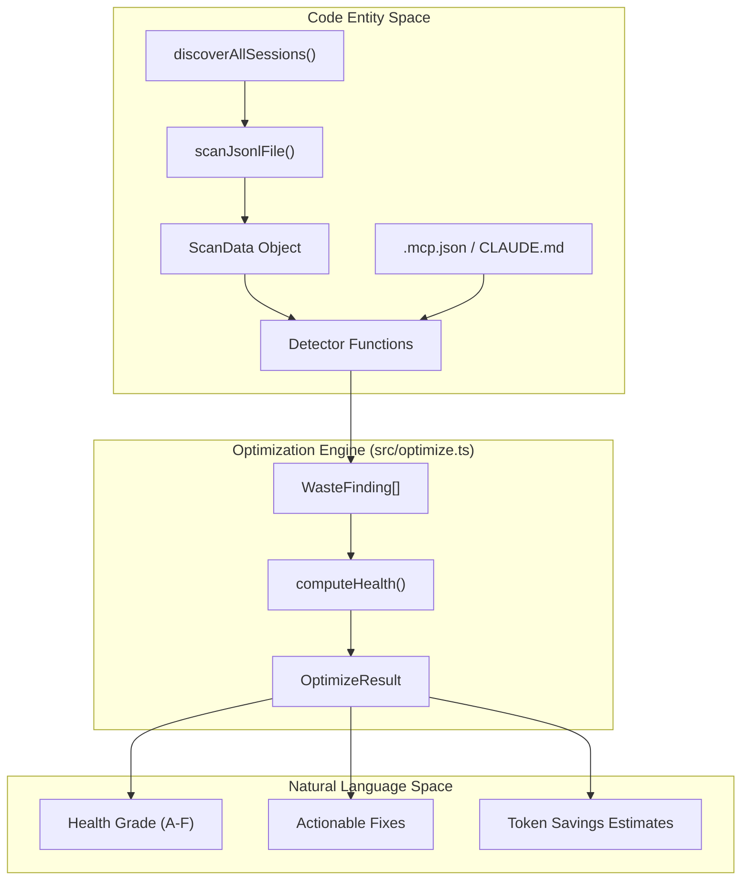
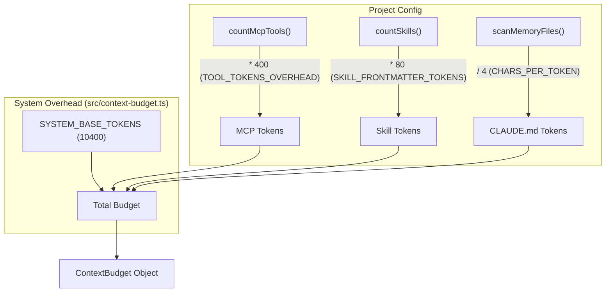

# 최적화 엔진(codeburn optimize)

관련 소스 파일

다음 파일들은 이 위키 페이지를 생성하기 위한 컨텍스트로 사용되었습니다.

- [src/context-budget.ts](src/context-budget.ts)
- [src/optimize.ts](src/optimize.ts)
- [tests/mcp-coverage.test.ts](tests/mcp-coverage.test.ts)
- [tests/optimize-fs.test.ts](tests/optimize-fs.test.ts)
- [tests/optimize.test.ts](tests/optimize.test.ts)
- [tests/parser-mcp-inventory.test.ts](tests/parser-mcp-inventory.test.ts)

최적화 엔진은 과거 세션 데이터를 스캔하여 비효율적인 패턴("낭비")을 식별하고, 프로젝트 건강 점수를 계산하며, 실행 가능한 수정 사항을 제공하는 역할을 담당합니다. 도구 호출 시퀀스, 컨텍스트 오버헤드, 제공자별 구성 파일을 분석하여 동작합니다.

## 개요와 구현

엔진의 진입점은 `scanAndDetect` 함수 [src/optimize.ts:222-258]()이며, 이 함수는 파일 시스템에서 데이터 수집을 오케스트레이션하고 탐지기 함수 모음을 실행합니다. `.jsonl` 세션 파일(주로 Claude Code)을 처리하고 프로젝트 메타데이터를 사용하여 도구 호출, API 메타데이터, 프로젝트 경로를 포함하는 `ScanData` 객체를 빌드합니다.

### 데이터 흐름

다음 다이어그램은 원시 세션 데이터가 최적화 발견 사항으로 변환되는 방식을 보여줍니다.

**그림 1: 최적화 데이터 파이프라인**

출처: [src/optimize.ts:222-258](), [src/optimize.ts:163-169](), [src/providers/index.js:23-45]()

## 낭비 탐지기

엔진은 특정 유형의 토큰 낭비를 식별하기 위해 특화된 탐지기를 사용합니다. 각 탐지기는 설명, 영향 수준(`high`, `medium`, `low`), 제안 수정 사항을 포함하는 `WasteFinding` [src/optimize.ts:133-141]()을 반환합니다.

### 1. 파일 접근 패턴
*   **불필요한 읽기(`detectJunkReads`)**: 에이전트가 무시되어야 할 디렉터리(예: `node_modules`, `.git`, `dist`)의 파일을 읽는 경우를 식별합니다. `MIN_JUNK_READS_TO_FLAG`(3)를 초과하면 플래그를 지정합니다 [src/optimize.ts:43](), [src/optimize.ts:269-309]().
*   **중복 읽기(`detectDuplicateReads`)**: 단일 세션 안에서 같은 파일을 여러 번 읽는 경우를 감지합니다. 이는 종종 에이전트가 이전 컨텍스트를 "잊었거나" 루프에 갇혔음을 나타냅니다 [src/optimize.ts:311-344]().
*   **낮은 Read:Edit 비율(`detectLowReadEditRatio`)**: 읽기는 매우 적고 편집은 많이 수행하는 프로젝트를 플래그합니다. 이는 에이전트가 파일 구조를 환각하거나 blind change를 수행할 수 있음을 시사합니다 [src/optimize.ts:411-435]().

### 2. 컨텍스트 및 구성 비대화
*   **비대한 CLAUDE.md(`detectBloatedClaudeMd`)**: 200줄을 초과하는 `CLAUDE.md` 파일을 스캔합니다. 전체 전이적 컨텍스트 가중치를 계산하기 위해 최대 깊이 5(`MAX_IMPORT_DEPTH`)까지 `@-imports`를 재귀적으로 따라갑니다 [src/optimize.ts:102](), [src/optimize.ts:477-518]().
*   **사용되지 않은 MCP 서버(`detectUnusedMcp`)**: `.mcp.json`에 구성된 MCP 서버와 실제 도구 호출을 비교합니다. 최근 30일 동안 호출되지 않은 서버는 불필요한 부담으로 플래그됩니다 [src/optimize.ts:544-585]().
*   **캐시 비대화(`detectCacheBloat`)**: API 메타데이터의 `cacheCreationTokens`를 분석합니다. 중앙값 캐시 크기가 baseline의 1.4배를 초과하면, 효율적인 프롬프트 캐싱에 비해 컨텍스트가 너무 커졌다고 제안합니다 [src/optimize.ts:437-475]().
*   **MCP 도구 커버리지(`detectMcpToolCoverage`)**: 많은 도구가 정의되어 있지만 거의 사용되지 않아 "schema tax"를 유발하는 MCP 서버를 플래그하는 고정밀 탐지기입니다 [src/optimize.ts:346-409]().

### 3. "고스트" 엔터티
엔진은 에이전트 지침에는 존재하지만 실제로 활용되지 않는 정의인 "고스트" 엔터티를 감지합니다.
*   **고스트 에이전트**: 정의되어 있지만 호출된 적 없는 사용자 정의 에이전트입니다 [src/optimize.ts:605-628]().
*   **고스트 스킬**: 한 번도 트리거되지 않은 `.claude/skills/`의 `SKILL.md` 파일입니다 [src/optimize.ts:630-653]().
*   **고스트 명령**: `CLAUDE.md`에서 발견되지만 세션 로그에는 없는 사용자 정의 슬래시 명령입니다 [src/optimize.ts:655-680]().

출처: [src/optimize.ts:41-81](), [src/optimize.ts:269-680]()

## 건강 점수와 추세 분석

### 건강 점수(`computeHealth`)
건강 점수는 감지된 발견 사항에서 파생되는 정규화된 값(0-100)입니다.
*   **가중치**: 발견 사항은 영향도에 따라 가중됩니다. `high`(15점), `medium`(7점), `low`(3점) [src/optimize.ts:86-88]().
*   **등급**: 점수는 문자 등급에 매핑됩니다.
    *   **A**: ≥ 90
    *   **B**: 75–89
    *   **C**: 55–74
    *   **D**: 30–54
    *   **F**: < 30
출처: [src/optimize.ts:90-93](), [src/optimize.ts:743-764]()

### 추세 분석(`computeTrend`)
엔진은 "최근 창"(최근 48시간, `RECENT_WINDOW_MS`로 정의됨)의 발생 횟수와 전체 기간의 발생 횟수를 비교하여 발견 사항이 `active`인지 `improving`인지 결정합니다 [src/optimize.ts:177-180](). 최근 발생 비율이 과거 평균보다 상당히 낮으면(`IMPROVING_THRESHOLD` 미만), 해당 발견 사항은 `improving`으로 표시됩니다 [src/optimize.ts:766-784]().

## 컨텍스트 예산 추정

`ContextBudget` 시스템 [src/context-budget.ts]()은 모든 프롬프트와 함께 전송되는 고정 토큰 오버헤드를 추정합니다. 이는 짧은 메시지도 비쌀 수 있는 이유를 이해하는 데 중요합니다.

**그림 2: 컨텍스트 예산 계산 로직**

### 예산 구성 요소
| 구성 요소 | 토큰 비용 계산 | 출처 |
| :--- | :--- | :--- |
| **System Base** | 상수 10,400 토큰 | [src/context-budget.ts:9]() |
| **MCP Tools** | 도구당 400토큰(서버당 5개 도구로 추정) | [src/context-budget.ts:10, 55]() |
| **Skills** | `SKILL.md`당 80토큰 | [src/context-budget.ts:11]() |
| **Memory Files** | `CLAUDE.md`에서 문자 4개당 약 1토큰 | [src/context-budget.ts:8, 23]() |

출처: [src/context-budget.ts:8-24](), [src/context-budget.ts:104-122]()
