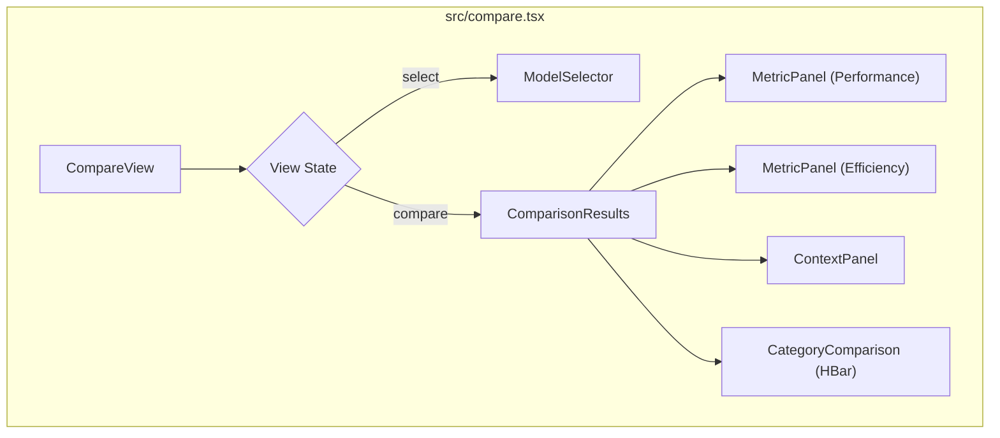

# 모델 비교(codeburn compare)

관련 소스 파일

다음 파일들은 이 위키 페이지를 생성하기 위한 컨텍스트로 사용되었습니다.

- [docs/superpowers/plans/2026-04-19-model-comparison.md](docs/superpowers/plans/2026-04-19-model-comparison.md)
- [docs/superpowers/specs/2026-04-19-model-comparison-design.md](docs/superpowers/specs/2026-04-19-model-comparison-design.md)
- [src/compare-stats.ts](src/compare-stats.ts)
- [src/compare.tsx](src/compare.tsx)
- [src/ink-win.ts](src/ink-win.ts)
- [src/sqlite.ts](src/sqlite.ts)
- [tests/compare-stats.test.ts](tests/compare-stats.test.ts)
- [tests/providers/opencode.test.ts](tests/providers/opencode.test.ts)

`codeburn compare` 명령은 과거 사용량 데이터를 기반으로 여러 LLM 모델을 일대일 벤치마킹하기 위한 터미널 사용자 인터페이스(TUI)를 제공합니다. 여러 세션에 걸쳐 성능, 효율성, 행동 지표를 집계하여 어떤 모델이 가장 좋은 "원샷" 코딩 성공률, 비용 효율성, 작업 스타일을 제공하는지 판단합니다.

### 데이터 흐름과 아키텍처

비교 엔진은 원시 세션 파싱에서 정규화된 지표 계산까지 이어지는 파이프라인을 따릅니다. 표준 `parseAllSessions` 유틸리티를 사용해 데이터를 수집한 뒤, 특화된 통계 집계기로 전달합니다.

#### 모델 비교 파이프라인

```mermaid
graph TD
    subgraph "Data_Ingestion [src/parser.ts]"
        A["parseAllSessions()"] --> B["ProjectSummary[]"]
    end

    subgraph "Aggregation_Layer [src/compare-stats.ts]"
        B --> C["aggregateModelStats()"]
        C --> D["ModelStats[]"]
    end

    subgraph "Analysis_Engine [src/compare-stats.ts]"
        D --> E["computeComparison()"]
        D --> F["computeCategoryComparison()"]
        D --> G["computeWorkingStyle()"]
        D --> H["scanSelfCorrections()"]
    end

    subgraph "Presentation_TUI [src/compare.tsx]"
        E --> I["CompareView"]
        F --> I
        G --> I
        H --> I
    end
```

**출처:** [src/compare.tsx:5-9](), [src/compare-stats.ts:26-74]()

---

### 코어 통계 집계

엔진은 `ProjectSummary` 객체를 모든 비교의 기반 역할을 하는 `ModelStats` 객체로 변환합니다.

#### `aggregateModelStats`
이 함수는 모든 세션의 모든 턴을 순회합니다. "기본 모델"(턴에서 처음 응답한 모델)을 식별하고 원샷 성공 같은 턴 수준 성공 지표를 해당 모델에 귀속합니다.
*   **기본 모델 귀속:** 턴에 여러 호출이 있는 경우(예: 재시도), 턴 수준 지표는 해당 턴에서 처음 사용된 모델에 귀속됩니다 [src/compare-stats.ts:42-45]().
*   **합성 데이터 필터링:** `<synthetic>`으로 표시된 호출은 통계에서 제외됩니다 [src/compare-stats.ts:43-43](), [src/compare-stats.ts:57-58]().
*   **턴 지표:** `totalTurns`, `editTurns`(파일 수정이 포함된 턴), `oneShotTurns`(재시도가 0인 편집 턴)를 추적합니다 [src/compare-stats.ts:46-53]().
*   **비용 추적:** 총비용과 `editCost`(편집이 발생한 턴에서 특히 발생한 비용)를 구분합니다 [src/compare-stats.ts:50-52]().

**출처:** [src/compare-stats.ts:8-24](), [src/compare-stats.ts:26-74]()

---

### 지표 정의와 승자 로직

비교 지표는 `METRICS`에 정의되며, 이는 값을 계산하는 방법과 값이 높을수록 좋은지 낮을수록 좋은지를 지정하는 `MetricDef` 객체 모음입니다.

| 지표 | 계산 | 높을수록 좋은가? |
| :--- | :--- | :--- |
| **One-shot rate** | `oneShotTurns / editTurns` | 예 |
| **Retry rate** | `retries / editTurns` | 아니요 |
| **Self-correction** | `selfCorrections / totalTurns` | 아니요 |
| **Cost / call** | `cost / calls` | 아니요 |
| **Cost / edit** | `editCost / editTurns` | 아니요 |
| **Output tok / call**| `outputTokens / calls` | 아니요 |
| **Cache hit rate** | `cacheReadTokens / totalTokens` | 예 |

#### 승자 선택
`pickWinner` 함수는 `higherIsBetter` 플래그에 따라 `valueA`와 `valueB`를 비교하여 특정 행의 "승자"를 결정합니다 [src/compare-stats.ts:166-171](). 
*   값이 같으면 `'tie'`를 반환합니다.
*   두 모델 중 하나라도 데이터가 없으면(`null`) `'none'`을 반환합니다 [src/compare-stats.ts:167-167]().
*   "낮을수록 좋은" 지표(예: Retry rate)의 경우 더 낮은 값에 승리가 할당됩니다 [src/compare-stats.ts:170-170]().

**출처:** [src/compare-stats.ts:103-164](), [src/compare-stats.ts:166-171]()

---

### 작업 스타일과 자체 수정 분석

원시 성능을 넘어 `codeburn`은 `computeWorkingStyle` 및 `scanSelfCorrections` 함수를 사용해 모델의 "성격" 또는 작업 스타일을 분석합니다.

#### `computeWorkingStyle`
이 함수는 다음과 같은 행동 패턴을 식별합니다.
*   **계획 성향:** `TaskCreate`, `TodoWrite`, `EnterPlanMode` 같은 도구 사용 빈도 [src/compare-stats.ts:6-6](), [src/compare-stats.ts:246-248]().
*   **에이전트 사용:** `hasAgentSpawn`을 통한 하위 에이전트 생성 빈도 [src/compare-stats.ts:251-253]().
*   **장황함:** 호출당 정규화된 출력 토큰 수 [src/compare-stats.ts:256-258]().

#### `scanSelfCorrections`
"자체 수정"은 모델이 도구 호출을 실행한 직후, 사용자 개입 없이 같은 턴 안에서 "재시도" 또는 수정 조치를 이어서 수행할 때 감지됩니다. 이 로직은 초기 시도 뒤에 이어지는 같은 턴 내 어시스턴트 호출을 구체적으로 찾습니다 [src/compare-stats.ts:271-300]().

**출처:** [src/compare-stats.ts:241-268](), [src/compare-stats.ts:271-300]()

---

### TUI 구현(`CompareView`)

비교 인터페이스는 `ink`를 사용해 빌드되며 선택과 결과라는 두 가지 주요 단계로 구성됩니다.

#### 컴포넌트 계층

#### 일대일 막대 차트
범주별 비교(예: "coding" 대 "refactoring")를 위해 TUI는 `FULL_BLOCK`(`\u2588`) 문자를 사용해 가로 막대 차트를 렌더링합니다 [src/compare.tsx:26-26]().
*   **원샷 비율 막대:** 막대의 너비는 `Math.round((rate / 100) * BAR_MAX_WIDTH)`로 계산됩니다 [src/compare.tsx:48-50]().
*   **낮은 데이터 임계값:** 호출 수가 20개 미만인 모델이나 범주는 "low data" 경고로 표시됩니다 [src/compare.tsx:18-18](), [src/compare.tsx:105-117]().
*   **형식 지정:** 값은 중앙화된 `formatValue` 헬퍼를 사용해 타입(비용, 백분율, 소수, 숫자)에 따라 형식화됩니다 [src/compare.tsx:28-36]().

**출처:** [src/compare.tsx:57-130](), [src/compare.tsx:187-220]()

---

### 주요 함수와 타입 참조

| 심볼 | 파일 | 설명 |
| :--- | :--- | :--- |
| `ModelStats` | [src/compare-stats.ts:8-24]() | 토큰, 비용, 턴을 포함한 집계된 모델 데이터 인터페이스입니다. |
| `computeComparison` | [src/compare-stats.ts:173-186]() | `METRICS`를 적용하여 두 모델에 대한 `ComparisonRow` 배열을 생성합니다. |
| `computeCategoryComparison` | [src/compare-stats.ts:188-239]() | 일대일 차트를 위해 `TaskCategory`별 원샷 비율을 분해합니다. |
| `MetricPanel` | [src/compare.tsx:142-164]() | 승자를 초록색으로 강조한 지표 표를 렌더링합니다. |
| `shortName` | [src/compare.tsx:38-40]() | 더 깔끔한 TUI 표시를 위해 접두사(예: `claude-`)와 날짜 접미사를 제거합니다. |
| `patchStdoutForWindows` | [src/ink-win.ts:5-14]() | 특정 ANSI 이스케이프 코드를 가로채 Windows의 터미널 깜박임을 수정합니다. |

**출처:** [src/compare-stats.ts:1-300](), [src/compare.tsx:1-250](), [src/ink-win.ts:5-14]()
