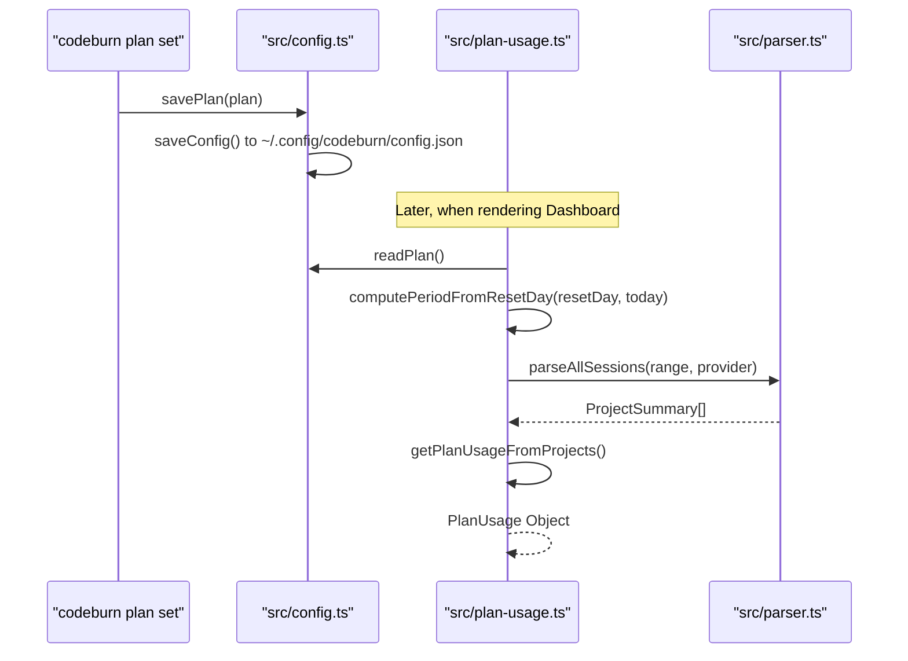
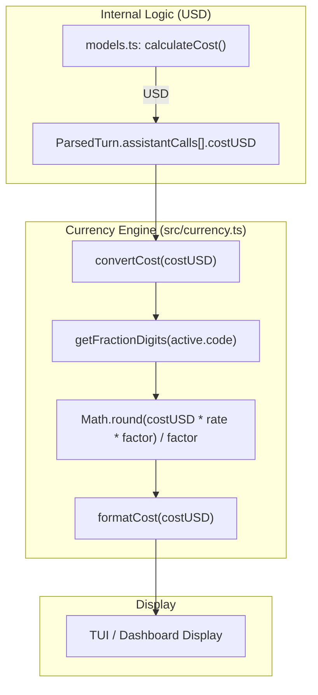

# 구독 플랜과 통화

관련 소스 파일

다음 파일들은 이 위키 페이지를 생성하기 위한 컨텍스트로 사용되었습니다.

- [src/config.ts](src/config.ts)
- [src/currency.ts](src/currency.ts)
- [src/day-aggregator.ts](src/day-aggregator.ts)
- [src/export.ts](src/export.ts)
- [src/format.ts](src/format.ts)
- [src/plan-usage.ts](src/plan-usage.ts)
- [src/plans.ts](src/plans.ts)
- [tests/cli-plan.test.ts](tests/cli-plan.test.ts)
- [tests/export.test.ts](tests/export.test.ts)
- [tests/plan-usage.test.ts](tests/plan-usage.test.ts)
- [tests/plans.test.ts](tests/plans.test.ts)

이 페이지는 사용자 구독 예산 관리, 청구 기간 계산, 월간 지출 예측, 외부 환율 API를 통한 다중 통화 변환을 담당하는 시스템을 문서화합니다.

## 구독 플랜

CodeBurn은 사용자가 AI 서비스에 대한 월간 예산을 나타내는 "Plan"을 정의할 수 있게 합니다. 이 플랜은 "burn" 비율을 계산하고 대시보드에 시각적 진행률 표시기를 제공하는 데 사용됩니다.

### 플랜 정의와 프리셋
플랜은 `PlanId`, `PlanProvider`(예산에 반영할 로그를 필터링하기 위한 값), 월간 USD 한도 `monthlyUsd`로 정의됩니다 [src/config.ts:8-14](). 

시스템은 **일반적인 AI 구독을 위한 여러 내장 프리셋을 제공**합니다.
*   **Claude Pro**: $20/mo, provider: `claude` [src/plans.ts:7-12]().
*   **Claude Max**: $200/mo, provider: `claude` [src/plans.ts:13-18]().
*   **Claude Max 5x**: $100/mo, provider: `claude` [src/plans.ts:19-24]().
*   **Cursor Pro**: $20/mo, provider: `cursor` [src/plans.ts:25-30]().

### 구성 영속성
플랜은 `~/.config/codeburn/config.json`의 기본 CodeBurn 구성 파일 안에 저장됩니다 [src/config.ts:25-31](). `savePlan` 및 `clearPlan` 함수는 손상을 방지하기 위해 원자적 파일 쓰기(`.tmp` 파일에 쓴 뒤 이름 변경)를 사용하여 이러한 업데이트를 관리합니다 [src/config.ts:42-65]().

### 플랜 관리 흐름
다음 다이어그램은 플랜이 설정되고 이후 사용량 데이터를 가져오는 데 사용되는 방식을 보여줍니다.

**플랜 구성 및 사용량 흐름**

출처: [src/config.ts:50-65](), [src/plan-usage.ts:107-138](), [tests/cli-plan.test.ts:20-42]()

## 청구 기간 계산

CodeBurn은 `resetDay`(1과 28 사이로 제한됨)를 기준으로 현재 청구 주기를 계산합니다 [src/plan-usage.ts:22-25]().

`computePeriodFromResetDay` 함수는 `periodStart`와 `periodEnd`를 결정합니다 [src/plan-usage.ts:27-43]().
1.  오늘 날짜가 `resetDay`보다 크거나 같으면 기간은 **현재 월**에 시작하고 **다음 월**에 끝납니다.
2.  오늘 날짜가 `resetDay`보다 이전이면 기간은 **이전 월**에 시작하고 **현재 월**에 끝납니다.

출처: [src/plan-usage.ts:27-43](), [tests/plan-usage.test.ts:13-35]()

## 사용량 예측(일별 중앙값)

총 월간 지출을 추정하기 위해 CodeBurn은 단순 평균이 아니라 일별 중앙값 기반 예측을 사용합니다. 이를 통해 사용량이 유독 많은 하루가 월간 추정치를 과도하게 왜곡하는 것을 방지합니다.

### 예측 알고리즘
1.  **일별 비용 수집**: 현재 기간의 모든 턴을 순회하고 비용을 로컬 날짜 키에 매핑합니다 [src/plan-usage.ts:77-91]().
2.  **간극 채우기**: `periodStart`부터 오늘까지 매일의 비용 배열을 만들고, 누락된 날은 `0`으로 채웁니다 [src/plan-usage.ts:93-98]().
3.  **Trailing Window**: 최근 7일의 비용을 추출합니다 [src/plan-usage.ts:100]().
4.  **중앙값 계산**: 이 window의 중앙값을 계산합니다 [src/plan-usage.ts:45-53]().
5.  **외삽**: `medianDailyCost`에 주기의 `daysRemaining`을 곱하고 현재 `spent`에 더합니다 [src/plan-usage.ts:102-104]().

출처: [src/plan-usage.ts:45-53](), [src/plan-usage.ts:70-105](), [tests/plan-usage.test.ts:67-95]()

## 통화와 FX 엔진

CodeBurn은 모든 내부 비용을 USD로 계산하지만, ISO 4217 표준에서 지원하는 모든 통화로 비용을 표시할 수 있습니다.

### 통화 상태
`active` 통화 상태는 `src/currency.ts`에서 관리되며 기본값은 USD입니다 [src/currency.ts:27-29]().

| 속성 | 타입 | 설명 |
| :--- | :--- | :--- |
| `code` | `string` | ISO 4217 통화 코드(예: "EUR") |
| `rate` | `number` | 1 USD에서 이 통화로의 변환율 |
| `symbol` | `string` | `Intl.NumberFormat`으로 해석된 표시 기호(예: "€") |

출처: [src/currency.ts:7-11](), [src/currency.ts:41-48]()

### Frankfurter FX API 통합
환율은 [Frankfurter API](https://www.frankfurter.app/)에서 가져옵니다 [src/currency.ts:14]().
*   **검증**: 가져온 환율은 잘못된 응답으로 인한 계산 오류를 방지하기 위해 `MIN_VALID_FX_RATE`(0.0001)와 `MAX_VALID_FX_RATE`(1,000,000)를 기준으로 검증됩니다 [src/currency.ts:17-25]().
*   **캐싱**: 환율은 24시간 TTL로 `~/.cache/codeburn/exchange-rate.json`에 로컬 캐시됩니다 [src/currency.ts:13](), [src/currency.ts:57-63]().

### 데이터 흐름: USD에서 현지 통화까지
다음 다이어그램은 가격 책정 엔진에서 UI까지의 변환 로직을 매핑합니다.

**통화 변환 로직**

출처: [src/currency.ts:139-155](), [src/currency.ts:50-55]()

### 형식 지정 로직
`formatCost` 함수는 값에 따라 정밀도를 동적으로 조정합니다 [src/currency.ts:145-155]().
*   **Cost >= 1**: 소수점 2자리(예: $1.50).
*   **Cost >= 0.01**: 소수점 3자리(예: $0.005).
*   **Cost < 0.01**: 소수점 4자리(예: $0.0005).
*   **소수점이 없는 통화**: 가장 가까운 정수로 반올림(예: ¥150) [src/currency.ts:150]().

출처: [src/currency.ts:145-155]()
