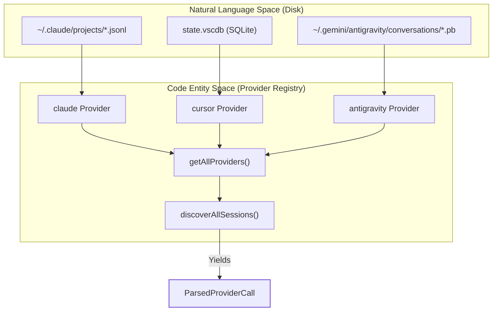
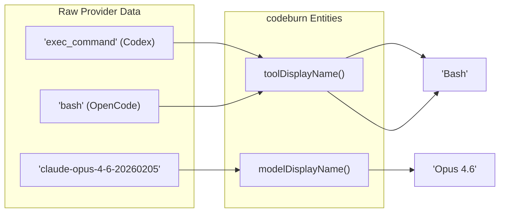

# 제공자 플러그인 시스템

관련 소스 파일

다음 파일들은 이 위키 페이지를 생성하기 위한 컨텍스트로 사용되었습니다.

- [README.md](README.md)
- [assets/menubar-0.8.0.png](assets/menubar-0.8.0.png)
- [src/data/litellm-snapshot.json](src/data/litellm-snapshot.json)
- [src/providers/antigravity.ts](src/providers/antigravity.ts)
- [src/providers/index.ts](src/providers/index.ts)
- [src/providers/opencode.ts](src/providers/opencode.ts)
- [src/providers/types.ts](src/providers/types.ts)
- [tests/provider-registry.test.ts](tests/provider-registry.test.ts)

CodeBurn은 여러 AI 코딩 도구에서 세션 데이터를 수집하기 위해 모듈식 **Provider Plugin System**을 사용합니다. 각 도구(예: Claude Code, Cursor, GitHub Copilot)는 JSONL 로그부터 SQLite 데이터베이스까지 서로 다른 형식으로 기록을 저장하므로, 시스템은 이러한 차이를 통합 `Provider` 인터페이스 뒤로 추상화합니다 [src/providers/types.ts:32-39]().

## Provider 인터페이스

지원되는 모든 AI 도구는 `Provider` 객체로 구현됩니다. 이 인터페이스는 코어 집계 엔진이 발견과 파싱을 위한 일관된 메서드 집합을 사용해 서로 다른 데이터 소스와 상호작용할 수 있게 합니다.

| 속성 / 메서드 | 설명 |
|:---|:---|
| `name` | 내부 고유 식별자(예: `claude`, `cursor`) [src/providers/types.ts:33](). |
| `discoverSessions()` | 로컬 파일시스템에서 세션 파일 또는 데이터베이스 항목을 스캔합니다 [src/providers/types.ts:37](). |
| `createSessionParser()` | `ParsedProviderCall` 객체를 산출할 수 있는 `SessionParser`를 반환합니다 [src/providers/types.ts:38](). |
| `modelDisplayName()` | 원시 모델 문자열을 사람이 읽을 수 있는 버전으로 정규화합니다(예: `gpt-4o` → `GPT-4o`) [src/providers/types.ts:35](). |
| `toolDisplayName()` | 제공자별 도구 이름을 표준 CodeBurn 이름으로 매핑합니다(예: `exec_command` → `Bash`) [src/providers/types.ts:36](). |

### Provider 데이터 흐름

다음 다이어그램은 `getAllProviders` 레지스트리가 물리적 파일 시스템(자연어 공간/로그)과 내부 `ParsedProviderCall` 객체(코드 엔터티 공간) 사이의 간극을 어떻게 연결하는지 보여줍니다.

**다이어그램: 수집 파이프라인 매핑**

출처: [src/providers/types.ts:11-30](), [src/providers/index.ts:91-100](), [src/providers/antigravity.ts:11-11]()

## Provider 레지스트리와 지연 로딩

빠른 시작 시간을 유지하고 `better-sqlite3` 같은 선택적 의존성을 처리하기 위해 CodeBurn은 **코어 제공자**와 **지연 로딩 제공자**를 구분하는 레지스트리를 사용합니다.

*   **코어 제공자**: 동기적으로 로드됩니다. `claude`, `codex`, `copilot`, `droid`, `gemini`, `kiloCode`, `kiro`, `openclaw`, `pi`, `omp`, `qwen`, `rooCode`가 포함됩니다 [src/providers/index.ts:89-89]().
*   **지연 로딩 제공자**: 필요할 때 또는 전체 발견 과정에서만 비동기적으로 로드됩니다. `antigravity`, `goose`, `cursor`, `opencode`, `cursor-agent`가 포함됩니다 [src/providers/index.ts:14-87]().

### 세션 발견
`discoverAllSessions` 함수 [src/providers/index.ts:104-115]()는 등록된 모든 제공자를 순회하면서 각자의 `discoverSessions` 메서드를 호출하여 `SessionSource` 객체 목록을 빌드합니다. 이를 통해 CLI는 발견이 시작되기 전에 레지스트리를 필터링하여 `--provider` 플래그를 지원할 수 있습니다.

출처: [src/providers/index.ts:1-140](), [tests/provider-registry.test.ts:1-15]()

## 통합 요약

각 제공자는 `ParsedProviderCall` 스키마를 채우기 위한 특정 추출 로직을 처리합니다.

| Provider | 데이터 소스 | 핵심 로직 |
|:---|:---|:---|
| **Claude** | JSONL | 메시지를 턴으로 그룹화하고, 도구 사용과 메시지 ID를 추출합니다. |
| **Cursor** | SQLite | `state.vscdb`에서 `cursorDiskKV`를 파싱하고, "Auto" 모델 추정을 처리합니다. |
| **Antigravity** | Protobuf / RPC | 사용량 데이터를 가져오기 위해 RPC로 로컬 language server와 통신합니다 [src/providers/antigravity.ts:143-189](). |
| **OpenCode** | SQLite | `node:sqlite` shim을 사용하며, `skill`과 `patch` 같은 복잡한 도구 이름을 정규화합니다 [src/providers/opencode.ts:52-65](). |

### 모델과 도구 정규화
제공자는 "AI-speak"를 "Human-speak"로 번역하는 역할을 담당합니다. 예를 들어 `codex` 제공자는 `exec_command`를 `Bash`로 매핑하고 [tests/provider-registry.test.ts:43-43](), `opencode` 제공자는 모델 이름에서 vendor 접두사를 제거합니다 [tests/provider-registry.test.ts:21-22]().

**다이어그램: 정규화 로직**

출처: [tests/provider-registry.test.ts:17-69](), [src/providers/types.ts:34-36]()

## 상세 Provider 문서

중복 제거 전략과 파일시스템 경로를 포함한 특정 구현의 깊은 기술적 세부 정보는 하위 페이지를 참조하세요.

*   **[Claude Provider](#4.1)**: Claude provider를 문서화합니다. `~/.claude/projects/` 아래의 JSONL 세션 발견, 턴 그룹화, 도구 추출, 메시지 ID를 통한 중복 제거, subagent 로그 처리를 다룹니다.
*   **[Cursor Provider](#4.2)**: Cursor provider를 문서화합니다. SQLite `state.vscdb` 추출, `cursorDiskKV` bubble 파싱, 모델 해석(`CURSOR_DEFAULT_MODEL`), 중복 제거 키 형식, `cursor-agent` 변형을 다룹니다.
*   **[Other Providers (Codex, Copilot, OpenCode, Pi/OMP, and more)](#4.3)**: Codex, Copilot, OpenCode(`sqlite.ts` 드라이버 shim 경유), Gemini, Goose, Qwen, Roo Code, RPC 기반 Antigravity 통합을 포함한 나머지 provider 플러그인을 문서화합니다.

출처: [src/providers/index.ts:1-139](), [src/providers/opencode.ts:1-13]()
