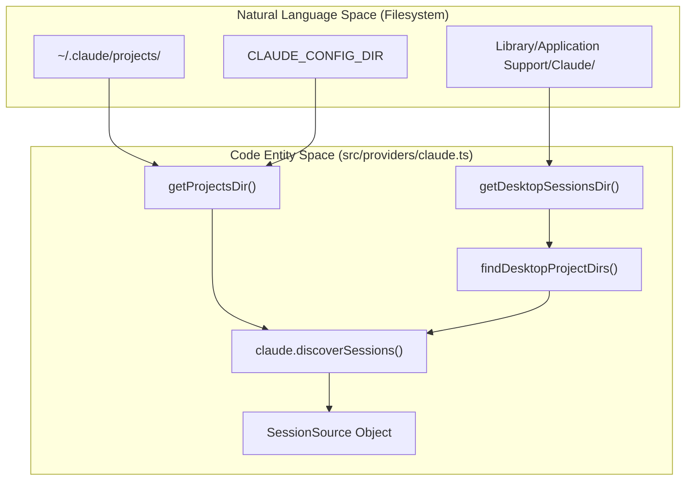
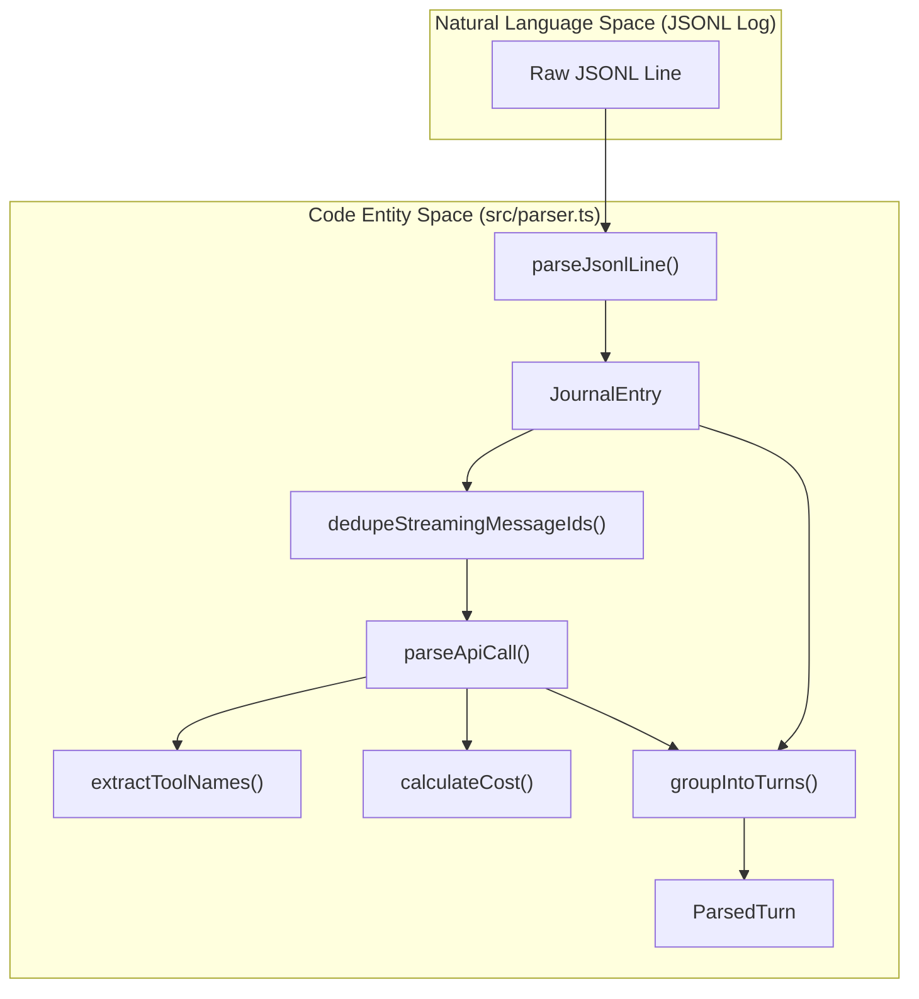

# Claude Provider

관련 소스 파일

다음 파일들은 이 위키 페이지를 생성하기 위한 컨텍스트로 사용되었습니다.

- [src/parser.ts](src/parser.ts)
- [src/providers/claude.ts](src/providers/claude.ts)
- [src/types.ts](src/types.ts)

Claude provider는 Claude Desktop 애플리케이션과 그 관련 로컬 에이전트 모드가 생성한 세션 로그를 발견하고 파싱하는 역할을 담당합니다. JSONL 형식의 저널 항목을 수집하고, 이를 논리적 대화 턴으로 그룹화하며, 도구 사용량, 토큰 수, subagent 생성 등 상세 메타데이터를 추출합니다.

## 세션 발견

Claude 세션은 JSONL(JSON Lines) 파일을 포함하는 디렉터리로 저장됩니다. provider는 이러한 세션을 찾기 위해 두 가지 주요 위치를 스캔합니다.

1.  **표준 구성 디렉터리**: 기본값은 `~/.claude/projects/`이지만, `CLAUDE_CONFIG_DIR` 환경 변수로 재정의할 수 있습니다 [src/providers/claude.ts:22-28]().
2.  **Desktop Local Agent 세션**: `local-agent-mode-sessions`에 대한 플랫폼별 경로를 스캔합니다 [src/providers/claude.ts:30-34]().
    *   **macOS**: `~/Library/Application Support/Claude/local-agent-mode-sessions`
    *   **Windows**: `~/AppData/Roaming/Claude/local-agent-mode-sessions`
    *   **Linux**: `~/.config/Claude/local-agent-mode-sessions`

발견 과정은 이러한 디렉터리를 재귀적으로 순회하여(최대 깊이 8) 개별 세션 로그를 포함하는 `projects` 하위 디렉터리를 찾습니다 [src/providers/claude.ts:36-60]().

### 세션 발견 데이터 흐름
다음 다이어그램은 `claude.discoverSessions`가 로컬 파일시스템을 수집 파이프라인에서 사용하는 `SessionSource` 엔터티로 어떻게 연결하는지 보여줍니다.

Title: Claude 세션 발견 흐름

출처: [src/providers/claude.ts:22-106]()

## 수집 및 파싱 파이프라인

provider는 JSONL 파일에서 발견되는 `JournalEntry` 객체 [src/types.ts:46-59]()를 처리합니다. 파싱 로직은 주로 `src/parser.ts`에 구현되어 있습니다.

### Turn 그룹화와 중복 제거
대화는 `ParsedTurn` 객체 [src/types.ts:61-66]()로 구조화됩니다. 턴은 `user` 메시지를 만났을 때 시작되며, 다음 사용자 메시지 전까지의 모든 후속 `assistant` 응답을 포함합니다 [src/parser.ts:161-184]().

로그가 겹치거나 다시 읽힐 수 있는 환경에서 중복 집계를 방지하기 위해 파서는 `seenMsgIds` Set [src/parser.ts:161]()을 사용합니다. `getMessageId` [src/parser.ts:84-88]()를 통해 어시스턴트 메시지에서 고유 ID를 추출합니다.
*   사용 가능한 경우 `msg.id`를 사용합니다 [src/parser.ts:87]().
*   fallback으로 `parseApiCall`에서 복합 키 `claude:${entry.timestamp}`를 사용합니다 [src/parser.ts:133]().

`dedupeStreamingMessageIds` 함수는 특히 스트리밍 메시지 청크를 처리합니다. 이 함수는 전체 usage와 content가 포함된 특정 ID의 최종 메시지만 처리되도록 보장하면서 원래 시작 타임스탬프를 보존합니다 [src/parser.ts:137-159]().

### 도구와 Subagent 추출
파서는 어시스턴트 메시지의 `ContentBlock` 배열을 검사하여 다음을 식별합니다.
*   **코어 도구**: `extractCoreTools`로 추출되는 표준 도구입니다 [src/parser.ts:58-60]().
*   **MCP 도구**: `mcp__` 접두사로 식별됩니다 [src/parser.ts:43-45]().
*   **Skills**: `Skill`이라는 이름의 도구 블록에서 추출됩니다 [src/parser.ts:47-56]().
*   **Subagent 생성**: `Agent` 도구가 있으면 감지됩니다 [src/parser.ts:128]().
*   **Plan Mode**: `EnterPlanMode` 도구가 있으면 감지됩니다 [src/parser.ts:129]().
*   **Bash 명령**: `BASH_TOOLS`와 일치하는 도구에 대해 `extractBashCommandsFromContent`를 사용하여 도구 입력에서 추출됩니다 [src/parser.ts:62-69]().

### 데이터 흐름: 원시 로그에서 ParsedTurn까지
이 다이어그램은 원시 `JournalEntry`가 `ParsedApiCall`로, 최종적으로 `ParsedTurn`으로 변환되는 과정을 보여줍니다.

Title: Claude 로그 파싱 로직

출처: [src/parser.ts:29-204](), [src/types.ts:61-82]()

## 기술 세부 정보

### 토큰 사용량과 비용 계산
provider는 `parseApiCall` [src/parser.ts:90-116]() 안에서 `ApiUsage` 객체 [src/types.ts:24-34]()로부터 상세 토큰 지표를 추출합니다.
*   `inputTokens`(`usage.input_tokens`에서)
*   `outputTokens`(`usage.output_tokens`에서)
*   `cacheCreationInputTokens`(`usage.cache_creation_input_tokens`에서)
*   `cacheReadInputTokens`(`usage.cache_read_input_tokens`에서)
*   `webSearchRequests`(`usage.server_tool_use.web_search_requests`에서)

이 값들은 모델 ID 및 `speed` 파라미터(예: 'fast' vs 'standard')와 함께 `calculateCost` [src/parser.ts:108-116]()로 전달되어 호출의 USD 비용을 결정합니다.

### 모델 이름 정규화
Claude는 버전이 지정된 모델 문자열(예: `claude-3-5-sonnet-20241022`)을 사용합니다. provider는 `src/providers/claude.ts`의 매핑을 사용해 이를 UI용 사람이 읽기 쉬운 짧은 이름으로 매핑합니다 [src/providers/claude.ts:7-20]().

| 원시 모델 접두사 | 표시 이름 |
| :--- | :--- |
| `claude-3-7-sonnet` | Sonnet 3.7 |
| `claude-3-5-sonnet` | Sonnet 3.5 |
| `claude-opus-4` | Opus 4 |
| `claude-haiku-3-5` | Haiku 3.5 |

출처: [src/providers/claude.ts:7-20](), [src/parser.ts:90-135]()

## MCP Inventory 발견
Claude Code는 `attachment.type === "deferred_tools_delta"`인 특정 저널 항목을 내보냅니다. `extractMcpInventory` 함수는 이를 파싱하여 세션 중 사용 가능한 모든 `mcp__` 식별자의 합집합을 유지하며, 이는 `SessionSummary`의 `mcpInventory` 필드에 저장됩니다 [src/parser.ts:206-227]().

출처: [src/parser.ts:206-227](), [src/types.ts:129-130]()
