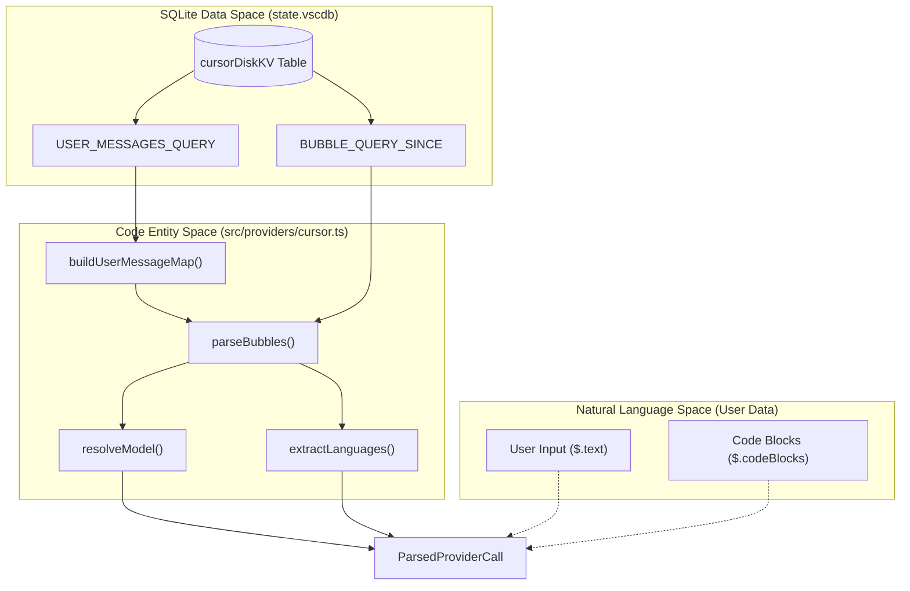
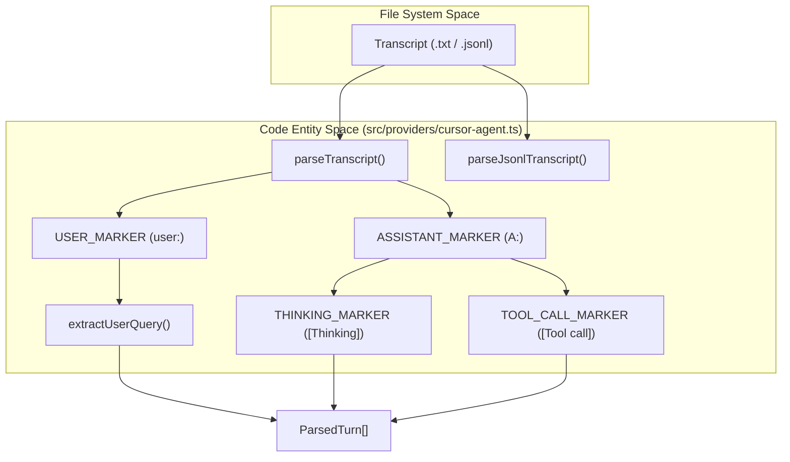

# Cursor Provider

관련 소스 파일

다음 파일들은 이 위키 페이지를 생성하기 위한 컨텍스트로 사용되었습니다.

- [src/compare.tsx](src/compare.tsx)
- [src/cursor-cache.ts](src/cursor-cache.ts)
- [src/ink-win.ts](src/ink-win.ts)
- [src/providers/cursor-agent.ts](src/providers/cursor-agent.ts)
- [src/providers/cursor.ts](src/providers/cursor.ts)
- [src/sqlite.ts](src/sqlite.ts)
- [tests/providers/cursor-agent.test.ts](tests/providers/cursor-agent.test.ts)
- [tests/providers/cursor.test.ts](tests/providers/cursor.test.ts)
- [tests/providers/opencode.test.ts](tests/providers/opencode.test.ts)

Cursor provider는 Cursor 에디터에서 AI 사용량 데이터를 추출하는 역할을 담당합니다. Cursor가 애플리케이션 상태와 대화 기록을 저장하는 로컬 SQLite 데이터베이스를 쿼리하여 동작합니다. 이 provider에는 통합 채팅/composer 동작을 위한 표준 `cursor` provider와 장시간 실행되는 agentic transcript를 위한 `cursor-agent` 변형, 두 가지가 포함됩니다.

## 데이터 추출과 SQLite 스키마

Cursor provider의 기본 신뢰 소스는 `state.vscdb` SQLite 데이터베이스입니다 [src/providers/cursor.ts:62-70](). 이 데이터베이스에는 여러 애플리케이션 상태 객체를 JSON 문자열로 저장하는 `cursorDiskKV`라는 테이블이 포함되어 있습니다.

### 주요 데이터베이스 테이블과 쿼리

provider는 `cursorDiskKV` 테이블에 저장된 "bubbles"(개별 메시지 턴)와 agent 관련 blob을 대상으로 합니다.

| 쿼리 유형 | 목적 | 테이블/조건 |
| :--- | :--- | :--- |
| **Bubble Query** | 토큰 수, 모델 정보, 코드 블록을 추출합니다. | `cursorDiskKV` WHERE `key LIKE 'bubbleId:%'` [src/providers/cursor.ts:101-114]() |
| **User Message Query** | 컨텍스트를 위해 사용자 텍스트를 대화 ID에 매핑합니다. | `cursorDiskKV` WHERE `key LIKE 'bubbleId:%'` AND `json_extract(value, '$.type') = 1` [src/providers/cursor.ts:129-139]() |
| **Agent KV Query** | agentic blob의 role, content, request ID를 추출합니다. | `cursorDiskKV` WHERE `key LIKE 'agentKv:blob:%'` [src/providers/cursor.ts:116-127]() |
| **Validation** | 데이터베이스 스키마가 호환되는지 확인합니다. | `SELECT COUNT(*) FROM cursorDiskKV` [src/providers/cursor.ts:146-155]() |

### 데이터 흐름: SQLite에서 ParsedProviderCall까지

다음 다이어그램은 `parseBubbles` 함수가 원시 SQLite 행을 표준 `ParsedProviderCall` 형식으로 변환하는 방식을 보여줍니다.

**Cursor 데이터 변환 파이프라인**

출처: [src/providers/cursor.ts:101-114](), [src/providers/cursor.ts:129-144](), [src/providers/cursor.ts:159-171](), [src/providers/cursor.ts:173-220]()

## 모델 해석과 가격 책정

Cursor는 내부 모델 식별자나 "default" 별칭을 자주 사용합니다. provider는 정확한 비용 계산을 위해 이를 표준 이름으로 해석합니다.

- **기본 모델**: 모델이 지정되지 않았거나 `default`로 설정되어 있으면 `claude-sonnet-4-5`로 해석됩니다 [src/providers/cursor.ts:10-10](), [src/providers/cursor.ts:91-94]().
- **모델 별칭**: `gpt-5.1-codex-high` 또는 `grok-code-fast-1` 같은 내부 이름은 UI를 위해 읽기 쉬운 표시 이름으로 매핑됩니다 [src/providers/cursor.ts:12-27]().
- **비용 계산**: 해석된 가격 책정 모델과 추출된 토큰 수를 사용해 `calculateCost` 함수가 호출됩니다 [src/providers/cursor.ts:215-215]().

## 중복 제거와 캐싱

실행 간 중복 집계를 방지하기 위해 provider는 특정 중복 제거 키 형식과 파일 기반 캐시 계층을 사용합니다.

### 중복 제거 키
키는 다음과 같이 구성됩니다.
`cursor:{conversationId}:{createdAt}:{inputTokens}:{outputTokens}` [src/providers/cursor.ts:207-207]().

### Cursor-Cache 계층
SQLite 데이터베이스 쿼리와 대형 JSON blob 파싱은 비용이 클 수 있으므로, `cursor-cache.ts` 모듈은 영속성 계층을 제공합니다.
- **Fingerprinting**: 캐시는 SQLite 파일의 `mtimeMs`와 `size`를 기준으로 검증됩니다 [src/cursor-cache.ts:26-33](), [src/cursor-cache.ts:43-43]().
- **Storage**: 결과는 `~/.cache/codeburn/cursor-results.json`에 저장됩니다 [src/cursor-cache.ts:16-24]().
- **Functions**: `readCachedResults` [src/cursor-cache.ts:35-50]() 및 `writeCachedResults` [src/cursor-cache.ts:52-67]().

## Cursor Agent 변형

`cursor-agent` provider(`src/providers/cursor-agent.ts`에 구현됨)는 일반적으로 기본 SQLite DB가 아니라 텍스트 transcript 또는 JSONL 파일로 저장되는 Cursor의 agentic workflow 로그를 처리합니다.

### 발견과 파싱
- **기본 디렉터리**: 기본값은 `~/.cursor`입니다 [src/providers/cursor-agent.ts:67-71]().
- **Transcripts**: `projects/*/agent-transcripts/*.txt`를 스캔합니다 [src/providers/cursor-agent.ts:73-75]().
- **토큰 추정**: transcript는 원시 텍스트이므로 `CHARS_PER_TOKEN` 상수(4로 설정됨)를 사용해 토큰을 추정합니다 [src/providers/cursor-agent.ts:35-35](), [src/providers/cursor-agent.ts:81-84]().

**Agent Transcript 파싱 로직**

출처: [src/providers/cursor-agent.ts:39-45](), [src/providers/cursor-agent.ts:146-165](), [src/providers/cursor-agent.ts:167-217](), [src/providers/cursor-agent.ts:219-230]()

### Attribution 데이터베이스
agent 변형은 transcript를 제목과 updated timestamp 같은 특정 대화 메타데이터와 연결하기 위해 `ai-code-tracking.db`에서도 읽기를 시도합니다 [src/providers/cursor-agent.ts:77-79](), [src/providers/cursor-agent.ts:46-50]().

출처:
- [src/providers/cursor.ts:1-220]()
- [src/providers/cursor-agent.ts:1-230]()
- [src/cursor-cache.ts:1-67]()
- [src/sqlite.ts:86-101]()
- [tests/providers/cursor.test.ts:1-78]()
- [tests/providers/cursor-agent.test.ts:1-174]()
