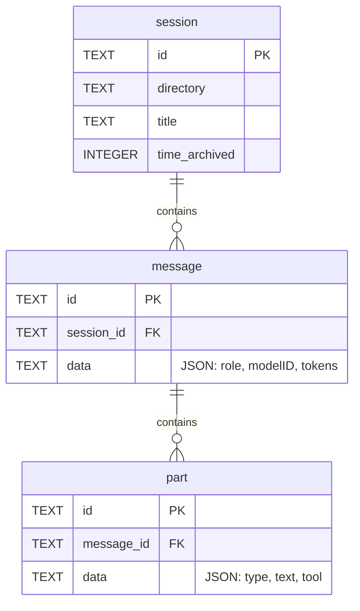

# 기타 Provider(Codex, Copilot, OpenCode, Pi/OMP 등)

<details>
<summary>관련 소스 파일</summary>

다음 파일들은 이 위키 페이지를 생성하기 위한 컨텍스트로 사용되었습니다.

- [scripts/bundle-litellm.mjs](scripts/bundle-litellm.mjs)
- [src/codex-cache.ts](src/codex-cache.ts)
- [src/providers/codex.ts](src/providers/codex.ts)
- [src/providers/copilot.ts](src/providers/copilot.ts)
- [src/providers/droid.ts](src/providers/droid.ts)
- [src/providers/gemini.ts](src/providers/gemini.ts)
- [src/providers/goose.ts](src/providers/goose.ts)
- [src/providers/kilo-code.ts](src/providers/kilo-code.ts)
- [src/providers/kiro.ts](src/providers/kiro.ts)
- [src/providers/openclaw.ts](src/providers/openclaw.ts)
- [src/providers/pi.ts](src/providers/pi.ts)
- [src/providers/qwen.ts](src/providers/qwen.ts)
- [src/providers/roo-code.ts](src/providers/roo-code.ts)
- [src/providers/vscode-cline-parser.ts](src/providers/vscode-cline-parser.ts)
- [tests/providers/codex.test.ts](tests/providers/codex.test.ts)
- [tests/providers/copilot.test.ts](tests/providers/copilot.test.ts)
- [tests/providers/droid.test.ts](tests/providers/droid.test.ts)
- [tests/providers/kilo-code.test.ts](tests/providers/kilo-code.test.ts)
- [tests/providers/omp.test.ts](tests/providers/omp.test.ts)
- [tests/providers/openclaw.test.ts](tests/providers/openclaw.test.ts)
- [tests/providers/pi.test.ts](tests/providers/pi.test.ts)
- [tests/providers/roo-code.test.ts](tests/providers/roo-code.test.ts)

</details>


이 페이지는 CodeBurn의 보조 provider 플러그인 구현을 문서화합니다. Claude와 Cursor provider가 일반적인 사용량의 대부분을 처리하지만, 이 provider들은 로컬 JSONL 로그, SQLite 데이터베이스, companion 설정 파일을 파싱하여 특화된 AI 코딩 도구(Codex, Pi/OMP, Gemini, Droid)와 주요 확장(Copilot, Roo Code)을 지원합니다.

## 지원 형식 개요

이 섹션의 provider들은 세 가지 주요 데이터 수집 전략을 사용합니다.
1.  **JSONL 스트리밍**: `codex.ts`, `copilot.ts`, `pi.ts`, `gemini.ts`, `qwen.ts`, `droid.ts`는 줄 단위 JSON 파일을 읽습니다.
2.  **SQLite 추출**: `goose.ts`와 `opencode.ts`는 구조화된 관계형 데이터를 쿼리하기 위해 `node:sqlite` shim을 사용합니다.
3.  **하이브리드 메타데이터**: `droid.ts`는 토큰 사용량을 해석하기 위해 `.jsonl` 세션 로그를 `.settings.json` 파일과 짝지어 사용합니다 [src/providers/droid.ts:121-128]().

### 데이터 흐름: 로그에서 Parsed Call까지

다음 다이어그램은 이러한 provider들이 원시 로컬 상태를 표준 `ParsedProviderCall` 형식으로 변환하는 방식을 보여줍니다.

**Provider 수집 파이프라인**
```mermaid
graph TD
    subgraph "Local File System"
        JSONL[".jsonl files"]
        SQL["SQLite DB (.db / .vscdb)"]
        SET["Companion .settings.json"]
    end

    subgraph "Code Entities"
        CP["createParser() / createSessionParser()"]
        SD["discoverSessionsInDir() / discoverSessions()"]
        SQ["sqlite.ts Driver Shim"]
        RP["readSessionFile() / readSessionLines()"]
    end

    JSONL --> RP
    RP --> CP
    SET --> CP
    SQL -->|openDatabase| SQ
    SQ --> CP
    SD -->|SessionSource| CP
    CP -->|AsyncGenerator| PPC["ParsedProviderCall"]
end
```
**출처:** [src/providers/pi.ts:114-116](), [src/providers/codex.ts:188-190](), [src/providers/copilot.ts:221-223](), [src/providers/droid.ts:111-116](), [src/sqlite.ts:86-101]()

---

## JSONL Provider

### Codex Provider
Codex provider는 `~/.codex/sessions`(또는 `CODEX_HOME`)를 모니터링합니다 [src/providers/codex.ts:69-71](). 세션을 `YYYY/MM/DD` 디렉터리 구조로 구성합니다 [src/providers/codex.ts:129-152]().

*   **대형 메타 처리**: Codex CLI 0.128+는 20KB를 초과할 수 있는 `session_meta` 라인을 기록합니다. provider는 메모리를 고갈시키지 않으면서 이를 파싱하기 위해 1MB `FIRST_LINE_READ_CAP`을 사용합니다 [src/providers/codex.ts:80-92]().
*   **토큰 사용량**: Codex는 `last_token_usage`(증분)와 `total_token_usage`(누적)를 모두 제공합니다 [src/providers/codex.ts:50-55](). 파서는 누적 총계에서 delta를 계산하여 턴별 비용을 방출합니다 [src/providers/codex.ts:206-210]().
*   **캐싱**: 파일 fingerprint가 변경되지 않은 경우 무거운 세션 파일(종종 250MB 초과)을 다시 파싱하지 않도록 `readCachedCodexResults`를 사용합니다 [src/providers/codex.ts:191-201]().

### Copilot Provider
Copilot provider는 `~/.copilot/session-state`와 VS Code workspace transcript를 대상으로 합니다 [src/providers/copilot.ts:228-230]().

*   **형식 감지**: 레거시 `.jsonl` 이벤트와 최신 VS Code transcript를 모두 처리합니다 [src/providers/copilot.ts:61-141]().
*   **모델 추론**: transcript에는 명시적 모델 이름이 없는 경우가 많으므로, `inferModelFromToolCallIds`는 도구 호출 ID 접두사(예: Anthropic의 `toolu_`, OpenAI의 `call_`)를 사용해 활성 모델을 추정합니다 [src/providers/copilot.ts:156-186]().
*   **비용 계산**: Copilot 로그에는 흔히 `outputTokens`만 포함되며, 로그의 `inputTokens`는 0인 경우가 많아 Copilot 비용 추정치는 하한값이 됩니다 [src/providers/copilot.ts:112-124]().

### Gemini, Qwen, Droid
*   **Gemini**: `~/.gemini/tmp`의 `.json` 또는 `.jsonl` 채팅을 파싱합니다. Gemini 사용량 보고는 cached 토큰을 input 총계에 포함하므로 중복 과금을 피하기 위해 `input`에서 `cached` 토큰을 뺍니다 [src/providers/gemini.ts:105-107]().
*   **Qwen**: `~/.qwen/projects`에서 세션을 발견합니다. `thoughtsTokenCount`에서 reasoning 토큰을 추출합니다 [src/providers/qwen.ts:119-122]().
*   **Droid**: `.settings.json`의 세션 수준 토큰 사용량을 `.jsonl` 로그에서 발견된 모든 어시스턴트 메시지에 균등하게 분배한다는 점이 독특합니다 [src/providers/droid.ts:210-225]().

**출처:** [src/providers/codex.ts:1-132](), [src/providers/copilot.ts:1-186](), [src/providers/gemini.ts:105-122](), [src/providers/droid.ts:121-225]()

---

## SQLite Provider(Goose, OpenCode)

이 provider들은 `sqlite.ts` 드라이버를 사용해 로컬 데이터베이스를 쿼리합니다.

### Goose Provider
Goose는 `XDG_DATA_HOME/goose` 또는 `AppData`에 위치한 `sessions.db` 파일에 세션을 저장합니다 [src/providers/goose.ts:52-62]().
*   **집계**: Goose는 세션 수준에서 `accumulated_input_tokens`와 `accumulated_output_tokens`를 제공합니다 [src/providers/goose.ts:170-171]().
*   **도구 추출**: `messages` 테이블에서 하위 쿼리를 수행하고 `content_json`을 파싱하여 `toolRequest` 타입을 찾습니다 [src/providers/goose.ts:89-102]().

### OpenCode Provider
OpenCode는 세션 기록을 저장하기 위해 관계형 데이터베이스(`opencode.db`)를 사용합니다. provider는 `session`, `message`, `part` 테이블에 걸쳐 복잡한 join을 수행합니다.

**OpenCode 엔터티 관계**

**출처:** [src/providers/goose.ts:8-31](), [src/sqlite.ts:1-15]()

---

## SQLite 드라이버 Shim(`sqlite.ts`)

CodeBurn은 네이티브 바이너리 의존성을 피하기 위해 `node:sqlite` 위에 얇은 래퍼를 포함합니다.

| 기능 | 설명 |
| :--- | :--- |
| **Compatibility** | Node 24에서는 안정적이고, Node 22/23에서는 실험적입니다 [src/sqlite.ts:3-5](). |
| **Lazy Loading** | SQLite 기반 provider가 호출될 때만 드라이버가 로드됩니다 [src/sqlite.ts:30-32](). |
| **Warning Suppression** | `sqlite` 모듈에 대한 `ExperimentalWarning`을 숨기기 위해 `process.emit`을 가로챕니다 [src/sqlite.ts:46-56](). |
| **Read-Only** | 데이터베이스 손상을 방지하기 위해 열 때 `readOnly: true`를 강제합니다 [src/sqlite.ts:91](). |

**출처:** [src/sqlite.ts:1-102]()

---

## 도구 매핑 요약

Provider들은 `toolNameMap` 객체를 통해 내부 도구 이름을 CodeBurn 표준으로 정규화합니다.

| Provider | 내부 이름 | CodeBurn 표준 |
| :--- | :--- | :--- |
| **Codex** | `exec_command` | Bash [src/providers/codex.ts:26]() |
| **Copilot** | `replace_string_in_file` | Edit [src/providers/copilot.ts:40]() |
| **Goose** | `developer__shell` | Bash [src/providers/goose.ts:39]() |
| **Qwen** | `browser_action` | WebFetch [src/providers/qwen.ts:18]() |
| **Droid** | `Execute` | Bash [src/providers/droid.ts:23]() |
| **OpenClaw** | `dispatch_agent` | Agent [src/providers/openclaw.ts:19]() |

**출처:** [src/providers/codex.ts:25-35](), [src/providers/copilot.ts:34-53](), [src/providers/goose.ts:38-46](), [src/providers/qwen.ts:10-22](), [src/providers/droid.ts:15-32](), [src/providers/openclaw.ts:10-24]()
