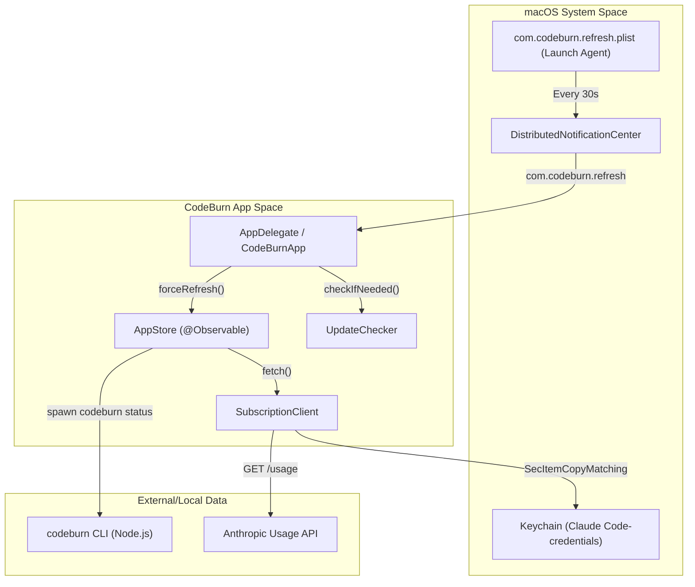
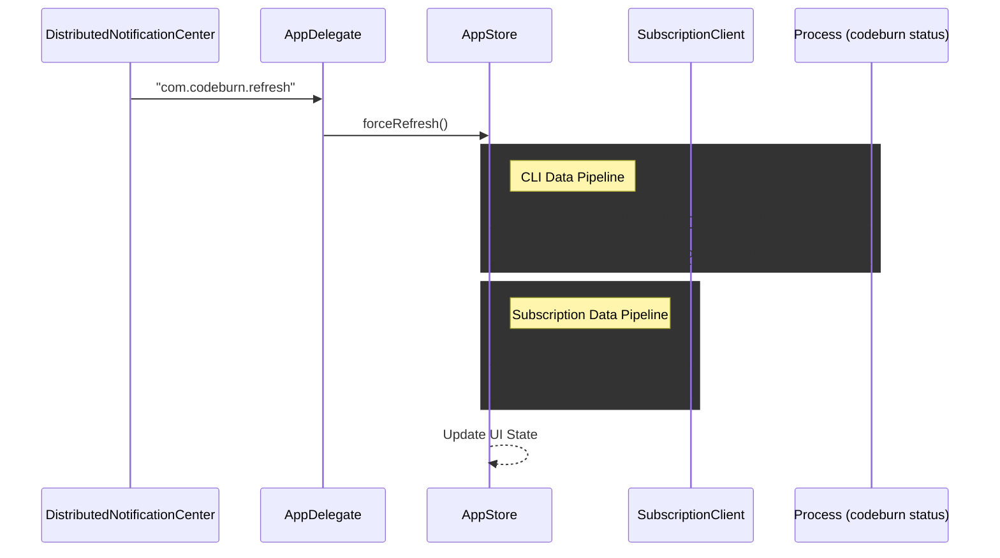

# macOS 메뉴 막대 애플리케이션

관련 소스 파일

다음 파일들은 이 위키 페이지를 생성하기 위한 컨텍스트로 사용되었습니다.

- [mac/.gitignore](mac/.gitignore)
- [mac/Package.swift](mac/Package.swift)
- [mac/README.md](mac/README.md)
- [mac/Sources/CodeBurnMenubar/CodeBurnApp.swift](mac/Sources/CodeBurnMenubar/CodeBurnApp.swift)
- [mac/Sources/CodeBurnMenubar/Data/CapacityEstimator.swift](mac/Sources/CodeBurnMenubar/Data/CapacityEstimator.swift)
- [mac/Sources/CodeBurnMenubar/Data/SubscriptionClient.swift](mac/Sources/CodeBurnMenubar/Data/SubscriptionClient.swift)

CodeBurn macOS 메뉴 막대 애플리케이션은 시스템 트레이에서 AI 코딩 지출과 토큰 사용량을 실시간으로 직접 보여주도록 설계된 네이티브 Swift/SwiftUI 구현입니다 [mac/README.md:1-3](). `codeburn` CLI의 그래픽 동반 앱으로 동작하며, 로컬 세션 데이터를 주기적으로 polling하고 provider API와 통합하여 비용 지표, 사용량 추세, 최적화 인사이트를 표시합니다.

### 시스템 아키텍처

애플리케이션은 macOS 액세서리 앱(`LSUIElement = true`)으로 빌드되어 Dock 아이콘 없이 메뉴 막대에만 존재합니다 [mac/README.md:45-45](). 뷰 계층에는 SwiftUI를, 상태 관리에는 `@Observable` 패턴을 사용하는 반응형 아키텍처를 따릅니다 [mac/Sources/CodeBurnMenubar/CodeBurnApp.swift:3-13]().

#### 데이터 오케스트레이션과 흐름
애플리케이션은 구조화된 데이터 파이프라인을 통해 사용자 의도의 "자연어 공간"을 "코드 엔터티 공간"으로 연결합니다.

1.  **트리거**: Launch Agent `com.codeburn.refresh.plist` 또는 내부 타이머가 30초마다 실행됩니다 [mac/Sources/CodeBurnMenubar/CodeBurnApp.swift:5-7, 111-112]().
2.  **실행**: `AppStore`가 refresh를 트리거하고, 이는 `CodeburnCLI.makeProcess`를 통해 `codeburn` CLI를 subprocess로 호출합니다 [mac/README.md:49-49]().
3.  **파싱**: CLI 출력(JSON)이 `MenubarPayload`로 디코딩됩니다 [mac/README.md:49-49]().
4.  **관찰**: `AppStore`가 `@Observable` 상태를 업데이트하여 `MenuBarContent` 계층 전반의 SwiftUI 뷰 refresh를 트리거합니다 [mac/Sources/CodeBurnMenubar/CodeBurnApp.swift:29-29]().

**메뉴 막대 시스템 컨텍스트**

출처: [mac/Sources/CodeBurnMenubar/CodeBurnApp.swift:54-59](), [mac/Sources/CodeBurnMenubar/CodeBurnApp.swift:80-116](), [mac/Sources/CodeBurnMenubar/Data/SubscriptionClient.swift:33-49](), [mac/README.md:49-52]()

### 컴포넌트 개요

#### 앱 생명주기와 상태 관리
`AppDelegate`는 활성화 정책을 `.accessory`로 설정하고 갑작스러운 종료를 비활성화하여 백그라운드 polling이 계속 활성 상태로 남도록 하는 등 애플리케이션 생명주기를 관리합니다 [mac/Sources/CodeBurnMenubar/CodeBurnApp.swift:35-44](). 앱이 백그라운드에 있을 때도 데이터 refresh를 위한 "heartbeat"를 제공하기 위해 Launch Agent를 설치합니다 [mac/Sources/CodeBurnMenubar/CodeBurnApp.swift:90-117](). `AppStore`는 중앙 상태 컨테이너 역할을 하며 데이터 가져오기와 통화 영속화를 처리합니다 [mac/Sources/CodeBurnMenubar/CodeBurnApp.swift:29-29]().

자세한 내용은 [앱 생명주기와 상태 관리](#5.1)를 참조하세요.

#### 메뉴 막대 UI 뷰
UI는 SwiftUI 뷰 계층을 포함하는 `NSPopover`를 사용해 구현됩니다 [mac/Sources/CodeBurnMenubar/CodeBurnApp.swift:27-28](). 레이아웃은 `MenuBarContent.swift`에 정의되어 있으며 비용 요약, 히트맵, 최적화 발견 사항 섹션을 포함합니다 [mac/README.md:58-63](). 시각적 정체성을 위해 사용자 정의 "warm terracotta" 팔레트를 사용합니다 [mac/README.md:79-89]().

자세한 내용은 [메뉴 막대 UI 뷰](#5.2)를 참조하세요.

#### 데이터 계층과 구독 통합
앱은 `codeburn status --format menubar-json`을 호출하여 `codeburn` CLI와 통신합니다 [mac/README.md:49-49](). 또한 macOS Keychain 또는 `~/.claude/.credentials.json`에서 Claude OAuth credentials를 가져와 Anthropic API에서 실시간 사용량 백분율을 가져오는 `SubscriptionClient`를 포함합니다 [mac/Sources/CodeBurnMenubar/Data/SubscriptionClient.swift:33-61](). `CapacityEstimator`는 이러한 백분율 snapshot에서 토큰 한도를 역공학하는 데 사용됩니다 [mac/Sources/CodeBurnMenubar/Data/CapacityEstimator.swift:33-43]().

자세한 내용은 [데이터 계층과 구독 통합](#5.3)을 참조하세요.

#### 설치와 업데이트
설치는 CLI 명령 `npx codeburn menubar`를 통해 처리되며, GitHub에서 `.app` bundle 다운로드, `~/Applications`로 이동, Gatekeeper quarantine 해제를 자동화합니다 [mac/README.md:15-19](). 앱에는 새 버전을 사용자에게 알리기 위해 GitHub Releases API를 polling하는 내부 `UpdateChecker`가 포함되어 있습니다 [mac/Sources/CodeBurnMenubar/CodeBurnApp.swift:59-59]().

자세한 내용은 [설치와 업데이트](#5.4)를 참조하세요.

### 코드 엔터티 매핑

다음 표는 시스템 책임을 주요 Swift 엔터티에 매핑합니다.

| 책임 | 코드 엔터티 | 핵심 메서드/속성 |
| :--- | :--- | :--- |
| **Main Entry Point** | `CodeBurnApp` | `@main` [mac/Sources/CodeBurnMenubar/CodeBurnApp.swift:13-14]() |
| **System Integration** | `AppDelegate` | `applicationDidFinishLaunching` [mac/Sources/CodeBurnMenubar/CodeBurnApp.swift:42-60]() |
| **Central State** | `AppStore` | `@Observable class AppStore` [mac/Sources/CodeBurnMenubar/CodeBurnApp.swift:29-29]() |
| **Usage API Client** | `SubscriptionClient` | `fetch()` [mac/Sources/CodeBurnMenubar/Data/SubscriptionClient.swift:34-49]() |
| **Token Estimation** | `CapacityEstimator` | `estimate(_:asOf:)` [mac/Sources/CodeBurnMenubar/Data/CapacityEstimator.swift:43-93]() |
| **Update Management** | `UpdateChecker` | `checkIfNeeded()` [mac/Sources/CodeBurnMenubar/CodeBurnApp.swift:59-59]() |

**데이터 파이프라인 엔터티 맵**

출처: [mac/Sources/CodeBurnMenubar/CodeBurnApp.swift:80-88](), [mac/Sources/CodeBurnMenubar/CodeBurnApp.swift:168-179](), [mac/Sources/CodeBurnMenubar/Data/SubscriptionClient.swift:34-49](), [mac/README.md:49-52]()
