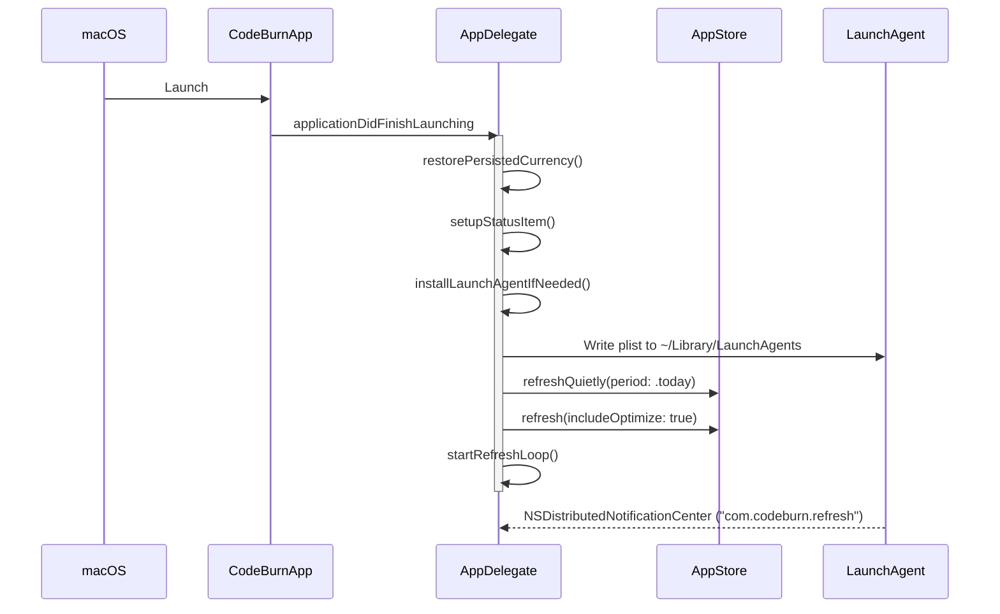
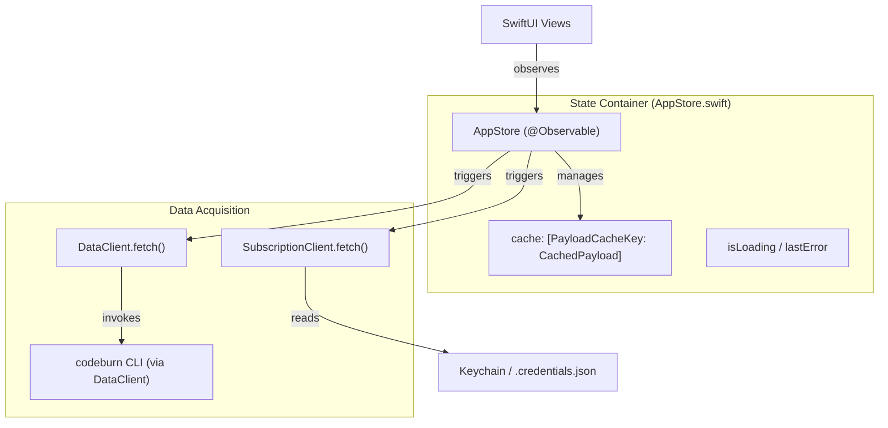

# 앱 생명주기와 상태 관리

관련 소스 파일

다음 파일들은 이 위키 페이지를 생성하기 위한 컨텍스트로 사용되었습니다.

- [mac/Sources/CodeBurnMenubar/AppStore.swift](mac/Sources/CodeBurnMenubar/AppStore.swift)
- [mac/Sources/CodeBurnMenubar/CodeBurnApp.swift](mac/Sources/CodeBurnMenubar/CodeBurnApp.swift)
- [mac/Sources/CodeBurnMenubar/Data/SubscriptionClient.swift](mac/Sources/CodeBurnMenubar/Data/SubscriptionClient.swift)

CodeBurn macOS 메뉴 막대 애플리케이션은 로컬 AI 개발 활동을 고빈도로 관찰하는 역할을 합니다. 백그라운드 polling, Launch Agent 영속성, `codeburn` CLI와 동기화되는 반응형 상태 컨테이너를 포함하는 복잡한 생명주기를 관리합니다.

## CodeBurnApp과 AppDelegate

애플리케이션 진입점은 `CodeBurnApp`이며, `@NSApplicationDelegateAdaptor`를 사용해 `AppDelegate` 생명주기를 관리합니다 [mac/Sources/CodeBurnMenubar/CodeBurnApp.swift:14-23](). 앱은 `.accessory` 유형으로 구성되어 [mac/Sources/CodeBurnMenubar/CodeBurnApp.swift:39](), Dock에 표시되지 않고 기본 창도 없으며 시스템 메뉴 막대에만 존재합니다.

### 생명주기 관리
지속적인 모니터링을 보장하기 위해 앱은 시스템 절전 기능을 명시적으로 사용하지 않습니다.
*   **App Nap 및 종료**: `automaticTerminationSupportEnabled`를 비활성화하고 `disableSuddenTermination()`을 호출합니다 [mac/Sources/CodeBurnMenubar/CodeBurnApp.swift:43-44]().
*   **백그라운드 활동**: "CodeBurn menubar polls AI coding cost every 30 seconds while idle in the background."라는 이유로 백그라운드 활동 세션을 등록합니다 [mac/Sources/CodeBurnMenubar/CodeBurnApp.swift:45-48]().

### Refresh 전략
앱은 데이터 동기화를 위해 세 가지 서로 다른 트리거를 사용합니다.
1.  **Heartbeat Timer**: `DispatchSourceTimer`(`refreshIntervalSeconds = 30`으로 구성됨)가 메인 큐에서 실행되어 백그라운드 refresh를 수행합니다 [mac/Sources/CodeBurnMenubar/CodeBurnApp.swift:5-7]().
2.  **Wake Observers**: `NSWorkspace.didWakeNotification` 및 `screensDidWakeNotification`에 대한 리스너가 Mac이 sleep에서 깨어날 때 `forceRefresh()`를 트리거합니다 [mac/Sources/CodeBurnMenubar/CodeBurnApp.swift:62-78]().
3.  **Launch Agent Heartbeat**: 앱은 `osascript`를 사용해 30초마다 `NSDistributedNotificationCenter`를 통해 `com.codeburn.refresh` 알림을 broadcast하는 Launch Agent(`com.codeburn.refresh.plist`)를 설치합니다 [mac/Sources/CodeBurnMenubar/CodeBurnApp.swift:90-117](). 이를 통해 메인 프로세스가 OS에 의해 throttling되더라도 앱이 활성 상태를 유지할 수 있습니다.

### 앱 초기화 흐름
다음 다이어그램은 시작 시퀀스를 특정 코드 엔터티에 매핑합니다.

**시작 및 초기화 시퀀스**

출처: [mac/Sources/CodeBurnMenubar/CodeBurnApp.swift:42-60](), [mac/Sources/CodeBurnMenubar/CodeBurnApp.swift:80-140](), [mac/Sources/CodeBurnMenubar/CodeBurnApp.swift:168-179]()

## AppStore: 반응형 상태 컨테이너

`AppStore`는 중앙 `@Observable` 상태 컨테이너입니다 [mac/Sources/CodeBurnMenubar/AppStore.swift:18-19](). UI 상태(선택, 로딩 표시기, 오류)를 관리하고 CLI에서 받은 payload를 캐시합니다.

### 데이터 흐름과 캐싱
`AppStore`는 `Period`와 `ProviderFilter`의 조합을 키로 하는 `MenubarPayload` 객체 `cache`를 유지합니다 [mac/Sources/CodeBurnMenubar/AppStore.swift:36-41](). 

| 기능 | 구현 |
| :--- | :--- |
| **Cache TTL** | 30초 [mac/Sources/CodeBurnMenubar/AppStore.swift:4]() |
| **Active Refresh** | `refresh(includeOptimize:force:)`는 UI 피드백을 위해 `loadingCount`를 전환합니다 [mac/Sources/CodeBurnMenubar/AppStore.swift:102-114]() |
| **Quiet Refresh** | `refreshQuietly(period:)`는 `loadingCount`를 증가시키지 않고 캐시를 업데이트합니다 [mac/Sources/CodeBurnMenubar/AppStore.swift:147-154]() |
| **Concurrency Guard** | `inFlightKeys`는 같은 기간/provider에 대한 중복 `DataClient.fetch` 호출을 방지합니다 [mac/Sources/CodeBurnMenubar/AppStore.swift:100-112]() |

### 상태 전이
store는 `switchTo(period:)`와 `switchTo(provider:)`를 통해 사용자 상호작용(기간 또는 provider 전환)을 처리합니다. 이 메서드들은 현재 진행 중인 `switchTask`를 취소하고, UI 동기화를 유지하기 위해 특정 필터와 "All Providers" 보기 모두에 대해 병렬 refresh를 트리거합니다 [mac/Sources/CodeBurnMenubar/AppStore.swift:69-98]().

**상태 관리 엔터티 매핑**

출처: [mac/Sources/CodeBurnMenubar/AppStore.swift:18-51](), [mac/Sources/CodeBurnMenubar/AppStore.swift:102-142](), [mac/Sources/CodeBurnMenubar/Data/SubscriptionClient.swift:33-49]()

## 통화 영속성과 FX 처리

메뉴 막대 앱은 통화 설정을 CLI 구성과 동기화합니다.

1.  **복원**: 실행 시 `restorePersistedCurrency()`는 `CLICurrencyConfig.loadCode()`를 사용해 통화 코드를 로드합니다 [mac/Sources/CodeBurnMenubar/CodeBurnApp.swift:184-188]().
2.  **FX 해석**: `FXRateCache.shared.cachedRate(for:)`에서 환율을 해석하거나 백그라운드에서 실시간으로 가져옵니다 [mac/Sources/CodeBurnMenubar/CodeBurnApp.swift:189-193]().
3.  **영속성**: 앱은 `codeburn currency` CLI 명령으로 영속화된 통화 설정이 앱 재실행 시 반영되도록 보장합니다 [mac/Sources/CodeBurnMenubar/CodeBurnApp.swift:181-184]().

출처: [mac/Sources/CodeBurnMenubar/CodeBurnApp.swift:184-194]()

## Claude 구독 통합

앱은 사용량 백분율과 capacity 추정치를 제공하기 위해 Claude의 OAuth 시스템과 통합됩니다.

*   **Credential 발견**: `SubscriptionClient`는 `~/.claude/.credentials.json`(`SafeFile.read` 경유) 또는 macOS Keychain(`Claude Code-credentials`)에서 credentials 로드를 시도합니다 [mac/Sources/CodeBurnMenubar/Data/SubscriptionClient.swift:53-61]().
*   **정제**: Claude CLI가 Keychain에서 긴 토큰을 줄바꿈할 수 있으므로, `sanitizeKeychainData(_:)`는 JSON 파싱 전에 정규식 기반 정리를 수행하여 줄바꿈과 불필요한 공백을 제거합니다 [mac/Sources/CodeBurnMenubar/Data/SubscriptionClient.swift:93-103]().
*   **Refresh 로직**: 사용량 가져오기가 401 상태로 실패하면 클라이언트는 저장된 refresh token을 사용해 자동으로 `refreshAccessToken`을 시도합니다 [mac/Sources/CodeBurnMenubar/Data/SubscriptionClient.swift:41-48]().
*   **상태 추적**: `AppStore`는 Claude 사용량 pill의 UI를 구동하기 위해 `subscriptionLoadState`(.idle, .loading, .loaded, .failed, .noCredentials)를 추적합니다 [mac/Sources/CodeBurnMenubar/AppStore.swift:158-176]().

출처: [mac/Sources/CodeBurnMenubar/AppStore.swift:158-176](), [mac/Sources/CodeBurnMenubar/Data/SubscriptionClient.swift:33-49](), [mac/Sources/CodeBurnMenubar/Data/SubscriptionClient.swift:93-103]()
