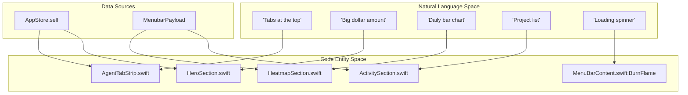
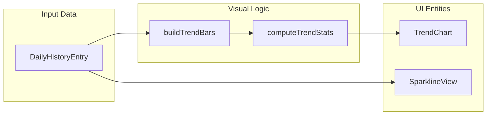

# 메뉴 막대 UI 뷰

관련 소스 파일

다음 파일들은 이 위키 페이지를 생성하기 위한 컨텍스트로 사용되었습니다.

- [mac/Sources/CodeBurnMenubar/CurrencyState.swift](mac/Sources/CodeBurnMenubar/CurrencyState.swift)
- [mac/Sources/CodeBurnMenubar/Data/DataClient.swift](mac/Sources/CodeBurnMenubar/Data/DataClient.swift)
- [mac/Sources/CodeBurnMenubar/Security/TerminalLauncher.swift](mac/Sources/CodeBurnMenubar/Security/TerminalLauncher.swift)
- [mac/Sources/CodeBurnMenubar/Theme/Theme.swift](mac/Sources/CodeBurnMenubar/Theme/Theme.swift)
- [mac/Sources/CodeBurnMenubar/Theme/ThemeState.swift](mac/Sources/CodeBurnMenubar/Theme/ThemeState.swift)
- [mac/Sources/CodeBurnMenubar/Views/ActivitySection.swift](mac/Sources/CodeBurnMenubar/Views/ActivitySection.swift)
- [mac/Sources/CodeBurnMenubar/Views/AgentTabStrip.swift](mac/Sources/CodeBurnMenubar/Views/AgentTabStrip.swift)
- [mac/Sources/CodeBurnMenubar/Views/FindingsSection.swift](mac/Sources/CodeBurnMenubar/Views/FindingsSection.swift)
- [mac/Sources/CodeBurnMenubar/Views/HeatmapSection.swift](mac/Sources/CodeBurnMenubar/Views/HeatmapSection.swift)
- [mac/Sources/CodeBurnMenubar/Views/HeroSection.swift](mac/Sources/CodeBurnMenubar/Views/HeroSection.swift)
- [mac/Sources/CodeBurnMenubar/Views/MenuBarContent.swift](mac/Sources/CodeBurnMenubar/Views/MenuBarContent.swift)
- [mac/Sources/CodeBurnMenubar/Views/ModelsSection.swift](mac/Sources/CodeBurnMenubar/Views/ModelsSection.swift)
- [mac/Sources/CodeBurnMenubar/Views/PeriodSegmentedControl.swift](mac/Sources/CodeBurnMenubar/Views/PeriodSegmentedControl.swift)
- [mac/Sources/CodeBurnMenubar/Views/SparklineView.swift](mac/Sources/CodeBurnMenubar/Views/SparklineView.swift)
- [src/daily-cache.ts](src/daily-cache.ts)
- [tests/daily-cache.test.ts](tests/daily-cache.test.ts)

CodeBurn macOS 애플리케이션은 네이티브 SwiftUI 메뉴 막대 인터페이스를 통해 고밀도 대화형 대시보드를 제공합니다. 이 페이지는 파싱된 세션 데이터와 인사이트를 렌더링하는 뷰 계층, 데이터 흐름, 특화 UI 컴포넌트를 문서화합니다.

## 뷰 계층과 데이터 흐름

메뉴 막대 UI는 `MenuBarContent` 내부의 `VStack` 안에 있는 특화 섹션들의 세로 스택으로 구조화됩니다. 데이터는 중앙 `@Observable` 상태 컨테이너인 `AppStore`에서 SwiftUI `@Environment`를 통해 전파됩니다.

### 계층 개요
1.  **Header**: 앱 브랜딩과 업데이트 알림 [mac/Sources/CodeBurnMenubar/Views/MenuBarContent.swift:10]().
2.  **AgentTabStrip**: 가로 provider 필터링(Claude, Cursor 등) [mac/Sources/CodeBurnMenubar/Views/MenuBarContent.swift:15]().
3.  **HeroSection**: 기본 KPI(비용, 호출, 세션) [mac/Sources/CodeBurnMenubar/Views/MenuBarContent.swift:22]().
4.  **PeriodSegmentedControl**: 시간 범위 필터링(Today, 7D, 30D, Month, All) [mac/Sources/CodeBurnMenubar/Views/MenuBarContent.swift:24]().
5.  **HeatmapSection**: 전환 가능한 시각화(Trends, Forecast, Pulse) [mac/Sources/CodeBurnMenubar/Views/MenuBarContent.swift:29]().
6.  **ActivitySection**: 프로젝트 수준 분석 [mac/Sources/CodeBurnMenubar/Views/MenuBarContent.swift:35]().
7.  **ModelsSection**: 모델 수준 비용과 토큰 분석 [mac/Sources/CodeBurnMenubar/Views/MenuBarContent.swift:37]().
8.  **FindingsSection**: AI가 생성한 최적화 팁 [mac/Sources/CodeBurnMenubar/Views/MenuBarContent.swift:39]().
9.  **FooterBar**: 앱 설정과 외부 링크 [mac/Sources/CodeBurnMenubar/Views/MenuBarContent.swift:54]().

### 데이터 흐름 다이어그램: 자연어에서 코드 엔터티까지

다음 다이어그램은 사용자 인터페이스 개념을 이를 구현하는 특정 SwiftUI 뷰와 데이터 구조에 매핑합니다.

**UI 컴포넌트 매핑**

출처: [mac/Sources/CodeBurnMenubar/Views/MenuBarContent.swift:5-58](), [mac/Sources/CodeBurnMenubar/Views/AgentTabStrip.swift:3-10]()

---

## 기본 레이아웃 컴포넌트

### MenuBarContent
루트 popover 뷰입니다. 전역 레이아웃을 관리하고, 선택한 기간에 특정 provider의 데이터가 없을 때 "Empty State" 로직을 처리합니다 [mac/Sources/CodeBurnMenubar/Views/MenuBarContent.swift:60-65](). 또한 `store.isLoading`이 true일 때 트리거되는 `BurnLoadingOverlay`를 관리합니다 [mac/Sources/CodeBurnMenubar/Views/MenuBarContent.swift:44-47]().

### AgentTabStrip
`AgentTab` 버튼을 포함하는 가로 `ScrollView`입니다. 전체 대시보드를 provider(예: Claude, Cursor, Codex)별로 필터링합니다.
*   **표시 로직**: 로컬 머신에서 감지된 provider에 대해서만 탭이 표시됩니다 [mac/Sources/CodeBurnMenubar/Views/AgentTabStrip.swift:36-44]().
*   **데이터 바인딩**: 탭을 누르면 `store.switchTo(provider:)`가 호출되어 선택된 필터에 대한 데이터 refresh를 트리거합니다 [mac/Sources/CodeBurnMenubar/Views/AgentTabStrip.swift:10-11]().
*   **비용 배지**: 각 탭은 해당 특정 provider와 연관된 비용에 대한 간결한 통화 배지를 선택적으로 표시합니다 [mac/Sources/CodeBurnMenubar/Views/AgentTabStrip.swift:72-77]().

### PeriodSegmentedControl
데이터의 시간 window를 전환하기 위한 사용자 정의 컨트롤입니다. `store.selectedPeriod`를 업데이트하는 버튼들의 `HStack`을 사용합니다 [mac/Sources/CodeBurnMenubar/Views/PeriodSegmentedControl.swift:7-10](). UI는 활성 segment를 강조하기 위해 `NSColor.windowBackgroundColor`를 사용합니다 [mac/Sources/CodeBurnMenubar/Views/PeriodSegmentedControl.swift:22]().

출처: [mac/Sources/CodeBurnMenubar/Views/MenuBarContent.swift:5-58](), [mac/Sources/CodeBurnMenubar/Views/AgentTabStrip.swift:3-60](), [mac/Sources/CodeBurnMenubar/Views/PeriodSegmentedControl.swift:3-36]()

---

## 시각화 섹션

### HeatmapSection
이 섹션은 서로 다른 분석 뷰 사이를 전환하기 위해 "Pill Switcher"(`InsightPillSwitcher`)를 구현합니다 [mac/Sources/CodeBurnMenubar/Views/HeatmapSection.swift:15-17]().

| 보기 모드 | 구현 | 설명 |
| :--- | :--- | :--- |
| **Trend** | `TrendInsight` | 일별 지출 또는 토큰을 보여주는 19일 막대 차트입니다 [mac/Sources/CodeBurnMenubar/Views/HeatmapSection.swift:84-139](). |
| **Forecast** | `ForecastInsight` | 현재 속도를 기반으로 월간 burn을 예측합니다 [mac/Sources/CodeBurnMenubar/Views/HeatmapSection.swift:47](). |
| **Pulse** | `PulseInsight` | 캐시 적중률과 원샷 비율 같은 효율성 KPI를 표시합니다 [mac/Sources/CodeBurnMenubar/Views/HeatmapSection.swift:48](). |
| **Plan** | `PlanInsight` | Claude 전용 구독 사용량입니다(Claude provider에서만 표시됨) [mac/Sources/CodeBurnMenubar/Views/HeatmapSection.swift:27-34](). |

### TrendChart
`TrendInsight` 내부의 특화 막대 차트입니다.
*   **지표 선택**: "All Providers" 보기에서는 토큰 수로, 특정 provider 보기에서는 통화 금액으로 자동 전환됩니다 [mac/Sources/CodeBurnMenubar/Views/HeatmapSection.swift:92-95]().
*   **상호작용**: 특정 날짜의 값을 보여주기 위한 hover 상태를 지원합니다 [mac/Sources/CodeBurnMenubar/Views/HeatmapSection.swift:174]().

### 시각 데이터 흐름 다이어그램

출처: [mac/Sources/CodeBurnMenubar/Views/HeatmapSection.swift:8-51](), [mac/Sources/CodeBurnMenubar/Views/SparklineView.swift:3-41]()

---

## 분석 섹션

### ActivitySection 및 ModelsSection
두 섹션 모두 총비용에 대한 상대 기여도를 보여주기 위해 접을 수 있는 레이아웃을 사용합니다.
*   **ActivityRow**: 프로젝트 이름, 비용, 턴 수, 원샷 비율을 표시합니다.
*   **ModelRow**: 모델 이름, 비용, 호출 수를 표시합니다.
*   **데이터 소스**: 이 섹션들은 각각 `projectBreakdown`과 `modelBreakdown`을 포함하는 `store.payload.current`를 소비합니다.

### FindingsSection
기록 분석과 최적화 엔진에서 파생된 "Tips"를 렌더링합니다 [mac/Sources/CodeBurnMenubar/Views/FindingsSection.swift:6-12]().
*   **범주**: 발견 사항을 "Wins", "Improvements", "Risks"로 그룹화합니다 [mac/Sources/CodeBurnMenubar/Views/FindingsSection.swift:133-190]().
*   **최적화 통합**: CLI가 특정 낭비 패턴을 감지한 경우, "Improvements" 그룹은 예상 절감액과 함께 이를 나열합니다 [mac/Sources/CodeBurnMenubar/Views/FindingsSection.swift:165-171]().
*   **상호작용**: "Open Full Optimize" 버튼을 제공하며, 이는 `TerminalLauncher.open(subcommand: ["optimize"])`를 호출하여 터미널 창에서 CLI 대시보드를 실행합니다 [mac/Sources/CodeBurnMenubar/Views/FindingsSection.swift:78-80]().

출처: [mac/Sources/CodeBurnMenubar/Views/FindingsSection.swift:4-131](), [mac/Sources/CodeBurnMenubar/Security/TerminalLauncher.swift:17-32]()

---

## 브랜드 애니메이션과 오버레이

### BurnLoadingOverlay
CLI에서 데이터를 가져오는 동안 `.ultraThinMaterial`을 사용해 아래 콘텐츠를 blur 처리하는 반투명 오버레이입니다 [mac/Sources/CodeBurnMenubar/Views/MenuBarContent.swift:120-139]().

### BurnFlame
CodeBurn 브랜드를 나타내는 기본 로딩 표시기입니다.
*   **시각적 구성**: glow를 위한 pulsing `flame.fill`, 정적인 `flame` outline, gradient로 채워진 `flame.fill`을 계층화하는 `ZStack`입니다 [mac/Sources/CodeBurnMenubar/Views/MenuBarContent.swift:151-194]().
*   **애니메이션**: gradient flame은 `fillProgress`가 구동하는 높이의 `Rectangle`로 mask되어 아래에서 위로 채워지는 효과를 만듭니다 [mac/Sources/CodeBurnMenubar/Views/MenuBarContent.swift:184-190]().
*   **테마**: `ThemeState`에서 사용자가 선택한 preset에 따라 동적으로 업데이트되는 `Theme.brandAccent` 색상을 사용합니다 [mac/Sources/CodeBurnMenubar/Theme/Theme.swift:8-11]().

출처: [mac/Sources/CodeBurnMenubar/Views/MenuBarContent.swift:117-194](), [mac/Sources/CodeBurnMenubar/Theme/Theme.swift:1-28](), [mac/Sources/CodeBurnMenubar/Theme/ThemeState.swift:75-88]()
