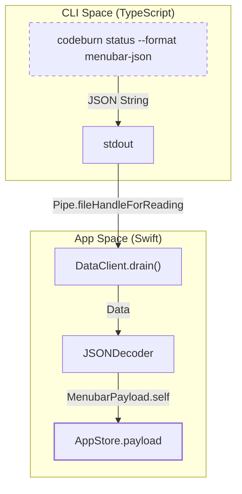
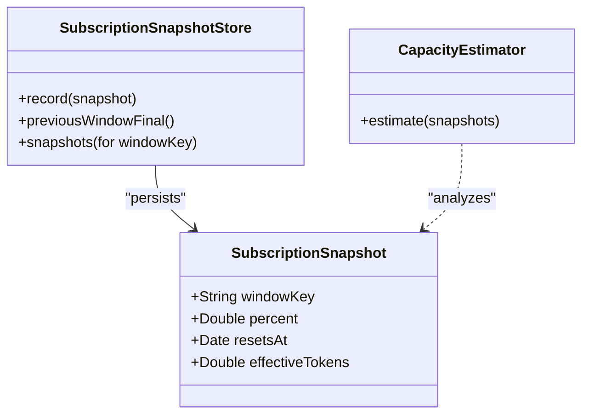

# 데이터 계층과 구독 통합

관련 소스 파일

다음 파일들은 이 위키 페이지를 생성하기 위한 컨텍스트로 사용되었습니다.

- [mac/Sources/CodeBurnMenubar/CodeBurnApp.swift](mac/Sources/CodeBurnMenubar/CodeBurnApp.swift)
- [mac/Sources/CodeBurnMenubar/Data/DataClient.swift](mac/Sources/CodeBurnMenubar/Data/DataClient.swift)
- [mac/Sources/CodeBurnMenubar/Data/MenubarPayload.swift](mac/Sources/CodeBurnMenubar/Data/MenubarPayload.swift)
- [mac/Sources/CodeBurnMenubar/Data/SubscriptionClient.swift](mac/Sources/CodeBurnMenubar/Data/SubscriptionClient.swift)
- [mac/Sources/CodeBurnMenubar/Data/SubscriptionSnapshotStore.swift](mac/Sources/CodeBurnMenubar/Data/SubscriptionSnapshotStore.swift)
- [mac/Sources/CodeBurnMenubar/Data/SubscriptionUsage.swift](mac/Sources/CodeBurnMenubar/Data/SubscriptionUsage.swift)
- [mac/Sources/CodeBurnMenubar/Data/UpdateChecker.swift](mac/Sources/CodeBurnMenubar/Data/UpdateChecker.swift)
- [mac/Sources/CodeBurnMenubar/Security/CodeburnCLI.swift](mac/Sources/CodeBurnMenubar/Security/CodeburnCLI.swift)
- [mac/Sources/CodeBurnMenubar/Security/SafeFile.swift](mac/Sources/CodeBurnMenubar/Security/SafeFile.swift)
- [mac/Sources/CodeBurnMenubar/Views/MenuBarContent.swift](mac/Sources/CodeBurnMenubar/Views/MenuBarContent.swift)
- [mac/Tests/CodeBurnMenubarTests/CapacityEstimatorTests.swift](mac/Tests/CodeBurnMenubarTests/CapacityEstimatorTests.swift)

CodeBurn macOS 메뉴 막대 애플리케이션은 TypeScript 기반 CLI와 네이티브 Swift 환경 사이의 간극을 연결하기 위해 특화된 데이터 계층에 의존합니다. 이 계층은 고빈도 CLI 호출을 처리하고, Claude의 OAuth 기반 구독 데이터를 관리하며, 토큰 한도를 추적하기 위한 역공학된 capacity 추정 엔진을 구현합니다.

## DataClient: CLI 호출 브리지

`DataClient`는 사용량 지표를 가져오기 위해 `codeburn` CLI를 실행하는 Swift 유틸리티입니다. 메뉴 막대 UI에 최적화된 구조화 payload를 얻기 위해 특히 `--format menubar-json` 플래그와 함께 `status` 명령을 호출합니다 [mac/Sources/CodeBurnMenubar/Data/DataClient.swift:22-28]().

### 실행과 안전성
안정성을 보장하고 리소스 누수를 방지하기 위해 `DataClient`는 여러 안전 메커니즘을 구현합니다.
*   **직접 호출**: injection 위험을 피하기 위해 shell 해석 대신 `CodeburnCLI.makeProcess`를 통해 `argv`를 직접 사용합니다 [mac/Sources/CodeBurnMenubar/Security/CodeburnCLI.swift:3-6]().
*   **안전한 인자**: `CodeburnCLI`는 shell-injection 공격을 방지하기 위해 모든 바이너리 경로를 `safeArgPattern`과 대조해 검증합니다 [mac/Sources/CodeBurnMenubar/Security/CodeburnCLI.swift:11-30]().
*   **동시 Drain**: 자식 프로세스가 가득 찬 pipe buffer에서 block될 때 deadlock이 발생하지 않도록 `drain` 헬퍼를 사용해 `stdout`과 `stderr` pipe를 동시에 비웁니다 [mac/Sources/CodeBurnMenubar/Data/DataClient.swift:64-67]().
*   **리소스 한계**: 20MB payload 제한(`maxPayloadBytes`)과 45초 wall-clock timeout을 강제합니다 [mac/Sources/CodeBurnMenubar/Data/DataClient.swift:7-9]().

### 데이터 흐름: CLI에서 Swift까지
다음 다이어그램은 원시 CLI 출력이 네이티브 Swift 모델로 변환되는 방식을 보여줍니다.

**CLI 데이터 수집 파이프라인**

출처: [mac/Sources/CodeBurnMenubar/Data/DataClient.swift:22-42](), [mac/Sources/CodeBurnMenubar/Security/CodeburnCLI.swift:35-50]()

## MenubarPayload 스키마

`MenubarPayload`는 프로세스 간 통신에 사용되는 표준 데이터 구조입니다. 비용, 활동 범주, 최적화 발견 사항을 포함하여 특정 기간(예: "Today", "7 Days")에 대한 요약 보기를 제공합니다 [mac/Sources/CodeBurnMenubar/Data/MenubarPayload.swift:5-10]().

| 컴포넌트 | 설명 | 핵심 코드 엔터티 |
| :--- | :--- | :--- |
| **Current** | 활성 기간의 지표입니다(비용, 세션, provider). | `CurrentBlock` [mac/Sources/CodeBurnMenubar/Data/MenubarPayload.swift:61-73]() |
| **Optimize** | 잠재 절감액과 감지된 상위 발견 사항의 요약입니다. | `OptimizeBlock` [mac/Sources/CodeBurnMenubar/Data/MenubarPayload.swift:88-92]() |
| **History** | sparkline과 heatmap을 위한 일별 사용량 rolling window입니다. | `HistoryBlock` [mac/Sources/CodeBurnMenubar/Data/MenubarPayload.swift:12-14]() |

### Effective Token 계산
Claude 구독은 서로 다른 토큰 유형에 복잡한 가중치를 사용하므로, 메뉴 막대 앱은 Anthropic의 가격 비율과 맞추기 위해 `effectiveTokens`를 계산합니다.
`effectiveTokens = input + (5.0 * output) + cacheWrite + (0.1 * cacheRead)` [mac/Sources/CodeBurnMenubar/Data/MenubarPayload.swift:38-40]().

출처: [mac/Sources/CodeBurnMenubar/Data/MenubarPayload.swift:5-10](), [mac/Sources/CodeBurnMenubar/Data/MenubarPayload.swift:38-41]()

## 구독 통합(Claude OAuth)

`SubscriptionClient`는 OAuth credentials를 읽고 Anthropic API에서 사용량 데이터를 가져와 Claude 구독 계층과의 통합을 관리합니다.

### Credential 처리
클라이언트는 두 위치에서 credentials 로드를 시도합니다.
1.  **파일 시스템**: `~/.claude/.credentials.json` [mac/Sources/CodeBurnMenubar/Data/SubscriptionClient.swift:4-5]().
2.  **macOS Keychain**: 서비스 이름 `Claude Code-credentials` [mac/Sources/CodeBurnMenubar/Data/SubscriptionClient.swift:5-6]().

CLI의 keychain writer는 종종 line-wrap과 제어 문자를 삽입하므로, `SubscriptionClient`에는 JSON 디코딩 전에 정규식을 사용해 토큰에서 줄바꿈과 앞쪽 공백을 제거하는 `sanitizeKeychainData` 함수가 포함되어 있습니다 [mac/Sources/CodeBurnMenubar/Data/SubscriptionClient.swift:93-103]().

### 사용량 가져오기와 Tier
클라이언트는 5시간 rolling limit과 Opus 또는 Sonnet 같은 특정 모델의 7일 limit 등 여러 window의 사용률 백분율을 추적합니다 [mac/Sources/CodeBurnMenubar/Data/SubscriptionUsage.swift:24-34](). 원시 tier 문자열을 내부 `Tier` enum(`pro`, `max5x`, `team` 등)에 매핑하여 UI 로직을 구동합니다 [mac/Sources/CodeBurnMenubar/Data/SubscriptionUsage.swift:36-45]().

출처: [mac/Sources/CodeBurnMenubar/Data/SubscriptionClient.swift:33-49](), [mac/Sources/CodeBurnMenubar/Data/SubscriptionUsage.swift:3-22]()

## Capacity 추정

Claude의 API는 사용량을 백분율(예: "한도의 45% 사용")로만 제공하므로, `CapacityEstimator`는 로컬 로그의 `effectiveTokens`를 구독 서비스가 보고한 백분율과 상관시켜 절대 토큰 한도를 역공학합니다.

### 추정 로직
1.  **Snapshot 수집**: 앱은 해당 시점의 백분율과 계산된 `effectiveTokens`를 포함하는 `SubscriptionSnapshot` 객체를 기록합니다 [mac/Sources/CodeBurnMenubar/Data/SubscriptionSnapshotStore.swift:6-12]().
2.  **선형 회귀**: 이 snapshot들에 대해 회귀를 수행하여 100% 절편을 찾습니다.
3.  **Gating**: 수학적 유의성을 보장하기 위해 snapshot이 최소 5개 이상이고 백분율 범위가 최소 15포인트 이상일 때만 추정치를 생성합니다 [mac/Tests/CodeBurnMenubarTests/CapacityEstimatorTests.swift:23-39]().
4.  **최신성 가중치**: 구독 tier 변경을 반영하기 위해 최신 snapshot에 더 높은 가중치를 부여합니다(일반적으로 30일 half-life) [mac/Tests/CodeBurnMenubarTests/CapacityEstimatorTests.swift:105-111]().

**Capacity 추정 데이터 관계**

출처: [mac/Sources/CodeBurnMenubar/Data/SubscriptionSnapshotStore.swift:6-12](), [mac/Tests/CodeBurnMenubarTests/CapacityEstimatorTests.swift:15-19]()

## SubscriptionSnapshotStore

`SubscriptionSnapshotStore`는 사용률 reading을 위한 영구 저장소를 제공합니다. 사용량 window가 reset될 때(예: 새로운 7일 주기가 시작될 때), 앱이 이전 주기의 "final" reading을 계속 참조할 수 있도록 보장합니다 [mac/Sources/CodeBurnMenubar/Data/SubscriptionSnapshotStore.swift:56-60]().

*   **영속성**: 데이터는 원자적 쓰기를 위해 `SafeFile`을 사용하여 `~/.cache/codeburn/subscription-snapshots.json`에 저장됩니다 [mac/Sources/CodeBurnMenubar/Data/SubscriptionSnapshotStore.swift:14-23]().
*   **보안**: `SafeFile`은 symlink를 따라가지 않으며, clobbering 공격을 방지하기 위해 `O_NOFOLLOW`와 `rename`을 사용합니다 [mac/Sources/CodeBurnMenubar/Security/SafeFile.swift:5-18]().
*   **동시성**: 쓰기 중 race condition을 방지하기 위해 `SnapshotLock` actor를 통해 접근이 직렬화됩니다 [mac/Sources/CodeBurnMenubar/Data/SubscriptionSnapshotStore.swift:26-29]().
*   **멱등성**: 같은 reset window에 여러 snapshot이 기록되면, "peak" 사용량을 보존하기 위해 가장 높은 백분율을 가진 snapshot만 유지됩니다 [mac/Sources/CodeBurnMenubar/Data/SubscriptionSnapshotStore.swift:35-43]().

출처: [mac/Sources/CodeBurnMenubar/Data/SubscriptionSnapshotStore.swift:31-54](), [mac/Sources/CodeBurnMenubar/Security/SafeFile.swift:26-66]()

## UpdateChecker

`UpdateChecker`는 메뉴 막대 앱의 새 버전을 감지하기 위해 GitHub Releases API를 polling하는 `@Observable` 클래스입니다 [mac/Sources/CodeBurnMenubar/Data/UpdateChecker.swift:4-11]().

*   **버전 비교**: GitHub의 `latestVersion`이 `CFBundleShortVersionString`의 `currentVersion`보다 최신인지 확인하기 위해 `.orderedDescending` numeric comparison을 사용합니다 [mac/Sources/CodeBurnMenubar/Data/UpdateChecker.swift:16-27]().
*   **업데이트 실행**: 트리거되면 실제 다운로드와 설치를 수행하기 위해 `CodeburnCLI`를 통해 `codeburn menubar --force`를 호출합니다 [mac/Sources/CodeBurnMenubar/Data/UpdateChecker.swift:64-72]().

출처: [mac/Sources/CodeBurnMenubar/Data/UpdateChecker.swift:11-37](), [mac/Sources/CodeBurnMenubar/Data/UpdateChecker.swift:64-93]()
