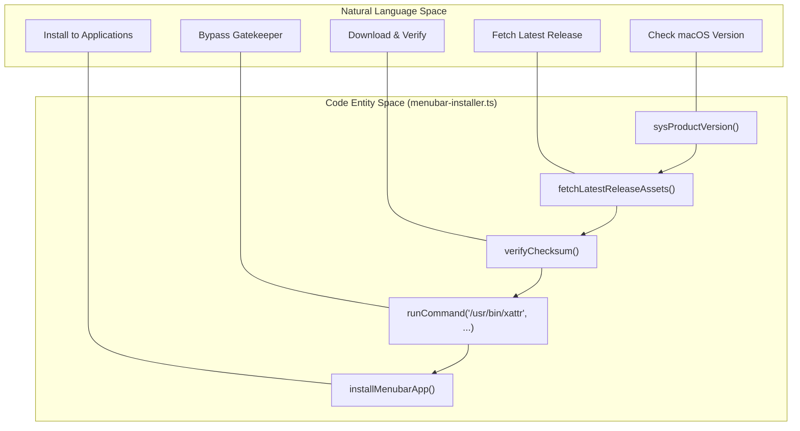
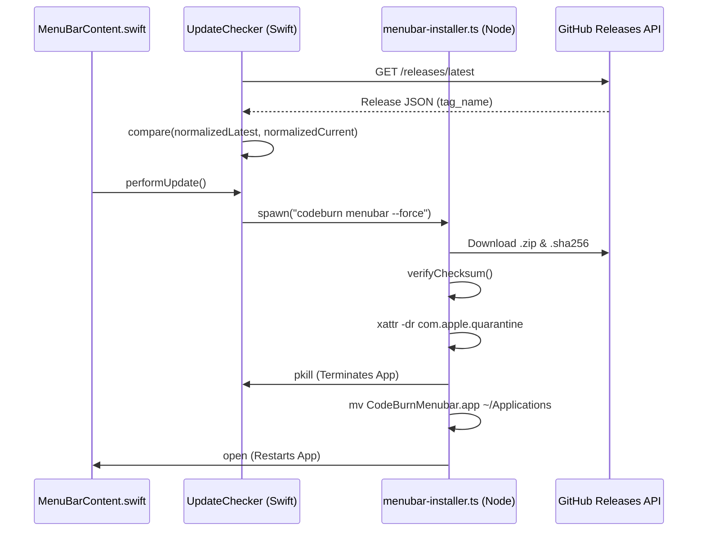

# 설치와 업데이트

관련 소스 파일

다음 파일들은 이 위키 페이지를 생성하기 위한 컨텍스트로 사용되었습니다.

- [.github/workflows/release-menubar.yml](.github/workflows/release-menubar.yml)
- [SECURITY.md](SECURITY.md)
- [mac/.gitignore](mac/.gitignore)
- [mac/Package.swift](mac/Package.swift)
- [mac/README.md](mac/README.md)
- [mac/Scripts/package-app.sh](mac/Scripts/package-app.sh)
- [mac/Sources/CodeBurnMenubar/Data/CapacityEstimator.swift](mac/Sources/CodeBurnMenubar/Data/CapacityEstimator.swift)
- [mac/Sources/CodeBurnMenubar/Data/UpdateChecker.swift](mac/Sources/CodeBurnMenubar/Data/UpdateChecker.swift)
- [src/menubar-installer.ts](src/menubar-installer.ts)

CodeBurn 생태계는 CLI와 macOS 메뉴 막대 애플리케이션 모두에 대해 매끄러운 설치 및 업데이트 경험을 제공합니다. 이 페이지는 `codeburn menubar` 설치 프로그램 뒤의 자동화, 앱 내 업데이트 확인 메커니즘, 네이티브 애플리케이션을 패키징하는 데 사용되는 빌드 파이프라인을 자세히 설명합니다.

## macOS 메뉴 막대 설치 프로그램

메뉴 막대 애플리케이션은 일반적으로 CLI의 `codeburn menubar` 명령을 사용해 설치하고 관리합니다. 이 로직은 `menubar-installer.ts`에 구현되어 있습니다.

### 플랫폼 검증
설치 프로그램은 진행하기 전에 호스트 환경을 검증합니다.
- **OS 확인**: `darwin`(macOS)만 지원됩니다 [src/menubar-installer.ts:40-42]().
- **버전 확인**: macOS 14.0(Sonoma) 이상이 필요합니다 [src/menubar-installer.ts:18-18](). 현재 OS 버전을 확인하기 위해 `/usr/bin/sw_vers -productVersion`을 사용합니다 [src/menubar-installer.ts:50-61]().

### 설치 흐름
`installMenubarApp` 함수는 생명주기를 오케스트레이션합니다 [src/menubar-installer.ts:147-195]().

1.  **발견**: GitHub Releases API(`/releases/latest`)를 쿼리하여 `CodeBurnMenubar-*.zip` 패턴과 일치하는 최신 `.zip` asset을 찾습니다 [src/menubar-installer.ts:63-83]().
2.  **검증**: `.sha256` asset이 발견되면 설치 프로그램은 진행하기 전에 `verifyChecksum`을 사용해 archive 무결성을 검증합니다 [src/menubar-installer.ts:85-105](), [src/menubar-installer.ts:170-175]().
3.  **스테이징**: zip은 `mkdtemp`로 생성된 임시 디렉터리에 다운로드됩니다 [src/menubar-installer.ts:164-168]().
4.  **Quarantine 제거**: 압축 해제 후 설치 프로그램은 `.app` bundle에 대해 `/usr/bin/xattr -dr com.apple.quarantine`을 실행합니다 [src/menubar-installer.ts:188-188](). 이는 Mac App Store 외부에서 다운로드한 바이너리에서 흔히 발생하는 첫 실행 시 Gatekeeper 차단을 방지합니다.
5.  **배치**: 앱은 `~/Applications`로 이동됩니다 [src/menubar-installer.ts:150-151](). 기존 버전이 실행 중이면 설치 프로그램은 bundle을 교체하기 전에 `pkill`을 사용해 프로세스를 종료합니다 [src/menubar-installer.ts:139-145]().
6.  **실행**: 마지막으로 `/usr/bin/open`을 사용해 앱을 실행합니다 [src/menubar-installer.ts:156-156]().

### 설치 프로그램 로직 흐름
다음 다이어그램은 자연어 설치 단계를 `menubar-installer.ts`의 특정 코드 엔터티에 매핑합니다.

"설치 데이터 흐름"

출처: [src/menubar-installer.ts:39-195]()

## 앱 내 업데이트 확인기

설치된 후 메뉴 막대 앱은 `UpdateChecker` 클래스를 사용해 독립적으로 업데이트를 모니터링합니다.

### 버전 비교
앱은 로컬 `CFBundleShortVersionString`을 최신 GitHub release에서 발견한 버전 태그와 비교합니다 [mac/Sources/CodeBurnMenubar/Data/UpdateChecker.swift:16-27]().
- **간격**: API rate limit을 피하기 위해 48시간마다 확인을 수행합니다 [mac/Sources/CodeBurnMenubar/Data/UpdateChecker.swift:5-5]().
- **영속성**: 마지막 확인 타임스탬프와 최신으로 알려진 버전은 `UserDefaults`에 저장됩니다 [mac/Sources/CodeBurnMenubar/Data/UpdateChecker.swift:57-58]().

### 업데이트 수행
사용자가 업데이트를 트리거하면 앱은 `performUpdate()`를 호출합니다 [mac/Sources/CodeBurnMenubar/Data/UpdateChecker.swift:64-93]().
1.  `CodeburnCLI.makeProcess`를 통해 `codeburn` CLI의 자식 프로세스를 생성합니다 [mac/Sources/CodeBurnMenubar/Data/UpdateChecker.swift:68-68]().
2.  하위 명령 `menubar --force`를 실행합니다 [mac/Sources/CodeBurnMenubar/Data/UpdateChecker.swift:68-68]().
3.  이는 CLI의 `installMenubarApp` 로직을 다시 트리거하여 새 버전을 다운로드하고, 현재 binary를 교체하며, 앱을 재시작합니다.

### 업데이트 시스템 아키텍처
이 다이어그램은 Swift `UpdateChecker`가 Node.js CLI와 상호작용하여 제자리 업그레이드를 수행하는 방식을 보여줍니다.

"업데이트 메커니즘 상호작용"

출처: [mac/Sources/CodeBurnMenubar/Data/UpdateChecker.swift:11-93](), [src/menubar-installer.ts:147-195]()

## 빌드와 패키징 파이프라인

프로젝트는 배포 가능한 bundle을 만들기 위해 사용자 정의 셸 스크립트 `package-app.sh`를 사용합니다. 이 스크립트는 `.github/workflows/release-menubar.yml` workflow에서 사용됩니다.

### 패키징 과정
`package-app.sh` 스크립트는 다음 단계를 수행합니다 [mac/Scripts/package-app.sh:11-110]().
1.  **Universal Binary**: `swift build -c release`를 사용해 `arm64`와 `x86_64` 아키텍처 모두에 대해 Swift 코드를 컴파일합니다 [mac/Scripts/package-app.sh:32-32]().
2.  **Bundle Assembly**: `.app` 폴더 구조(`Contents/MacOS`, `Contents/Resources`)를 만들고 제공된 버전으로 표준 `Info.plist`를 생성합니다 [mac/Scripts/package-app.sh:41-82]().
3.  **Ad-hoc Signing**: `codesign --force --sign -`를 실행합니다 [mac/Scripts/package-app.sh:93-93](). 이는 macOS 14+ 요구 사항에 맞게 bundle의 내부 일관성을 보장하고 Gatekeeper edge case를 방지합니다 [mac/Scripts/package-app.sh:88-91]().
4.  **Compression**: macOS 메타데이터와 resource fork를 보존하는 `.zip` archive를 만들기 위해 `/usr/bin/ditto`를 사용합니다 [mac/Scripts/package-app.sh:99-99]().
5.  **Checksum Generation**: 설치 프로그램의 검증을 위해 최종 zip의 SHA-256 hash를 계산합니다 [mac/Scripts/package-app.sh:104-104]().

### CI/CD 통합
GitHub Action `release-menubar.yml`은 `mac-v*`와 일치하는 tag에서 트리거됩니다 [.github/workflows/release-menubar.yml:8-10](). packaging script를 실행하고 결과 zip과 checksum을 GitHub Release에 업로드합니다 [.github/workflows/release-menubar.yml:68-70]().

| 컴포넌트 | 책임 | 파일 |
| :--- | :--- | :--- |
| **Installer** | 앱을 다운로드하고, checksum을 검증하고, quarantine을 해제하고, 이동합니다 | [src/menubar-installer.ts]() |
| **UpdateChecker** | GitHub API를 polling하고 CLI `--force` 업데이트를 호출합니다 | [mac/Sources/CodeBurnMenubar/Data/UpdateChecker.swift]() |
| **Package Script** | universal binary를 컴파일하고, 서명하고, checksum을 생성합니다 | [mac/Scripts/package-app.sh]() |
| **Release Workflow** | git tag에서 빌드와 asset 업로드를 자동화합니다 | [.github/workflows/release-menubar.yml]() |

출처: [mac/Scripts/package-app.sh:1-110](), [.github/workflows/release-menubar.yml:1-72](), [mac/Sources/CodeBurnMenubar/Data/UpdateChecker.swift:1-104](), [src/menubar-installer.ts:1-195]()
