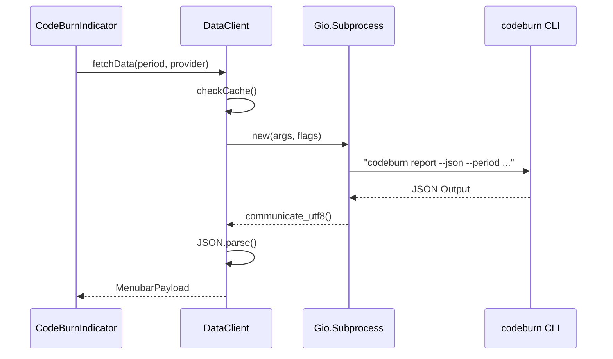

# GNOME Shell 확장

<details>
<summary>관련 소스 파일</summary>

다음 파일들은 이 위키 페이지를 생성하기 위한 컨텍스트로 사용되었습니다.

- [gnome/README.md](gnome/README.md)
- [gnome/extension.js](gnome/extension.js)
- [gnome/icons/codeburn-symbolic.svg](gnome/icons/codeburn-symbolic.svg)
- [gnome/indicator.js](gnome/indicator.js)
- [gnome/install.sh](gnome/install.sh)

</details>


CodeBurn GNOME Shell 확장은 macOS 메뉴 막대 애플리케이션에 대응하는 Linux 네이티브 기능을 제공하여, 사용자가 GNOME 상태 영역에서 AI 코딩 비용과 토큰 사용량을 직접 모니터링할 수 있게 합니다. `codeburn` CLI의 그래픽 frontend로 동작하며, GNOME Shell의 `St` 및 `Clutter` toolkit을 사용해 데이터를 주기적으로 polling하고 대화형 차트와 인사이트를 렌더링합니다.

### 시스템 개요

확장은 생명주기를 관리하는 코어 진입점, UI와 사용자 상호작용을 처리하는 indicator 클래스, 시스템 CLI와 인터페이스하는 data client로 구성됩니다.

#### 확장 컴포넌트 관계
이 다이어그램은 상위 수준 논리 컴포넌트를 특정 구현 클래스와 파일에 매핑합니다.

```mermaid
graph TD
    subgraph "GNOME Shell Environment"
        [CodeBurnExtension] -->|instantiates| [CodeBurnIndicator]
        [CodeBurnIndicator] -->|uses| [DataClient]
    end

    subgraph "External"
        [DataClient] -->|executes| [codeburn_CLI_binary]
        [CodeBurnIndicator] -->|fetches| [Frankfurter_API]
    end

    style [CodeBurnExtension] stroke-width:2px
    style [CodeBurnIndicator] stroke-width:2px
    style [DataClient] stroke-width:2px
```
**출처:** [gnome/extension.js:5-17](), [gnome/indicator.js:103-141](), [gnome/dataClient.js:1-10]()

---

### 확장 아키텍처와 Indicator UI

확장의 진입점은 GNOME 상태 영역에 indicator를 추가하고 제거하는 과정을 관리하는 `CodeBurnExtension` 클래스입니다 [gnome/extension.js:5-17](). 기본 UI 로직은 `PanelMenu.Button`의 하위 클래스인 `CodeBurnIndicator`에 있습니다 [gnome/indicator.js:103-104]().

UI는 GNOME의 `St`(Shell Toolkit)와 `Clutter` actor를 사용해 빌드됩니다. flame 아이콘과 현재 비용을 표시하는 panel button [gnome/indicator.js:145-161]()과 다음을 포함하는 복합 popup menu를 제공합니다.
*   **Provider Tabs:** Claude, Cursor, Copilot 같은 특정 AI 도구별로 데이터를 필터링합니다 [gnome/indicator.js:32-45]().
*   **Period Tabs:** 시간 범위(Today, 7 Days, Month 등)를 전환합니다 [gnome/indicator.js:16-22]().
*   **Insight Pills:** Activity, Trends, Forecasts 같은 여러 데이터 시각화 사이를 전환합니다 [gnome/indicator.js:24-30]().
*   **Visualizations:** 토큰 사용량을 위한 사용자 정의 막대 차트와 추세 분석을 위한 sparkline입니다.

UI 렌더링과 widget 계층에 대한 자세한 내용은 [확장 아키텍처와 Indicator UI](#6.1)를 참조하세요.

**출처:** [gnome/indicator.js:103-200](), [gnome/extension.js:8-11]()

---

### Data Client와 구성

CodeBurn 코어 로직과의 통신은 `DataClient` 클래스가 처리합니다. Swift의 `Process`를 사용하는 macOS 앱과 달리, GNOME 확장은 `codeburn report --json` 같은 CLI 명령을 실행하기 위해 `Gio.Subprocess`를 사용합니다 [gnome/dataClient.js:1-20]().

#### 데이터 흐름과 명령 실행
이 다이어그램은 `DataClient`가 GNOME Shell(GJS) 환경을 Node.js CLI에 연결하는 방식을 보여줍니다.


**출처:** [gnome/indicator.js:320-350](), [gnome/dataClient.js:30-60]()

확장은 구성 영속성을 위해 `GSettings`를 사용하여 사용자가 refresh 간격을 사용자 지정하고, "Compact Mode"(아이콘만 표시)를 토글하며, 예산 알림을 설정할 수 있게 합니다 [gnome/README.md:41-49](). 설치는 schema를 컴파일하고 파일을 로컬 extensions 디렉터리로 이동하는 shell script를 통해 자동화됩니다 [gnome/install.sh:1-33]().

subprocess 보안, 캐싱, GSettings 통합에 대한 자세한 내용은 [GNOME Data Client와 구성](#6.2)을 참조하세요.

**출처:** [gnome/dataClient.js:1-80](), [gnome/install.sh:1-39](), [gnome/README.md:41-49]()

---

### 설치와 설정

확장을 사용하려면 CodeBurn CLI가 `npm`을 통해 전역 설치되어 있어야 합니다.

| 요구 사항 | 설명 |
| :--- | :--- |
| **GNOME Shell** | 버전 45 이상(ESM 지원) |
| **CodeBurn CLI** | 시스템 PATH에서 사용할 수 있거나 수동으로 구성되어야 함 |
| **Build Tools** | 구성 지원을 위한 `glib-compile-schemas` |

**빠른 설치:**
1.  `gnome/` 디렉터리로 이동합니다.
2.  `./install.sh`를 실행합니다 [gnome/install.sh:1-33]().
3.  GNOME Shell을 재시작하거나 로그아웃/로그인합니다.
4.  `gnome-extensions enable codeburn@codeburn.dev`로 활성화합니다.

**출처:** [gnome/README.md:5-27](), [gnome/install.sh:1-33]()
