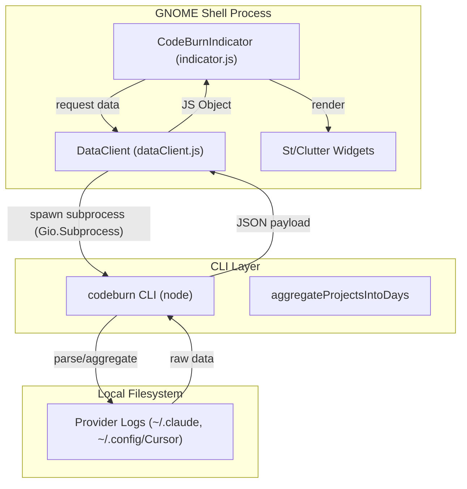
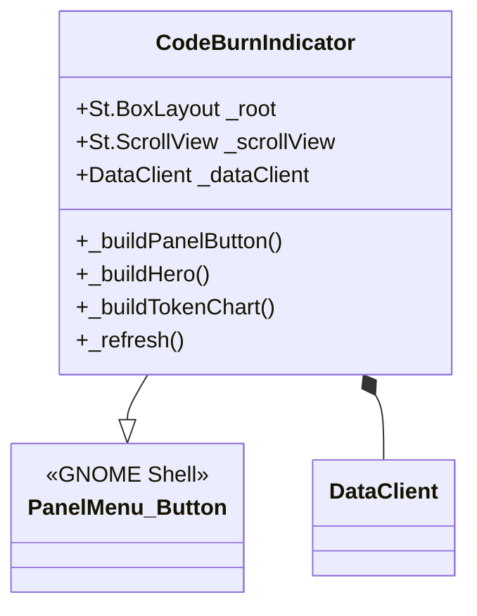

# 확장 아키텍처와 Indicator UI

관련 소스 파일

다음 파일들은 이 위키 페이지를 생성하기 위한 컨텍스트로 사용되었습니다.

- [gnome/extension.js](gnome/extension.js)
- [gnome/indicator.js](gnome/indicator.js)
- [gnome/metadata.json](gnome/metadata.json)
- [gnome/stylesheet.css](gnome/stylesheet.css)

CodeBurn GNOME 확장은 GNOME Shell 상단 패널에서 AI 코딩 어시스턴트 비용과 토큰 사용량을 직접 모니터링하기 위한 Linux 네이티브 인터페이스를 제공합니다. GNOME JavaScript(GJS) 환경을 사용해 빌드되었으며, UI 렌더링에는 `St`(Shell Toolkit)와 `Clutter` 라이브러리를 활용합니다.

## 코어 아키텍처

확장은 세 가지 주요 컴포넌트로 구조화됩니다. `CodeBurnExtension` 생명주기 관리자, `CodeBurnIndicator` UI 컨트롤러, CLI 통신을 위한 `DataClient`입니다.

### 확장 생명주기
`CodeBurnExtension` 클래스는 표준 GNOME 확장 생명주기 훅을 처리합니다. 활성화되면 indicator를 인스턴스화하고 시스템 상태 영역에 추가합니다.

| 클래스 | 역할 | 핵심 메서드 |
| :--- | :--- | :--- |
| `CodeBurnExtension` | 진입점과 생명주기 관리입니다. | `enable()`, `disable()` |
| `CodeBurnIndicator` | 기본 UI 컴포넌트이며, 상태와 렌더링을 관리합니다. | `_init()`, `_refresh()`, `_buildPopup()` |
| `DataClient` | `codeburn` CLI로 이어지는 비동기 브리지입니다. | `getPeriodData()`, `getSummary()` |

### 데이터 흐름 다이어그램
다음 다이어그램은 로컬 provider 로그(예: Claude, Cursor)에서 CLI를 거쳐 GNOME UI로 데이터가 흐르는 방식을 보여줍니다.

**GNOME 확장 데이터 파이프라인**

**출처:**
- `gnome/extension.js:5-17`
- `gnome/indicator.js:103-141`
- `gnome/dataClient.js`(`gnome/indicator.js:9`에서 참조)

## Indicator UI 컴포넌트

`CodeBurnIndicator`는 `PanelMenu.Button`을 확장하며, 두 가지 주요 부분으로 구성됩니다. 상단 막대에 보이는 Panel Button과 대시보드인 Popup Menu입니다.

### Panel Button
panel button은 "flame" 아이콘(`🔥`)과 요약 라벨을 표시합니다.
- **Flame Icon:** `codeburn-flame` style class가 적용된 `St.Label`입니다 [gnome/indicator.js:147-151]().
- **Label:** 현재 비용 또는 상태를 표시합니다. 표시 여부는 `compact-mode` 설정으로 전환됩니다 [gnome/indicator.js:152-159]().

### Popup Dashboard
대시보드는 `St.BoxLayout` 및 `St.ScrollView` 컨테이너의 복잡한 계층입니다. 여러 기능 영역으로 구성됩니다.

1.  **Agent Tabs:** provider 배지(Claude, Cursor 등)의 가로 스크롤 행입니다 [gnome/indicator.js:342-367]().
2.  **Hero Section:** 선택한 기간의 기본 비용을 `codeburn-hero-amount` 스타일을 사용해 큰 텍스트로 표시합니다 [gnome/indicator.js:401-419]().
3.  **Period Tabs:** "Today", "7 Days", "30 Days", "Month", "6 Months" 사이를 전환합니다 [gnome/indicator.js:16-22](), [gnome/indicator.js:421-438]().
4.  **Insight Pills:** "Activity", "Trend", "Stats" 같은 여러 데이터 보기 사이를 전환합니다 [gnome/indicator.js:24-30](), [gnome/indicator.js:440-457]().
5.  **Token Chart:** 사용량의 histogram 또는 sparkline 시각화입니다 [gnome/indicator.js:459-480]().

**UI 클래스 연결**

**출처:**
- `gnome/indicator.js:104-141`
- `gnome/indicator.js:165-200`
- `gnome/stylesheet.css:1-135`

## 렌더링과 시각 요소

확장은 시각 요소를 위해 CSS와 명령형 widget 구성을 함께 사용합니다.

### 막대 차트와 Sparkline
여러 프로젝트의 사용량 강도는 가로 막대 차트를 사용해 렌더링됩니다.
- **Track:** `codeburn-bar-track`이 적용된 `St.BoxLayout`입니다(width: 240px) [gnome/indicator.js:14](), [gnome/indicator.js:655-659]().
- **Fill:** `codeburn-bar-fill`이 적용된 자식 `St.Widget`이며, 너비는 데이터셋의 최댓값 대비 백분율로 계산됩니다 [gnome/indicator.js:660-664]().

### 테마
확장은 적절한 light/dark theme class를 적용하기 위해 GNOME color scheme 설정(`org.gnome.desktop.interface color-scheme`)을 모니터링합니다.
- **Signal Connection:** `_themeSettings.connect('changed::color-scheme', ...)` [gnome/indicator.js:131-133]().
- **Application:** `_applyThemeClass()` 메서드는 root element에서 `codeburn-light` class를 토글합니다 [gnome/indicator.js:317-325]().

### 형식 지정 헬퍼
indicator에는 데이터 표시를 위한 여러 유틸리티 함수가 포함되어 있습니다.
- `formatCost`: 통화 기호, FX rate, 큰 값에 대한 "k" 접미사를 처리합니다 [gnome/indicator.js:75-83]().
- `formatTokensCompact`: 원시 숫자를 B/M/k 표기법으로 변환합니다 [gnome/indicator.js:85-91]().
- `formatTime`: "Last Updated" footer를 위한 상대 시간 문자열(예: "5m ago")을 생성합니다 [gnome/indicator.js:93-101]().

**출처:**
- `gnome/indicator.js:75-101`
- `gnome/indicator.js:650-675`
- `gnome/stylesheet.css:197-207`

## 상태와 설정 통합

확장 상태는 GNOME GSettings와 동기화됩니다. 주요 설정은 다음과 같습니다.
- `codeburn-path`: CLI 실행 파일 경로 [gnome/indicator.js:110]().
- `default-period`: 로드 시 표시되는 초기 시간 범위 [gnome/indicator.js:113]().
- `compact-mode`: panel label 표시 여부를 전환합니다 [gnome/indicator.js:159]().
- `refresh-interval`: `_startRefreshLoop()` 빈도를 제어합니다 [gnome/indicator.js:139]().

**출처:**
- `gnome/indicator.js:109-120`
- `gnome/metadata.json:7`
