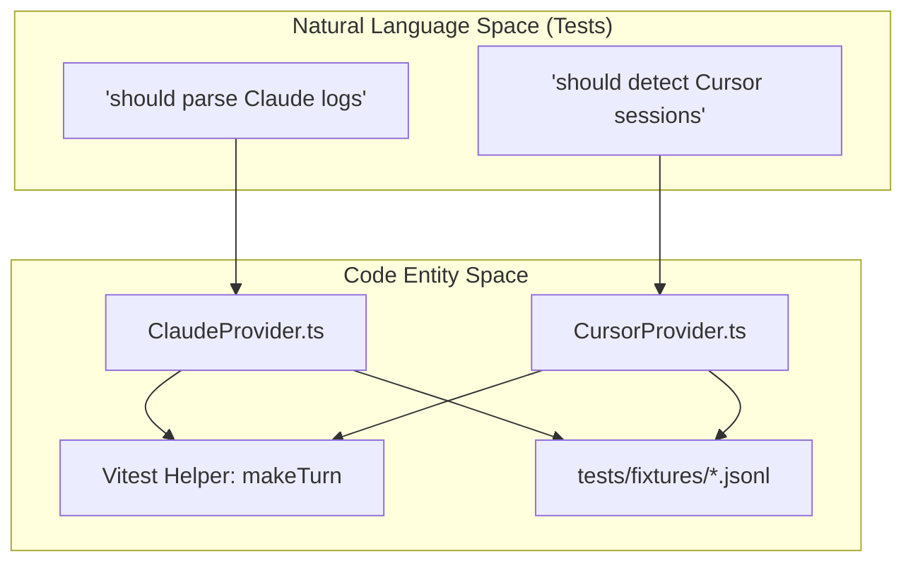
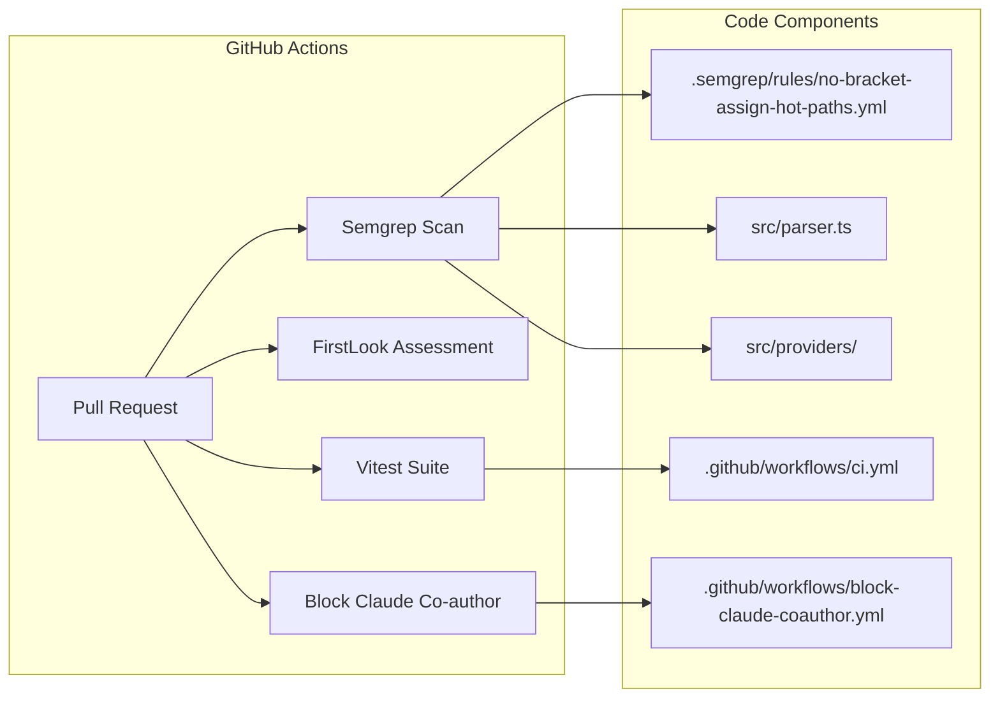

# 테스트와 보안

관련 소스 파일

다음 파일들은 이 위키 페이지를 생성하기 위한 컨텍스트로 사용되었습니다.

- [.github/workflows/block-claude-coauthor.yml](.github/workflows/block-claude-coauthor.yml)
- [.github/workflows/ci.yml](.github/workflows/ci.yml)
- [.github/workflows/firstlook.yml](.github/workflows/firstlook.yml)
- [.semgrep/rules/no-bracket-assign-hot-paths.yml](.semgrep/rules/no-bracket-assign-hot-paths.yml)

CodeBurn 프로젝트는 품질 보증과 시스템 강화를 위해 다계층 접근 방식을 구현합니다. 이 도구는 민감한 로컬 LLM 로그를 처리하고 macOS 파일 시스템과 상호작용하므로, 인프라는 격리된 통합 테스트와 일반적인 injection 및 pollution 취약점에 대한 defense-in-depth에 초점을 맞춥니다.

## 테스트 인프라

CodeBurn은 TypeScript를 네이티브로 처리하도록 구성된 **Vitest**를 기본 테스트 러너로 사용합니다. 테스트 전략은 격리된 파일 시스템 mock을 사용해 실제 provider 데이터 환경을 시뮬레이션하는 통합 테스트를 강조합니다.

### 구성과 패턴
테스트는 기능 도메인별로 구성되며, 주로 `src/` 디렉터리 구조를 반영합니다.
*   **Provider 테스트**: `tests/providers/`에 있으며, 여러 AI 도구(Claude, Cursor 등)의 파싱 로직을 정적 fixture에 대해 검증합니다.
*   **보안 테스트**: `tests/security/`에 있으며, path traversal이나 잘못된 로그 항목 같은 edge case를 구체적으로 대상으로 합니다.
*   **Fixtures**: `tests/fixtures/` 디렉터리에는 원시 에이전트 로그를 나타내는 샘플 `JSONL` 및 `SQLite` 파일이 포함되어 있습니다.

### 주요 테스트 헬퍼
suite 전반의 일관성을 유지하기 위해 복잡한 데이터 구조를 인스턴스화하는 여러 헬퍼 함수가 사용됩니다.
*   `makeTurn`: 집계 로직 테스트를 위한 mock `ParsedTurn` 객체를 생성합니다.
*   `makeProject`: 다중 세션 그룹화를 테스트하기 위한 mock 프로젝트 컨테이너를 생성합니다.

새 테스트 구현 또는 fake-home 디렉터리 패턴 사용에 대한 자세한 내용은 [테스트 인프라와 패턴](#7.1)을 참조하세요.

### 테스트/코드 관계
다음 다이어그램은 테스트 suite가 코어 파싱 엔진과 상호작용하는 방식을 보여줍니다.

**파싱 엔진 테스트 흐름**

출처: [.github/workflows/ci.yml:1-28](), [tests/providers/]() (암시된 구조).

## 보안 강화

CodeBurn의 보안은 서드파티 AI 에이전트의 신뢰할 수 없거나 잘못된 로그 데이터를 처리하는 동안 사용자의 로컬 환경을 보호하는 데 초점을 맞춥니다.

### Prototype Pollution 방지
코드베이스는 외부 로그에서 파생된 데이터를 저장하는 map 유사 객체에 `Object.create(null)` 사용을 엄격히 강제합니다. 이를 통해 공격자 또는 잘못된 로그가 JavaScript 내장 객체 속성(예: `__proto__`)을 덮어쓰는 것을 방지합니다. 이는 사용자 정의 Semgrep 규칙 `no-bracket-assign-on-literal-object-map`으로 강제됩니다.

### 제한된 리소스 사용
대형 로그 파일을 읽을 때 Denial of Service(DoS)를 방지하기 위해 CodeBurn은 `MAX_SESSION_FILE_BYTES` 제한(128MB로 설정)을 구현합니다. 이를 통해 비대한 세션 파일을 만났을 때 파서가 중단되거나 시스템을 crash시키지 않도록 보장합니다.

### Injection Guard
*   **CSV Injection**: `escCsv` 함수는 스프레드시트 소프트웨어로 데이터를 내보낼 때 formula injection을 방지하기 위해 출력을 정제합니다.
*   **CLI Subprocesses**: Subprocess 호출, 특히 GNOME 확장과 macOS 앱의 호출은 shell 인자가 올바르게 escape되고 command injection 대상이 되지 않도록 `SafeArgPattern`을 사용합니다.

이러한 구현과 이를 강제하는 Semgrep 규칙에 대한 자세한 내용은 [보안 강화](#7.2)를 참조하세요.

출처: [.semgrep/rules/no-bracket-assign-hot-paths.yml:1-23](), [.github/workflows/ci.yml:17-27]().

## CI 파이프라인

프로젝트는 모든 pull request에 대해 품질 검사와 보안 감사를 자동화하기 위해 GitHub Actions를 사용합니다.

### 자동화된 검사
*   **Semgrep**: 전용 job이 `.semgrep/rules/no-bracket-assign-hot-paths.yml`의 구성을 사용하여 `no-bracket-assign-guard`를 실행하고, `src/providers/`와 `src/parser.ts` 같은 hot path의 잠재적 prototype pollution 취약점을 감지합니다.
*   **FirstLook**: `getagentseal/firstlook`을 사용해 자동화된 PR 평가를 제공하고 알려지지 않은 위험을 스캔합니다.
*   **Co-author 차단**: `block-claude-coauthor.yml` workflow는 AI co-author trailer(예: `Co-authored-by: ... claude ...`)가 포함된 PR을 거부하여 contributor guideline을 강제합니다. 이는 프로젝트 licensing과 attribution 무결성을 유지합니다.

**CI 파이프라인 아키텍처**

출처: [.github/workflows/ci.yml:1-28](), [.github/workflows/firstlook.yml:1-24](), [.github/workflows/block-claude-coauthor.yml:1-44](), [.semgrep/rules/no-bracket-assign-hot-paths.yml:1-23]().
