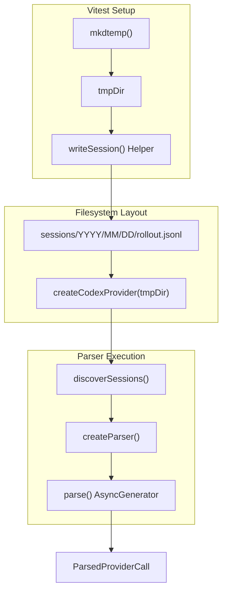
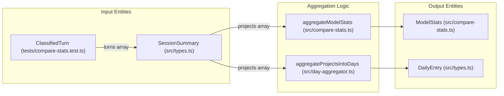

# 테스트 인프라와 패턴

<details>
<summary>관련 소스 파일</summary>

다음 파일들은 이 위키 페이지를 생성하기 위한 컨텍스트로 사용되었습니다.

- [src/codex-cache.ts](src/codex-cache.ts)
- [src/compare-stats.ts](src/compare-stats.ts)
- [src/cursor-cache.ts](src/cursor-cache.ts)
- [src/fs-utils.ts](src/fs-utils.ts)
- [src/providers/codex.ts](src/providers/codex.ts)
- [src/providers/cursor.ts](src/providers/cursor.ts)
- [tests/classifier.test.ts](tests/classifier.test.ts)
- [tests/compare-stats.test.ts](tests/compare-stats.test.ts)
- [tests/dashboard.test.ts](tests/dashboard.test.ts)
- [tests/day-aggregator.test.ts](tests/day-aggregator.test.ts)
- [tests/fs-utils.test.ts](tests/fs-utils.test.ts)
- [tests/models.test.ts](tests/models.test.ts)
- [tests/providers/codex.test.ts](tests/providers/codex.test.ts)
- [tests/providers/cursor.test.ts](tests/providers/cursor.test.ts)

</details>


CodeBurn은 **Vitest**를 기본 테스트 프레임워크로 사용하며, provider 로그 환경과 지표 집계 로직을 높은 충실도로 시뮬레이션하는 데 초점을 맞춥니다. 테스트 suite는 다양한 AI provider 형식 전반에서 비용 계산, 세션 파싱, 최적화 휴리스틱의 정확성을 보장하도록 설계되었습니다.

## 테스트 구성과 파일 구조

테스트 suite는 소스 디렉터리 구조를 반영하도록 구성되며, provider 파싱과 보안을 위한 특화 디렉터리를 둡니다.

| 디렉터리 | 목적 |
| :--- | :--- |
| `tests/` | 집계기, 비용 모델, 유틸리티에 대한 일반 로직 테스트입니다(예: `day-aggregator.test.ts`, `models.test.ts`). |
| `tests/providers/` | Provider별 파싱 테스트입니다(Claude, Codex, Cursor 등). |
| `tests/security/` | Prototype pollution과 CSV injection에 대한 hardening 테스트입니다. |
| `tests/fixtures/` | 재사용 가능한 세션 로그 조각과 mock 파일 시스템 구조입니다. |

**출처:**
- [tests/compare-stats.test.ts:4-6]()
- [tests/providers/codex.test.ts:1-7]()
- [tests/fs-utils.test.ts:6-11]()

## 테스트 패턴

### 1. Fixture 기반 헬퍼 패턴
장황한 수동 객체 생성을 피하기 위해 CodeBurn은 `makeTurn`과 `makeProject` 같은 factory 함수를 사용합니다. 이 헬퍼들은 합리적인 기본값을 가진 `ClassifiedTurn` 및 `ProjectSummary` 객체를 생성하여, 테스트가 `editCost`나 `oneShotTurns` 같은 특정 지표에 집중할 수 있게 합니다.

```typescript
// Example usage in tests/compare-stats.test.ts
const project = makeProject([
  makeTurn('opus-4-6', 0.10, { hasEdits: true, retries: 0 }),
  makeTurn('opus-4-7', 0.20, { hasEdits: false }),
])
```

**주요 헬퍼:**
- `makeTurn`: mock `assistantCalls`, 사용량 토큰, 비용이 포함된 `ClassifiedTurn`을 구성합니다 [tests/compare-stats.test.ts:8-39]().
- `makeProject`: 턴을 `SessionSummary`로 감싼 뒤 `ProjectSummary`로 감쌉니다 [tests/compare-stats.test.ts:41-67]().
- `makeSession`: 빈 category breakdown을 가진 `SessionSummary`를 생성합니다 [tests/dashboard.test.ts:22-41]().
- `makeCall`: 집계기 테스트를 위한 mock `ParsedApiCall` 또는 `assistantCall`을 생성합니다 [tests/day-aggregator.test.ts:16-39]().

**출처:**
- [tests/compare-stats.test.ts:8-67]()
- [tests/dashboard.test.ts:22-51]()
- [tests/day-aggregator.test.ts:16-39]()

### 2. Provider Mocking과 발견
Provider 테스트(예: `codex.test.ts`)는 AI 도구가 사용하는 복잡한 디렉터리 구조를 시뮬레이션합니다. `mkdtemp`를 사용해 격리된 환경을 만들고, 그 안에 mock `.jsonl` 또는 `.sqlite` 파일을 작성하여 발견 로직과 파싱 견고성을 검증합니다.

**데이터 흐름: Provider 세션 발견**
Title: Provider 발견 및 파싱 시뮬레이션


**출처:**
- [tests/providers/codex.test.ts:11-17]()
- [tests/providers/codex.test.ts:84-91]()
- [src/providers/codex.ts:129-178]()

### 3. 파일 시스템 유틸리티 테스트
CodeBurn은 대형 세션 파일을 처리할 때 메모리 안전성을 보장하기 위해 `fs-utils.ts`에 대한 엄격한 테스트를 포함합니다. 테스트는 `MAX_SESSION_FILE_BYTES`(128MB)를 초과하는 파일이 V8 문자열 한계 crash를 방지하기 위해 건너뛰어지는지, 그리고 `STREAM_THRESHOLD_BYTES`(8MB)를 넘는 파일이 `readViaStream` 경로로 처리되는지 검증합니다 [src/fs-utils.ts:8-9]().

**출처:**
- [tests/fs-utils.test.ts:32-47]()
- [src/fs-utils.ts:34-55]()

## 주요 테스트 헬퍼와 유틸리티

### 지표 집계 테스트
시스템은 "One-shot rate"와 "Self-correction" 백분율 같은 복잡한 파생 지표를 검증합니다. `computeComparison` 테스트는 `pickWinner` 로직이 여러 지표 유형의 `higherIsBetter` 플래그를 올바르게 처리하는지 확인합니다(예: 캐시 적중은 높을수록 좋고, 비용은 낮을수록 좋음) [src/compare-stats.ts:103-171]().

**출처:**
- [tests/compare-stats.test.ts:176-183]()
- [src/compare-stats.ts:166-171]()

### 집계기 데이터 흐름
이 다이어그램은 자연어 개념(Turns, Projects)을 테스트 suite에서 사용하는 코드 엔터티로 연결합니다.

Title: 지표 집계 데이터 흐름


**출처:**
- [src/compare-stats.ts:26-74]()
- [src/day-aggregator.ts:41-85]()
- [tests/compare-stats.test.ts:41-67]()

### 캐시 계층 무결성
`cursor-cache.ts`와 `codex-cache.ts`의 테스트는 세션 파싱 결과가 파일 fingerprint(mtime과 size)에 따라 올바르게 영속화되고 무효화되는지 보장합니다 [src/cursor-cache.ts:26-33](). 이를 통해 CLI를 호출할 때마다 수백 MB 규모의 로그 파일을 다시 파싱하지 않도록 합니다.

**출처:**
- [tests/providers/cursor.test.ts:71-77]()
- [src/cursor-cache.ts:35-50]()
- [src/codex-cache.ts:59-69]()

## 대형 Payload 회귀 테스트
Codex CLI 0.128+가 세션 파일의 첫 줄에 전체 시스템 프롬프트를 포함하여 line이 20KB를 초과하는 등, 최신 AI 도구 동작을 처리하기 위한 특정 테스트가 존재합니다. 테스트는 `readFirstLine`이 `FIRST_LINE_READ_CAP`(1MB)이 적용된 제한된 stream reader를 사용하여 전체 파일을 로드하지 않고 이러한 경우를 처리하는지 검증합니다 [src/providers/codex.ts:80-82]().

**출처:**
- [tests/providers/codex.test.ts:126-153]()
- [src/providers/codex.ts:82-118]()
