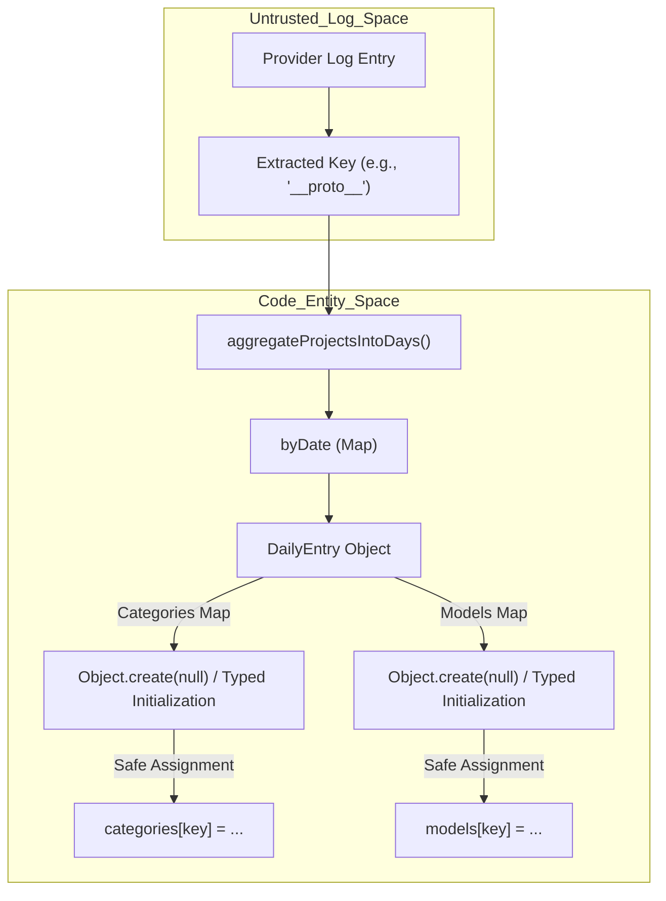
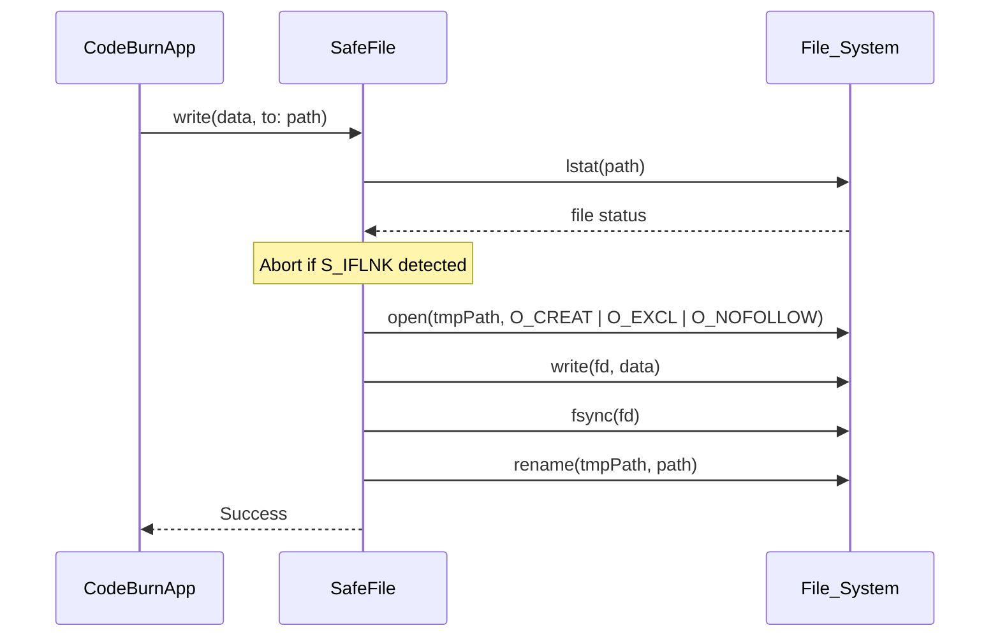

# 보안 강화

관련 소스 파일

다음 파일들은 이 위키 페이지를 생성하기 위한 컨텍스트로 사용되었습니다.

- [.github/workflows/ci.yml](.github/workflows/ci.yml)
- [.semgrep/rules/no-bracket-assign-hot-paths.yml](.semgrep/rules/no-bracket-assign-hot-paths.yml)
- [mac/Sources/CodeBurnMenubar/Security/CodeburnCLI.swift](mac/Sources/CodeBurnMenubar/Security/CodeburnCLI.swift)
- [mac/Sources/CodeBurnMenubar/Security/SafeFile.swift](mac/Sources/CodeBurnMenubar/Security/SafeFile.swift)
- [src/currency.ts](src/currency.ts)
- [src/day-aggregator.ts](src/day-aggregator.ts)
- [src/export.ts](src/export.ts)
- [src/format.ts](src/format.ts)
- [tests/export.test.ts](tests/export.test.ts)
- [tests/fixtures/security/proto-bash.jsonl](tests/fixtures/security/proto-bash.jsonl)
- [tests/fixtures/security/proto-model.jsonl](tests/fixtures/security/proto-model.jsonl)
- [tests/fixtures/security/proto-tool.jsonl](tests/fixtures/security/proto-tool.jsonl)
- [tests/security/prototype-pollution.test.ts](tests/security/prototype-pollution.test.ts)

이 페이지는 신뢰할 수 없는 provider 로그 처리, 데이터 내보내기, 파일 I/O 수행 중 일반적인 취약점으로부터 보호하기 위해 CodeBurn에 구현된 보안 조치를 문서화합니다. 시스템은 정적 분석 guard, 런타임 입력 정제, 제한된 리소스 소비를 결합한 defense-in-depth 전략을 사용합니다.

## Prototype Pollution 방지

CodeBurn은 모델 이름, 도구 이름, bash 명령 같은 키가 집계 map의 인덱스로 사용되는 여러 AI provider의 세션 로그를 처리합니다. 이러한 map이 표준 객체(`{}`)로 초기화되면 악성 로그 항목이 `__proto__` 같은 키를 사용해 `Object.prototype`의 속성을 덮어쓸 수 있습니다.

### 구현 세부 정보
이를 완화하기 위해 집계 및 파싱 로직의 모든 breakdown map은 `Object.create(null)`을 사용해 초기화되거나 `Map` 객체로 관리됩니다. 이를 통해 결과 객체에 prototype이 없도록 하여 bracket assignment를 통한 pollution에 면역을 갖게 합니다.

*   **집계 Map**: `aggregateProjectsIntoDays` 함수는 날짜 기반 그룹화에 `Map`을 사용합니다 [src/day-aggregator.ts:29-32](). category, model, provider에 대한 내부 breakdown은 안전하게 초기화됩니다 [src/day-aggregator.ts:5-21]().
*   **정적 분석 Guard**: 사용자 정의 Semgrep 규칙 `no-bracket-assign-on-literal-object-map`이 CI 파이프라인에서 강제되어 hot path에서 리터럴 객체에 bracket assignment를 사용하는 것을 방지합니다 [/.semgrep/rules/no-bracket-assign-hot-paths.yml:2-18]().
*   **CI 강제**: `semgrep` job은 모든 push와 pull request에서 실행되며, 새로운 취약점이 도입되지 않도록 `src/providers/`와 `src/parser.ts`를 스캔합니다 [.github/workflows/ci.yml:9-28]().

### 데이터 흐름: 집계 보안
다음 다이어그램은 집계 엔진이 provider 로그에서 온 잠재적 악성 키를 처리하는 방식을 보여줍니다.

**집계 보안 흐름**

**출처:** [src/day-aggregator.ts:28-94](), [tests/security/prototype-pollution.test.ts:29-77](), [/.semgrep/rules/no-bracket-assign-hot-paths.yml:1-23]()

## 제한된 파일 읽기와 FX 검증

매우 큰 로그 파일이나 손상된 캐시 파일을 통한 Denial of Service(DoS) 공격을 방지하기 위해 CodeBurn은 엄격한 크기 제한과 계층화된 읽기 전략을 구현합니다.

*   **MAX_SESSION_FILE_BYTES**: 단일 세션 파일에 128MB의 hard cap을 둡니다. 이 제한을 초과하는 파일은 경고와 함께 건너뜁니다.
*   **FX Rate Bounds**: 통화 엔진은 가져오거나 캐시된 모든 환율에 방어적 bounds를 구현합니다. `0.0001`에서 `1,000,000` 범위를 벗어나는 환율은 악성 또는 잘못된 데이터가 후속 비용 계산을 망가뜨리지 않도록 거부됩니다 [src/currency.ts:17-25]().
*   **캐시 검증**: 캐시된 환율을 로드할 때 시스템은 변조된 캐시 파일이 `Infinity`나 숫자가 아닌 값을 주입할 수 없도록 `code`, `timestamp`, `rate` 타입을 검증합니다 [src/currency.ts:74-88]().

**출처:** [src/currency.ts:13-25](), [src/currency.ts:74-88]()

## CSV Injection 보호

CSV 형식으로 데이터를 내보낼 때 CodeBurn은 "CSV Injection"(Formula Injection이라고도 함)을 방지하기 위해 셀 값을 정제합니다. 이 공격은 Excel이나 Google Sheets 같은 스프레드시트 애플리케이션이 `=`, `+`, `-`, `@`로 시작하는 셀을 수식으로 해석할 때 발생합니다.

### 정제 로직
`escCsv` 함수는 모든 문자열의 시작 부분을 확인합니다. 위험한 패턴 `/^[\t\r=+\-@]/`와 일치하면 값 앞에 작은따옴표 `'`를 붙여 스프레드시트가 이를 리터럴 텍스트로 처리하도록 강제합니다 [src/export.ts:8-14]().

| 원래 값 | 정제된 값 | 이유 |
| :--- | :--- | :--- |
| `=SUM(1,2)` | `'=SUM(1,2)` | 수식 실행 방지 |
| `+danger-model` | `'+danger-model` | 수식 실행 방지 |
| `@malicious` | `'@malicious` | DDE/외부 링크 실행 방지 |
| `\tcmd` | `'\tcmd` | 탭 기반 우회 방지 |

**출처:** [src/export.ts:8-26](), [tests/export.test.ts:115-154]()

## CLI Subprocess 강화

macOS Menubar 애플리케이션과 GNOME 확장은 `codeburn` CLI를 subprocess로 호출합니다. shell injection을 방지하기 위해 이러한 컴포넌트는 shell을 매개로 한 실행을 피합니다.

### SafeArgPattern(macOS)
Swift `CodeburnCLI` 유틸리티는 `CODEBURN_BIN` 환경 변수를 엄격한 문자 whitelist(`A-Za-z0-9 ._/-`)와 대조해 검증합니다 [mac/Sources/CodeBurnMenubar/Security/CodeburnCLI.swift:11-12](). shell 메타문자(`;`, `&`, `|`, `$`, quotes)가 포함된 문자열은 거부됩니다 [mac/Sources/CodeBurnMenubar/Security/CodeburnCLI.swift:25-29]().

### 구현 기능
*   **직접 호출**: Subprocess는 `/bin/sh` 또는 `/bin/zsh`를 우회하고, 인자를 별도의 배열로 전달하여 `/usr/bin/env`를 사용해 생성됩니다 [mac/Sources/CodeBurnMenubar/Security/CodeburnCLI.swift:35-43]().
*   **인자 Guarding**: `--` delimiter를 사용하여 이후의 모든 토큰을 환경 변수 할당이 아니라 인자로 처리합니다 [mac/Sources/CodeBurnMenubar/Security/CodeburnCLI.swift:43-43]().

**출처:** [mac/Sources/CodeBurnMenubar/Security/CodeburnCLI.swift:7-64]()

## macOS 앱 보안: SafeFile

Swift 기반 macOS 메뉴 막대 애플리케이션은 구성, 통화 환율, 구독 snapshot과 관련된 모든 영속성 작업에 특화된 `SafeFile` 유틸리티를 사용합니다.

### 구현 기능
*   **Symlink 보호**: `SafeFile`은 경로를 열기 전에 `lstat`을 사용해 symlink가 아닌지 확인하고, `open()` 호출 중 `O_NOFOLLOW` 플래그를 활용합니다.
*   **원자적 쓰기**: 데이터는 임시 파일에 작성된 다음 `rename()`으로 제자리에 이동되어, 프로세스가 crash되거나 전원이 끊기더라도 파일 무결성을 보장합니다.
*   **Advisory Locking**: 공유 구성 파일의 race condition을 방지하기 위해 `flock(LOCK_EX)`를 사용하여 CLI와 Menubar 앱 사이의 접근을 조정합니다.
*   **읽기 제한**: 변조된 캐시 파일로 인한 메모리 고갈을 방지하기 위해 읽기는 `defaultReadLimit`(8MB)로 제한됩니다.

### Swift 파일 I/O 안전성

**출처:** [mac/Sources/CodeBurnMenubar/Security/SafeFile.swift:1-128](), [mac/Sources/CodeBurnMenubar/Security/CodeburnCLI.swift:1-64]()
