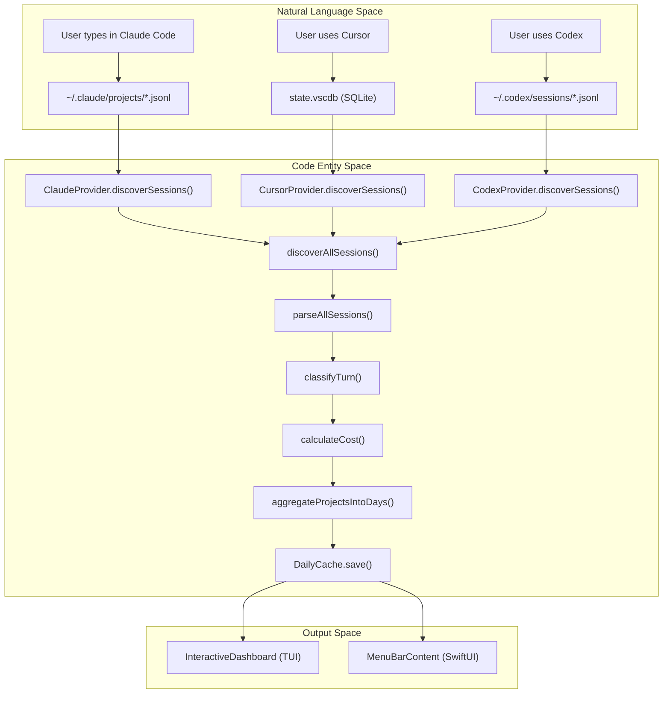
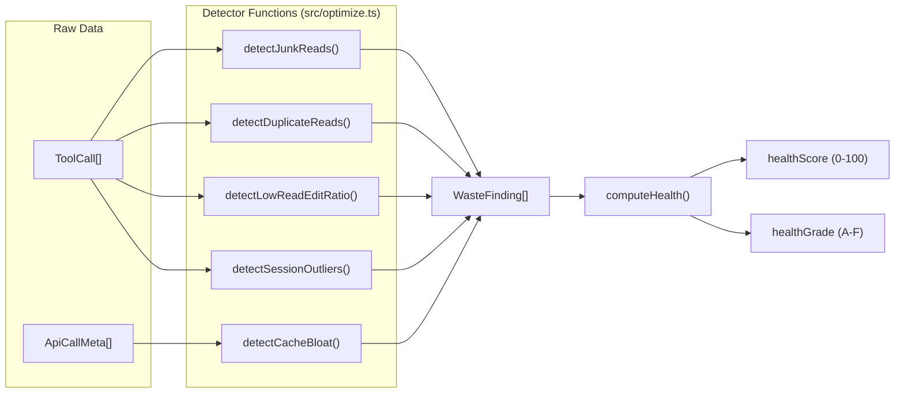

# 용어집

관련 소스 파일

다음 파일들은 이 위키 페이지를 생성하기 위한 컨텍스트로 사용되었습니다.

- [CHANGELOG.md](CHANGELOG.md)
- [README.md](README.md)
- [assets/menubar-0.8.0.png](assets/menubar-0.8.0.png)
- [package.json](package.json)
- [src/classifier.ts](src/classifier.ts)
- [src/codex-cache.ts](src/codex-cache.ts)
- [src/config.ts](src/config.ts)
- [src/context-budget.ts](src/context-budget.ts)
- [src/cursor-cache.ts](src/cursor-cache.ts)
- [src/models.ts](src/models.ts)
- [src/optimize.ts](src/optimize.ts)
- [src/parser.ts](src/parser.ts)
- [src/plan-usage.ts](src/plan-usage.ts)
- [src/plans.ts](src/plans.ts)
- [src/providers/codex.ts](src/providers/codex.ts)
- [src/providers/cursor.ts](src/providers/cursor.ts)
- [src/types.ts](src/types.ts)
- [tests/cli-plan.test.ts](tests/cli-plan.test.ts)
- [tests/optimize-fs.test.ts](tests/optimize-fs.test.ts)
- [tests/optimize.test.ts](tests/optimize.test.ts)
- [tests/plan-usage.test.ts](tests/plan-usage.test.ts)
- [tests/plans.test.ts](tests/plans.test.ts)
- [tests/providers/codex.test.ts](tests/providers/codex.test.ts)
- [tests/providers/cursor.test.ts](tests/providers/cursor.test.ts)

이 용어집은 CodeBurn 프로젝트에서 사용되는 기술 도메인 언어, 코드베이스 고유 용어, 아키텍처 개념을 정의합니다. 신규 엔지니어가 자연어 개념을 TypeScript 및 Swift 계층의 특정 구현 세부 사항에 매핑할 수 있도록 돕는 참조 자료 역할을 합니다.

## 핵심 도메인 개념

### Provider
**Provider**는 세션 데이터를 로컬 디스크에 저장하는 AI 코딩 도구 또는 서비스를 나타내는 플러그인 기반 추상화입니다.
*   **구현**: 각 provider는 [src/providers/types.ts:10-14]()에 정의된 `Provider` 인터페이스를 구현합니다.
*   **책임**: 세션 파일 발견(`discoverSessions`), 원시 로그를 통합 형식으로 파싱(`createSessionParser`), 모델과 도구의 표시 이름 제공을 포함합니다.
*   **핵심 파일**: [src/providers/index.ts](), [src/providers/claude.ts](), [src/providers/cursor.ts](), [src/providers/codex.ts]().

### Session
**Session**은 사용자와 AI 에이전트 사이의 하나의 연속적인 상호작용 또는 "chat"을 나타냅니다.
*   **데이터 흐름**: 원시 파일(JSONL, SQLite)은 `SessionSource` 객체로 파싱됩니다 [src/providers/types.ts:1-6]().
*   **집계**: 세션은 파싱 파이프라인 중 `ProjectSummary` 객체로 그룹화됩니다 [src/parser.ts:21-23]().

### Turn
**Turn**은 세션 안에서 가장 작은 상호작용 단위이며, 하나의 사용자 메시지와 그에 이어지는 어시스턴트 응답(여러 도구 호출을 포함할 수 있음)으로 구성됩니다.
*   **분류**: 모든 turn은 `classifyTurn`을 거쳐 `TaskCategory`가 할당됩니다 [src/classifier.ts:150-174]().
*   **재시도 로직**: 시스템은 `Edit` 도구 뒤에 `Bash` 명령(테스트/빌드로 추정)이 오고 다시 `Edit`이 이어지는 패턴을 찾아 turn 안의 "retries"를 감지합니다 [src/classifier.ts:124-144]().

### TaskCategory
`Turn`에 할당되어 작업의 성격을 설명하는 라벨입니다.
*   **로직**: 도구 패턴 매칭(예: `Edit` 도구는 `coding`을 의미)을 사용한 뒤 키워드 휴리스틱(예: "fix"는 `debugging`을 의미)을 적용합니다 [src/classifier.ts:60-94]().
*   **라벨**: `coding`, `debugging`, `refactoring`, `feature`, `testing`, `exploration`, `planning`, `git`, `build/deploy`, `brainstorming`, `delegation`, `conversation`, `general`을 포함합니다 [src/types.ts:1-21]().

---

## 기술 엔터티와 데이터 구조

### ParsedApiCall / ParsedProviderCall
단일 API 상호작용의 표준 내부 표현입니다. 원시 provider 로그와 CodeBurn 집계 엔진 사이의 간극을 연결합니다.

| 속성 | 설명 | 코드 포인터 |
| :--- | :--- | :--- |
| `usage` | 토큰 사용량 breakdown(input, output, cache) | [src/types.ts:15-15]() |
| `costUSD` | `ModelCosts`를 기반으로 계산된 비용 | [src/types.ts:15-15]() |
| `deduplicationKey` | 중복 집계를 방지하는 데 사용되는 고유 ID | [src/types.ts:15-15]() |
| `bashCommands` | 호출에서 추출된 셸 명령 배열 | [src/types.ts:15-15]() |

### ModelCosts
특정 LLM의 가격 계층을 포함하는 구조입니다.
*   **가격 책정 엔진**: 가격은 주로 LiteLLM의 `model_prices_and_context_window.json` 캐시 버전에서 가져옵니다 [src/models.ts:25-26]().
*   **스냅샷**: 네트워크를 사용할 수 없는 경우 내장 스냅샷이 fallback 데이터를 제공합니다 [src/models.ts:4-5]().
*   **별칭**: 모델 이름은 가격 항목과 일치하도록 `getCanonicalName`과 `resolveAlias`를 통해 정규화됩니다 [src/models.ts:170-180]().

### WasteFinding
`optimize` 엔진이 생성하는 객체로, 특정 토큰 낭비 패턴을 나타냅니다.
*   **탐지기**: `detectJunkReads`(`node_modules` 읽기 발견) 또는 `detectCacheBloat` 같은 함수가 이러한 발견 사항을 생성합니다 [src/optimize.ts:133-140]().
*   **수정 사항**: 각 발견 사항에는 `paste`(CLAUDE.md 지침), 실행할 `command`, 또는 `file-content` 변경일 수 있는 `WasteAction`이 포함됩니다 [src/optimize.ts:126-130]().

---

## 시스템 아키텍처 다이어그램

### 데이터 변환 파이프라인
다음 다이어그램은 **자연어 공간**(사용자 동작/provider 로그)을 **코드 엔터티 공간**(클래스와 함수)으로 연결합니다.

**출처**: [src/parser.ts:5-8](), [src/classifier.ts:150-155](), [src/models.ts:108-115](), [src/providers/codex.ts:129-132](), [src/providers/cursor.ts:62-65]().

### 최적화와 건강 점수
이 다이어그램은 시스템이 원시 도구 호출에서 "Waste"와 "Health"를 평가하는 방식을 보여줍니다.

**출처**: [src/optimize.ts:142-147](), [tests/optimize.test.ts:4-15]().

---

## 약어 용어집 표

| 약어 | 전체 용어 | 컨텍스트 |
| :--- | :--- | :--- |
| **MCP** | Model Context Protocol | `detectUnusedMcp`를 통해 사용되지 않은 서버를 감지하는 데 사용됩니다 [src/optimize.ts:56-62](). |
| **TUI** | Terminal User Interface | CLI에서 렌더링되는 React-Ink 대시보드를 가리킵니다 [package.json:48-50](). |
| **TTL** | Time To Live | 가격 데이터 캐시(24h)에 사용됩니다 [src/models.ts:26-26](). |
| **FX** | Foreign Exchange | Frankfurter API를 사용하는 통화 변환 로직을 가리킵니다 [CHANGELOG.md:40-41](). |
| **CWD** | Current Working Directory | 프로젝트별 세션을 해석하고 프로젝트 이름을 정제하는 데 사용됩니다 [src/providers/codex.ts:73-75](). |
| **JSONL** | JSON Lines | Claude, Codex, OpenClaw 로그의 기본 저장 형식입니다 [src/parser.ts:29-35](). |

---

## macOS 특정 용어

### AppStore
macOS Menubar 앱의 중앙화된 상태 컨테이너입니다. Swift `@Observable` 매크로를 사용하여 CLI에서 데이터를 가져올 때 UI 업데이트를 트리거합니다 [CHANGELOG.md:60-61]().

### DataClient
Swift UI와 Node.js CLI 사이의 브리지입니다. `codeburn report --format json`을 subprocess로 실행하고 출력을 파싱합니다 [CHANGELOG.md:56-58]().

### CapacityEstimator
Claude API가 보고하는 백분율 기반 사용량에서 절대 토큰 한도를 역공학하는 로직 엔진입니다 [CHANGELOG.md:90-91]().

**출처**: [CHANGELOG.md:54-66](), [package.json:1-10]().
