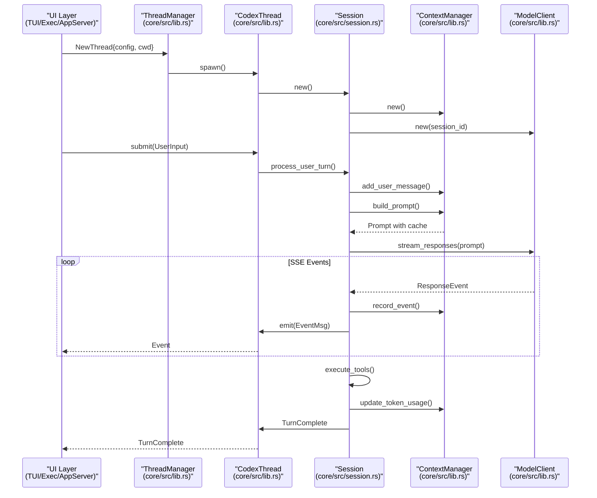

# 개요

<details>
<summary>관련 소스 파일</summary>

다음 파일들은 이 위키 페이지를 생성하기 위한 컨텍스트로 사용되었습니다.

- [.gitignore](.gitignore)
- [CHANGELOG.md](CHANGELOG.md)
- [README.md](README.md)
- [cliff.toml](cliff.toml)
- [codex-cli/package.json](codex-cli/package.json)
- [codex-rs/Cargo.lock](codex-rs/Cargo.lock)
- [codex-rs/Cargo.toml](codex-rs/Cargo.toml)
- [codex-rs/README.md](codex-rs/README.md)
- [codex-rs/cli/Cargo.toml](codex-rs/cli/Cargo.toml)
- [codex-rs/cli/src/lib.rs](codex-rs/cli/src/lib.rs)
- [codex-rs/cli/src/main.rs](codex-rs/cli/src/main.rs)
- [codex-rs/core/Cargo.toml](codex-rs/core/Cargo.toml)
- [codex-rs/core/src/lib.rs](codex-rs/core/src/lib.rs)
- [codex-rs/default.nix](codex-rs/default.nix)
- [codex-rs/exec/Cargo.toml](codex-rs/exec/Cargo.toml)
- [codex-rs/exec/src/cli.rs](codex-rs/exec/src/cli.rs)
- [codex-rs/exec/src/event_processor.rs](codex-rs/exec/src/event_processor.rs)
- [codex-rs/exec/src/lib.rs](codex-rs/exec/src/lib.rs)
- [codex-rs/responses-api-proxy/npm/package.json](codex-rs/responses-api-proxy/npm/package.json)
- [codex-rs/tui/Cargo.toml](codex-rs/tui/Cargo.toml)
- [codex-rs/tui/src/cli.rs](codex-rs/tui/src/cli.rs)
- [codex-rs/tui/src/lib.rs](codex-rs/tui/src/lib.rs)
- [flake.lock](flake.lock)
- [flake.nix](flake.nix)
- [package.json](package.json)
- [pnpm-lock.yaml](pnpm-lock.yaml)
- [pnpm-workspace.yaml](pnpm-workspace.yaml)
- [sdk/typescript/jest.config.cjs](sdk/typescript/jest.config.cjs)
- [sdk/typescript/package.json](sdk/typescript/package.json)
- [sdk/typescript/tsconfig.json](sdk/typescript/tsconfig.json)

</details>


Codex CLI는 사용자의 컴퓨터에서 로컬로 실행되는 OpenAI의 AI 코딩 에이전트입니다. AI 지원으로 코딩 작업을 실행하기 위한 대화형 터미널 인터페이스, 비대화형 자동화 모드, IDE 통합 기능을 제공합니다. 이 시스템은 Cargo workspace로서 Rust로 구현되어 있으며, 여러 실행 모드, 설정 가능한 샌드박싱, Model Context Protocol(MCP)을 통한 도구 확장성, 다중 에이전트 워크플로를 지원합니다.

설치 절차에 대한 자세한 정보는 [설치 및 설정](#1.1)을 참조하세요. 설정 옵션은 [설정 시스템](#2.2)을 참조하세요. IDE 통합 세부 사항은 [앱 서버와 IDE 통합](#4.5)을 참조하세요.

## 프로젝트 목적과 아키텍처

Codex는 AI 모델 상호작용을 조정하고, 샌드박스 환경에서 도구를 실행하며, 여러 세션에 걸친 대화 상태를 관리하는 무의존성 네이티브 실행 파일로 설계되었습니다. 코드베이스는 핵심 비즈니스 로직, 사용자 인터페이스, 통합 지점을 명확히 분리한 Rust workspace로 구성되어 있습니다.

### 상위 수준 시스템 아키텍처

아래 다이어그램은 상위 수준 시스템 컴포넌트를 `codex-rs` workspace 내부의 구체적인 구현 crate 및 모듈에 매핑합니다.

```mermaid
graph TB
    subgraph "Entry Points"
        [codex_bin] --> ["codex binary<br/>(cli/src/main.rs)"]
        [tui_entry] --> ["Interactive TUI<br/>(tui/src/lib.rs)"]
        [exec_entry] --> ["Non-Interactive Exec<br/>(exec/src/lib.rs)"]
        [app_server_entry] --> ["App Server (IDE)<br/>(app-server/src/lib.rs)"]
        [mcp_server_entry] --> ["MCP Server<br/>(mcp-server/src/lib.rs)"]
    end
    
    subgraph "Core Engine (codex-core)"
        [ThreadManager] --> ["ThreadManager<br/>(core/src/lib.rs)"]
        [CodexThread] --> ["CodexThread<br/>(core/src/lib.rs)"]
        [Session] --> ["Session (internal)<br/>(core/src/session.rs)"]
        [ContextManager] --> ["ContextManager<br/>(core/src/lib.rs)"]
        [ModelClient] --> ["ModelClient<br/>(core/src/lib.rs)"]
    end
    
    subgraph "Tool Execution"
        [ToolRouter] --> ["ToolRouter<br/>(core/src/lib.rs)"]
        [UnifiedExec] --> ["UnifiedExecProcessManager<br/>(core/src/lib.rs)"]
        [McpManager] --> ["McpManager<br/>(core/src/lib.rs)"]
        [Sandbox] --> ["Platform Sandboxes<br/>(core/src/sandboxing/)"]
    end
    
    subgraph "Configuration & State"
        [ConfigBuilder] --> ["ConfigBuilder<br/>(core/src/lib.rs)"]
        [RolloutRecorder] --> ["RolloutRecorder<br/>(core/src/lib.rs)"]
        [StateDb] --> ["SQLite StateDb<br/>(core/src/lib.rs)"]
    end
    
    [codex_bin] --> [tui_entry]
    [codex_bin] --> [exec_entry]
    [codex_bin] --> [app_server_entry]
    [codex_bin] --> [mcp_server_entry]
    
    [tui_entry] --> [ThreadManager]
    [exec_entry] --> [ThreadManager]
    [app_server_entry] --> [ThreadManager]
    
    [ThreadManager] --> [CodexThread]
    [CodexThread] --> [Session]
    [Session] --> [ContextManager]
    [Session] --> [ModelClient]
    [Session] --> [ToolRouter]
    [Session] --> [ConfigBuilder]
    
    [ToolRouter] --> [UnifiedExec]
    [ToolRouter] --> [McpManager]
    [ToolRouter] --> [Sandbox]
    
    [CodexThread] --> [RolloutRecorder]
    [ThreadManager] --> [StateDb]
```

**출처:** [codex-rs/cli/src/main.rs:103-209](), [codex-rs/core/src/lib.rs:1-198](), [README.md:1-10]()

## 실행 모드

Codex는 서로 다른 사용 사례를 처리하는 여러 주요 실행 모드를 지원합니다. 모든 모드는 동일한 핵심 `ThreadManager` [codex-rs/core/src/lib.rs:115]() 인프라로 수렴하지만, 이벤트를 표시하고 사용자 상호작용을 처리하는 방식이 다릅니다.

### 실행 모드 비교

| 모드 | 진입점 | 사용 사례 | 세션 영속성 | 사용자 상호작용 |
|------|-------------|----------|---------------------|------------------|
| **TUI** | `codex` (default) | 대화형 개발 | 예 (rollout 파일) | 완전한 대화형 UI [codex-rs/cli/src/main.rs:114]() |
| **Exec** | `codex exec` | 자동화/CI | 예 (ephemeral이 아닌 경우) | 비대화형 [codex-rs/cli/src/main.rs:124]() |
| **App Server** | `codex app-server` | IDE 통합 | 예 | JSON-RPC 프로토콜 [codex-rs/cli/src/main.rs:145]() |
| **MCP Server** | `codex mcp-server` | 도구 위임 | 예 | MCP 프로토콜 (stdio) [codex-rs/cli/src/main.rs:142]() |
| **Cloud** | `codex cloud` | 원격 작업 관리 | 원격 | Cloud용 TUI/CLI [codex-rs/cli/src/main.rs:194]() |

### 명령 디스패치와 런타임 초기화

`MultitoolCli` [codex-rs/cli/src/main.rs:103]() 구조체는 하위 명령을 각각의 crate와 로직으로 라우팅하는 일을 처리합니다.

```mermaid
graph LR
    subgraph "Installation"
        [npm] --> ["npm install -g<br/>@openai/codex"]
        [brew] --> ["brew install<br/>--cask codex"]
        [binary] --> ["GitHub Releases<br/>Platform Binaries"]
    end
    
    subgraph "Commands (cli/src/main.rs)"
        [interactive] --> ["codex<br/>(TUI)"]
        [exec] --> ["codex exec 'task'<br/>(Non-interactive)"]
        [app_server] --> ["codex app-server<br/>(JSON-RPC)"]
        [mcp_server] --> ["codex mcp-server<br/>(MCP stdio)"]
        [review] --> ["codex review<br/>(Code Review)"]
        [cloud] --> ["codex cloud<br/>(Cloud Tasks)"]
    end
    
    subgraph "Core Runtime (core/src/lib.rs)"
        [thread_mgr] --> ["ThreadManager"]
        [config_load] --> ["ConfigBuilder"]
        [auth_mgr] --> ["AuthManager"]
    end
    
    [npm] --> [interactive]
    [brew] --> [interactive]
    [binary] --> [interactive]
    
    [interactive] --> [config_load]
    [exec] --> [config_load]
    [app_server] --> [config_load]
    [mcp_server] --> [config_load]
    [review] --> [config_load]
    [cloud] --> [config_load]
    
    [config_load] --> [auth_mgr]
    [auth_mgr] --> [thread_mgr]
```

**출처:** [codex-rs/cli/src/main.rs:120-209](), [README.md:14-40](), [codex-rs/core/src/lib.rs:115-118]()

## Core Crate 구성

Codex workspace는 목적이 뚜렷한 crate들로 구성되어 있습니다. `codex-rs/Cargo.toml` [codex-rs/Cargo.toml:1-121]() 파일은 workspace 멤버를 정의합니다.

| Crate | 경로 | 목적 |
|-------|------|---------|
| `codex-core` | `core/` | 핵심 에이전트 로직, 세션 관리, 모델 클라이언트, 도구 오케스트레이션 [codex-rs/Cargo.toml:36]() |
| `codex-tui` | `tui/` | Ratatui로 구축된 대화형 터미널 UI [codex-rs/Cargo.toml:83]() |
| `codex-exec` | `exec/` | 비대화형 headless CLI [codex-rs/Cargo.toml:42]() |
| `codex-cli` | `cli/` | 멀티툴 디스패처, 하위 명령 라우팅, 기능 토글 [codex-rs/Cargo.toml:28]() |
| `codex-app-server` | `app-server/` | VS Code 및 기타 IDE 클라이언트를 위한 JSON-RPC 서버 [codex-rs/Cargo.toml:11]() |
| `codex-mcp-server` | `mcp-server/` | Codex를 도구로 노출하는 MCP 서버 구현 [codex-rs/Cargo.toml:64]() |
| `codex-config` | `config/` | 설정 파싱, 검증, 계층 병합 [codex-rs/Cargo.toml:31]() |
| `codex-cloud-tasks` | `cloud-tasks/` | Codex Cloud 환경과 상호작용하기 위한 인터페이스 [codex-rs/Cargo.toml:25]() |

**출처:** [codex-rs/Cargo.toml:1-121]()

## 핵심 아키텍처 컴포넌트

핵심 엔진은 `ThreadManager`가 스레드 생명주기를 관리하고, `CodexThread`가 세션 실행을 조정하며, 내부 `Session` 모듈이 턴 단위 모델 상호작용을 처리하는 계층형 아키텍처를 구현합니다.

### 스레드와 세션 생명주기

프런트엔드와 코어 사이의 상호작용은 `UserInput` [codex-rs/cli/src/main.rs:85]() 제출과 `ResponseEvent` [codex-rs/core/src/lib.rs:184]() 객체 스트리밍으로 제어됩니다.



**출처:** [codex-rs/core/src/lib.rs:16-115](), [codex-rs/core/src/session.rs:16]()

### 주요 컴포넌트 책임

| 컴포넌트 | 파일 | 주요 책임 |
|-----------|------|-------------------------|
| `ThreadManager` | `core/src/lib.rs` | 스레드 생성/재개, 상태 데이터베이스 상호작용 [codex-rs/core/src/lib.rs:115]() |
| `CodexThread` | `core/src/lib.rs` | 제출 큐, 이벤트 방출, 작업 관리 [codex-rs/core/src/lib.rs:23]() |
| `Session` (internal) | `core/src/session.rs` | 턴 오케스트레이션, 프롬프트 구성, 모델 스트리밍 [codex-rs/core/src/session.rs:16]() |
| `ContextManager` | `core/src/lib.rs` | 메시지 기록, 토큰 추적, 압축 트리거 [codex-rs/core/src/lib.rs:36]() |
| `ModelClient` | `core/src/lib.rs` | HTTP/WebSocket 전송, SSE 파싱, 재시도 로직 [codex-rs/core/src/lib.rs:179]() |
| `RolloutRecorder` | `core/src/lib.rs` | 세션 영속화, 이벤트 필터링 [codex-rs/core/src/lib.rs:150]() |

**출처:** [codex-rs/core/src/lib.rs:1-198]()

## 설정 시스템

설정은 여러 계층에서 조립되며 CLI 인자가 가장 높은 우선순위를 가집니다. `ConfigEditsBuilder` [codex-rs/cli/src/main.rs:72]()는 설정을 프로그래밍 방식으로 수정하는 데 사용됩니다. Codex는 기본값에서 시작해 CLI 재정의까지 이어지는 계층형 설정 시스템을 지원합니다.

```mermaid
graph TB
    subgraph "Configuration Sources (Priority Order)"
        [cli] --> ["CLI Arguments<br/>(codex-utils-cli)"]
        [features] --> ["Feature Toggles<br/>(codex-features)"]
        [profile] --> ["Profile Selection<br/>--profile name"]
        [env] --> ["Environment Variables<br/>(CODEX_*, OPENAI_*)"]
        [project] --> [".codex/config.toml<br/>(Project)"]
        [global] --> ["~/.codex/config.toml<br/>(Global)"]
        [defaults] --> ["Built-in Defaults<br/>(hardcoded)"]
    end
    
    subgraph "Configuration Builder"
        [builder] --> ["ConfigBuilder::build()<br/>(core/src/lib.rs)"]
    end
    
    subgraph "Final Configuration"
        [config] --> ["Config struct<br/>(core/src/lib.rs)"]
        [model_provider] --> ["ModelProviderInfo<br/>(core/src/lib.rs)"]
    end
    
    [cli] --> [builder]
    [features] --> [builder]
    [profile] --> [builder]
    [env] --> [builder]
    [project] --> [builder]
    [global] --> [builder]
    [defaults] --> [builder]
    
    [builder] --> [config]
    [config] --> [model_provider]
```

**출처:** [codex-rs/cli/src/main.rs:105-108](), [codex-rs/core/src/lib.rs:33](), [codex-rs/core/src/lib.rs:105]()

## 세션 영속화와 재생

세션은 이벤트 스트림을 포함하는 rollout 파일로 영속화됩니다. `RolloutRecorder` [codex-rs/core/src/lib.rs:150]()가 이 프로세스를 관리합니다. 파일은 `SESSIONS_SUBDIR` [codex-rs/core/src/lib.rs:152]() 및 `ARCHIVED_SESSIONS_SUBDIR` [codex-rs/core/src/lib.rs:147]()에서 정의한 디렉터리에 저장됩니다.

**출처:** [codex-rs/core/src/lib.rs:147-170]()
