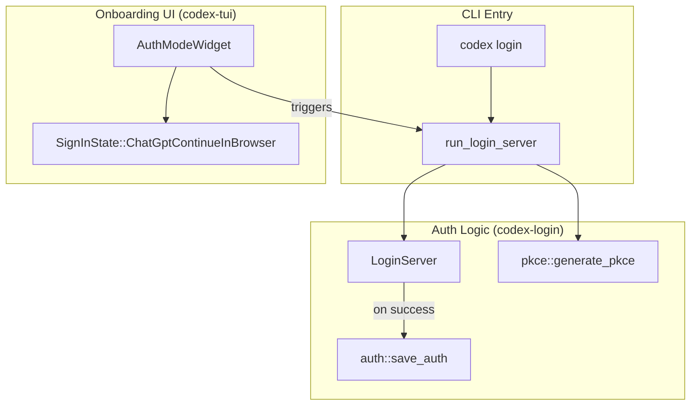

# 설치 및 설정

<details>
<summary>관련 소스 파일</summary>

다음 파일들은 이 위키 페이지를 생성하기 위한 컨텍스트로 사용되었습니다.

- [.github/actions/linux-code-sign/action.yml](.github/actions/linux-code-sign/action.yml)
- [.github/actions/windows-code-sign/action.yml](.github/actions/windows-code-sign/action.yml)
- [.github/scripts/archive-release-symbols-and-strip-binaries.sh](.github/scripts/archive-release-symbols-and-strip-binaries.sh)
- [.github/workflows/ci.yml](.github/workflows/ci.yml)
- [.github/workflows/rust-ci-full.yml](.github/workflows/rust-ci-full.yml)
- [.github/workflows/rust-ci.yml](.github/workflows/rust-ci.yml)
- [.github/workflows/rust-release-argument-comment-lint.yml](.github/workflows/rust-release-argument-comment-lint.yml)
- [.github/workflows/rust-release-windows.yml](.github/workflows/rust-release-windows.yml)
- [.github/workflows/rust-release.yml](.github/workflows/rust-release.yml)
- [.github/workflows/sdk.yml](.github/workflows/sdk.yml)
- [.gitignore](.gitignore)
- [CHANGELOG.md](CHANGELOG.md)
- [README.md](README.md)
- [cliff.toml](cliff.toml)
- [codex-cli/.gitignore](codex-cli/.gitignore)
- [codex-cli/bin/codex.js](codex-cli/bin/codex.js)
- [codex-cli/package.json](codex-cli/package.json)
- [codex-cli/scripts/README.md](codex-cli/scripts/README.md)
- [codex-cli/scripts/build_npm_package.py](codex-cli/scripts/build_npm_package.py)
- [codex-rs/cli/src/login.rs](codex-rs/cli/src/login.rs)
- [codex-rs/default.nix](codex-rs/default.nix)
- [codex-rs/login/BUILD.bazel](codex-rs/login/BUILD.bazel)
- [codex-rs/login/Cargo.toml](codex-rs/login/Cargo.toml)
- [codex-rs/login/src/assets/error.html](codex-rs/login/src/assets/error.html)
- [codex-rs/login/src/lib.rs](codex-rs/login/src/lib.rs)
- [codex-rs/login/src/server.rs](codex-rs/login/src/server.rs)
- [codex-rs/login/tests/suite/login_server_e2e.rs](codex-rs/login/tests/suite/login_server_e2e.rs)
- [codex-rs/responses-api-proxy/npm/package.json](codex-rs/responses-api-proxy/npm/package.json)
- [codex-rs/tui/src/config_update.rs](codex-rs/tui/src/config_update.rs)
- [codex-rs/tui/src/onboarding/auth.rs](codex-rs/tui/src/onboarding/auth.rs)
- [codex-rs/tui/src/onboarding/mod.rs](codex-rs/tui/src/onboarding/mod.rs)
- [codex-rs/tui/src/onboarding/onboarding_screen.rs](codex-rs/tui/src/onboarding/onboarding_screen.rs)
- [codex-rs/tui/src/onboarding/trust_directory.rs](codex-rs/tui/src/onboarding/trust_directory.rs)
- [codex-rs/tui/src/onboarding/welcome.rs](codex-rs/tui/src/onboarding/welcome.rs)
- [flake.lock](flake.lock)
- [flake.nix](flake.nix)
- [package.json](package.json)
- [pnpm-lock.yaml](pnpm-lock.yaml)
- [pnpm-workspace.yaml](pnpm-workspace.yaml)
- [scripts/stage_npm_packages.py](scripts/stage_npm_packages.py)
- [sdk/typescript/jest.config.cjs](sdk/typescript/jest.config.cjs)
- [sdk/typescript/package.json](sdk/typescript/package.json)
- [sdk/typescript/tsconfig.json](sdk/typescript/tsconfig.json)

</details>


이 페이지는 Codex CLI 설치, 인증, 초기 설정 수행을 다룹니다. Codex는 사용자의 컴퓨터에서 로컬로 실행되는 코딩 에이전트입니다 [README.md:1](). npm, Homebrew, 직접 다운로드 또는 셸 설치 스크립트를 통해 네이티브 바이너리로 배포됩니다. 설치 후에는 ChatGPT OAuth 또는 API 키 중 하나를 사용해 인증해야 합니다 [README.md:58-62]().

## 시스템 요구 사항

**지원 플랫폼:**

| 운영 체제 | 세부 사항 |
|-----------------|---------|
| **macOS** | macOS 12+ (Apple Silicon/arm64 및 x86_64) [README.md:47-49]() |
| **Linux** | Ubuntu 20.04+/Debian 10+ (musl을 통한 x86_64 및 arm64) [README.md:50-52]() |
| **Windows** | Windows 11 (PowerShell을 통한 네이티브 실행 또는 WSL2 경유) [README.md:22-26]() |

**도구 요구 사항:**
* **Node.js:** >= 16 (npm 기반 설치용) [codex-cli/package.json:10-12]()
* **pnpm:** >= 10.33.0 (monorepo 개발용) [codex-cli/package.json:21]()
* **Rust:** 1.95.0 (소스에서 빌드할 때 권장) [.github/workflows/rust-release.yml:28]()

출처: [README.md:47-52](), [codex-cli/package.json:10-21](), [.github/workflows/rust-release.yml:28]()

## 설치 방법

### 빠른 설치(Mac, Linux, Windows)

공식 설치 스크립트는 플랫폼을 감지하고 적절한 바이너리를 가져옵니다.

*   **Mac/Linux:** `curl -fsSL https://chatgpt.com/codex/install.sh | sh` [README.md:18-20]()
*   **Windows:** `powershell -ExecutionPolicy ByPass -c "irm https://chatgpt.com/codex/install.ps1 | iex"` [README.md:22-26]()

### npm(JS 환경에 권장)

npm을 사용해 CLI를 전역으로 설치합니다. `@openai/codex` 패키지는 네이티브 바이너리용 래퍼로 동작합니다 [codex-cli/package.json:2-8]().

```shell
npm install -g @openai/codex
```

이 패키지는 `bin/codex.js`를 가리키는 `codex` 바이너리 진입점을 정의합니다 [codex-cli/package.json:6-8]().

출처: [README.md:30-33](), [codex-cli/package.json:1-9]()

### Homebrew(macOS)

macOS에서 Codex는 Homebrew Cask로 제공됩니다.

```shell
brew install --cask codex
```

출처: [README.md:35-38]()

### 직접 바이너리 다운로드

사전 컴파일된 바이너리는 GitHub Releases에서 사용할 수 있습니다 [README.md:42-43](). 릴리스 산출물은 `aarch64-apple-darwin`, `x86_64-apple-darwin`, `x86_64-unknown-linux-musl`, `aarch64-unknown-linux-musl`을 포함한 여러 대상용으로 빌드됩니다 [.github/workflows/rust-release.yml:79-127]().

| 플랫폼 | 바이너리 이름(아카이브 내부) |
|----------|--------------------------|
| macOS Apple Silicon | `codex-aarch64-apple-darwin` [README.md:48]() |
| macOS Intel | `codex-x86_64-apple-darwin` [README.md:49]() |
| Linux x86_64 (musl) | `codex-x86_64-unknown-linux-musl` [README.md:51]() |
| Linux arm64 (musl) | `codex-aarch64-unknown-linux-musl` [README.md:52]() |

출처: [README.md:42-56](), [.github/workflows/rust-release.yml:79-127]()

## 인증 설정

Codex는 `AuthManager` [codex-rs/login/src/auth.rs:22]()가 관리하는 여러 인증 모드를 지원합니다.

### ChatGPT로 로그인(OAuth)

개인 사용에는 이 방법이 권장됩니다 [README.md:60](). OAuth 흐름을 처리하기 위해 로컬 콜백 서버를 사용합니다.

1.  **로컬 서버**: `codex login`을 실행하면 `localhost:1455`(또는 `1457`)에서 수명이 짧은 `tiny_http` 서버가 시작됩니다 [codex-rs/login/src/server.rs:54-57]().
2.  **PKCE 흐름**: 시스템은 보안 권한 부여를 위해 PKCE 코드(`generate_pkce`)와 state 매개변수를 생성합니다 [codex-rs/login/src/server.rs:141-142]().
3.  **브라우저 권한 부여**: CLI는 OpenAI issuer URL로 시스템 브라우저를 엽니다 [codex-rs/login/src/server.rs:167]().
4.  **토큰 저장**: 성공하면 토큰이 `save_auth`를 통해 `auth.json`에 영속화됩니다 [codex-rs/login/src/auth.rs:30]().

### API 키 인증

headless 환경에서 Codex는 환경 변수를 통한 API 키를 지원합니다.
*   `OPENAI_API_KEY`: 표준 OpenAI 키 [codex-rs/login/src/lib.rs:33]().
*   `CODEX_API_KEY`: Codex 전용 재정의 [codex-rs/login/src/lib.rs:26]().

출처: [codex-rs/login/src/server.rs:54-167](), [codex-rs/login/src/auth.rs:22-30](), [codex-rs/login/src/lib.rs:26-33]()

## 프로세스와 엔티티 매핑

**설치 영역에서 코드로의 매핑:**

```mermaid
graph LR
    subgraph "Natural Language Space"
        ["NPM Package"]
        ["Binary Archive"]
        ["Homebrew Cask"]
    end

    subgraph "Code Entity Space"
        PackageJson["codex-cli/package.json"]
        BinJS["codex-cli/bin/codex.js"]
        RustRelease["workflow: rust-release"]
        LoginServer["codex-rs/login/src/server.rs"]
    end

    ["NPM Package"] --- PackageJson
    PackageJson --- BinJS
    ["Binary Archive"] --- RustRelease
    ["Homebrew Cask"] --- RustRelease
    BinJS -- "invokes" --> LoginServer
```

출처: [codex-cli/package.json:2-8](), [.github/workflows/rust-release.yml:11-15](), [codex-rs/login/src/server.rs:1-7]()

**인증 흐름 로직:**



출처: [codex-rs/login/src/server.rs:140-155](), [codex-rs/login/src/auth.rs:30](), [codex-rs/tui/src/onboarding/auth.rs:78-87](), [codex-rs/cli/src/login.rs:116-132]()

## 설치 관련 핵심 요점

1.  **로컬 OAuth 서버**: `run_login_server` 함수는 리디렉션 URI `http://localhost:{port}/auth/callback`을 캡처하기 위해 로컬 포트에 바인딩합니다 [codex-rs/login/src/server.rs:140-156]().
2.  **Headless 지원**: 브라우저를 열 수 없는 원격 머신의 경우 `codex login --device-auth`가 Device Code 흐름을 사용합니다 [codex-rs/cli/src/login.rs:111-113]().
3.  **다중 플랫폼 릴리스**: 릴리스 파이프라인은 매트릭스 전략을 사용해 Linux(musl), macOS(Darwin), Windows(MSVC)용으로 빌드합니다 [.github/workflows/rust-release.yml:77-128]().
4.  **온보딩 오케스트레이션**: TUI에는 신규 사용자를 `WelcomeWidget`, `AuthModeWidget`, `TrustDirectoryWidget` 순서로 안내하는 `OnboardingScreen`이 포함되어 있습니다 [codex-rs/tui/src/onboarding/onboarding_screen.rs:56-60]().
5.  **안전한 토큰 저장**: 인증 데이터는 `AuthDotJson`에서 처리되며, `AuthCredentialsStoreMode`를 통해 다른 저장 모드를 사용하도록 설정할 수 있습니다 [codex-rs/login/src/server.rs:27-41]().
