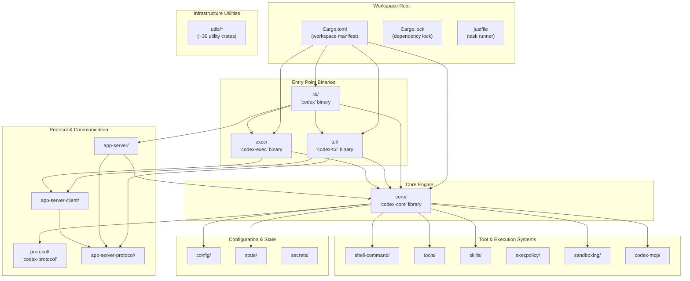
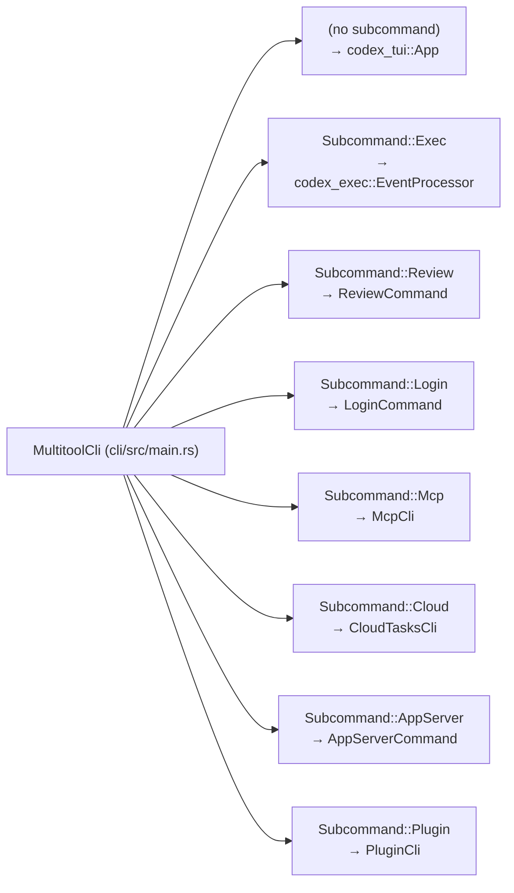
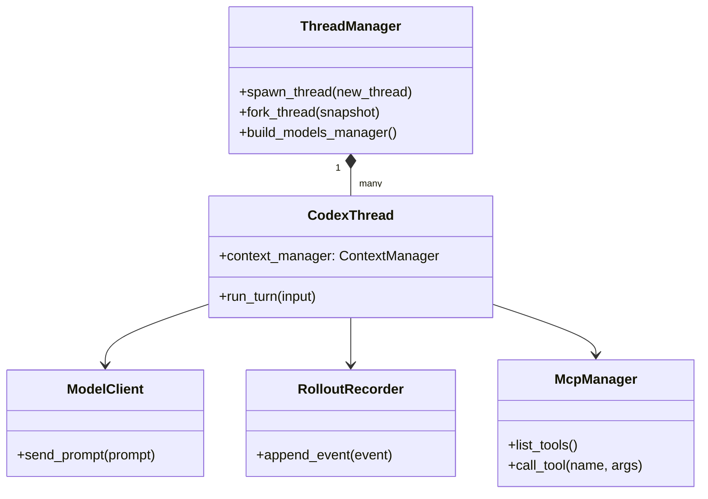

# 저장소 구조

관련 소스 파일

다음 파일들은 이 위키 페이지를 생성하기 위한 컨텍스트로 사용되었습니다.

- [.bazelrc](.bazelrc)
- [.github/scripts/run-bazel-ci.sh](.github/scripts/run-bazel-ci.sh)
- [.github/scripts/run-bazel-query-ci.sh](.github/scripts/run-bazel-query-ci.sh)
- [.github/scripts/run_bazel_with_buildbuddy.py](.github/scripts/run_bazel_with_buildbuddy.py)
- [.github/scripts/rusty_v8_bazel.py](.github/scripts/rusty_v8_bazel.py)
- [.github/scripts/test_run_bazel_with_buildbuddy.py](.github/scripts/test_run_bazel_with_buildbuddy.py)
- [.github/scripts/test_rusty_v8_bazel.py](.github/scripts/test_rusty_v8_bazel.py)
- [.github/workflows/bazel.yml](.github/workflows/bazel.yml)
- [.github/workflows/rusty-v8-release.yml](.github/workflows/rusty-v8-release.yml)
- [.github/workflows/v8-canary.yml](.github/workflows/v8-canary.yml)
- [.gitignore](.gitignore)
- [AGENTS.md](AGENTS.md)
- [CHANGELOG.md](CHANGELOG.md)
- [README.md](README.md)
- [cliff.toml](cliff.toml)
- [codex-cli/package.json](codex-cli/package.json)
- [codex-rs/Cargo.lock](codex-rs/Cargo.lock)
- [codex-rs/Cargo.toml](codex-rs/Cargo.toml)
- [codex-rs/cli/Cargo.toml](codex-rs/cli/Cargo.toml)
- [codex-rs/cli/src/lib.rs](codex-rs/cli/src/lib.rs)
- [codex-rs/cli/src/main.rs](codex-rs/cli/src/main.rs)
- [codex-rs/core/Cargo.toml](codex-rs/core/Cargo.toml)
- [codex-rs/core/src/lib.rs](codex-rs/core/src/lib.rs)
- [codex-rs/default.nix](codex-rs/default.nix)
- [codex-rs/docs/bazel.md](codex-rs/docs/bazel.md)
- [codex-rs/exec/Cargo.toml](codex-rs/exec/Cargo.toml)
- [codex-rs/exec/src/cli.rs](codex-rs/exec/src/cli.rs)
- [codex-rs/exec/src/event_processor.rs](codex-rs/exec/src/event_processor.rs)
- [codex-rs/exec/src/lib.rs](codex-rs/exec/src/lib.rs)
- [codex-rs/responses-api-proxy/npm/package.json](codex-rs/responses-api-proxy/npm/package.json)
- [codex-rs/tui/Cargo.toml](codex-rs/tui/Cargo.toml)
- [codex-rs/tui/src/cli.rs](codex-rs/tui/src/cli.rs)
- [codex-rs/tui/src/lib.rs](codex-rs/tui/src/lib.rs)
- [docs/authentication.md](docs/authentication.md)
- [docs/contributing.md](docs/contributing.md)
- [docs/install.md](docs/install.md)
- [flake.lock](flake.lock)
- [flake.nix](flake.nix)
- [justfile](justfile)
- [package.json](package.json)
- [pnpm-lock.yaml](pnpm-lock.yaml)
- [pnpm-workspace.yaml](pnpm-workspace.yaml)
- [scripts/list-bazel-clippy-targets.sh](scripts/list-bazel-clippy-targets.sh)
- [sdk/typescript/jest.config.cjs](sdk/typescript/jest.config.cjs)
- [sdk/typescript/package.json](sdk/typescript/package.json)
- [sdk/typescript/tsconfig.json](sdk/typescript/tsconfig.json)

이 페이지는 `codex-rs` 저장소의 Cargo workspace 구성, 주요 crate, 의존성 관계를 문서화합니다. 또한 최상위 TypeScript/Python SDK와 배포 인프라도 다룹니다.

## 범위와 구성

`codex-rs` 저장소는 120개가 넘는 멤버 crate를 포함하는 Cargo workspace로 구성되어 있습니다 [codex-rs/Cargo.toml:2-121](). 이 workspace는 모든 crate가 루트 `Cargo.toml` manifest를 통해 공통 도구, 의존성, 빌드 설정을 공유하는 monorepo 구조를 사용합니다 [codex-rs/Cargo.toml:133-218]().

이 프로젝트는 여러 플랫폼(Linux, macOS, Windows)에 걸친 hermetic 빌드와 테스트를 위해 **Bazel**을 활용합니다 [.github/workflows/bazel.yml:1-52](). 이는 V8 같은 복잡한 의존성과 크로스 컴파일 toolchain을 위한 플랫폼별 패치로 지원됩니다 [.github/workflows/bazel.yml:141-157]().

**출처:** [codex-rs/Cargo.toml:1-218](), [.github/workflows/bazel.yml:1-157]()

---

## Workspace 구조

workspace는 [codex-rs/Cargo.toml:1-121]()의 `[workspace]` 섹션에 정의되어 있습니다. `[workspace.package]` 섹션을 통해 모든 멤버에 통일된 edition(2024)과 license(Apache-2.0)를 강제합니다 [codex-rs/Cargo.toml:124-132]().

### Workspace 컴포넌트 맵

다음 다이어그램은 workspace의 주요 기능 그룹 사이의 관계를 보여줍니다.

**시스템 컴포넌트 다이어그램**

**출처:** [codex-rs/Cargo.toml:2-121](), [codex-rs/Cargo.toml:133-218](), [justfile:1-10]()

---

## 진입점 Crate

### CLI 멀티툴(`cli/`)

`codex` 바이너리는 통합 진입점 역할을 하며, 하위 명령을 통해 서로 다른 실행 모드로 라우팅합니다. `MultitoolCli` 구조체는 명령 구조를 정의합니다 [codex-rs/cli/src/main.rs:103-118]().

| 바이너리 이름 | Crate | 주요 기능 |
|-------------|-------|------------------|
| `codex` | `codex-cli` | 하위 명령 라우팅을 포함한 멀티툴 디스패처 [codex-rs/cli/src/main.rs:88-102]() |
| `codex-tui` | `codex-tui` | 대화형 터미널 UI(`codex`를 통해 실행되거나 독립 실행) [codex-rs/tui/Cargo.toml:8-10]() |
| `codex-exec` | `codex-exec` | 비대화형/headless 실행 [codex-rs/exec/Cargo.toml:1-5]() |

**하위 명령 디스패치:**
CLI는 `Exec`, `Review`, `Mcp`, `Cloud`, `AppServer` 같은 하위 명령으로 디스패치합니다 [codex-rs/cli/src/main.rs:120-209]().

**CLI 라우팅 다이어그램**

**출처:** [codex-rs/cli/src/main.rs:103-209](), [codex-rs/cli/Cargo.toml:1-10]()

### 대화형 TUI(`tui/`)

`codex-tui` crate는 [Ratatui](https://ratatui.rs/)로 구축된 전체 화면 터미널 인터페이스를 제공합니다 [codex-rs/tui/Cargo.toml:82-87]().

- **바이너리:** `codex-tui` ([codex-rs/tui/Cargo.toml:9]())
- **프로토콜 통합:** 에이전트 엔진과의 구조화된 통신을 위해 `codex-app-server-protocol` 및 `codex-app-server-client`에 의존합니다 [codex-rs/tui/src/lib.rs:25-31]().
- **컴포넌트 아키텍처:** TUI는 `chatwidget`, `bottom_pane`, `status_indicator_widget` 같은 모듈로 구성되어 있습니다 [codex-rs/tui/src/lib.rs:115-187]().

**출처:** [codex-rs/tui/Cargo.toml:1-167](), [codex-rs/tui/src/lib.rs:115-187]()

---

## 핵심 엔진(`codex-core`)

`codex-core` crate는 세션, 모델 상호작용, 도구 오케스트레이션을 위한 비즈니스 로직을 포함하는 중앙 라이브러리입니다.

**핵심 엔진 클래스 다이어그램**

### 주요 모듈과 Export

루트 모듈 [codex-rs/core/src/lib.rs:1-197]()은 workspace 소비자를 위해 주요 타입을 다시 export합니다.

| Export | 소스 모듈 | 목적 |
|--------|---------------|---------|
| `CodexThread` | [codex-rs/core/src/lib.rs:23]() | 단일 대화 스레드/턴 상태 관리 |
| `ThreadManager` | [codex-rs/core/src/lib.rs:115]() | 스레드 생명주기(spawn/fork/resume) 오케스트레이션 |
| `ModelClient` | [codex-rs/core/src/lib.rs:179]() | LLM API 통신과 재시도 처리 |
| `RolloutRecorder` | [codex-rs/core/src/lib.rs:150]() | 세션 영속화와 이벤트 로깅 처리 |
| `McpManager` | [codex-rs/core/src/lib.rs:55]() | Model Context Protocol 서버 연결 관리 |
| `SkillsManager` | [codex-rs/core/src/lib.rs:89]() | 에이전트 skill 탐색과 주입 |

**출처:** [codex-rs/core/src/lib.rs:1-197](), [codex-rs/core/Cargo.toml:18-120]()

---

## SDK와 외부 패키지

Rust workspace 외에도 저장소에는 외부 통합을 위한 패키지가 포함되어 있습니다.

- **TypeScript SDK (`@openai/codex-sdk`)**: `sdk/typescript/`에 위치하며, Node.js 환경을 위한 프로그래밍 방식 인터페이스를 제공합니다 [sdk/typescript/package.json:2]().
- **Codex CLI NPM Package (`@openai/codex`)**: `codex-cli/`에 위치하며, 이 패키지는 npm을 통한 배포를 위해 컴파일된 Rust 바이너리를 래핑합니다 [codex-cli/package.json:2-8]().
- **Python SDK**: `sdk/python/`에 위치하며, Python 사용자를 위한 클라이언트 추상화를 포함합니다 [codex-rs/Cargo.toml:157-158]().

**출처:** [sdk/typescript/package.json:1-10](), [codex-cli/package.json:1-22](), [codex-rs/Cargo.toml:157-158]()

---

## 빌드와 배포

이 저장소는 특히 크로스 플랫폼 지원과 V8 같은 복잡한 의존성 관리를 위해 고성능 hermetic 빌드 도구인 **Bazel**을 사용합니다 [.github/workflows/bazel.yml:1-18]().

- **플랫폼 지원**: `aarch64-apple-darwin`, `x86_64-unknown-linux-musl`, `x86_64-pc-windows-gnullvm`을 명시적으로 지원합니다 [README.md:47-52]().
- **NPM 배포**: `codex-cli` 패키지는 Node.js 래퍼를 통해 `codex` 명령을 제공합니다 [codex-cli/package.json:6-8]().
- **설치 스크립트**: 공식 설치는 셸 및 PowerShell 스크립트를 통해 처리됩니다 [README.md:18-26]().
- **개발 도구**: 루트 `justfile`은 포맷팅, 테스트, 스키마 생성을 위한 표준화된 명령을 제공합니다 [justfile:1-10]().

**출처:** [.github/workflows/bazel.yml:1-157](), [README.md:14-63](), [codex-cli/package.json:1-22](), [justfile:1-10]()
