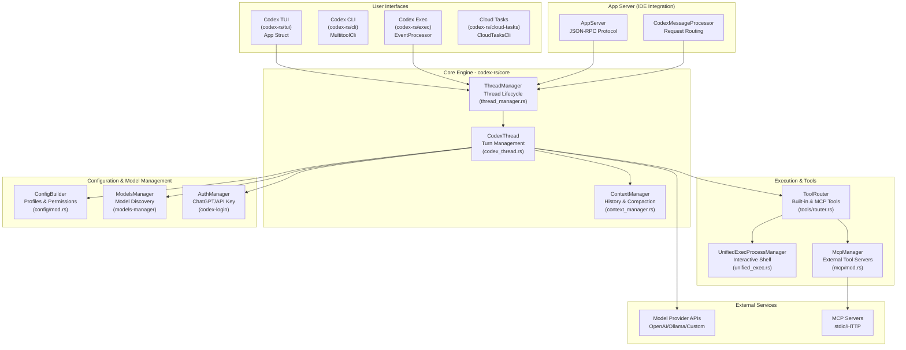
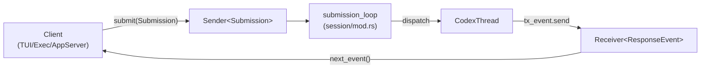
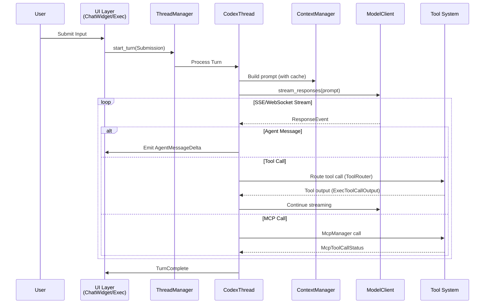
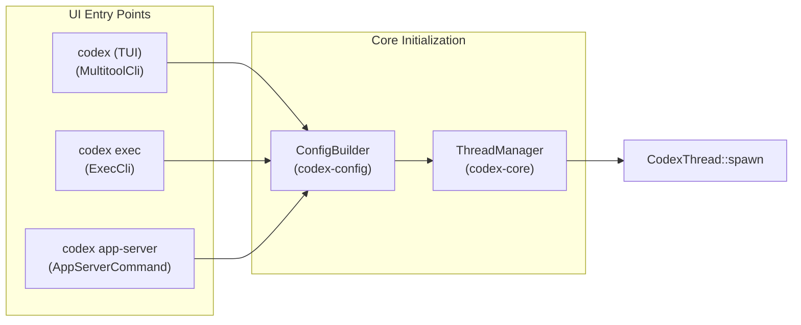
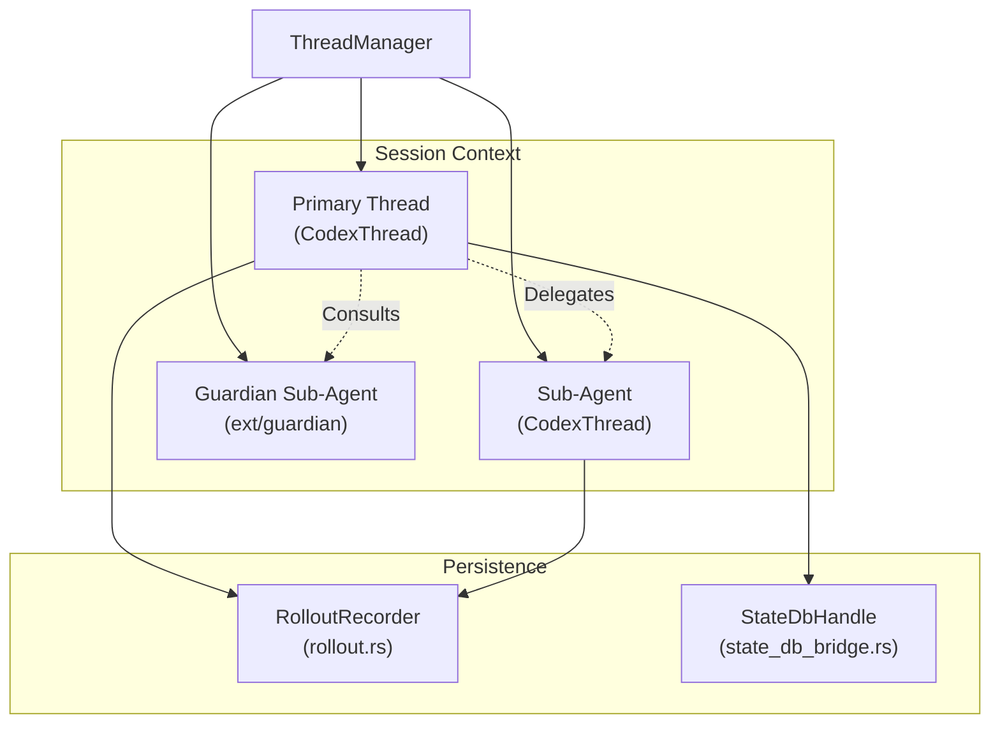
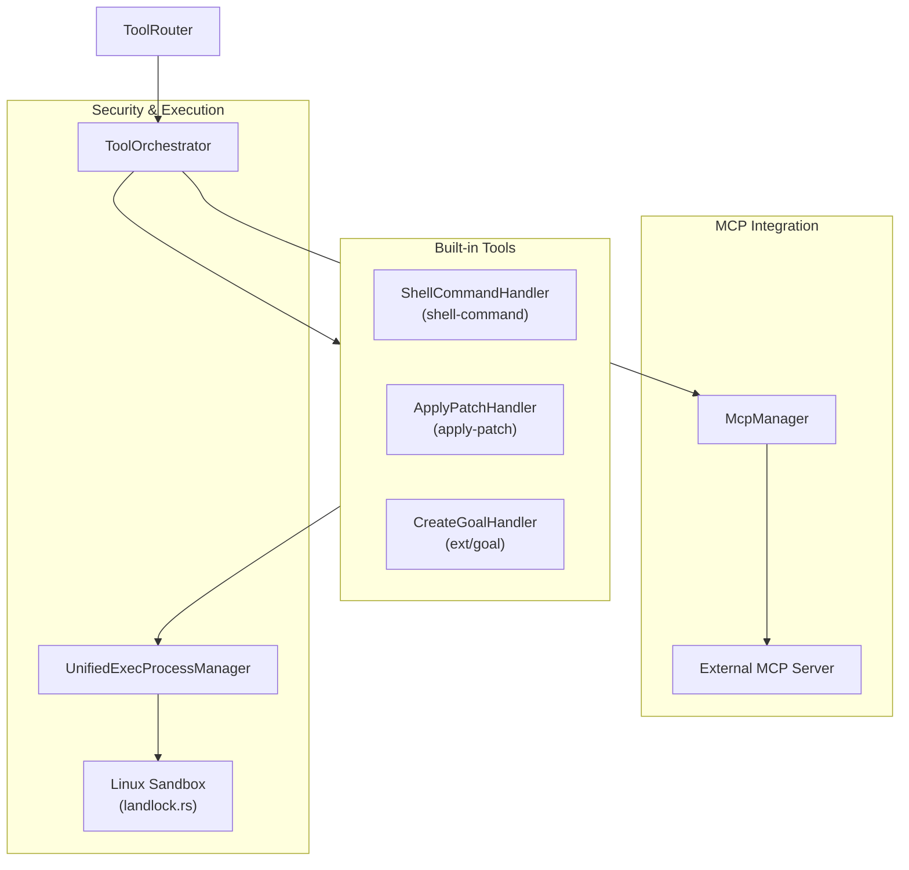

# 아키텍처 개요

관련 소스 파일

다음 파일들은 이 위키 페이지를 생성하기 위한 컨텍스트로 사용되었습니다.

- [codex-rs/Cargo.lock](codex-rs/Cargo.lock)
- [codex-rs/Cargo.toml](codex-rs/Cargo.toml)
- [codex-rs/app-server-protocol/schema/json/ClientRequest.json](codex-rs/app-server-protocol/schema/json/ClientRequest.json)
- [codex-rs/app-server-protocol/schema/json/ServerNotification.json](codex-rs/app-server-protocol/schema/json/ServerNotification.json)
- [codex-rs/app-server-protocol/schema/json/codex_app_server_protocol.schemas.json](codex-rs/app-server-protocol/schema/json/codex_app_server_protocol.schemas.json)
- [codex-rs/app-server-protocol/schema/json/codex_app_server_protocol.v2.schemas.json](codex-rs/app-server-protocol/schema/json/codex_app_server_protocol.v2.schemas.json)
- [codex-rs/app-server-protocol/schema/typescript/ClientRequest.ts](codex-rs/app-server-protocol/schema/typescript/ClientRequest.ts)
- [codex-rs/app-server-protocol/schema/typescript/ServerNotification.ts](codex-rs/app-server-protocol/schema/typescript/ServerNotification.ts)
- [codex-rs/app-server-protocol/schema/typescript/v2/index.ts](codex-rs/app-server-protocol/schema/typescript/v2/index.ts)
- [codex-rs/app-server-protocol/src/protocol/common.rs](codex-rs/app-server-protocol/src/protocol/common.rs)
- [codex-rs/app-server/README.md](codex-rs/app-server/README.md)
- [codex-rs/app-server/src/bespoke_event_handling.rs](codex-rs/app-server/src/bespoke_event_handling.rs)
- [codex-rs/cli/Cargo.toml](codex-rs/cli/Cargo.toml)
- [codex-rs/cli/src/lib.rs](codex-rs/cli/src/lib.rs)
- [codex-rs/cli/src/main.rs](codex-rs/cli/src/main.rs)
- [codex-rs/core/Cargo.toml](codex-rs/core/Cargo.toml)
- [codex-rs/core/src/codex_thread.rs](codex-rs/core/src/codex_thread.rs)
- [codex-rs/core/src/lib.rs](codex-rs/core/src/lib.rs)
- [codex-rs/core/src/session/handlers.rs](codex-rs/core/src/session/handlers.rs)
- [codex-rs/core/src/session/mod.rs](codex-rs/core/src/session/mod.rs)
- [codex-rs/core/src/session/review.rs](codex-rs/core/src/session/review.rs)
- [codex-rs/core/src/session/session.rs](codex-rs/core/src/session/session.rs)
- [codex-rs/core/src/session/tests.rs](codex-rs/core/src/session/tests.rs)
- [codex-rs/core/src/session/turn.rs](codex-rs/core/src/session/turn.rs)
- [codex-rs/core/src/session/turn_context.rs](codex-rs/core/src/session/turn_context.rs)
- [codex-rs/core/src/state/mod.rs](codex-rs/core/src/state/mod.rs)
- [codex-rs/core/src/state/turn.rs](codex-rs/core/src/state/turn.rs)
- [codex-rs/core/src/tasks/compact.rs](codex-rs/core/src/tasks/compact.rs)
- [codex-rs/core/src/tasks/mod.rs](codex-rs/core/src/tasks/mod.rs)
- [codex-rs/core/src/tasks/regular.rs](codex-rs/core/src/tasks/regular.rs)
- [codex-rs/core/src/tasks/review.rs](codex-rs/core/src/tasks/review.rs)
- [codex-rs/core/tests/suite/codex_delegate.rs](codex-rs/core/tests/suite/codex_delegate.rs)
- [codex-rs/exec/Cargo.toml](codex-rs/exec/Cargo.toml)
- [codex-rs/exec/src/cli.rs](codex-rs/exec/src/cli.rs)
- [codex-rs/exec/src/event_processor.rs](codex-rs/exec/src/event_processor.rs)
- [codex-rs/exec/src/lib.rs](codex-rs/exec/src/lib.rs)
- [codex-rs/tools/src/tool_config.rs](codex-rs/tools/src/tool_config.rs)
- [codex-rs/tools/src/tool_config_tests.rs](codex-rs/tools/src/tool_config_tests.rs)
- [codex-rs/tui/Cargo.toml](codex-rs/tui/Cargo.toml)
- [codex-rs/tui/src/cli.rs](codex-rs/tui/src/cli.rs)
- [codex-rs/tui/src/lib.rs](codex-rs/tui/src/lib.rs)

Codex는 TUI, CLI, IDE 통합, 웹 인터페이스 등 여러 실행 모드를 지원하며, 이 모든 모드는 공유 핵심 엔진으로 구동되는 AI 코딩 에이전트입니다. 이 시스템은 비동기적이고 중단 가능한 워크플로를 가능하게 하기 위해 큐 기반 submission/event 프로토콜을 사용합니다.

## 시스템 구성

아키텍처는 여러 주요 기능 영역으로 구성됩니다.

1.  **사용자 인터페이스** – TUI(`codex-rs/tui`), CLI exec 모드(`codex-rs/exec`), IDE app-server(`codex-rs/app-server`), cloud task 인터페이스(`codex-rs/cloud-tasks`).
2.  **핵심 엔진** – 세션 관리, 턴 실행, 이벤트 처리(`codex-rs/core`).
3.  **실행 및 도구** – 승인 워크플로와 샌드박싱을 포함한 내장 도구 및 MCP 도구(`codex-rs/tools`, `codex-rs/codex-mcp`).
4.  **설정 및 모델 관리** – 계층형 설정, 프로파일, 모델 메타데이터, 인증(`codex-rs/config`, `codex-rs/models-manager`, `codex-rs/login`).
5.  **외부 서비스** – 모델 provider API, MCP 서버, cloud backend.
6.  **App Server** – IDE 통합을 위한 JSON-RPC 프로토콜(`codex-rs/app-server-protocol`).

핵심 설계 패턴은 **비동기 submission/event 큐**입니다. 사용자 작업은 `Op`를 포함하는 `Submission` 메시지 [codex-rs/core/src/session/tests.rs:127-127]()로 제출되고, 에이전트가 이를 처리한 뒤 결과가 `ResponseEvent` 항목 [codex-rs/core/src/lib.rs:184-184]()으로 다시 스트리밍됩니다. 이를 통해 모든 인터페이스에서 취소, 중단, 스트리밍 UX가 가능해집니다.

출처: [codex-rs/core/src/lib.rs:1-198](), [codex-rs/Cargo.toml:1-121](), [codex-rs/app-server/README.md:20-30](), [codex-rs/core/src/session/tests.rs:127-127]()

---

## 전체 시스템 개요

아래 다이어그램은 모든 주요 하위 시스템이 어떻게 연결되는지 보여줍니다. 사용자 인터페이스는 핵심 엔진에 작업을 제출하고, 핵심 엔진은 모델 API 호출, 도구 실행, 상태 영속화를 조정합니다.

**다이어그램: 전체 시스템 아키텍처**

**분석**: 이 시스템은 TUI, CLI, AppServer 등 여러 진입점을 지원하며, 모두 `ThreadManager` [codex-rs/core/src/lib.rs:115-115]()로 수렴합니다. `ThreadManager`는 여러 활성 `CodexThread` 인스턴스 [codex-rs/core/src/lib.rs:23-23]()를 조정합니다. 턴 실행 로직은 `CodexThread` [codex-rs/core/src/codex_thread.rs:1-50]() 안에 캡슐화되어 있습니다. 도구는 `ToolRouter` [codex-rs/core/src/session/tests.rs:71-71]()를 통해 내장 구현으로 라우팅되거나, `McpManager` [codex-rs/core/src/lib.rs:55-55]()를 통해 외부 `McpServers`로 라우팅됩니다.

출처: [codex-rs/core/src/lib.rs:23-23](), [codex-rs/core/src/lib.rs:115-115](), [codex-rs/core/src/lib.rs:55-55](), [codex-rs/app-server/README.md:66-73](), [codex-rs/core/src/session/tests.rs:71-71]()

---

## Submission/Event 큐 패턴

핵심 엔진은 비동기 큐 기반 프로토콜을 사용합니다. 클라이언트는 작업을 제출하고 이벤트를 수신합니다.

**다이어그램: Submission 및 Event 흐름**

**주요 프로토콜 타입**:

*   **`Submission`**: 고유 ID와 trace context를 포함해 작업을 감쌉니다 [codex-rs/core/src/session/tests.rs:127-127]().
*   **`Op`**: `UserInput`, `Interrupt`, `SteerInput` 등을 포함하는 작업 변형입니다 [codex-rs/core/src/session/mod.rs:1-100]().
*   **`ResponseEvent`**: 턴 실행 중 방출되는 주요 이벤트 타입으로, 모델 delta와 도구 생명주기를 캡처합니다 [codex-rs/core/src/lib.rs:184-184]().
*   **`ServerNotification`**: JSON-RPC app-server용 알림 타입입니다 [codex-rs/app-server-protocol/src/protocol/common.rs:1-100]().

`ThreadManager`는 이러한 세션과 그 기반 통신 채널의 생명주기를 관리합니다 [codex-rs/core/src/lib.rs:115-116]().

출처: [codex-rs/core/src/lib.rs:184-184](), [codex-rs/core/src/session/tests.rs:127-127](), [codex-rs/core/src/lib.rs:115-116]()

---

## 요청/응답 흐름

턴 실행 로직은 자연어 입력에서 코드 수준 도구 실행과 모델 응답 스트리밍으로 이어지는 전환을 관리합니다.

**다이어그램: 사용자 턴 실행 흐름**

**분석**: `CodexThread`는 단일 턴의 생명주기를 관리합니다 [codex-rs/core/src/lib.rs:23-25](). `ContextManager` [codex-rs/core/src/lib.rs:36-36]()와 상호작용하여 `Prompt` [codex-rs/core/src/lib.rs:183-183]()를 구성하고, 이 프롬프트는 이후 `ModelClient` [codex-rs/core/src/lib.rs:179-179]()로 전송됩니다. 모델 API에서 chunk가 도착하면 `ResponseEvent` 항목 [codex-rs/core/src/lib.rs:184-184]()으로 변환됩니다. 도구 호출은 도구 시스템에서 처리되며, 종종 `ExecToolCallOutput` [codex-rs/core/src/session/tests.rs:40-40]()을 반환합니다.

출처: [codex-rs/core/src/lib.rs:23-25](), [codex-rs/core/src/lib.rs:179-184](), [codex-rs/core/src/session/tests.rs:40-40](), [codex-rs/app-server/README.md:79-82]()

---

## 실행 모드와 진입점

Codex는 서로 다른 진입점을 가진 여러 실행 모드를 지원합니다. 모든 모드는 스레드 생명주기 관리를 위해 `ThreadManager`로 수렴합니다.

**다이어그램: 실행 모드와 진입점**

### 실행 모드 요약

| 모드 | 진입점 | 주요 사용 사례 | 이벤트 처리 |
| :--- | :--- | :--- | :--- |
| **TUI** | `MultitoolCli` [codex-rs/cli/src/main.rs:103]() | 대화형 터미널 세션 | `App` 구조체가 UI 루프 처리 [codex-rs/tui/src/lib.rs:20-20]() |
| **Exec** | `ExecCli` [codex-rs/cli/src/main.rs:124]() | CI/CD, 스크립트, 비대화형 | `EventProcessor`가 출력 처리 [codex-rs/exec/src/lib.rs:157-157]() |
| **App Server** | `AppServerCommand` [codex-rs/cli/src/main.rs:145]() | IDE 확장(VS Code, Cursor) | `codex-app-server` JSON-RPC 브리지 [codex-rs/app-server/README.md:1-3]() |
| **MCP Server** | `McpServerCommand` [codex-rs/cli/src/main.rs:142]() | 다른 에이전트를 위한 도구로서의 Codex | Codex를 도구로 노출 [codex-rs/cli/src/main.rs:142-142]() |

출처: [codex-rs/cli/src/main.rs:103-145](), [codex-rs/tui/src/lib.rs:20-20](), [codex-rs/exec/src/lib.rs:157-157](), [codex-rs/app-server/README.md:1-3]()

---

## 다중 에이전트와 영속화

Codex는 스레드 관리를 통해 다중 에이전트 워크플로를 지원하고, rollout 영속화 시스템을 통해 내구성을 보장합니다.

**다이어그램: 다중 에이전트 스레드 아키텍처**

**분석**: `ThreadManager`는 활성 스레드를 유지합니다 [codex-rs/core/src/lib.rs:115-115](). 각 스레드는 `CodexThread` 인스턴스입니다 [codex-rs/core/src/lib.rs:23-23](). Guardian 하위 에이전트(`codex-rs/core/src/guardian.rs`에서 참조됨)는 내부 분석과 도구 승인에 사용됩니다 [codex-rs/core/src/lib.rs:43-43](). 모든 스레드 이벤트는 `RolloutRecorder`를 통해 JSONL 파일로 영속화되며 [codex-rs/core/src/lib.rs:150-150](), 메타데이터는 `StateDbHandle` [codex-rs/core/src/lib.rs:140-140]()를 통해 관리됩니다.

출처: [codex-rs/core/src/lib.rs:23-23](), [codex-rs/core/src/lib.rs:115-115](), [codex-rs/core/src/lib.rs:140-150](), [codex-rs/core/src/lib.rs:43-43]()

---

## 도구 생태계와 MCP 통합

도구 시스템은 확장 가능하며, 내장 shell/patch 도구와 Model Context Protocol(MCP)을 통한 외부 서버를 모두 지원합니다.

**다이어그램: 도구 시스템 아키텍처**

**분석**: `ToolRouter` [codex-rs/core/src/session/tests.rs:71-71]()가 도구 호출을 디스패치합니다. 내장 shell 도구는 `UnifiedExecProcessManager` [codex-rs/core/src/lib.rs:102-102]()를 사용합니다. 외부 도구는 외부 MCP 서버의 생명주기를 처리하는 `McpManager` [codex-rs/core/src/lib.rs:55-55]()를 통해 접근됩니다. 보안은 `spawn_command_under_linux_sandbox` [codex-rs/core/src/lib.rs:48-48]() 같은 샌드박싱을 통해 강제됩니다.

출처: [codex-rs/core/src/lib.rs:48-55](), [codex-rs/core/src/lib.rs:102-102](), [codex-rs/core/src/session/tests.rs:71-71](), [codex-rs/app-server/README.md:22-23]()
