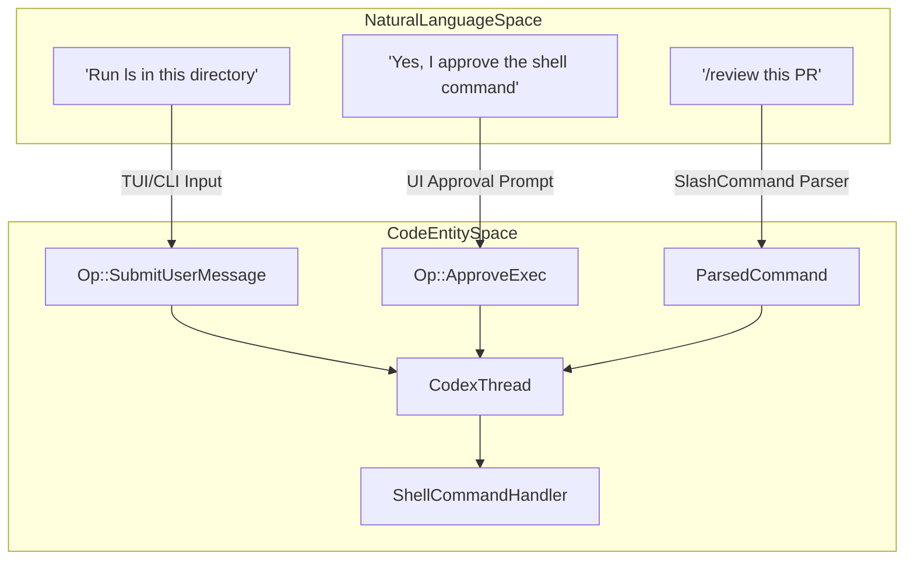
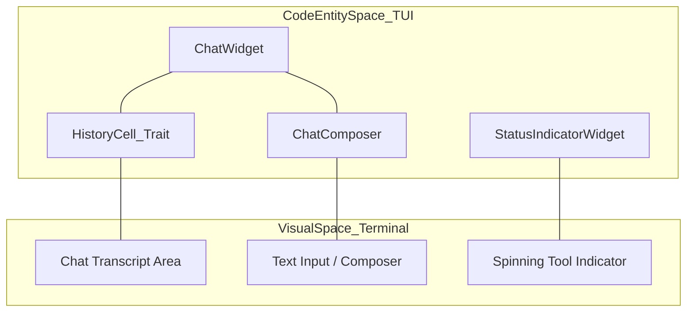
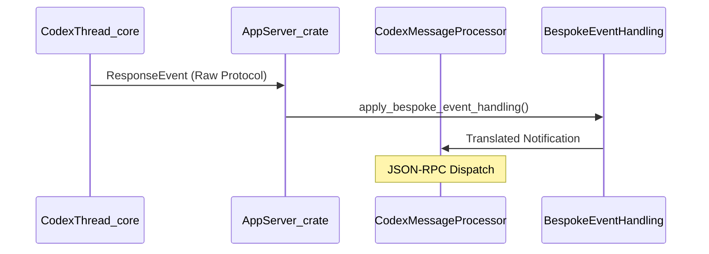

# 용어집

관련 소스 파일

다음 파일들은 이 위키 페이지를 생성하기 위한 컨텍스트로 사용되었습니다.

- [codex-rs/Cargo.lock](codex-rs/Cargo.lock)
- [codex-rs/Cargo.toml](codex-rs/Cargo.toml)
- [codex-rs/app-server-protocol/schema/json/ClientRequest.json](codex-rs/app-server-protocol/schema/json/ClientRequest.json)
- [codex-rs/app-server-protocol/schema/json/ServerNotification.json](codex-rs/app-server-protocol/schema/json/ServerNotification.json)
- [codex-rs/app-server-protocol/schema/json/codex_app_server_protocol.schemas.json](codex-rs/app-server-protocol/schema/json/codex_app_server_protocol.schemas.json)
- [codex-rs/app-server-protocol/schema/json/codex_app_server_protocol.v2.schemas.json](codex-rs/app-server-protocol/schema/json/codex_app_server_protocol.v2.schemas.json)
- [codex-rs/app-server-protocol/schema/typescript/ClientRequest.ts](codex-rs/app-server-protocol/schema/typescript/ClientRequest.ts)
- [codex-rs/app-server-protocol/schema/typescript/ServerNotification.ts](codex-rs/app-server-protocol/schema/typescript/ServerNotification.ts)
- [codex-rs/app-server-protocol/schema/typescript/v2/index.ts](codex-rs/app-server-protocol/schema/typescript/v2/index.ts)
- [codex-rs/app-server-protocol/src/protocol/common.rs](codex-rs/app-server-protocol/src/protocol/common.rs)
- [codex-rs/app-server/README.md](codex-rs/app-server/README.md)
- [codex-rs/app-server/src/bespoke_event_handling.rs](codex-rs/app-server/src/bespoke_event_handling.rs)
- [codex-rs/cli/Cargo.toml](codex-rs/cli/Cargo.toml)
- [codex-rs/cli/src/lib.rs](codex-rs/cli/src/lib.rs)
- [codex-rs/cli/src/main.rs](codex-rs/cli/src/main.rs)
- [codex-rs/config/src/config_toml.rs](codex-rs/config/src/config_toml.rs)
- [codex-rs/config/src/profile_toml.rs](codex-rs/config/src/profile_toml.rs)
- [codex-rs/config/src/schema.rs](codex-rs/config/src/schema.rs)
- [codex-rs/core-api/src/lib.rs](codex-rs/core-api/src/lib.rs)
- [codex-rs/core/Cargo.toml](codex-rs/core/Cargo.toml)
- [codex-rs/core/config.schema.json](codex-rs/core/config.schema.json)
- [codex-rs/core/src/agent/control.rs](codex-rs/core/src/agent/control.rs)
- [codex-rs/core/src/agent/control_tests.rs](codex-rs/core/src/agent/control_tests.rs)
- [codex-rs/core/src/codex_delegate.rs](codex-rs/core/src/codex_delegate.rs)
- [codex-rs/core/src/codex_thread.rs](codex-rs/core/src/codex_thread.rs)
- [codex-rs/core/src/config/config_tests.rs](codex-rs/core/src/config/config_tests.rs)
- [codex-rs/core/src/config/mod.rs](codex-rs/core/src/config/mod.rs)
- [codex-rs/core/src/lib.rs](codex-rs/core/src/lib.rs)
- [codex-rs/core/src/prompt_debug.rs](codex-rs/core/src/prompt_debug.rs)
- [codex-rs/core/src/session/config_lock.rs](codex-rs/core/src/session/config_lock.rs)
- [codex-rs/core/src/session/handlers.rs](codex-rs/core/src/session/handlers.rs)
- [codex-rs/core/src/session/mod.rs](codex-rs/core/src/session/mod.rs)
- [codex-rs/core/src/session/review.rs](codex-rs/core/src/session/review.rs)
- [codex-rs/core/src/session/session.rs](codex-rs/core/src/session/session.rs)
- [codex-rs/core/src/session/tests.rs](codex-rs/core/src/session/tests.rs)
- [codex-rs/core/src/session/tests/guardian_tests.rs](codex-rs/core/src/session/tests/guardian_tests.rs)
- [codex-rs/core/src/session/turn.rs](codex-rs/core/src/session/turn.rs)
- [codex-rs/core/src/session/turn_context.rs](codex-rs/core/src/session/turn_context.rs)
- [codex-rs/core/src/state/mod.rs](codex-rs/core/src/state/mod.rs)
- [codex-rs/core/src/state/service.rs](codex-rs/core/src/state/service.rs)
- [codex-rs/core/src/state/turn.rs](codex-rs/core/src/state/turn.rs)
- [codex-rs/core/src/tasks/compact.rs](codex-rs/core/src/tasks/compact.rs)
- [codex-rs/core/src/tasks/mod.rs](codex-rs/core/src/tasks/mod.rs)
- [codex-rs/core/src/tasks/regular.rs](codex-rs/core/src/tasks/regular.rs)
- [codex-rs/core/src/tasks/review.rs](codex-rs/core/src/tasks/review.rs)
- [codex-rs/core/src/thread_manager.rs](codex-rs/core/src/thread_manager.rs)
- [codex-rs/core/src/thread_manager_tests.rs](codex-rs/core/src/thread_manager_tests.rs)
- [codex-rs/core/src/tools/events.rs](codex-rs/core/src/tools/events.rs)
- [codex-rs/core/src/tools/handlers/apply_patch.rs](codex-rs/core/src/tools/handlers/apply_patch.rs)
- [codex-rs/core/src/tools/handlers/multi_agents_spec.rs](codex-rs/core/src/tools/handlers/multi_agents_spec.rs)
- [codex-rs/core/src/tools/handlers/multi_agents_spec_tests.rs](codex-rs/core/src/tools/handlers/multi_agents_spec_tests.rs)
- [codex-rs/core/src/tools/handlers/multi_agents_tests.rs](codex-rs/core/src/tools/handlers/multi_agents_tests.rs)
- [codex-rs/core/src/tools/handlers/multi_agents_v2.rs](codex-rs/core/src/tools/handlers/multi_agents_v2.rs)
- [codex-rs/core/src/tools/handlers/multi_agents_v2/message_tool.rs](codex-rs/core/src/tools/handlers/multi_agents_v2/message_tool.rs)
- [codex-rs/core/src/tools/handlers/shell.rs](codex-rs/core/src/tools/handlers/shell.rs)
- [codex-rs/core/src/tools/handlers/unified_exec.rs](codex-rs/core/src/tools/handlers/unified_exec.rs)
- [codex-rs/core/src/tools/handlers/view_image.rs](codex-rs/core/src/tools/handlers/view_image.rs)
- [codex-rs/core/src/tools/network_approval.rs](codex-rs/core/src/tools/network_approval.rs)
- [codex-rs/core/src/tools/orchestrator.rs](codex-rs/core/src/tools/orchestrator.rs)
- [codex-rs/core/src/tools/runtimes/apply_patch.rs](codex-rs/core/src/tools/runtimes/apply_patch.rs)
- [codex-rs/core/src/tools/runtimes/mod.rs](codex-rs/core/src/tools/runtimes/mod.rs)
- [codex-rs/core/src/tools/runtimes/mod_tests.rs](codex-rs/core/src/tools/runtimes/mod_tests.rs)
- [codex-rs/core/src/tools/runtimes/shell.rs](codex-rs/core/src/tools/runtimes/shell.rs)
- [codex-rs/core/src/tools/runtimes/unified_exec.rs](codex-rs/core/src/tools/runtimes/unified_exec.rs)
- [codex-rs/core/src/tools/sandboxing.rs](codex-rs/core/src/tools/sandboxing.rs)
- [codex-rs/core/src/turn_diff_tracker.rs](codex-rs/core/src/turn_diff_tracker.rs)
- [codex-rs/core/src/turn_diff_tracker_tests.rs](codex-rs/core/src/turn_diff_tracker_tests.rs)
- [codex-rs/core/src/unified_exec/mod.rs](codex-rs/core/src/unified_exec/mod.rs)
- [codex-rs/core/src/unified_exec/process_manager.rs](codex-rs/core/src/unified_exec/process_manager.rs)
- [codex-rs/core/tests/suite/codex_delegate.rs](codex-rs/core/tests/suite/codex_delegate.rs)
- [codex-rs/core/tests/suite/unified_exec.rs](codex-rs/core/tests/suite/unified_exec.rs)
- [codex-rs/exec/Cargo.toml](codex-rs/exec/Cargo.toml)
- [codex-rs/exec/src/cli.rs](codex-rs/exec/src/cli.rs)
- [codex-rs/exec/src/event_processor.rs](codex-rs/exec/src/event_processor.rs)
- [codex-rs/exec/src/lib.rs](codex-rs/exec/src/lib.rs)
- [codex-rs/features/src/feature_configs.rs](codex-rs/features/src/feature_configs.rs)
- [codex-rs/features/src/lib.rs](codex-rs/features/src/lib.rs)
- [codex-rs/features/src/tests.rs](codex-rs/features/src/tests.rs)
- [codex-rs/rollout-trace/README.md](codex-rs/rollout-trace/README.md)
- [codex-rs/rollout-trace/src/tool_dispatch.rs](codex-rs/rollout-trace/src/tool_dispatch.rs)
- [codex-rs/thread-manager-sample/src/main.rs](codex-rs/thread-manager-sample/src/main.rs)
- [codex-rs/tools/src/tool_config.rs](codex-rs/tools/src/tool_config.rs)
- [codex-rs/tools/src/tool_config_tests.rs](codex-rs/tools/src/tool_config_tests.rs)
- [codex-rs/tui/Cargo.toml](codex-rs/tui/Cargo.toml)
- [codex-rs/tui/src/cli.rs](codex-rs/tui/src/cli.rs)
- [codex-rs/tui/src/lib.rs](codex-rs/tui/src/lib.rs)

이 페이지는 Codex 시스템 전반에서 사용되는 codebase-specific 용어, jargon, 약어를 정의합니다. 온보딩 엔지니어가 개념적 시스템 구성 요소와 Rust의 구체적 구현 사이의 매핑을 이해하기 위한 기술 참조 역할을 합니다.

## 핵심 시스템 엔티티

### Codex
세션의 수명 주기를 관리하는 최상위 agent engine입니다. model interaction, tool execution, state persistence를 조정합니다.
*   **구현**: `Codex`는 시스템을 가리키는 개념적 용어이지만, `CodexThread`가 개별 conversation logic과 turn execution을 관리하는 기본 handle입니다 [codex-rs/core/src/codex_thread.rs:21-23]().
*   **Data Flow**: `ModelClient`를 통해 model interaction을 처리하고 [codex-rs/core/src/lib.rs:179-179](), `ResponseEvent` stream을 통해 event를 내보냅니다 [codex-rs/core/src/lib.rs:184-184]().

### Thread
세션 안의 논리적 conversation container입니다. 하나의 Codex session은 여러 thread를 관리할 수 있습니다(예: 기본 chat thread와 review 또는 research를 위한 sub-agent thread).
*   **구현**: [codex-rs/core/src/thread_manager.rs:115-115]()의 `ThreadManager`가 관리합니다.
*   **식별**: conversation branch의 고유 식별자인 `ThreadId`로 참조됩니다 [codex-rs/protocol/src/protocol.rs:18-18]().

### Turn
conversation의 단일 exchange입니다. 사용자 메시지(또는 agent trigger)에서 시작해 agent가 생성을 멈추거나 사용자 입력이 필요할 때 끝납니다.
*   **Context**: `TurnContext` 구조체는 특정 turn의 environment, prompt, override를 캡슐화합니다 [codex-rs/core/src/session/turn_context.rs:24-24]().
*   **Lifecycle**: turn 실행은 `Turn`이 처리하며 `TurnState`를 통해 추적됩니다 [codex-rs/core/src/session/turn.rs:10-20]().

### Op (Operation)
core engine으로 전송되는 primitive command unit입니다. operation에는 message 제출, tool call 승인, thread 전환 등이 포함됩니다.
*   **구현**: `enum Op`는 사용 가능한 user action 집합을 정의합니다 [codex-rs/protocol/src/protocol.rs:129-130]().

### EventMsg / ResponseEvent
core engine에서 frontend(TUI/App Server)로 전달되는 기본 communication mechanism입니다. token streaming, tool start, error 같은 incremental update를 캡슐화합니다.
*   **구현**: `ResponseEvent`는 state change를 비동기적으로 알리는 데 사용되는 core-api equivalent입니다 [codex-rs/core/src/lib.rs:184-184]().

---

## 아키텍처 매핑: 자연어에서 코드로

다음 다이어그램은 고수준 사용자 개념을 이를 처리하는 특정 코드 엔티티와 연결합니다.

**User Interaction to Code Entity Mapping**

출처: [codex-rs/protocol/src/protocol.rs:126-134](), [codex-rs/core/src/codex_thread.rs:21-23](), [codex-rs/core/src/tools/handlers/shell.rs:1-10]()

**TUI Visual Space to Code Structure**

출처: [codex-rs/tui/src/chatwidget.rs:1-10](), [codex-rs/tui/src/history_cell.rs:143-143](), [codex-rs/tui/src/status_indicator_widget.rs:187-187]()

---

## 기술 용어와 Jargon

| 용어 | 정의 | 코드 위치 |
| :--- | :--- | :--- |
| **Active Cell** | TUI에서 현재 streaming 중이거나 변경 중인 transcript unit입니다(예: live tool output). | [codex-rs/tui/src/chatwidget.rs:6-10]() |
| **Bespoke Event** | core event를 IDE용 특정 JSON-RPC notification으로 변환하기 위한 App Server의 사용자 지정 처리 로직입니다. | [codex-rs/app-server/src/bespoke_event_handling.rs:1-10]() |
| **Compaction** | model context limit 안에 머무르기 위해 오래된 conversation history를 요약하는 과정입니다. | [codex-rs/core/src/lib.rs:195-195]() |
| **Elicitation** | 사용자가 특정 configuration 또는 credential을 제공하도록 요청하는 것입니다(주로 MCP 서버용). | [codex-rs/protocol/src/protocol.rs:19-19]() |
| **Guardian** | 실행 전에 제안된 tool call의 security risk를 review하는 특수 sub-agent입니다. | [codex-rs/core/src/lib.rs:43-43]() |
| **History Cell** | TUI transcript의 renderable unit을 위한 trait입니다. | [codex-rs/tui/src/history_cell.rs:143-143]() |
| **MCP** | Model Context Protocol입니다. Codex가 external tool server에 연결할 수 있게 합니다. | [codex-rs/core/src/lib.rs:49-49]() |
| **Rollout** | replay와 state recovery를 위해 session의 모든 event를 기록하는 persistent file format(`.codex-rollout`)입니다. | [codex-rs/core/src/lib.rs:133-133]() |
| **Sandbox** | untrusted code 실행을 위한 platform-specific isolation(Landlock, Seatbelt, Windows Token)입니다. | [codex-rs/core/src/lib.rs:82-82]() |
| **Skill** | `.codex/skills` 디렉터리에서 로드되는 tool 또는 instruction의 패키지화된 집합입니다. | [codex-rs/core/src/lib.rs:85-89]() |
| **App Server** | IDE extension과 external frontend를 구동하는 JSON-RPC interface입니다. | [codex-rs/app-server/README.md:1-10]() |

---

## 데이터 흐름: Event Processing

시스템은 Core engine이 다양한 frontend에서 소비하고 렌더링하는 event를 stream하는 reactive pattern을 사용합니다.

**Event Translation Pipeline**

출처: [codex-rs/app-server/src/bespoke_event_handling.rs:1-10](), [codex-rs/core/src/codex_thread.rs:21-23]()

---

## Configuration Jargon

*   **Config Layer**: 계층 구조 안의 단일 source of truth입니다(예: `config.toml`, CLI flag, environment variable). `ConfigLayerSource`가 관리합니다 [codex-rs/core/src/config/mod.rs:12-12]().
*   **Constrained**: 값이 특정 validation criteria를 충족하도록 보장하기 위해 configuration에서 사용되는 wrapper type입니다. [codex-rs/core/src/config/mod.rs:149-149]().
*   **Managed Features**: `codex-features` crate에 정의된 runtime-toggled capability(feature flag)입니다 [codex-rs/core/src/config/mod.rs:156-156]().
*   **Personality**: agent의 tone과 instruction set을 조정하는 configuration setting입니다(예: "concise" vs "helpful") [codex-rs/core/src/config/mod.rs:84-84]().
*   **Permission Profile**: session에 적용되는 부여된 capability(filesystem, network)의 집합입니다 [codex-rs/core/src/config/mod.rs:96-96]().
*   **Alt Screen Mode**: TUI가 terminal의 alternate screen buffer를 사용할지 제어합니다 [codex-rs/core/src/config/mod.rs:81-81]().

출처: [codex-rs/core/src/config/mod.rs:1-160](), [codex-rs/protocol/src/protocol.rs:1-105](), [codex-rs/tui/src/lib.rs:1-80]()
