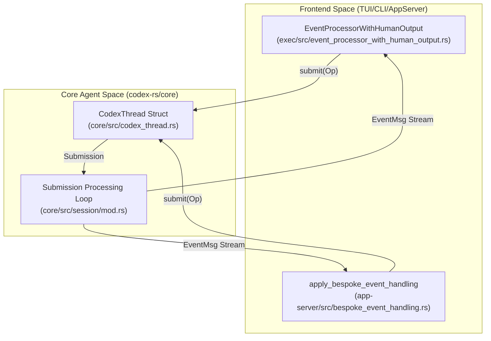
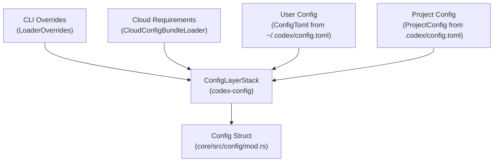
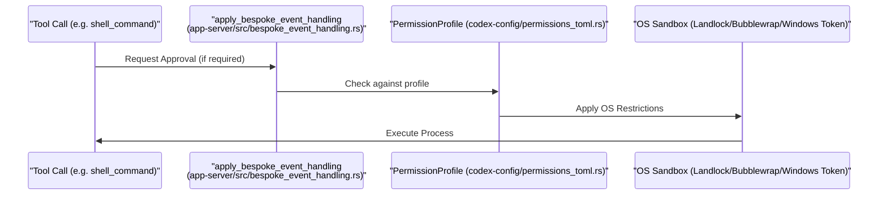

# 핵심 개념

관련 소스 파일

다음 파일들은 이 위키 페이지를 생성하기 위한 컨텍스트로 사용되었습니다.

- [codex-rs/app-server-protocol/schema/json/ClientRequest.json](codex-rs/app-server-protocol/schema/json/ClientRequest.json)
- [codex-rs/app-server-protocol/schema/json/ServerNotification.json](codex-rs/app-server-protocol/schema/json/ServerNotification.json)
- [codex-rs/app-server-protocol/schema/json/codex_app_server_protocol.schemas.json](codex-rs/app-server-protocol/schema/json/codex_app_server_protocol.schemas.json)
- [codex-rs/app-server-protocol/schema/json/codex_app_server_protocol.v2.schemas.json](codex-rs/app-server-protocol/schema/json/codex_app_server_protocol.v2.schemas.json)
- [codex-rs/app-server-protocol/schema/json/v2/RawResponseItemCompletedNotification.json](codex-rs/app-server-protocol/schema/json/v2/RawResponseItemCompletedNotification.json)
- [codex-rs/app-server-protocol/schema/json/v2/ThreadForkParams.json](codex-rs/app-server-protocol/schema/json/v2/ThreadForkParams.json)
- [codex-rs/app-server-protocol/schema/json/v2/ThreadResumeParams.json](codex-rs/app-server-protocol/schema/json/v2/ThreadResumeParams.json)
- [codex-rs/app-server-protocol/schema/json/v2/ThreadStartParams.json](codex-rs/app-server-protocol/schema/json/v2/ThreadStartParams.json)
- [codex-rs/app-server-protocol/schema/json/v2/TurnStartParams.json](codex-rs/app-server-protocol/schema/json/v2/TurnStartParams.json)
- [codex-rs/app-server-protocol/schema/typescript/ClientRequest.ts](codex-rs/app-server-protocol/schema/typescript/ClientRequest.ts)
- [codex-rs/app-server-protocol/schema/typescript/ResponseItem.ts](codex-rs/app-server-protocol/schema/typescript/ResponseItem.ts)
- [codex-rs/app-server-protocol/schema/typescript/ServerNotification.ts](codex-rs/app-server-protocol/schema/typescript/ServerNotification.ts)
- [codex-rs/app-server-protocol/schema/typescript/v2/ThreadForkParams.ts](codex-rs/app-server-protocol/schema/typescript/v2/ThreadForkParams.ts)
- [codex-rs/app-server-protocol/schema/typescript/v2/ThreadResumeParams.ts](codex-rs/app-server-protocol/schema/typescript/v2/ThreadResumeParams.ts)
- [codex-rs/app-server-protocol/schema/typescript/v2/ThreadStartParams.ts](codex-rs/app-server-protocol/schema/typescript/v2/ThreadStartParams.ts)
- [codex-rs/app-server-protocol/schema/typescript/v2/index.ts](codex-rs/app-server-protocol/schema/typescript/v2/index.ts)
- [codex-rs/app-server-protocol/src/protocol/common.rs](codex-rs/app-server-protocol/src/protocol/common.rs)
- [codex-rs/app-server/README.md](codex-rs/app-server/README.md)
- [codex-rs/app-server/src/bespoke_event_handling.rs](codex-rs/app-server/src/bespoke_event_handling.rs)
- [codex-rs/config/src/config_toml.rs](codex-rs/config/src/config_toml.rs)
- [codex-rs/config/src/profile_toml.rs](codex-rs/config/src/profile_toml.rs)
- [codex-rs/config/src/schema.rs](codex-rs/config/src/schema.rs)
- [codex-rs/core-api/src/lib.rs](codex-rs/core-api/src/lib.rs)
- [codex-rs/core/config.schema.json](codex-rs/core/config.schema.json)
- [codex-rs/core/src/config/config_tests.rs](codex-rs/core/src/config/config_tests.rs)
- [codex-rs/core/src/config/mod.rs](codex-rs/core/src/config/mod.rs)
- [codex-rs/core/src/session/config_lock.rs](codex-rs/core/src/session/config_lock.rs)
- [codex-rs/features/src/feature_configs.rs](codex-rs/features/src/feature_configs.rs)
- [codex-rs/features/src/lib.rs](codex-rs/features/src/lib.rs)
- [codex-rs/features/src/tests.rs](codex-rs/features/src/tests.rs)
- [codex-rs/protocol/src/models.rs](codex-rs/protocol/src/models.rs)
- [codex-rs/thread-manager-sample/src/main.rs](codex-rs/thread-manager-sample/src/main.rs)
- [codex-rs/utils/image/src/error.rs](codex-rs/utils/image/src/error.rs)
- [codex-rs/utils/image/src/image_tests.rs](codex-rs/utils/image/src/image_tests.rs)
- [codex-rs/utils/image/src/lib.rs](codex-rs/utils/image/src/lib.rs)

이 페이지는 Codex 코드베이스의 기반을 이루는 기본 아키텍처 패턴과 시스템을 문서화합니다. 이러한 개념은 모든 실행 모드(TUI, CLI, IDE 통합 또는 MCP 서버)에서 변하지 않으며, 세션 관리, 설정, 보안을 위한 핵심 추상화를 제공합니다.

이 개념 위에 구축된 특정 하위 시스템에 대한 자세한 정보는 다음을 참조하세요.
- [프로토콜 계층(Submission/Event 시스템)](#2.1) — 코어와 모든 프런트엔드 사이의 비동기 통신을 조정하는 `Op` submission 큐와 `Event` 스트림 패턴을 문서화합니다.
- [설정 시스템](#2.2) — 계층형 설정 시스템(CLI args → env vars → `config.toml` → defaults)과 `ConfigBuilder`를 설명합니다.
- [기능 플래그](#2.3) — 기능 플래그 시스템, 생명주기 단계(`UnderDevelopment`/`Experimental`/`Stable`/`Deprecated`), 런타임 토글을 문서화합니다.
- [샌드박스 및 승인 정책](#2.4) — 샌드박스 모드(`ReadOnly`/`WorkspaceWrite`/`DangerFullAccess`), 승인 정책, 권한 프로파일을 설명합니다.

---

## Submission/Event 프로토콜

Codex는 사용자 인터페이스(프런트엔드)와 에이전트 엔진(코어) 사이에서 비동기 통신을 수행하기 위해 **Submission Queue(SQ) / Event Queue(EQ)** 패턴을 사용합니다. 이 아키텍처는 코어가 UI를 블로킹하지 않고 오래 실행되는 모델 턴과 도구 실행을 처리할 수 있게 합니다.

### 아키텍처 개요

프런트엔드는 작업(`Op`)을 제출하여 세션과 상호작용하고, 이 작업은 이후 처리됩니다. 이벤트는 `EventMsg` 페이로드를 포함하는 `Event` 스트림을 통해 UI로 되돌아갑니다. `app-server`에서는 이러한 이벤트가 `apply_bespoke_event_handling` [codex-rs/app-server/src/bespoke_event_handling.rs:1-1]()을 통해 `TurnStartedNotification` [codex-rs/app-server/src/bespoke_event_handling.rs:81-81]() 같은 JSON-RPC 알림으로 변환됩니다.

**출처:** [codex-rs/app-server/src/bespoke_event_handling.rs:95-98](), [codex-rs/features/src/lib.rs:7-8]()

### Submission 및 Event 타입

| 기호 | 타입 | 목적 |
|--------|------|---------|
| `Op` | `enum` | `UserInput`, `Interrupt`, `OverrideTurnContext` 같은 작업 [codex-rs/app-server/src/bespoke_event_handling.rs:99-99](). |
| `EventMsg` | `enum` | `TurnStarted`, `AgentMessageDelta`, `SessionConfigured` 같은 페이로드 [codex-rs/protocol/src/protocol.rs:97-97](). |
| `Event` | `struct` | 메타데이터와 함께 `EventMsg`를 감쌉니다 [codex-rs/protocol/src/protocol.rs:96-96](). |

**출처:** [codex-rs/app-server/src/bespoke_event_handling.rs:95-98](), [codex-rs/features/src/lib.rs:7-9]()

---

## 설정 시스템

Codex는 여러 소스의 설정을 병합하는 **계층형 설정 시스템**을 사용합니다. 이 시스템은 로컬 프로젝트 재정의와 조직 요구 사항을 지원합니다.

### 설정 계층 구조

설정은 `ConfigLayerStack` [codex-rs/core/src/config/mod.rs:13-13]()가 관리하는 여러 소스에서 구축됩니다. 이 시스템은 `ProfileV2Name` [codex-rs/core/src/config/mod.rs:22-22]()을 통한 프로파일을 지원하며, `Constrained<T>` [codex-rs/core/src/config/mod.rs:149-149]()를 사용해 값을 고정합니다.

**출처:** [codex-rs/core/src/config/mod.rs:11-15](), [codex-rs/core/src/config/mod.rs:25-30](), [codex-rs/core/src/config/mod.rs:148-152]()

### 제약 검증 및 잠금
조직 정책은 `ConfigRequirements` [codex-rs/core/src/config/mod.rs:15-15]()를 통해 강제됩니다. 이 시스템은 `ConstrainedWithSource` [codex-rs/core/src/config/mod.rs:17-17]()를 사용해 값이 정책으로 고정되어 있는지 또는 재정의 가능한지를 추적합니다. Codex는 세션 재현성을 보장하기 위해 `ConfigLockfileToml` [codex-rs/core/src/config/mod.rs:27-27]()을 지원합니다.

**출처:** [codex-rs/core/src/config/mod.rs:14-16](), [codex-rs/core/src/config/mod.rs:26-27](), [codex-rs/core/src/config/mod.rs:145-148]()

---

## 기능 플래그 시스템

Codex는 실험적 기능을 관리하기 위해 `codex-features`에 정의된 **단계별 기능 플래그 시스템**을 사용합니다.

### 기능 정의와 생명주기

기능은 `Stage` enum [codex-rs/features/src/lib.rs:31-46]()에 정의된 생명주기 단계를 거쳐 진행됩니다.

| 단계 | 가시성 | 설명 |
|-------|-----------|-------------|
| `UnderDevelopment` | 숨김 | 외부 사용 준비가 되지 않음 [codex-rs/features/src/lib.rs:33-33](). |
| `Experimental` | Opt-in | `/experimental` 메뉴를 통해 사용 가능 [codex-rs/features/src/lib.rs:35-39](). |
| `Stable` | 기본값 | 일반 제공 [codex-rs/features/src/lib.rs:41-41](). |
| `Deprecated` | Opt-out | 제거 예정 [codex-rs/features/src/lib.rs:43-43](). |

**출처:** [codex-rs/features/src/lib.rs:28-45](), [codex-rs/features/src/lib.rs:77-184]()

### 런타임 토글
`Feature` enum [codex-rs/features/src/lib.rs:78-78]()은 `CodeMode` [codex-rs/features/src/lib.rs:87-87](), `UnifiedExec` [codex-rs/features/src/lib.rs:91-91](), `NetworkProxy` [codex-rs/features/src/lib.rs:135-135]() 같은 특정 플래그를 정의합니다. 이들은 런타임에 유효한 기능 집합으로 해석됩니다.

**출처:** [codex-rs/features/src/lib.rs:77-184]()

---

## 샌드박스 및 승인 정책

Codex는 도구 실행 중 호스트 환경을 보호하기 위해 **계층형 보안 제어**를 제공합니다.

### 승인 정책
`ApprovalsReviewer` [codex-rs/core/src/config/mod.rs:39-39]()는 승인 요청이 누구에게 라우팅될지 결정합니다.
- `user`: 인간 운영자 [codex-rs/core/config.schema.json:186-186]().
- `auto_review`: 하위 에이전트를 사용하는 위험 기반 의사결정 프레임워크 [codex-rs/core/config.schema.json:187-187]().

**출처:** [codex-rs/core/config.schema.json:183-191](), [codex-rs/core/src/config/mod.rs:39-39]()

### 샌드박스 정책
`SandboxPolicy` [codex-rs/core/src/config/mod.rs:104-104]()는 `PermissionProfile` [codex-rs/core/src/config/mod.rs:96-96]()에서 파생되는 파일시스템 및 네트워크 제한을 정의합니다.

| 정책 컴포넌트 | 타입 | 목적 |
|------------------|------|---------|
| `FileSystemSandboxPolicy` | `struct` | 경로와 접근 모드 정의 [codex-rs/core/src/config/mod.rs:100-100](). |
| `NetworkSandboxPolicy` | `struct` | 네트워크 접근 제어 [codex-rs/core/src/config/mod.rs:101-101](). |
| `SandboxMode` | `enum` | `ReadOnly` 같은 상위 수준 모드 [codex-rs/core/src/config/mod.rs:87-87](). |

**출처:** [codex-rs/core/src/config/mod.rs:86-104](), [codex-rs/core/src/config/config_tests.rs:164-178]()

### 도구 실행 흐름

도구는 `PermissionProfile`에 대해 검사됩니다. `app-server`는 `CommandExecutionRequestApprovalParams` [codex-rs/app-server/src/bespoke_event_handling.rs:19-19]()를 통해 이러한 요청을 처리합니다.

**출처:** [codex-rs/app-server/src/bespoke_event_handling.rs:124-135](), [codex-rs/core/src/config/mod.rs:154-155](), [codex-rs/core/src/config/config_tests.rs:171-180]()

---

## 핵심 데이터 구조

| 기호 | 위치 | 역할 |
|--------|----------|------|
| `ConfigToml` | [codex-rs/core/src/config/mod.rs:28-28]() | `config.toml`의 주요 스키마. |
| `ConfigEditsBuilder` | [codex-rs/core/src/config/mod.rs:4-4]() | 설정 변경을 위한 헬퍼. |
| `PermissionProfile` | [codex-rs/core/src/config/mod.rs:96-96]() | 샌드박스 및 네트워크 권한 모음. |
| `Feature` | [codex-rs/features/src/lib.rs:78-78]() | 시스템 기능 플래그를 정의하는 enum. |
| `AuthMode` | [codex-rs/app-server-protocol/src/protocol/common.rs:21-49]() | 인증 방법(ApiKey, Chatgpt 등)을 정의합니다. |

**출처:** [codex-rs/core/src/config/mod.rs](), [codex-rs/features/src/lib.rs](), [codex-rs/app-server-protocol/src/protocol/common.rs]()
