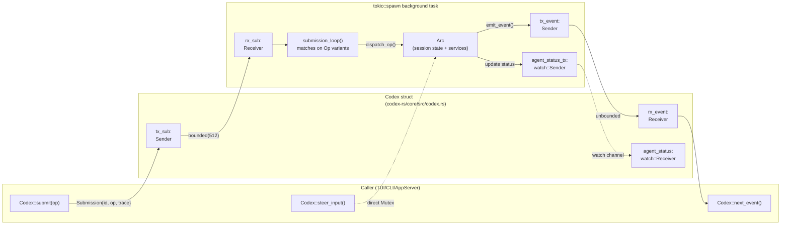
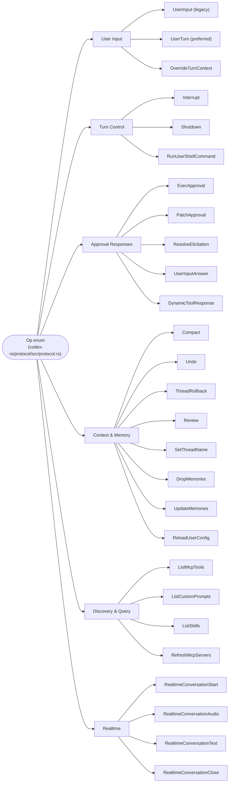
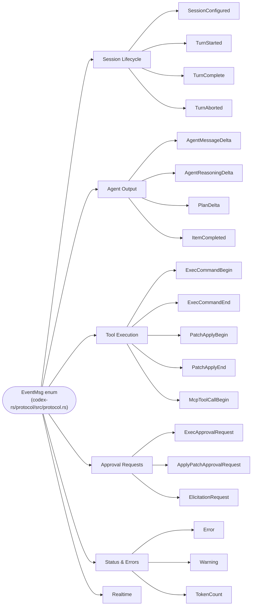
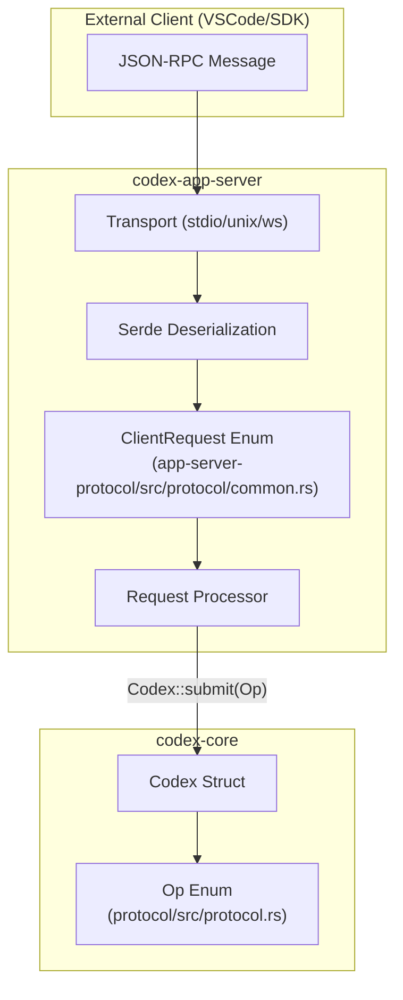
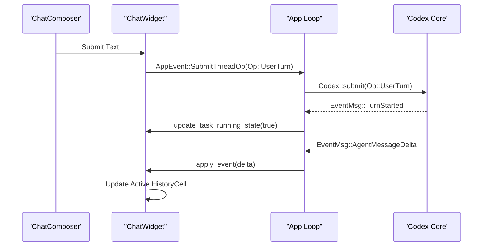

# 프로토콜 계층(Submission/Event 시스템)

<details>
<summary>관련 소스 파일</summary>

다음 파일들은 이 위키 페이지를 생성하기 위한 컨텍스트로 사용되었습니다.

- [codex-rs/app-server-protocol/Cargo.toml](codex-rs/app-server-protocol/Cargo.toml)
- [codex-rs/app-server-protocol/schema/json/ClientRequest.json](codex-rs/app-server-protocol/schema/json/ClientRequest.json)
- [codex-rs/app-server-protocol/schema/json/ServerNotification.json](codex-rs/app-server-protocol/schema/json/ServerNotification.json)
- [codex-rs/app-server-protocol/schema/json/codex_app_server_protocol.schemas.json](codex-rs/app-server-protocol/schema/json/codex_app_server_protocol.schemas.json)
- [codex-rs/app-server-protocol/schema/json/codex_app_server_protocol.v2.schemas.json](codex-rs/app-server-protocol/schema/json/codex_app_server_protocol.v2.schemas.json)
- [codex-rs/app-server-protocol/schema/json/v2/CommandExecParams.json](codex-rs/app-server-protocol/schema/json/v2/CommandExecParams.json)
- [codex-rs/app-server-protocol/schema/json/v2/RawResponseItemCompletedNotification.json](codex-rs/app-server-protocol/schema/json/v2/RawResponseItemCompletedNotification.json)
- [codex-rs/app-server-protocol/schema/json/v2/ThreadForkParams.json](codex-rs/app-server-protocol/schema/json/v2/ThreadForkParams.json)
- [codex-rs/app-server-protocol/schema/json/v2/ThreadResumeParams.json](codex-rs/app-server-protocol/schema/json/v2/ThreadResumeParams.json)
- [codex-rs/app-server-protocol/schema/json/v2/ThreadStartParams.json](codex-rs/app-server-protocol/schema/json/v2/ThreadStartParams.json)
- [codex-rs/app-server-protocol/schema/json/v2/TurnStartParams.json](codex-rs/app-server-protocol/schema/json/v2/TurnStartParams.json)
- [codex-rs/app-server-protocol/schema/typescript/ClientRequest.ts](codex-rs/app-server-protocol/schema/typescript/ClientRequest.ts)
- [codex-rs/app-server-protocol/schema/typescript/ResponseItem.ts](codex-rs/app-server-protocol/schema/typescript/ResponseItem.ts)
- [codex-rs/app-server-protocol/schema/typescript/ServerNotification.ts](codex-rs/app-server-protocol/schema/typescript/ServerNotification.ts)
- [codex-rs/app-server-protocol/schema/typescript/v2/CommandExecParams.ts](codex-rs/app-server-protocol/schema/typescript/v2/CommandExecParams.ts)
- [codex-rs/app-server-protocol/schema/typescript/v2/ThreadForkParams.ts](codex-rs/app-server-protocol/schema/typescript/v2/ThreadForkParams.ts)
- [codex-rs/app-server-protocol/schema/typescript/v2/ThreadResumeParams.ts](codex-rs/app-server-protocol/schema/typescript/v2/ThreadResumeParams.ts)
- [codex-rs/app-server-protocol/schema/typescript/v2/ThreadStartParams.ts](codex-rs/app-server-protocol/schema/typescript/v2/ThreadStartParams.ts)
- [codex-rs/app-server-protocol/schema/typescript/v2/index.ts](codex-rs/app-server-protocol/schema/typescript/v2/index.ts)
- [codex-rs/app-server-protocol/src/lib.rs](codex-rs/app-server-protocol/src/lib.rs)
- [codex-rs/app-server-protocol/src/protocol/common.rs](codex-rs/app-server-protocol/src/protocol/common.rs)
- [codex-rs/app-server-protocol/src/protocol/mappers.rs](codex-rs/app-server-protocol/src/protocol/mappers.rs)
- [codex-rs/app-server-protocol/src/protocol/mod.rs](codex-rs/app-server-protocol/src/protocol/mod.rs)
- [codex-rs/app-server-protocol/src/protocol/v1.rs](codex-rs/app-server-protocol/src/protocol/v1.rs)
- [codex-rs/app-server/README.md](codex-rs/app-server/README.md)
- [codex-rs/app-server/src/bespoke_event_handling.rs](codex-rs/app-server/src/bespoke_event_handling.rs)
- [codex-rs/app-server/src/request_processors/initialize_processor.rs](codex-rs/app-server/src/request_processors/initialize_processor.rs)
- [codex-rs/app-server/tests/suite/v2/command_exec.rs](codex-rs/app-server/tests/suite/v2/command_exec.rs)
- [codex-rs/app-server/tests/suite/v2/connection_handling_websocket_unix.rs](codex-rs/app-server/tests/suite/v2/connection_handling_websocket_unix.rs)
- [codex-rs/app-server/tests/suite/v2/initialize.rs](codex-rs/app-server/tests/suite/v2/initialize.rs)
- [codex-rs/app-server/tests/suite/v2/thread_name_websocket.rs](codex-rs/app-server/tests/suite/v2/thread_name_websocket.rs)
- [codex-rs/protocol/src/models.rs](codex-rs/protocol/src/models.rs)
- [codex-rs/utils/image/src/error.rs](codex-rs/utils/image/src/error.rs)
- [codex-rs/utils/image/src/image_tests.rs](codex-rs/utils/image/src/image_tests.rs)
- [codex-rs/utils/image/src/lib.rs](codex-rs/utils/image/src/lib.rs)

</details>


## 목적과 범위

이 페이지는 모든 사용자 대면 인터페이스와 `codex-core` 에이전트 사이에서 사용되는 핵심 통신 프로토콜을 문서화합니다. 여기에는 `Submission`/`Event` 큐 쌍, 모든 작업과 알림을 정의하는 `Op` 및 `EventMsg` enum, 그리고 `Codex` 구조체의 `submit`/`next_event` 인터페이스가 포함됩니다.

이 프로토콜은 `codex-protocol` crate([codex-rs/protocol/src/protocol.rs]())에 정의되어 있으며, `codex-core`의 `Codex` 구조체가 구현합니다. TUI, headless exec 모드, app server, MCP server 등 모든 클라이언트는 오직 이 인터페이스를 통해서만 에이전트와 통신합니다.

- 에이전트가 턴과 세션 상태를 관리하기 위해 이 프로토콜을 내부적으로 사용하는 방식은 **3.1 Codex Interface and Session Lifecycle**을 참조하세요.
- `Op` 필드에 나타나는 샌드박스 및 승인 정책 타입(`SandboxPolicy`, `AskForApproval`)은 **2.4 Sandbox and Approval Policies**를 참조하세요.
- TUI가 `EventMsg`를 렌더링된 history cell로 변환하는 방식은 **4.1.2 ChatWidget and Conversation Display**를 참조하세요.
- app server가 `EventMsg`를 JSON-RPC 알림으로 변환하는 방식은 **4.5.3 Event Translation and Streaming**을 참조하세요.

출처: [codex-rs/protocol/src/protocol.rs:1-5]()

---

## 핵심 추상화

### `Submission`과 `Op`

`Submission`은 submission 큐에 배치되는 봉투입니다. 고유한 correlation ID를 작업 및 선택적 distributed trace context와 짝지어 둡니다 [codex-rs/protocol/src/protocol.rs:125-133]().

```rust
pub struct Submission {
    /// Unique id for this Submission to correlate with Events
    pub id: String,
    /// Payload
    pub op: Op,
    /// Optional W3C trace carrier propagated across async submission handoffs.
    pub trace: Option<W3cTraceContext>,
}
```

`trace` 필드는 비동기 submission handoff 전반의 distributed tracing을 가능하게 합니다. 존재하는 경우 OpenTelemetry 통합을 위한 `traceparent` 및 `tracestate` 헤더를 담습니다 [codex-rs/protocol/src/protocol.rs:135-143]().

출처: [codex-rs/protocol/src/protocol.rs:125-143]()

`Op`는 클라이언트가 요청할 수 있는 모든 동작을 포괄하는 non-exhaustive enum입니다. 예를 들어 턴 시작, 도구 호출 승인, 코드 리뷰 요청 등이 포함됩니다 [codex-rs/protocol/src/protocol.rs:181-479]().

### `Event`와 `EventMsg`

`Event`는 event 큐에 배치되는 봉투입니다. `id` 필드는 이벤트를 유발한 `Submission.id`를 echo합니다(해당하는 경우) [codex-rs/protocol/src/protocol.rs:555-560]().

```rust
pub struct Event {
    pub id: String,
    pub msg: EventMsg,
}
```

`EventMsg`는 에이전트가 방출할 수 있는 모든 알림의 tagged union이며, 스트리밍 메시지 delta, 도구 실행 상태, 승인 요청 등을 포함합니다 [codex-rs/protocol/src/protocol.rs:563-1081]().

---

## 비동기 큐 모델

이 프로토콜은 `async-channel` 채널을 기반으로 하는 **Submission Queue / Event Queue**(SQ/EQ) 패턴 [codex-rs/protocol/src/protocol.rs:3-4]()으로 구현됩니다. 이를 통해 호출자는 에이전트의 내부 실행 모델과 분리됩니다.

**큐 아키텍처: `Codex` 구조체, 채널, 백그라운드 작업**



출처: [codex-rs/protocol/src/protocol.rs:3-4](), [codex-rs/protocol/src/protocol.rs:125-133]()

| 채널 | 타입 | 용량 | 방향 | 목적 |
|---|---|---|---|---|
| Submission 큐 | `async_channel::bounded` | 512 | 호출자 → Session | 메모리 압박을 방지하기 위해 제한됨 |
| Event 큐 | `async_channel::unbounded` | 무제한 | Session → 호출자 | 에이전트 실행을 절대 블로킹하지 않도록 무제한 |
| Agent 상태 | `tokio::sync::watch` | 1(최신 값) | Session → 호출자 | 현재 에이전트 상태 브로드캐스트 |

---

## `Codex` 인터페이스

`Codex` 구조체는 활성 에이전트 세션에 대한 기본 핸들입니다.

| 메서드 | 시그니처 | 설명 |
|---|---|---|
| `spawn` | `async fn spawn(...)` | 세션을 만들고 `submission_loop`를 spawn합니다. |
| `submit` | `async fn submit(&self, op: Op)` | UUID v7 ID가 있는 `Submission`으로 `op`를 감싸 큐로 보냅니다. |
| `submit_with_id` | `async fn submit_with_id(&self, submission: Submission)` | 미리 구성된 `Submission`을 제출하여 correlation용 사용자 지정 ID를 허용합니다 [codex-rs/protocol/src/protocol.rs:125](). |
| `next_event` | `async fn next_event(&self)` | 에이전트의 다음 이벤트를 기다린 뒤 반환합니다 [codex-rs/protocol/src/protocol.rs:555](). |

출처: [codex-rs/protocol/src/protocol.rs:125-133](), [codex-rs/protocol/src/protocol.rs:555-560]()

---

## Op Variant 참조

**`Op` enum 분류**



출처: [codex-rs/protocol/src/protocol.rs:181-479]()

### 주요 Op Variant

| Variant | 주요 필드 | 참고 |
|---|---|---|
| `UserInput` | `items`, `environments` | 세션 초기화에 사용되는 legacy 입력 variant [codex-rs/protocol/src/protocol.rs:185-196](). |
| `UserTurn` | `items`, `cwd`, `sandbox_policy`, `model` | 에이전트 턴을 시작하는 기본 진입점 [codex-rs/protocol/src/protocol.rs:198-216](). |
| `Interrupt` | — | 현재 턴을 중단합니다 [codex-rs/protocol/src/protocol.rs:242](). |
| `ExecApproval` | `id`, `decision` | shell 명령 승인 요청에 응답합니다 [codex-rs/protocol/src/protocol.rs:260-264](). |
| `PatchApproval` | `id`, `decision` | 파일 patch 승인 요청에 응답합니다 [codex-rs/protocol/src/protocol.rs:266-270](). |

---

## EventMsg Variant 참조

**`EventMsg` enum 분류**



출처: [codex-rs/protocol/src/protocol.rs:563-1081]()

### 주요 EventMsg Variant

| Variant | 주요 필드 | 참고 |
|---|---|---|
| `TurnStarted` | `TurnStartedEvent` | 턴 시작을 알립니다 [codex-rs/protocol/src/protocol.rs:577](). |
| `AgentMessageDelta` | `AgentMessageDeltaEvent` | 스트리밍되는 assistant 텍스트 chunk [codex-rs/protocol/src/protocol.rs:608](). |
| `ExecCommandBegin` | `ExecCommandBeginEvent` | shell 명령 실행이 시작됨 [codex-rs/protocol/src/protocol.rs:664](). |
| `ExecApprovalRequest` | `ExecApprovalRequestEvent` | 에이전트가 명령 실행을 위한 사용자 승인을 기다리는 중 [codex-rs/protocol/src/protocol.rs:821](). |
| `TurnComplete` | `TurnCompleteEvent` | 턴이 완료됨. 최종 usage와 text를 포함합니다 [codex-rs/protocol/src/protocol.rs:589](). |

---

## App Server 프로토콜(v2)

`codex-app-server`는 JSON-RPC 2.0 메시지를 통해 이 프로토콜을 노출합니다 [codex-rs/app-server/README.md:22](). 핵심 `EventMsg` variant를 bespoke server notification으로 변환합니다 [codex-rs/app-server/src/bespoke_event_handling.rs:135-150]().

### 요청/응답 매핑

app server는 핵심 작업을 JSON-RPC 호환 구조로 감싸는 `ClientRequest` enum을 정의합니다 [codex-rs/app-server-protocol/src/protocol/common.rs:176-189](). 이는 `client_request_definitions!` 매크로 [codex-rs/app-server-protocol/src/protocol/common.rs:181-189]()를 사용해 생성됩니다.

**App-Server 요청 라우팅 아키텍처**



출처: [codex-rs/app-server/README.md:22-30](), [codex-rs/app-server-protocol/src/protocol/common.rs:176-189](), [codex-rs/app-server/src/bespoke_event_handling.rs:87-99]()

| App Server 메서드 | Core Op | 참고 |
|---|---|---|
| `thread/start` | `UserInput` | 새 스레드 세션을 초기화합니다 [codex-rs/app-server/README.md:77](). |
| `turn/start` | `UserTurn` | 대화 턴을 시작합니다 [codex-rs/app-server/README.md:79](). |
| `turn/interrupt` | `Interrupt` | 활성 턴을 중단합니다 [codex-rs/app-server/README.md:81](). |

### 이벤트 변환

`codex-app-server`의 `apply_bespoke_event_handling` 함수는 핵심 이벤트를 `ServerNotification` 페이로드로 변환하는 과정을 조정합니다 [codex-rs/app-server/src/bespoke_event_handling.rs:135-150]().

- **스트리밍:** `AgentMessageDelta`는 `AgentMessageDeltaNotification`으로 변환됩니다 [codex-rs/app-server-protocol/schema/json/codex_app_server_protocol.v2.schemas.json:243-267]().
- **승인:** `ExecApprovalRequest`는 UI에서 사용자에게 프롬프트를 띄우기 위해 `CommandExecutionRequestApprovalParams`로 변환됩니다 [codex-rs/app-server/src/bespoke_event_handling.rs:18-22]().
- **Rate Limits:** 사용량 한도가 변경되면 서버가 `AccountRateLimitsUpdatedNotification`을 브로드캐스트합니다 [codex-rs/app-server-protocol/src/protocol/v2.rs:14-16]().

출처: [codex-rs/app-server/src/bespoke_event_handling.rs:1-150](), [codex-rs/app-server-protocol/src/protocol/common.rs:161-189](), [codex-rs/app-server/README.md:64-82]()

---

## TUI 이벤트 조정

TUI는 내부 `AppEvent` 버스를 사용해 `ChatWidget`, `ChatComposer`, 최상위 `App` 루프 사이의 동작을 조정합니다.



- **Submission:** 사용자가 텍스트를 제출하면 `ChatComposer`가 입력 버퍼를 처리하고 `ChatWidget`을 통해 제출을 트리거합니다.
- **상태 추적:** TUI는 spinner와 interrupt hint를 구동하기 위해 `agent_turn_running` 상태를 추적합니다.
- **History 동기화:** Slash command는 핵심 `Op` variant로 디스패치되기 전에 로컬 history에 staged됩니다.

출처: [codex-rs/app-server/README.md:79-81](), [codex-rs/app-server/src/bespoke_event_handling.rs:135-150]()
