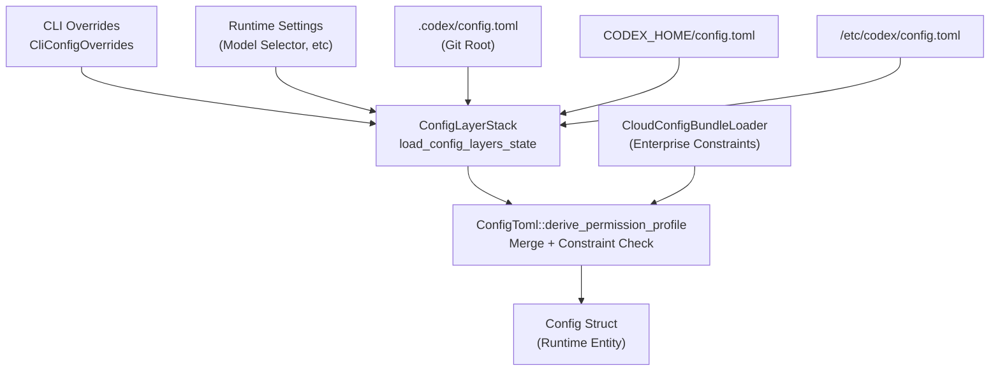
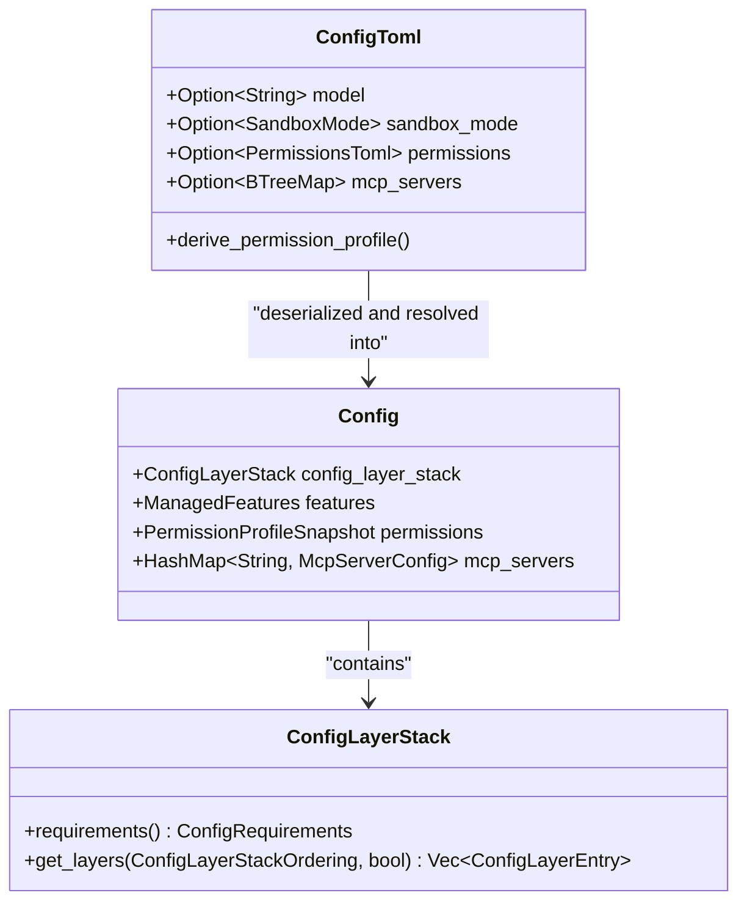
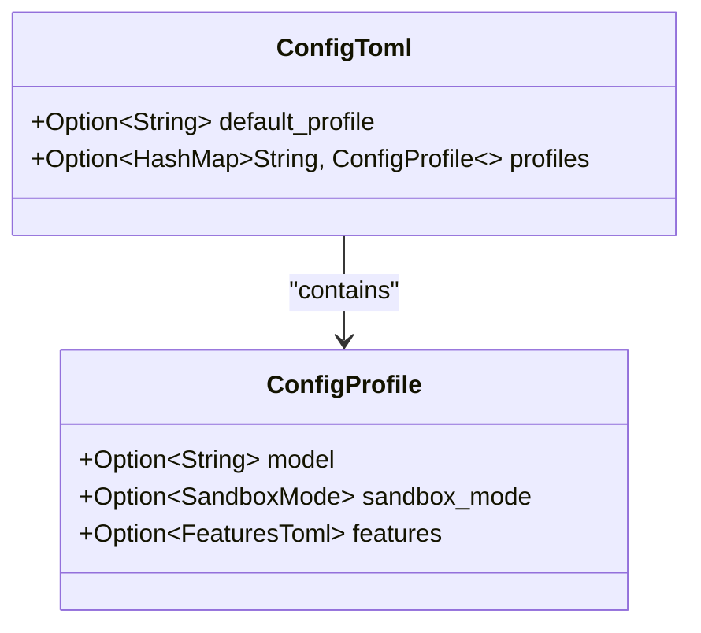
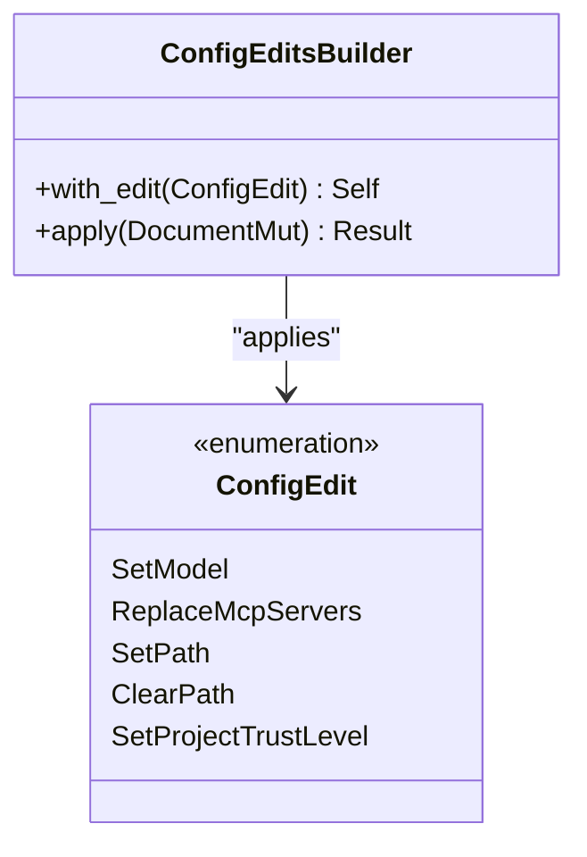

# 설정 시스템

<details>
<summary>관련 소스 파일</summary>

다음 파일들은 이 위키 페이지를 생성하기 위한 컨텍스트로 사용되었습니다.

- [codex-rs/app-server-protocol/schema/json/v2/ConfigRequirementsReadResponse.json](codex-rs/app-server-protocol/schema/json/v2/ConfigRequirementsReadResponse.json)
- [codex-rs/app-server-protocol/schema/typescript/v2/ConfigRequirements.ts](codex-rs/app-server-protocol/schema/typescript/v2/ConfigRequirements.ts)
- [codex-rs/app-server-protocol/src/protocol/v2/config.rs](codex-rs/app-server-protocol/src/protocol/v2/config.rs)
- [codex-rs/app-server-protocol/src/protocol/v2/tests.rs](codex-rs/app-server-protocol/src/protocol/v2/tests.rs)
- [codex-rs/app-server/src/config_manager.rs](codex-rs/app-server/src/config_manager.rs)
- [codex-rs/app-server/src/config_manager_service.rs](codex-rs/app-server/src/config_manager_service.rs)
- [codex-rs/app-server/src/config_manager_service_tests.rs](codex-rs/app-server/src/config_manager_service_tests.rs)
- [codex-rs/app-server/src/request_processors/config_processor.rs](codex-rs/app-server/src/request_processors/config_processor.rs)
- [codex-rs/cli/src/mcp_cmd.rs](codex-rs/cli/src/mcp_cmd.rs)
- [codex-rs/cli/tests/mcp_add_remove.rs](codex-rs/cli/tests/mcp_add_remove.rs)
- [codex-rs/cli/tests/mcp_list.rs](codex-rs/cli/tests/mcp_list.rs)
- [codex-rs/config/src/config_requirements.rs](codex-rs/config/src/config_requirements.rs)
- [codex-rs/config/src/config_toml.rs](codex-rs/config/src/config_toml.rs)
- [codex-rs/config/src/lib.rs](codex-rs/config/src/lib.rs)
- [codex-rs/config/src/loader/mod.rs](codex-rs/config/src/loader/mod.rs)
- [codex-rs/config/src/loader/tests.rs](codex-rs/config/src/loader/tests.rs)
- [codex-rs/config/src/profile_toml.rs](codex-rs/config/src/profile_toml.rs)
- [codex-rs/config/src/schema.rs](codex-rs/config/src/schema.rs)
- [codex-rs/config/src/state.rs](codex-rs/config/src/state.rs)
- [codex-rs/config/src/types.rs](codex-rs/config/src/types.rs)
- [codex-rs/config/src/types_tests.rs](codex-rs/config/src/types_tests.rs)
- [codex-rs/core-api/src/lib.rs](codex-rs/core-api/src/lib.rs)
- [codex-rs/core/config.schema.json](codex-rs/core/config.schema.json)
- [codex-rs/core/src/config/config_loader_tests.rs](codex-rs/core/src/config/config_loader_tests.rs)
- [codex-rs/core/src/config/config_tests.rs](codex-rs/core/src/config/config_tests.rs)
- [codex-rs/core/src/config/mod.rs](codex-rs/core/src/config/mod.rs)
- [codex-rs/core/src/session/config_lock.rs](codex-rs/core/src/session/config_lock.rs)
- [codex-rs/core/tests/suite/remote_env.rs](codex-rs/core/tests/suite/remote_env.rs)
- [codex-rs/exec-server/src/environment_path.rs](codex-rs/exec-server/src/environment_path.rs)
- [codex-rs/exec-server/src/fs_helper.rs](codex-rs/exec-server/src/fs_helper.rs)
- [codex-rs/exec-server/src/fs_sandbox.rs](codex-rs/exec-server/src/fs_sandbox.rs)
- [codex-rs/exec-server/src/local_file_system.rs](codex-rs/exec-server/src/local_file_system.rs)
- [codex-rs/exec-server/src/remote_file_system.rs](codex-rs/exec-server/src/remote_file_system.rs)
- [codex-rs/exec-server/src/sandboxed_file_system.rs](codex-rs/exec-server/src/sandboxed_file_system.rs)
- [codex-rs/exec-server/src/server/file_system_handler.rs](codex-rs/exec-server/src/server/file_system_handler.rs)
- [codex-rs/exec-server/tests/file_system.rs](codex-rs/exec-server/tests/file_system.rs)
- [codex-rs/features/src/feature_configs.rs](codex-rs/features/src/feature_configs.rs)
- [codex-rs/features/src/lib.rs](codex-rs/features/src/lib.rs)
- [codex-rs/features/src/tests.rs](codex-rs/features/src/tests.rs)
- [codex-rs/thread-manager-sample/src/main.rs](codex-rs/thread-manager-sample/src/main.rs)
- [codex-rs/tui/src/debug_config.rs](codex-rs/tui/src/debug_config.rs)
- [docs/config.md](docs/config.md)
- [docs/example-config.md](docs/example-config.md)
- [docs/skills.md](docs/skills.md)
- [docs/slash_commands.md](docs/slash_commands.md)

</details>


## 목적과 범위

설정 시스템은 모델 선택, 샌드박스 정책, 기능 플래그, MCP 서버 연결, 권한 프로파일을 포함한 Codex의 모든 런타임 설정을 관리합니다. 이 시스템은 여러 소스(CLI 인자, 환경 변수, 프로젝트 파일, 전역 파일, 내장 기본값)의 설정을 명확히 정의된 우선순위 규칙에 따라 병합하는 계층형 설정 모델을 구현합니다.

기능 플래그 관리에 대해서는 [기능 플래그](2.3)를 참조하세요. 샌드박스 실행 정책에 대해서는 [샌드박스 및 승인 정책](2.4)을 참조하세요.

---

## 설정 아키텍처

### 설정 소스와 우선순위

설정은 여러 계층에서 조립되며, 각 계층은 점점 낮은 우선순위를 가집니다. 시스템은 런타임에 단일 유효 설정을 구성하기 위해 이러한 계층을 해석합니다.

| 우선순위 | 계층 | 소스 | 범위 |
|----------|-------|--------|-------|
| 1 | Runtime/CLI | `--config` 플래그, UI의 모델 선택기, CLI 재정의 | 호출별 [codex-rs/core/src/config/mod.rs:145-149]() |
| 2 | Repo | `$(git rev-parse --show-toplevel)/.codex/config.toml` | 저장소 [codex-rs/core/src/config/mod.rs:11-13]() |
| 3 | Tree | `./.codex/config.toml`을 찾는 상위 디렉터리 검색 | 디렉터리 트리 [codex-rs/core/src/config/mod.rs:11-13]() |
| 4 | CWD | `${PWD}/config.toml` | 로컬 [codex-rs/core/src/config/mod.rs:11-13]() |
| 5 | User | `${CODEX_HOME}/config.toml` | 사용자 전역 [codex-rs/core/src/config/mod.rs:11-13]() |
| 6 | System | `/etc/codex/config.toml`(Unix) 또는 `%ProgramData%` | 머신 [codex-rs/core/src/config/mod.rs:11-13]() |
| 7 | Admin | 관리형 환경설정(macOS profiles) | 관리형 [codex-rs/core/src/config/mod.rs:11-13]() |

출처: [codex-rs/core/src/config/mod.rs:11-18](), [codex-rs/core/src/config/config_tests.rs:171-186]()

### 설정 계층 병합

`ConfigLayerStack`은 모든 소스의 TOML 값을 병합하며, 더 높은 우선순위의 계층이 더 낮은 우선순위의 계층을 재정의합니다.



**다이어그램: 설정 계층 병합 흐름**

시스템은 `CloudConfigBundleLoader` [codex-rs/core/src/config/mod.rs:10-15]()를 사용해 병합된 설정을 `requirements.toml` 또는 cloud-hosted requirements(Enterprise/Business 사용자용)에 대해 검증합니다. Cloud requirements는 샌드박스 모드, 승인 정책, 기능에 허용되는 값을 제한하여 workspace-managed 정책이 강제되도록 보장합니다 [codex-rs/config/src/config_requirements.rs:144-165]().

출처: [codex-rs/core/src/config/mod.rs:10-18](), [codex-rs/core/src/config/config_tests.rs:171-186](), [codex-rs/config/src/config_requirements.rs:144-165]()

---

## 설정 로딩 프로세스

### 데이터 흐름과 엔티티

설정 프로세스는 원시 TOML 데이터를 코어 에이전트가 사용하는 구조화되고 검증된 Rust 엔티티로 변환합니다.



**다이어그램: Config 엔티티 관계**

### 빌드 프로세스

설정 로딩은 여러 단계를 조정합니다.

1.  **경로 해석**: `codex_home`과 `cwd`를 결정합니다. override 안의 상대 경로는 `cwd`를 기준으로 해석됩니다 [codex-rs/core/src/config/config_tests.rs:177-187]().
2.  **계층 로드**: `load_config_layers_state()`를 호출해 모든 설정 파일을 `ConfigLayerStack`으로 읽어 들입니다 [codex-rs/core/src/config/mod.rs:34-34]().
3.  **역직렬화**: 병합된 TOML을 `ConfigToml`로 변환합니다. 시스템은 TOML 안의 경로(`AgentRoleToml.config_file` 등)가 올바르게 해석되도록 `AbsolutePathBuf`를 사용합니다 [codex-rs/core/config.schema.json:12-19]().
4.  **제약 적용**: `ConfigRequirements`에 대해 검증합니다(예: `allowed_sandbox_modes` 또는 `allowed_web_search_modes`) [codex-rs/core/src/config/mod.rs:14-15](), [codex-rs/tui/src/debug_config.rs:120-148]().
5.  **Config 구성**: 초기화된 `ManagedFeatures`와 `ModelsManagerConfig`를 포함해 최종 `Config` 객체를 빌드합니다 [codex-rs/core/src/config/mod.rs:79-141]().

출처: [codex-rs/core/src/config/mod.rs:10-36](), [codex-rs/core/src/config/config_tests.rs:171-186](), [codex-rs/core/config.schema.json:1-100](), [codex-rs/tui/src/debug_config.rs:60-202]()

---

## Config 구조체

### 주요 필드

`Config` 구조체(흔히 `codex_core::config` 모듈을 통해 참조됨)는 런타임에 모든 컴포넌트가 따르는 단일 진실 공급원입니다.

| 필드 범주 | 주요 필드 | 설명 |
|----------------|-----------|-------------|
| **출처 정보** | `config_layer_stack` | 설정을 빌드하는 데 사용된 전체 소스 스택 [codex-rs/core/src/config/mod.rs:12](). |
| **모델** | `model`, `model_provider` | 기본 LLM 선택 및 provider 정보 [codex-rs/config/src/config_toml.rs:140-146](). |
| **권한** | `permissions` | `PermissionProfileSnapshot`으로 해석된 샌드박스 정책과 승인 요구 사항 [codex-rs/core/src/config/mod.rs:159](). |
| **기능** | `features` | 중앙화된 기능 플래그 상태(`ManagedFeatures`) [codex-rs/core/src/config/mod.rs:153](). |
| **도구** | `mcp_servers` | 외부 도구 설정과 MCP 서버 registry [codex-rs/config/src/config_toml.rs:17-17](). |
| **메모리** | `memories` | memory 시스템을 위한 설정 [codex-rs/config/src/config_toml.rs:18-18](). |

출처: [codex-rs/core/src/config/mod.rs:10-159](), [codex-rs/config/src/config_toml.rs:17-200]()

---

## 설정 프로파일

### 프로파일 정의

설정 프로파일은 `config.toml`의 `profiles` 테이블을 통해 함께 활성화할 수 있는 관련 설정을 그룹화합니다.



**다이어그램: 설정 프로파일 구조**

프로파일 설정은 서로 다른 환경 간 전환을 가능하게 합니다(예: 로컬 모델을 사용하는 "dev" 프로파일과 cloud 모델을 사용하는 "prod" 프로파일) [codex-rs/config/src/config_toml.rs:9-9](). 프로파일은 `ProfileV2Name` [codex-rs/core/src/config/mod.rs:21]()을 사용해 해석됩니다.

출처: [codex-rs/config/src/config_toml.rs:9-10](), [codex-rs/config/src/profile_toml.rs:1-36](), [codex-rs/core/src/config/mod.rs:21]()

---

## MCP 서버 설정

### MCP 서버 정의

MCP 서버는 `[mcp_servers]` 테이블에 정의됩니다. 각 항목은 transport(Stdio 또는 StreamableHttp)와 도구별 설정을 지정합니다 [codex-rs/config/src/config_toml.rs:17-17]().

```toml
[mcp_servers.docs]
transport = { type = "stdio", command = "docs-server", args = [] }
supports_parallel_tool_calls = true
default_tools_approval_mode = "approve"

[mcp_servers.docs.tools.search]
approval_mode = "prompt"
```

출처: [codex-rs/core/src/config/config_tests.rs:113-162](), [codex-rs/cli/src/mcp_cmd.rs:9-12]()

### MCP CLI와 편집

`McpCli`(`codex mcp`로 접근 가능)는 MCP 서버를 관리합니다. `add`, `remove`, `login`, `logout` 같은 하위 명령은 전역 `config.toml`에 변경 사항을 영속화하기 위해 `ConfigEditsBuilder`를 사용합니다 [codex-rs/cli/src/mcp_cmd.rs:34-41]().

출처: [codex-rs/cli/src/mcp_cmd.rs:34-41](), [codex-rs/core/src/config/mod.rs:3-3]()

---

## 설정 편집과 영속화

### ConfigEdit 작업

`ConfigEditsBuilder`는 `config.toml`에 대한 프로그래밍 방식 업데이트를 처리하며, `toml_edit`을 사용해 포맷이 보존되도록 합니다 [codex-rs/core/src/config/edit.rs:19-23]().



**다이어그램: 설정 편집 아키텍처**

개별 mutation에는 모델, service tier, personality 업데이트와 다양한 시스템 notice 확인 처리가 포함됩니다 [codex-rs/core/src/config/edit.rs:31-77](). 파일 손상을 방지하기 위해 `write_atomically`를 통한 atomic write가 수행됩니다 [codex-rs/core/src/config/edit.rs:2-2]().

출처: [codex-rs/core/src/config/edit.rs:1-77](), [codex-rs/core/src/config/config_tests.rs:3-6]()

---

## Cloud Requirements

Business 및 Enterprise 사용자의 경우 Codex는 cloud-managed bundle에서 requirements를 가져올 수 있습니다 [codex-rs/core/src/config/mod.rs:10-10]().

*   **Requirements Stack**: 관리자는 사용자 수준 `config.toml`을 재정의하는 최상위 제약을 `requirements.toml`에서 강제할 수 있습니다 [docs/config.md:9-15]().
*   **Lifecycle Hooks**: requirements에 `allow_managed_hooks_only = true`를 설정하여 managed hook을 강제할 수 있습니다 [docs/config.md:11-13]().
*   **Constraint Logic**: 값은 `ConstrainedWithSource<T>`를 사용해 검증되며, 이는 허용되는 값 범위와 `RequirementSource`(예: `SystemRequirementsToml` 또는 `EnterpriseManaged`)를 모두 추적합니다 [codex-rs/config/src/config_requirements.rs:26-50]().

출처: [codex-rs/core/src/config/mod.rs:10-15](), [docs/config.md:9-15](), [codex-rs/config/src/config_requirements.rs:26-165]()

---

## 설정 파일 위치

| 파일 | 목적 |
|------|---------|
| `~/.codex/config.toml` | 전역 사용자 설정 [codex-rs/config/src/config_toml.rs:136-139](). |
| `.codex/config.toml` | 프로젝트별 재정의 [codex-rs/core/src/config/config_tests.rs:7-14](). |
| `config.schema.json` | 검증 및 IDE 지원을 위한 JSON Schema [codex-rs/core/config.schema.json:1-10](). |
| `requirements.toml` | 관리자가 강제하는 제약과 managed hook [docs/config.md:11-15](). |

출처: [codex-rs/config/src/config_toml.rs:136-139](), [codex-rs/core/src/config/config_tests.rs:7-14](), [codex-rs/core/config.schema.json:1-10](), [docs/config.md:11-15]()
