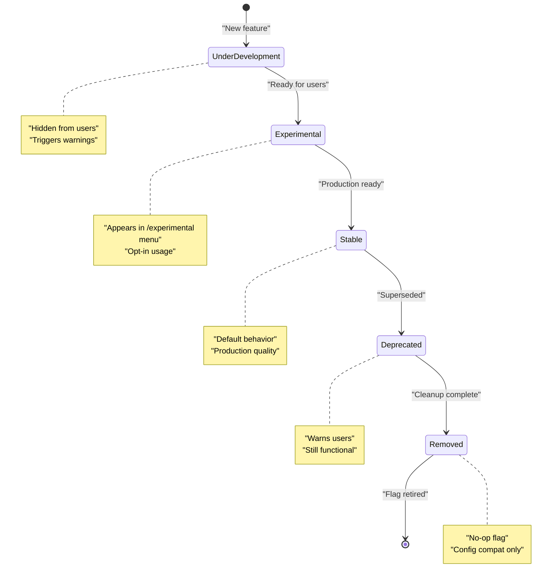
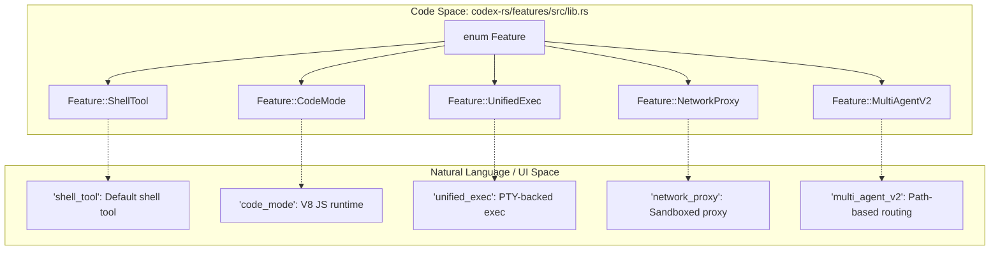
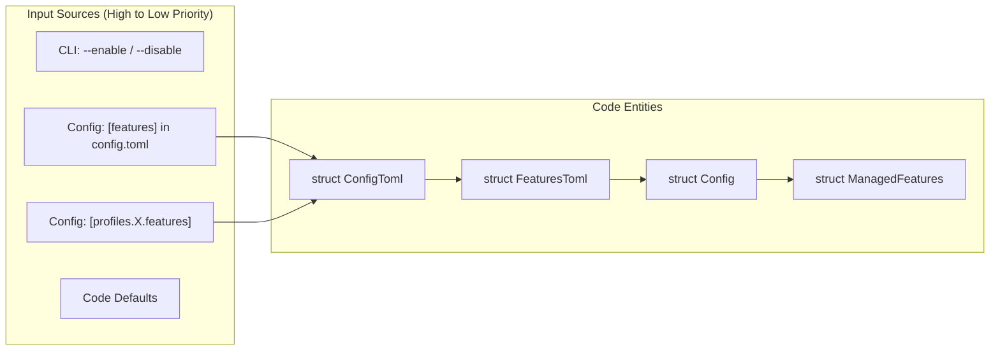

# 기능 플래그

관련 소스 파일

다음 파일들은 이 위키 페이지를 생성하기 위한 컨텍스트로 사용되었습니다.

- [codex-rs/config/src/config_toml.rs](codex-rs/config/src/config_toml.rs)
- [codex-rs/config/src/profile_toml.rs](codex-rs/config/src/profile_toml.rs)
- [codex-rs/config/src/schema.rs](codex-rs/config/src/schema.rs)
- [codex-rs/core-api/src/lib.rs](codex-rs/core-api/src/lib.rs)
- [codex-rs/core/config.schema.json](codex-rs/core/config.schema.json)
- [codex-rs/core/src/config/config_tests.rs](codex-rs/core/src/config/config_tests.rs)
- [codex-rs/core/src/config/mod.rs](codex-rs/core/src/config/mod.rs)
- [codex-rs/core/src/session/config_lock.rs](codex-rs/core/src/session/config_lock.rs)
- [codex-rs/features/src/feature_configs.rs](codex-rs/features/src/feature_configs.rs)
- [codex-rs/features/src/lib.rs](codex-rs/features/src/lib.rs)
- [codex-rs/features/src/tests.rs](codex-rs/features/src/tests.rs)
- [codex-rs/thread-manager-sample/src/main.rs](codex-rs/thread-manager-sample/src/main.rs)

이 문서는 Codex 전반에서 실험적 기능, 선택적 기능, 플랫폼별 기능을 gate하기 위해 사용되는 기능 플래그 시스템을 설명합니다. 기능 플래그는 잘 정의된 생명주기 단계를 통해 점진적 기능 rollout을 가능하게 하며, 사용자가 세션에서 어떤 기능을 활성화할지 세밀하게 제어할 수 있게 합니다.

개별 기능 설정에 대한 정보는 [설정 시스템(2.2)]()을 참조하세요.

---

## 개요

기능 플래그 시스템은 코드베이스 전반의 실험적 및 선택적 동작에 대한 토글을 중앙화합니다. 여러 모듈에 boolean 설정 필드를 흩뿌리는 대신, Codex는 생명주기 단계, 기본 상태, canonical key를 포함하는 일관된 메타데이터와 함께 중앙 registry에 기능을 정의합니다.

기능은 `Features` 구조체 [codex-rs/features/src/lib.rs:66-66]()를 통해 관리되며, 이 구조체는 활성화된 집합을 유지하고 deprecation warning을 위해 legacy 사용 패턴을 추적합니다. 이 시스템은 명확히 정의된 우선순위를 가진 여러 설정 소스, 자동 의존성 해석, `LegacyFeatureToggles` [codex-rs/features/src/lib.rs:26-26]()를 통한 deprecated feature key의 graceful handling을 지원합니다.

**출처:** [codex-rs/features/src/lib.rs:1-76]()

---

## 기능 생명주기 단계

각 기능은 `Stage` enum [codex-rs/features/src/lib.rs:31-46]()으로 표현되는 정의된 생명주기를 거쳐 진행됩니다. 단계는 가시성, 안정성 보장, 사용자 대상 표시 방식을 결정합니다.

### 기능 생명주기 상태 머신
Title: Feature Flag Lifecycle Stages

### 단계 정의

| 단계 | 가시성 | 기본 상태 | 목적 |
|-------|-----------|---------------|---------|
| `UnderDevelopment` | 내부 전용 | `false` | 아직 개발 중이며 외부 사용 준비가 되지 않은 기능 [codex-rs/features/src/lib.rs:33-33](). |
| `Experimental` | `/experimental` 메뉴 | `false` | UI를 통해 사용할 수 있게 제공되는 실험적 기능 [codex-rs/features/src/lib.rs:35-39](). |
| `Stable` | 표준 설정 | 다양함 | 안정화된 기능. 임시 토글을 위해 플래그가 유지됨 [codex-rs/features/src/lib.rs:41-41](). |
| `Deprecated` | 표준 설정 | `false` | 더 이상 사용하지 않아야 하는 기능 [codex-rs/features/src/lib.rs:43-43](). |
| `Removed` | 설정 호환성 | `false` | 하위 호환성을 위해 유지되는 쓸모없는 플래그 [codex-rs/features/src/lib.rs:45-45](). |

**출처:** [codex-rs/features/src/lib.rs:29-74]()

---

## 기능 Registry

모든 기능은 `Feature` enum [codex-rs/features/src/lib.rs:78-223]()에 정의되어 있습니다. 이 registry는 내부 로직을 사용자 대면 key에 매핑합니다.

### 코드 엔티티 매핑: 기능 Registry
Title: Mapping Feature Enums to Registry Metadata

### 기능 정의

registry에는 다양한 기능이 포함됩니다.
- **Stable Tools**: `ShellTool` [codex-rs/features/src/lib.rs:81-81](), `CodexHooks` [codex-rs/features/src/lib.rs:83-83]().
- **실행 및 샌드박싱**: `CodeMode` [codex-rs/features/src/lib.rs:87-87](), `UnifiedExec` [codex-rs/features/src/lib.rs:91-91](), `NetworkProxy` [codex-rs/features/src/lib.rs:135-135](), `UseLegacyLandlock` [codex-rs/features/src/lib.rs:117-119]().
- **에이전트 오케스트레이션**: `MultiAgentV2` [codex-rs/features/src/lib.rs:139-139](), `GuardianApproval` [codex-rs/features/src/tests.rs:128-133]().
- **외부 커넥터**: `Apps` [codex-rs/features/src/lib.rs:143-143](), `EnableMcpApps` [codex-rs/features/src/lib.rs:145-145](), `Plugins` [codex-rs/features/src/lib.rs:157-157]().

**출처:** [codex-rs/features/src/lib.rs:76-223](), [codex-rs/features/src/tests.rs:128-133]()

---

## 설정 소스와 우선순위

기능은 기본 설정 시스템에 통합됩니다. `ConfigToml` 구조체에는 `FeaturesToml` [codex-rs/config/src/config_toml.rs:201-201]()을 담는 `features` 필드가 포함됩니다.

### 데이터 흐름: 기능 토글 병합
Title: Feature Flag Configuration Precedence

### 설정 예시

**`config.toml`의 features 테이블:**
`FeaturesToml` 구조체 [codex-rs/features/src/lib.rs:67-67]()는 사용자가 특정 key를 활성화/비활성화할 수 있게 합니다. 또한 `FeatureToml::Config` [codex-rs/core/src/session/config_lock.rs:150-150]()를 통해 복잡한 기능별 설정 block도 지원합니다.

**Cloud-Managed Requirements:**
시스템은 사용자의 선호와 관계없이 특정 기능 상태를 강제하는 `FeatureRequirementsToml` [codex-rs/core/src/config/mod.rs:18-18]()을 로드할 수 있습니다. 이는 `NetworkProxy` 강제 같은 enterprise 보안 정책에 자주 사용됩니다.

**출처:** [codex-rs/config/src/config_toml.rs:139-201](), [codex-rs/core/src/config/mod.rs:10-27](), [codex-rs/core/src/session/config_lock.rs:144-155]()

---

## 런타임 기능 감지

세션 중 기능 상태는 `Config`로 materialize되고 `features.enabled(Feature::...)` 패턴 [codex-rs/core/src/session/config_lock.rs:149-149]()을 통해 접근됩니다.

### 의존성 해석
시스템은 플래그 사이의 의존성을 처리합니다. 예를 들어 `CodeModeOnly`는 normalization 중 자동으로 `CodeMode`를 요구합니다 [codex-rs/features/src/tests.rs:118-125]().

### 기능별 설정
일부 기능은 `feature_configs.rs`에 정의된 복잡한 구조화 데이터를 요구합니다.
- **`NetworkProxyConfigToml`**: domain 권한, proxy URL, SOCKS5 모드를 설정합니다 [codex-rs/features/src/feature_configs.rs:82-107]().
- **`MultiAgentV2ConfigToml`**: 하위 에이전트의 routing, timeout, usage hint를 설정합니다 [codex-rs/features/src/feature_configs.rs:29-59]().
- **`CodeModeConfigToml`**: V8 실행 환경과 도구 제외를 설정합니다 [codex-rs/features/src/feature_configs.rs:9-15]().

**출처:** [codex-rs/features/src/feature_configs.rs:9-117](), [codex-rs/features/src/tests.rs:118-125](), [codex-rs/core/src/session/config_lock.rs:148-155]()

---

## Legacy 기능 지원

기능 시스템은 이름이 변경되었거나 재구성된 feature key에 대해 하위 호환성을 유지합니다.

### 일반적인 Legacy Alias
| Legacy Key | 현재 기능 | 컨텍스트 |
|-----------|-----------------|---------|
| `apply_patch_freeform` | `Feature::ApplyPatchFreeform` | Removed/Deprecated [codex-rs/features/src/tests.rs:70-77](). |
| `use_legacy_landlock` | `Feature::UseLegacyLandlock` | Deprecated Linux sandbox fallback [codex-rs/features/src/tests.rs:46-49](). |
| `terminal_resize_reflow` | `Feature::TerminalResizeReflow` | Experimental이지만 기본적으로 활성화됨 [codex-rs/features/src/tests.rs:164-174](). |
| `tool_search` | `Feature::ToolSearch` | 제거된 호환성 플래그. 현재는 항상 활성화됨 [codex-rs/features/src/lib.rs:149-149](). |

**출처:** [codex-rs/features/src/tests.rs:46-77, 164-174](), [codex-rs/features/src/lib.rs:149-149]()

---

## Experimental 메뉴 통합

`Experimental` 단계의 기능은 TUI의 `/experimental` 메뉴를 통해 사용자에게 표시됩니다.

- **`experimental_menu_name()`**: UI에 표시할 이름을 반환합니다 [codex-rs/features/src/lib.rs:49-54]().
- **`experimental_menu_description()`**: 사용자를 위한 도움말 텍스트를 반환합니다 [codex-rs/features/src/lib.rs:56-63]().
- **`experimental_announcement()`**: 기능이 처음 토글될 때 표시되는 선택적 텍스트입니다 [codex-rs/features/src/lib.rs:65-73]().

**출처:** [codex-rs/features/src/lib.rs:48-74]()

---

## Config 잠금과 Replay

기능 상태는 세션 계약의 중요한 부분이며 `ConfigLockfileToml` [codex-rs/core/src/session/config_lock.rs:72-77]()에 영속화됩니다.

세션이 replay되거나 검증될 때 `materialize_resolved_enabled` 함수 [codex-rs/core/src/session/config_lock.rs:146-146]()는 원래 실행 중 활성화되어 있던 기능이 복원되도록 하여, legacy key나 기본값이 변경될 때 drift를 방지합니다.

**출처:** [codex-rs/core/src/session/config_lock.rs:71-167]()
