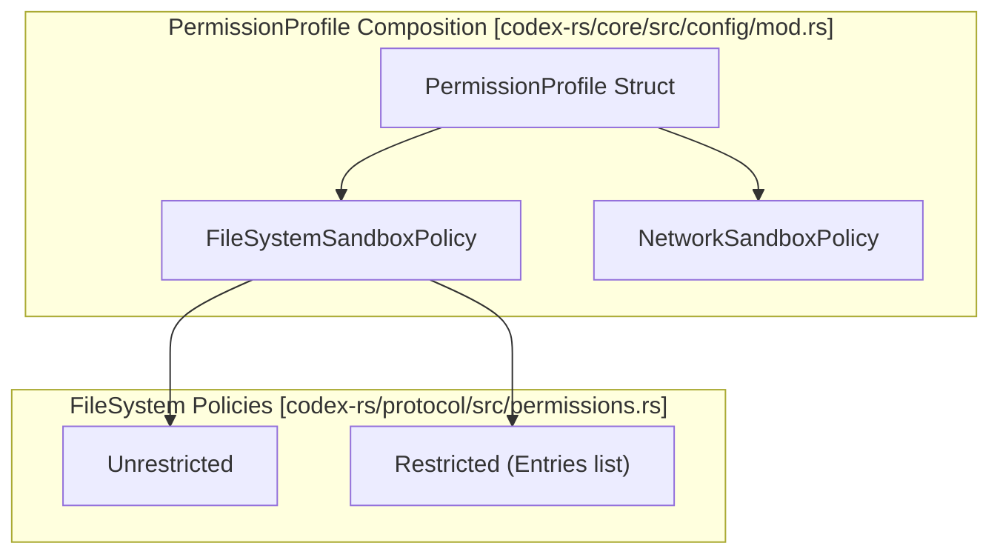
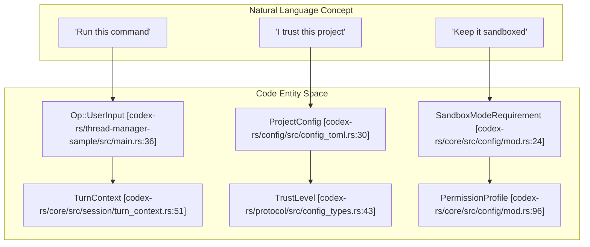

# 샌드박스 및 승인 정책

<details>
<summary>관련 소스 파일</summary>

다음 파일들은 이 위키 페이지를 생성하기 위한 컨텍스트로 사용되었습니다.

- [codex-rs/config/Cargo.toml](codex-rs/config/Cargo.toml)
- [codex-rs/config/src/config_toml.rs](codex-rs/config/src/config_toml.rs)
- [codex-rs/config/src/permissions_toml.rs](codex-rs/config/src/permissions_toml.rs)
- [codex-rs/config/src/profile_toml.rs](codex-rs/config/src/profile_toml.rs)
- [codex-rs/config/src/schema.rs](codex-rs/config/src/schema.rs)
- [codex-rs/core-api/src/lib.rs](codex-rs/core-api/src/lib.rs)
- [codex-rs/core/config.schema.json](codex-rs/core/config.schema.json)
- [codex-rs/core/src/config/config_tests.rs](codex-rs/core/src/config/config_tests.rs)
- [codex-rs/core/src/config/mod.rs](codex-rs/core/src/config/mod.rs)
- [codex-rs/core/src/config/permissions.rs](codex-rs/core/src/config/permissions.rs)
- [codex-rs/core/src/config/permissions_tests.rs](codex-rs/core/src/config/permissions_tests.rs)
- [codex-rs/core/src/exec_policy.rs](codex-rs/core/src/exec_policy.rs)
- [codex-rs/core/src/exec_policy_tests.rs](codex-rs/core/src/exec_policy_tests.rs)
- [codex-rs/core/src/exec_policy_windows_tests.rs](codex-rs/core/src/exec_policy_windows_tests.rs)
- [codex-rs/core/src/network_proxy_loader.rs](codex-rs/core/src/network_proxy_loader.rs)
- [codex-rs/core/src/session/config_lock.rs](codex-rs/core/src/session/config_lock.rs)
- [codex-rs/core/src/tools/runtimes/shell/unix_escalation.rs](codex-rs/core/src/tools/runtimes/shell/unix_escalation.rs)
- [codex-rs/core/src/tools/runtimes/shell/unix_escalation_tests.rs](codex-rs/core/src/tools/runtimes/shell/unix_escalation_tests.rs)
- [codex-rs/core/tests/common/zsh_fork.rs](codex-rs/core/tests/common/zsh_fork.rs)
- [codex-rs/core/tests/suite/approvals.rs](codex-rs/core/tests/suite/approvals.rs)
- [codex-rs/core/tests/suite/exec_policy.rs](codex-rs/core/tests/suite/exec_policy.rs)
- [codex-rs/core/tests/suite/skill_approval.rs](codex-rs/core/tests/suite/skill_approval.rs)
- [codex-rs/core/tests/suite/unified_exec_zsh_fork_approvals.rs](codex-rs/core/tests/suite/unified_exec_zsh_fork_approvals.rs)
- [codex-rs/features/src/feature_configs.rs](codex-rs/features/src/feature_configs.rs)
- [codex-rs/features/src/lib.rs](codex-rs/features/src/lib.rs)
- [codex-rs/features/src/tests.rs](codex-rs/features/src/tests.rs)
- [codex-rs/protocol/src/permissions.rs](codex-rs/protocol/src/permissions.rs)
- [codex-rs/thread-manager-sample/src/main.rs](codex-rs/thread-manager-sample/src/main.rs)

</details>


이 문서는 Codex에서 도구 실행을 제어하는 보안 메커니즘을 설명합니다. **샌드박스 정책**은 shell 명령과 기타 도구의 파일시스템 및 네트워크 접근 제한을 결정하고, **승인 정책**은 실행 전에 사용자가 어떤 동작을 명시적으로 승인해야 하는지 결정합니다. 이 시스템들은 함께 동작하여 완전히 샌드박스된 읽기 전용 접근부터 제한 없는 실행까지 단계적인 신뢰 수준을 제공합니다.

## 보안 정책 개요

Codex는 턴별로 설정되며 도구 실행의 서로 다른 측면을 제어하는 두 가지 직교 정책 시스템을 사용합니다.

| 정책 유형 | 목적 | 코드 엔티티 |
|------------|---------|----------------|
| `PermissionProfile` | 파일시스템 쓰기 접근, 네트워크 접근, 실행 환경 제어 | `codex_protocol::models::PermissionProfile` [codex-rs/core/src/config/mod.rs:96]() |
| `AskForApproval` | 명령 실행 전에 사용자 승인이 필요한 시점 제어 | `codex_protocol::protocol::AskForApproval` [codex-rs/core/src/config/mod.rs:102]() |

`TurnContext` 구조체(및 그에 대응하는 `Permissions` 컨테이너)는 에이전트 스레드의 단일 턴에 대한 유효 보안 상태를 캡슐화합니다.

**출처:** [codex-rs/core/src/config/mod.rs:87-104](), [codex-rs/core/config.schema.json:101-148](), [codex-rs/thread-manager-sample/src/main.rs:177-180]()

## 샌드박스 정책 시스템

### 정책 Variant와 프로파일

이 시스템은 세분화된 `PermissionProfile` 시스템을 활용합니다. 내장 프로파일은 legacy 샌드박스 모드에 매핑되는 표준화된 보안 수준을 제공합니다.

| 프로파일 이름 | 모드 | 설명 |
|--------------|-----------------|-------------|
| `BUILT_IN_READ_ONLY_PROFILE` | `ReadOnly` | 전체 디스크 읽기, 쓰기 없음, 네트워크 없음 [codex-rs/core/src/config/mod.rs:122]() |
| `BUILT_IN_WORKSPACE_PROFILE` | `WorkspaceWrite` | 전체 디스크 읽기, 쓰기는 workspace/temp로 제한, 선택적 네트워크 [codex-rs/core/src/config/mod.rs:123]() |
| `DANGER_FULL_ACCESS` | `DangerFullAccess` | 제한 없음. 전체 디스크 및 네트워크 접근 [codex-rs/core/src/config/config_tests.rs:76]() |



**출처:** [codex-rs/core/src/config/mod.rs:122-130](), [codex-rs/core/src/config/config_tests.rs:75-87](), [codex-rs/core/src/config/permissions.rs:119-125]()

### 관리형 네트워크와 프록시
샌드박스된 세션에서 Codex는 관리형 네트워크 프록시를 시작할 수 있습니다. 이는 `NetworkProxy` 기능 플래그로 제어되며 `NetworkProxyConfigToml` [codex-rs/features/src/lib.rs:135]()을 통해 설정됩니다. 시스템은 도구에 대한 도메인 기반 허용/거부 목록을 강제하기 위해 HTTP 및 SOCKS5 프록시 모드를 모두 지원합니다.

**출처:** [codex-rs/features/src/lib.rs:134-135](), [codex-rs/features/src/feature_configs.rs:21-24](), [codex-rs/core/src/config/mod.rs:124-135]()

## 승인 정책 시스템

### 정책 Variant

`AskForApproval` enum은 사용자 개입이 필요한 시점을 결정합니다. 서로 다른 프롬프트 범주를 독립적으로 토글할 수 있도록 `Granular` 모드를 지원합니다 [codex-rs/core/src/exec_policy.rs:175-198]().

```mermaid
graph TB
    subgraph "AskForApproval Evaluation [codex-rs/core/src/exec_policy.rs]"
        Input["Command / Tool Call"]
        Policy{AskForApproval variant?}
        
        Granular["GranularApprovalConfig"]
        RulesCheck{"allows_rules_approval?"}
        SandboxCheck{"allows_sandbox_approval?"}
        
        Never["Never"]
        Reject["Reject with PROMPT_CONFLICT_REASON"]
        
        AskUser["Ask user / Auto-Review"]
    end
    
    Input --> Policy
    Policy -->|Granular| Granular
    Granular --> RulesCheck
    Granular --> SandboxCheck
    
    RulesCheck -->|False| Reject
    SandboxCheck -->|False| Reject
    
    Policy -->|Never| Never
    Never --> Reject
    
    RulesCheck -->|True| AskUser
end
```

**출처:** [codex-rs/core/src/exec_policy.rs:174-197](), [codex-rs/core/src/tools/runtimes/shell/unix_escalation.rs:80-85]()

### 실행 정책 규칙
Codex는 `.rules` 파일에 정의된 규칙 기반 실행 정책을 지원합니다. 시스템은 실행 전에 명령이 prefix 규칙이나 heuristic과 일치하는지 확인합니다 [codex-rs/core/src/exec_policy.rs:161-166]().

*   **금지된 Prefix:** 시스템은 shell bridge를 우회하려는 경우 검토 대상으로 표시되는 `BANNED_PREFIX_SUGGESTIONS` 목록(예: `sudo`, `python -c`, `bash -lc`)을 유지합니다 [codex-rs/core/src/exec_policy.rs:52-99]().
*   **명령 출처:** `ExecPolicyCommandOrigin`은 Windows 명령 토큰을 위한 일반 heuristic과 PowerShell 전용 heuristic을 구분합니다 [codex-rs/core/src/exec_policy.rs:109-118]().

**출처:** [codex-rs/core/src/exec_policy.rs:43-136](), [codex-rs/core/src/exec_policy_tests.rs:194-213]()

## 구현 세부 사항

### 다중 계층 설정
보안 정책은 계층형 설정 스택(`ConfigLayerStack`)을 통해 해석됩니다. 여기에는 사용자 설정(`config.toml`), 프로젝트별 규칙, cloud-enforced requirements가 포함됩니다 [codex-rs/core/src/config/mod.rs:12-18]().

### 승인 검토자
승인이 필요한 경우 `ApprovalsReviewer` 설정이 라우팅을 결정합니다 [codex-rs/config/src/config_toml.rs:164]().
- `user`: TUI 또는 IDE의 전통적인 대화형 프롬프트.
- `auto_review`(이전 이름 `guardian_subagent`): 하위 에이전트를 사용해 컨텍스트를 수집하고 위험 기반 의사결정 프레임워크를 적용합니다 [codex-rs/core/config.schema.json:183-191]().

**출처:** [codex-rs/core/src/config/mod.rs:39](), [codex-rs/config/src/config_toml.rs:161-168](), [codex-rs/core/config.schema.json:183-191]()

### 자연어를 코드 엔티티에 매핑

이 다이어그램은 상위 수준 보안 개념을 정책 해석 중 사용되는 특정 코드 엔티티와 데이터 구조에 매핑합니다.



**출처:** [codex-rs/core/src/config/mod.rs:22-43](), [codex-rs/config/src/config_toml.rs:135-194](), [codex-rs/thread-manager-sample/src/main.rs:11-64]()

## 플랫폼별 구현

### Linux(Bubblewrap 및 Landlock)
Linux에서 Codex는 기본적으로 격리를 위해 **Bubblewrap**(`bwrap`)을 사용합니다.
- **파일시스템**: 기본적으로 읽기 전용이며, `PermissionProfile`을 통해 명시적 writable root가 제공됩니다.
- **네트워크**: 명시적으로 허용되지 않는 한 network namespace를 통해 격리됩니다.
- **Fallback**: 호스트 커널에서 Bubblewrap을 사용할 수 없거나 지원되지 않는 경우 `UseLegacyLandlock` 기능 플래그를 통해 Landlock 기반 샌드박스로 fallback할 수 있습니다 [codex-rs/features/src/lib.rs:114-119]().

### Windows(Restricted Tokens)
Windows에서 샌드박싱은 restricted access token과 private desktop을 사용합니다 [codex-rs/core/src/config/mod.rs:8-10]().
- **샌드박스 수준**: `WindowsSandboxLevel`(예: `None`, `Low`, `Medium`)을 통해 설정됩니다 [codex-rs/protocol/src/config_types.rs:94]().
- **Private Desktops**: `resolve_windows_sandbox_private_desktop` [codex-rs/core/src/config/mod.rs:10]()을 통해 UI 요소와 window handle을 선택적으로 격리합니다.

**출처:** [codex-rs/core/src/config/mod.rs:7-10](), [codex-rs/features/src/lib.rs:114-119](), [codex-rs/core/src/exec_policy.rs:113-118]()
