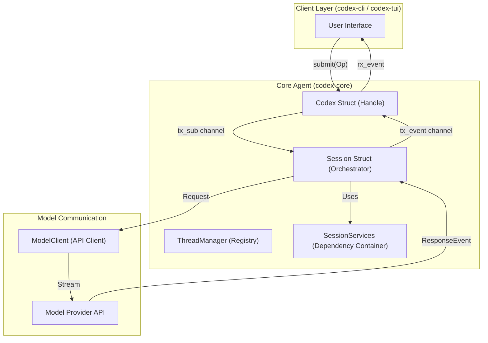

# 핵심 에이전트 시스템(codex-core)

<details>
<summary>관련 소스 파일</summary>

다음 파일들은 이 위키 페이지를 생성하기 위한 컨텍스트로 사용되었습니다.

- [codex-rs/Cargo.lock](codex-rs/Cargo.lock)
- [codex-rs/Cargo.toml](codex-rs/Cargo.toml)
- [codex-rs/cli/Cargo.toml](codex-rs/cli/Cargo.toml)
- [codex-rs/cli/src/lib.rs](codex-rs/cli/src/lib.rs)
- [codex-rs/cli/src/main.rs](codex-rs/cli/src/main.rs)
- [codex-rs/core/Cargo.toml](codex-rs/core/Cargo.toml)
- [codex-rs/core/src/codex_thread.rs](codex-rs/core/src/codex_thread.rs)
- [codex-rs/core/src/lib.rs](codex-rs/core/src/lib.rs)
- [codex-rs/core/src/session/handlers.rs](codex-rs/core/src/session/handlers.rs)
- [codex-rs/core/src/session/mod.rs](codex-rs/core/src/session/mod.rs)
- [codex-rs/core/src/session/review.rs](codex-rs/core/src/session/review.rs)
- [codex-rs/core/src/session/session.rs](codex-rs/core/src/session/session.rs)
- [codex-rs/core/src/session/tests.rs](codex-rs/core/src/session/tests.rs)
- [codex-rs/core/src/session/turn.rs](codex-rs/core/src/session/turn.rs)
- [codex-rs/core/src/session/turn_context.rs](codex-rs/core/src/session/turn_context.rs)
- [codex-rs/core/src/state/mod.rs](codex-rs/core/src/state/mod.rs)
- [codex-rs/core/src/state/turn.rs](codex-rs/core/src/state/turn.rs)
- [codex-rs/core/src/tasks/compact.rs](codex-rs/core/src/tasks/compact.rs)
- [codex-rs/core/src/tasks/mod.rs](codex-rs/core/src/tasks/mod.rs)
- [codex-rs/core/src/tasks/regular.rs](codex-rs/core/src/tasks/regular.rs)
- [codex-rs/core/src/tasks/review.rs](codex-rs/core/src/tasks/review.rs)
- [codex-rs/core/tests/suite/codex_delegate.rs](codex-rs/core/tests/suite/codex_delegate.rs)
- [codex-rs/exec/Cargo.toml](codex-rs/exec/Cargo.toml)
- [codex-rs/exec/src/cli.rs](codex-rs/exec/src/cli.rs)
- [codex-rs/exec/src/event_processor.rs](codex-rs/exec/src/event_processor.rs)
- [codex-rs/exec/src/lib.rs](codex-rs/exec/src/lib.rs)
- [codex-rs/tools/src/tool_config.rs](codex-rs/tools/src/tool_config.rs)
- [codex-rs/tools/src/tool_config_tests.rs](codex-rs/tools/src/tool_config_tests.rs)
- [codex-rs/tui/Cargo.toml](codex-rs/tui/Cargo.toml)
- [codex-rs/tui/src/cli.rs](codex-rs/tui/src/cli.rs)
- [codex-rs/tui/src/lib.rs](codex-rs/tui/src/lib.rs)

</details>


핵심 에이전트 시스템은 Codex의 중앙 오케스트레이션 계층으로, 대화 턴 관리, 모델 API 상호작용 조정, 세션 상태 유지를 담당합니다. 이 문서는 Codex 에이전트를 구동하는 기본 아키텍처, 실행 흐름, 주요 추상화를 다룹니다.

이 시스템과 상호작용하는 특정 사용자 인터페이스에 대한 정보는 [사용자 인터페이스](#4)를 참조하세요. 도구 실행과 승인 워크플로에 대한 세부 사항은 [도구 시스템](#5)을 참조하세요. 설정과 권한은 [샌드박스 및 승인 정책](#2.4)을 참조하세요.

## 아키텍처 개요

핵심 에이전트 시스템은 사용자 인터페이스와 에이전트 사이의 비동기 통신을 위해 **Submission Queue / Event Queue** 패턴을 구현합니다. 사용자는 `Codex` 인터페이스를 통해 사용자 프롬프트나 승인 응답 같은 작업을 제출하고, 에이전트는 작업이 진행됨에 따라 스트림을 통해 이벤트를 방출합니다.

### Submission/Event 패턴



**출처:** [codex-rs/core/src/session/mod.rs:148-154](), [codex-rs/core/src/session/session.rs:21-41](), [codex-rs/core/src/state/mod.rs:1-10]()

### 주요 컴포넌트

| 컴포넌트 | 목적 | 위치 |
|-----------|---------|----------|
| `Codex` | IO 채널(`tx_sub`, `rx_event`)과 상태를 보유하는 스레드용 공개 API 핸들. | [codex-rs/core/src/session/mod.rs:148-154]() |
| `Session` | 상태 머신, 활성 턴, 도구 실행을 관리하는 내부 오케스트레이터. | [codex-rs/core/src/session/mod.rs:42-42]() |
| `TurnContext` | 인증, 모델 정보, 기능을 포함하여 단일 턴에 필요한 불변 컨텍스트. | [codex-rs/core/src/session/turn_context.rs:55-106]() |
| `SessionTask` | 세션 턴(Regular, Review, Compact)을 구동하는 비동기 작업용 trait. | [codex-rs/core/src/tasks/mod.rs:208-224]() |
| `ThreadManager` | 스레드 생성과 메모리 내 유지를 담당. | [codex-rs/core/src/core/src/lib.rs:109-118]() |
| `CodexThread` | 코어 내부의 대화 스레드 표현. | [codex-rs/core/src/codex_thread.rs:23-23]() |

**출처:** [codex-rs/core/src/session/mod.rs:42-154](), [codex-rs/core/src/session/turn_context.rs:55-106](), [codex-rs/core/src/tasks/mod.rs:208-224](), [codex-rs/core/src/lib.rs:109-118]()

## 세션 생명주기

`Codex` 핸들은 단일 대화 스레드를 나타냅니다. 세션은 새 스레드 생성이나 영속 rollout에서의 재개를 처리하는 `ThreadManager`를 통해 관리됩니다.

```mermaid
stateDiagram-v2
    [*] --> StartThread: ThreadManager::start_thread()
    StartThread --> SessionInit: Session::new()
    SessionInit --> Idle: Session loop starts
    Idle --> ActiveTurn: Submission::UserInput
    ActiveTurn --> RunningTask: SessionTask::run()
    RunningTask --> ToolExecution: ToolRouter::handle()
    ToolExecution --> RunningTask: ToolOutput
    RunningTask --> Idle: TurnCompleteEvent
    Idle --> Terminated: CancellationToken triggered
    Terminated --> [*]
```

**출처:** [codex-rs/core/src/session/session.rs:21-41](), [codex-rs/core/src/tasks/mod.rs:208-224](), [codex-rs/core/src/lib.rs:112-115]()

### 다중 에이전트 조정

Codex는 기본 세션이 `AgentControl`을 통해 특화된 하위 에이전트에 작업을 위임할 수 있는 다중 에이전트 아키텍처를 지원합니다.

- **ReviewTask**: 발견 사항을 분석하거나 안전성 검토를 수행하기 위해 하위 에이전트 대화를 spawn하는 특화 작업 [codex-rs/core/src/tasks/review.rs:41-92]().
- **AgentControl**: 새 에이전트를 spawn하는 기능을 제공하고 에이전트 간 통신 계층을 관리합니다 [codex-rs/core/src/session/mod.rs:13-16]().
- **Sub-Agent Configuration**: 컨텍스트를 유지하기 위해 특정 메시지 형식을 사용하여 하위 에이전트에 알릴 수 있습니다 [codex-rs/core/src/session/mod.rs:38-38]().

**출처:** [codex-rs/core/src/tasks/review.rs:41-92](), [codex-rs/core/src/session/mod.rs:13-38]()

## 모델 클라이언트와 API 통신

`ModelClient`는 모델 provider 상호작용의 생명주기를 관리합니다. 턴마다 응답을 스트리밍하기 위한 `ModelClientSession`을 생성합니다.

- **Pre-Sampling Compaction**: 턴이 시작되기 전에 시스템은 스레드가 토큰 한도를 초과하는지 확인하고 필요한 경우 `run_pre_sampling_compact`를 실행합니다 [codex-rs/core/src/session/turn.rs:149-155]().
- **Model Discovery**: `SharedModelsManager`는 사용 가능한 모델 정보의 가져오기와 캐싱을 처리합니다 [codex-rs/core/src/tasks/mod.rs:39-39]().

**출처:** [codex-rs/core/src/session/turn.rs:149-155](), [codex-rs/core/src/tasks/mod.rs:39-39]()

## 턴 실행과 프롬프트 구성

Codex의 모든 상호작용은 `SessionTask`가 구동하는 턴 루프 안에서 처리됩니다.

### 턴 실행 흐름
1. **입력 처리**: 세션은 `TurnInput`을 수신하고 `TurnContext`를 초기화합니다 [codex-rs/core/src/session/turn.rs:135-142]().
2. **컨텍스트 주입**: 현재 설정과 사용자 mention을 기반으로 skill과 plugin이 프롬프트에 주입됩니다 [codex-rs/core/src/session/turn.rs:7-37]().
3. **Sampling 루프**: `run_turn`은 모델이 `ResponseEvent` 항목(텍스트 또는 도구 호출)을 방출하는 루프에 진입합니다 [codex-rs/core/src/session/turn.rs:135-142]().
4. **도구 실행**: 함수 호출은 `ToolRouter`를 통해 라우팅되고 결과는 다음 sampling 요청으로 다시 전달됩니다 [codex-rs/core/src/session/turn.rs:54-58]().

**출처:** [codex-rs/core/src/session/turn.rs:7-142]()

### 상태와 영속화
- **세션 상태**: 대화 기록과 `ActiveTurn` 같은 활성 작업을 추적합니다 [codex-rs/core/src/tasks/mod.rs:31-35]().
- **Rollout 영속화**: 세션은 항목이 상태 데이터베이스에 영속화되도록 보장하는 `RolloutRecorder`로 뒷받침됩니다 [codex-rs/core/src/lib.rs:147-158]().
- **토큰 사용량**: 토큰 수는 턴별로 추적되며 `TURN_TOKEN_USAGE_METRIC`을 통해 telemetry에 기록됩니다 [codex-rs/core/src/tasks/mod.rs:44-49]().

**출처:** [codex-rs/core/src/tasks/mod.rs:31-49](), [codex-rs/core/src/lib.rs:147-158]()

## 핵심 하위 시스템

다음 하위 페이지는 주요 하위 시스템을 자세히 다룹니다.

- **[Codex Interface and Session Lifecycle](#3.1)**: `Codex` 구조체, submission loop, 스레드 관리를 설명합니다 [codex-rs/core/src/session/mod.rs]().
- **[Model Client and API Communication](#3.2)**: `ModelClient`, transport 선택, 통신 로직을 문서화합니다 [codex-rs/core/src/lib.rs:179-180]().
- **[Turn Execution and Prompt Construction](#3.3)**: 턴 컨텍스트와 프롬프트 구성을 설명합니다 [codex-rs/core/src/session/turn_context.rs]().
- **[Event Processing and State Management](#3.4)**: `SessionState`와 이벤트 방출을 문서화합니다 [codex-rs/core/src/state/mod.rs]().
- **[Conversation History Management](#3.5)**: history 생명주기와 `ResponseItem` 저장을 설명합니다 [codex-rs/core/src/session/mod.rs:107]().
- **[Thread Management and Multi-Agent](#3.6)**: `ThreadManager`와 하위 에이전트 spawning을 문서화합니다 [codex-rs/core/src/lib.rs:109-118]().
- **[Session Tasks and Turn State](#3.7)**: `SessionTask` trait와 `TurnState`를 설명합니다 [codex-rs/core/src/tasks/mod.rs]().
- **[Models Manager](#3.8)**: `SharedModelsManager`를 통한 모델 discovery를 문서화합니다 [codex-rs/core/src/tasks/mod.rs:39]().
- **[Memories System](#3.9)**: 대화 memory 추출과 주입을 문서화합니다 [codex-rs/core/src/tasks/mod.rs:133-150]().
- **[Realtime Conversation](#3.10)**: 저지연 WebSocket/WebRTC 상호작용을 설명합니다 [codex-rs/core/src/session/mod.rs:37]().
- **[Hooks System](#3.11)**: pre/post-tool 실행을 위한 Claude-style hooks 엔진을 문서화합니다 [codex-rs/core/src/session/mod.rs:61-62]().
- **[Network Proxy](#3.12)**: 샌드박스된 세션을 위한 `NetworkProxy`를 문서화합니다 [codex-rs/core/src/session/mod.rs:72-74]().
- **[Goal Extension and State Runtime](#3.13)**: 목표 추적 시스템과 SQLite 기반 runtime을 문서화합니다 [codex-rs/core/src/lib.rs:139-141]().

**출처:** [codex-rs/core/src/session/mod.rs](), [codex-rs/core/src/tasks/mod.rs](), [codex-rs/core/src/lib.rs]()
