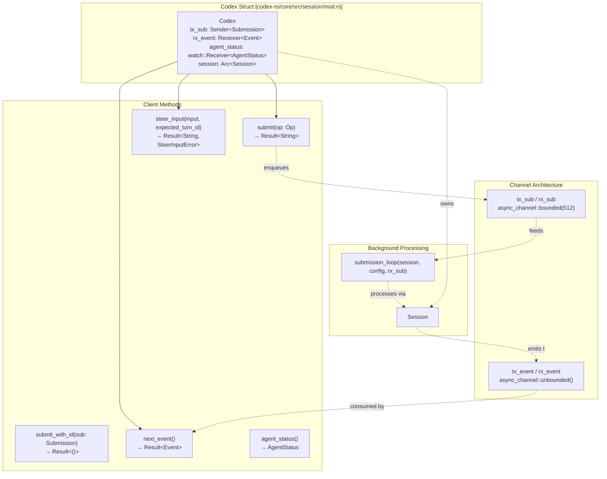
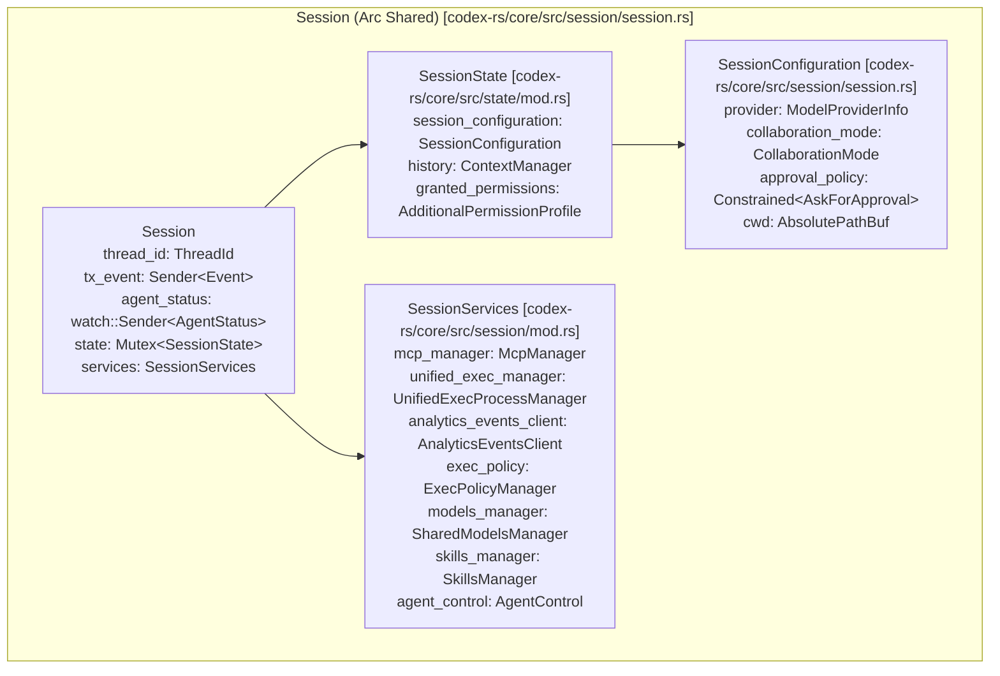
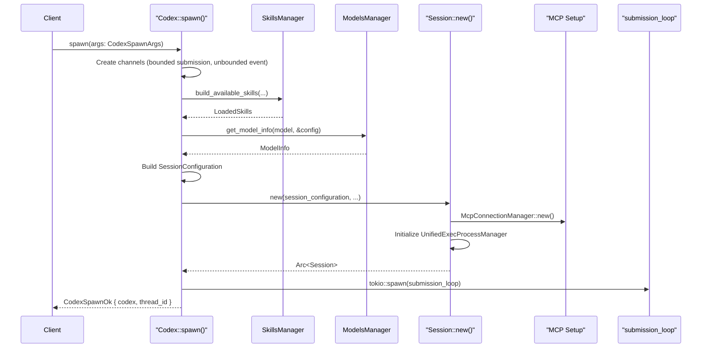
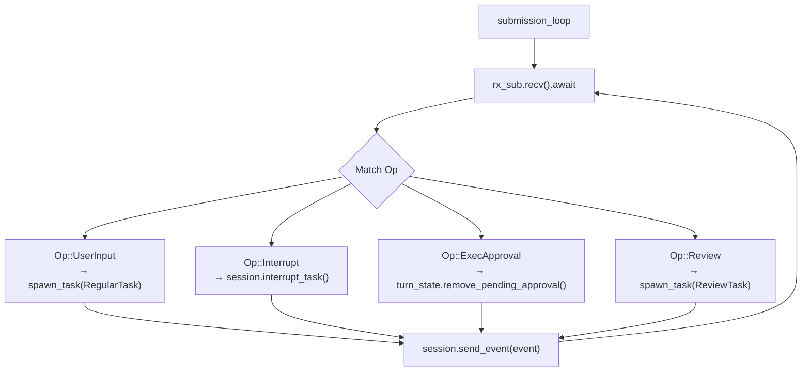

# Codex 인터페이스와 세션 생명주기

관련 소스 파일

다음 파일들은 이 위키 페이지를 생성하기 위한 컨텍스트로 사용되었습니다.

- [codex-rs/core/src/agent/control.rs](codex-rs/core/src/agent/control.rs)
- [codex-rs/core/src/agent/control_tests.rs](codex-rs/core/src/agent/control_tests.rs)
- [codex-rs/core/src/codex_delegate.rs](codex-rs/core/src/codex_delegate.rs)
- [codex-rs/core/src/codex_thread.rs](codex-rs/core/src/codex_thread.rs)
- [codex-rs/core/src/prompt_debug.rs](codex-rs/core/src/prompt_debug.rs)
- [codex-rs/core/src/session/handlers.rs](codex-rs/core/src/session/handlers.rs)
- [codex-rs/core/src/session/mod.rs](codex-rs/core/src/session/mod.rs)
- [codex-rs/core/src/session/review.rs](codex-rs/core/src/session/review.rs)
- [codex-rs/core/src/session/session.rs](codex-rs/core/src/session/session.rs)
- [codex-rs/core/src/session/tests.rs](codex-rs/core/src/session/tests.rs)
- [codex-rs/core/src/session/tests/guardian_tests.rs](codex-rs/core/src/session/tests/guardian_tests.rs)
- [codex-rs/core/src/session/turn.rs](codex-rs/core/src/session/turn.rs)
- [codex-rs/core/src/session/turn_context.rs](codex-rs/core/src/session/turn_context.rs)
- [codex-rs/core/src/state/mod.rs](codex-rs/core/src/state/mod.rs)
- [codex-rs/core/src/state/service.rs](codex-rs/core/src/state/service.rs)
- [codex-rs/core/src/state/turn.rs](codex-rs/core/src/state/turn.rs)
- [codex-rs/core/src/tasks/compact.rs](codex-rs/core/src/tasks/compact.rs)
- [codex-rs/core/src/tasks/mod.rs](codex-rs/core/src/tasks/mod.rs)
- [codex-rs/core/src/tasks/regular.rs](codex-rs/core/src/tasks/regular.rs)
- [codex-rs/core/src/tasks/review.rs](codex-rs/core/src/tasks/review.rs)
- [codex-rs/core/src/thread_manager.rs](codex-rs/core/src/thread_manager.rs)
- [codex-rs/core/src/thread_manager_tests.rs](codex-rs/core/src/thread_manager_tests.rs)
- [codex-rs/core/src/tools/handlers/multi_agents_spec.rs](codex-rs/core/src/tools/handlers/multi_agents_spec.rs)
- [codex-rs/core/src/tools/handlers/multi_agents_spec_tests.rs](codex-rs/core/src/tools/handlers/multi_agents_spec_tests.rs)
- [codex-rs/core/src/tools/handlers/multi_agents_tests.rs](codex-rs/core/src/tools/handlers/multi_agents_tests.rs)
- [codex-rs/core/src/tools/handlers/multi_agents_v2.rs](codex-rs/core/src/tools/handlers/multi_agents_v2.rs)
- [codex-rs/core/src/tools/handlers/multi_agents_v2/message_tool.rs](codex-rs/core/src/tools/handlers/multi_agents_v2/message_tool.rs)
- [codex-rs/core/tests/suite/codex_delegate.rs](codex-rs/core/tests/suite/codex_delegate.rs)
- [codex-rs/rollout-trace/README.md](codex-rs/rollout-trace/README.md)
- [codex-rs/rollout-trace/src/tool_dispatch.rs](codex-rs/rollout-trace/src/tool_dispatch.rs)
- [codex-rs/tools/src/tool_config.rs](codex-rs/tools/src/tool_config.rs)
- [codex-rs/tools/src/tool_config_tests.rs](codex-rs/tools/src/tool_config_tests.rs)

이 문서는 Codex 에이전트 시스템과 상호작용하기 위한 핵심 인터페이스와, 초기화부터 실행과 종료까지 이어지는 세션의 전체 생명주기를 설명합니다. `Codex` 구조체는 모든 사용자 인터페이스를 위한 공개 API를 제공하며, `Session`은 에이전트의 실행 컨텍스트, 상태, 서비스를 관리합니다.

## 핵심 컴포넌트

### Codex 공개 API

`Codex` 구조체는 Codex 시스템에 대한 상위 수준 인터페이스 역할을 하며, 클라이언트가 작업을 제출하고 이벤트를 비동기적으로 수신하는 큐 쌍 패턴을 구현합니다. 통신 채널과 공유 세션 상태를 캡슐화합니다.

### Codex 공개 API 구조

**주요 책임:**
- **작업 제출**: `submit()`은 고유한 submission ID를 생성하고 `Submission`을 `tx_sub` 채널에 enqueue합니다 [codex-rs/core/src/session/mod.rs:1044-1065]().
- **이벤트 소비**: `next_event()`는 처리된 `Event` 항목을 `rx_event` receiver에서 가져오며, 사용 가능할 때까지 blocking합니다 [codex-rs/core/src/session/mod.rs:1003-1005]().
- **상태 추적**: `agent_status` 필드는 에이전트가 idle, working, stalled 중 어느 상태인지에 대한 실시간 업데이트를 제공하는 `watch::Receiver<AgentStatus>`입니다 [codex-rs/core/src/session/mod.rs:983-985]().
- **Steer Input**: `steer_input()`은 턴이 아직 진행 중인 동안 사용자가 피드백이나 수정을 제공할 수 있게 합니다 [codex-rs/core/src/session/mod.rs:1067-1097]().

출처: [codex-rs/core/src/session/mod.rs:967-1110](), [codex-rs/core/src/session/session.rs:21-43]()

### 세션 아키텍처

`Session` 구조체는 단일 대화 스레드에 필요한 모든 상태, 서비스, 실행 리소스를 관리하는 핵심 에이전트 컨텍스트를 나타냅니다.

### 세션 구조

`Session`은 모든 에이전트 활동을 조정합니다.
- **가변 상태**: `Mutex<SessionState>`는 `ContextManager`가 관리하는 대화 기록, 토큰 사용량 추적, 부여된 권한을 보호합니다 [codex-rs/core/src/session/session.rs:29-29]().
- **세션 설정**: 초기화 시 캡처되는 모델 provider, 샌드박스 정책, 작업 디렉터리 등 설정의 snapshot입니다 [codex-rs/core/src/session/session.rs:46-110]().
- **세션 서비스**: `SessionServices`에 정의된 공유 인프라 컴포넌트입니다. 도구 탐색을 위한 `McpConnectionManager`, 프로세스 관리를 위한 `UnifiedExecProcessManager`, 다중 에이전트 조정을 위한 `AgentControl` 등이 포함됩니다 [codex-rs/core/src/session/session.rs:42-42]().

출처: [codex-rs/core/src/session/session.rs:21-43](), [codex-rs/core/src/session/session.rs:46-110]()

## 세션 생명주기 관리

### Spawn, Resume, Fork

스레드의 생명주기는 `ThreadManager` [codex-rs/core/src/thread_manager.rs:171-172]()가 관리하는 세 진입점 중 하나에서 시작됩니다.

1.  **Spawn**: `Codex::spawn`을 사용해 새 `Codex` 인스턴스를 처음부터 생성합니다 [codex-rs/core/src/session/mod.rs:1450-1455]().
2.  **Resume**: `ThreadStore`에 영속화된 history에서 스레드를 복원합니다 [codex-rs/core/src/thread_manager.rs:45-45]().
3.  **Fork**: 기존 스레드 history의 특정 지점을 복제해 새 스레드를 생성합니다. 하위 에이전트나 "what-if" 시나리오에 자주 사용됩니다 [codex-rs/core/src/thread_manager.rs:128-147]().

### 초기화 시퀀스

**초기화 단계:**
1.  **Skills Loading**: `SkillsManager`는 `build_available_skills`를 사용해 작업 디렉터리에 대해 활성화된 skill을 로드합니다 [codex-rs/core/src/session/mod.rs:18-18]().
2.  **Model Resolution**: `SharedModelsManager`를 통해 모델 메타데이터(context window, capabilities)를 가져옵니다 [codex-rs/core/src/session/mod.rs:71-71]().
3.  **Rollout Persistence**: 세션은 이벤트를 영속화하기 위해 `RolloutRecorder`를 초기화하거나 `ThreadStore`에 연결합니다 [codex-rs/core/src/session/mod.rs:132-142]().
4.  **Submission Loop**: 큐에서 `Submission` 항목을 처리하기 위한 비동기 작업이 spawn됩니다 [codex-rs/core/src/session/mod.rs:158-158]().

출처: [codex-rs/core/src/session/mod.rs:1450-1700](), [codex-rs/core/src/session/session.rs:46-110](), [codex-rs/core/src/thread_manager.rs:171-172]()

## Op/Event 통신 패턴

Codex는 사용자 인터페이스와 에이전트 사이에서 비동기 통신을 수행하기 위해 submission queue(SQ) / event queue(EQ) 패턴을 사용합니다.

### Submission 작업(`Op`)
작업은 사용자가 에이전트에 보내는 요청입니다 [codex-rs/core/src/codex_thread.rs:26-26]().
-   `UserInput`: 특정 턴 컨텍스트와 함께 새 메시지나 지시를 제출합니다 [codex-rs/core/src/session/handlers.rs:129-144]().
-   `InterAgentCommunication`: 다중 에이전트 세션에서 에이전트 간 메시지를 보냅니다 [codex-rs/core/src/agent/control.rs:166-170]().
-   `ExecApproval` / `ApplyPatchApproval`: 권한 요청에 응답합니다 [codex-rs/core/src/codex_delegate.rs:8-11]().
-   `Review`: 코드 리뷰 하위 에이전트 요청을 제출합니다 [codex-rs/core/src/tasks/review.rs:58-58]().

### Event 메시지(`EventMsg`)
이벤트는 상태 변경이나 모델 출력을 클라이언트에 알리기 위해 에이전트가 방출합니다 [codex-rs/core/src/session/turn.rs:90-95]().
-   `AgentMessageContentDelta`: assistant 텍스트의 스트리밍 chunk [codex-rs/core/src/session/turn.rs:90-90]().
-   `TurnStarted`: 새 턴이 시작되었음을 알리는 알림 [codex-rs/core/src/session/turn.rs:135-135]().
-   `TurnComplete`: 토큰 사용량을 포함하는 턴의 최종 이벤트 [codex-rs/core/src/tasks/mod.rs:52-52]().

출처: [codex-rs/core/src/session/handlers.rs:112-200](), [codex-rs/core/src/tasks/mod.rs:1-60](), [codex-rs/core/src/codex_delegate.rs:1-50]()

## 세션 실행 런타임

### Submission Loop
`submission_loop`는 상태 일관성을 보장하기 위해 작업을 순차적으로 처리합니다. 현재 실행 중인 `SessionTask` 인스턴스를 추적하는 `ActiveTurn` 상태를 관리합니다 [codex-rs/core/src/session/session.rs:39-39]().

### 작업 관리와 하위 에이전트
Codex는 regular chat, review, history compaction 같은 서로 다른 워크플로를 캡슐화하기 위해 `SessionTask`를 사용합니다 [codex-rs/core/src/tasks/mod.rs:208-220]().

-   **Regular Tasks**: 주요 모델 상호작용 루프를 구동하는 `RegularTask`가 관리합니다 [codex-rs/core/src/tasks/regular.rs:58-58]().
-   **Review Tasks**: 특화된 지시가 있는 "one-shot" 하위 에이전트를 spawn하고 그 출력을 캡처하는 `ReviewTask`가 관리합니다 [codex-rs/core/src/tasks/review.rs:42-50]().
-   **Compact Tasks**: context window에 맞도록 history를 요약하는 데 사용되는 `CompactTask`가 관리합니다 [codex-rs/core/src/tasks/compact.rs:57-57]().
-   **작업 생명주기**: 작업은 `SessionTask::run`에서 실행되고 `SessionTask::abort`를 통해 중단될 수 있습니다 [codex-rs/core/src/tasks/mod.rs:216-222]().
-   **다중 에이전트 위임**: 하위 에이전트는 `run_codex_thread_interactive`를 통해 시작되며, 이는 임시 실행 컨텍스트를 생성하고 parent-child 이벤트 forwarding을 처리합니다 [codex-rs/core/src/codex_delegate.rs:68-77]().

출처: [codex-rs/core/src/tasks/mod.rs:199-222](), [codex-rs/core/src/tasks/review.rs:33-50](), [codex-rs/core/src/codex_delegate.rs:68-156]()
