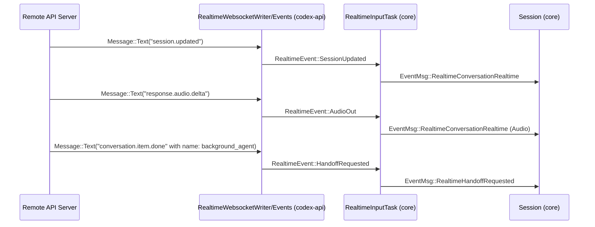
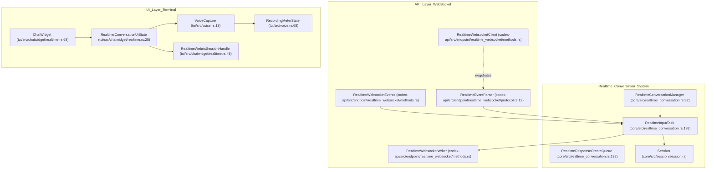

# 실시간 대화

<details>
<summary>관련 소스 파일</summary>

다음 파일들은 이 위키 페이지를 생성하기 위한 컨텍스트로 사용되었습니다.

- [codex-rs/app-server/tests/suite/v2/experimental_api.rs](codex-rs/app-server/tests/suite/v2/experimental_api.rs)
- [codex-rs/app-server/tests/suite/v2/realtime_conversation.rs](codex-rs/app-server/tests/suite/v2/realtime_conversation.rs)
- [codex-rs/codex-api/src/endpoint/realtime_websocket/methods.rs](codex-rs/codex-api/src/endpoint/realtime_websocket/methods.rs)
- [codex-rs/codex-api/src/endpoint/realtime_websocket/methods_common.rs](codex-rs/codex-api/src/endpoint/realtime_websocket/methods_common.rs)
- [codex-rs/codex-api/src/endpoint/realtime_websocket/methods_v1.rs](codex-rs/codex-api/src/endpoint/realtime_websocket/methods_v1.rs)
- [codex-rs/codex-api/src/endpoint/realtime_websocket/methods_v2.rs](codex-rs/codex-api/src/endpoint/realtime_websocket/methods_v2.rs)
- [codex-rs/codex-api/src/endpoint/realtime_websocket/mod.rs](codex-rs/codex-api/src/endpoint/realtime_websocket/mod.rs)
- [codex-rs/codex-api/src/endpoint/realtime_websocket/protocol.rs](codex-rs/codex-api/src/endpoint/realtime_websocket/protocol.rs)
- [codex-rs/codex-api/src/endpoint/realtime_websocket/protocol_v1.rs](codex-rs/codex-api/src/endpoint/realtime_websocket/protocol_v1.rs)
- [codex-rs/codex-api/src/endpoint/realtime_websocket/protocol_v2.rs](codex-rs/codex-api/src/endpoint/realtime_websocket/protocol_v2.rs)
- [codex-rs/codex-api/tests/realtime_websocket_e2e.rs](codex-rs/codex-api/tests/realtime_websocket_e2e.rs)
- [codex-rs/core/src/realtime_conversation.rs](codex-rs/core/src/realtime_conversation.rs)
- [codex-rs/core/src/realtime_conversation_tests.rs](codex-rs/core/src/realtime_conversation_tests.rs)
- [codex-rs/core/tests/suite/realtime_conversation.rs](codex-rs/core/tests/suite/realtime_conversation.rs)
- [codex-rs/tui/src/audio_device.rs](codex-rs/tui/src/audio_device.rs)
- [codex-rs/tui/src/chatwidget/realtime.rs](codex-rs/tui/src/chatwidget/realtime.rs)
- [codex-rs/tui/src/voice.rs](codex-rs/tui/src/voice.rs)

</details>


실시간 대화 시스템은 오디오 및 텍스트 상호작용을 위한 저지연 양방향 인터페이스를 제공합니다. 이를 통해 Codex AI 에이전트는 스트리밍 오디오 입력/출력, 서버 측 음성 활동 감지(VAD), 실시간 음성 모델과 핵심 에이전트 추론 시스템 사이의 조율된 handoff를 사용하는 대화형 음성 기반 세션에 참여할 수 있습니다. 이 시스템은 WebSocket 기반 통신과 macOS 네이티브 저지연 오디오/텍스트 상호작용을 위한 WebRTC를 모두 지원합니다.

---

## 시스템 아키텍처

실시간 대화 하위 시스템은 WebSocket/WebRTC 전송 계층과 내부 세션 로직을 연결하는 비동기 producer-consumer 모델로 설계되어 있습니다.

### 데이터 흐름과 작업 관리

핵심에는 세션 상태를 관리하고 주요 비동기 작업을 생성하는 `RealtimeConversationManager` 구조체가 있습니다 [codex-rs/core/src/realtime_conversation.rs:92-94]():

- **입력 작업(`RealtimeInputTask`)**: WebSocket 연결 생명주기를 유지하고, 서버 이벤트를 읽으며, 오디오 프레임, 사용자 텍스트, 세션 제어 이벤트를 포함한 outbound 메시지를 씁니다 [codex-rs/core/src/realtime_conversation.rs:193-203]().
- **Fanout 작업**: websocket에서 들어오는 이벤트를 내부 subscriber에 브로드캐스트하고, 이벤트를 핵심 세션 시스템이 소비하는 프로토콜 수준 메시지로 변환합니다.

이 컴포넌트들은 메시지 전달을 위해 async channel로 조율되며, 프로토콜 버전(V1 또는 V2)에 따라 선택 가능한 이벤트 파서를 사용합니다.

```mermaid
graph TD
    subgraph "codex-core (Code Entity Space)"
        RCM["RealtimeConversationManager (core/src/realtime_conversation.rs:92)"]
        RIT["RealtimeInputTask (core/src/realtime_conversation.rs:193)"]
        SESSION["Session (core/src/session/session.rs)"]
    end

    subgraph "codex-api (Protocol Layer)"
        RWClient["RealtimeWebsocketClient (codex-api/src/endpoint/realtime_websocket/methods.rs)"]
        RWWriter["RealtimeWebsocketWriter (codex-api/src/endpoint/realtime_websocket/methods.rs)"]
        RWEvents["RealtimeWebsocketEvents (codex-api/src/endpoint/realtime_websocket/methods.rs)"]
    end

    SESSION -->|Op::RealtimeConversationStart| RCM
    RCM -->|connect()| RWClient
    RWClient -->|returns| RWWriter
    RWClient -->|returns| RWEvents
    RIT -->|send()| RWWriter
    RWEvents -->|receive()| RIT
    RIT -->|EventMsg| SESSION
```

**출처:** [codex-rs/core/src/realtime_conversation.rs:92-94](), [codex-rs/core/src/realtime_conversation.rs:193-203](), [codex-rs/codex-api/src/endpoint/realtime_websocket/methods.rs:1-46]()

---

## 프로토콜 버전

Codex는 `RealtimeEventParser` enum으로 추상화된 여러 실시간 프로토콜 버전을 지원합니다 [codex-rs/codex-api/src/endpoint/realtime_websocket/protocol.rs:12-15](). 두 가지 주요 버전은 다음과 같습니다.

| 기능                   | V1 (Quicksilver)                               | V2 (Realtime)                                           |
|---------------------------|------------------------------------------------|--------------------------------------------------------|
| **세션 유형**          | `Quicksilver`                                  | `Realtime`                                             |
| **기본 모델**         | `gpt-realtime-1.5`                             | `gpt-realtime-1.5`                                     |
| **턴 감지**        | 없음(클라이언트 측)                             | `ServerVad`(서버 측 VAD)                          |
| **도구 지원**         | 지원되지 않음                                  | 비동기 handoff를 위한 `background_agent` 도구       |
| **출력 모달리티**       | 오디오만                                     | 오디오와 텍스트                                         |

- **V1 (Quicksilver)** 는 턴 감지나 도구 handoff 없이 빠른 오디오 상호작용에 적합한 더 단순한 프로토콜을 사용합니다. `RealtimeEventParser::V1`을 통해 선택됩니다 [codex-rs/codex-api/src/endpoint/realtime_websocket/protocol.rs:13]().
- **V2 (Realtime)** 는 서버 측 턴 감지(`ServerVad`), 양방향 오디오 및 텍스트 모달리티, 복잡한 작업을 background agent에 위임하기 위한 도구 기반 handoff 지원을 확장합니다 [codex-rs/codex-api/src/endpoint/realtime_websocket/methods_v2.rs:71-133]().

**출처:** [codex-rs/codex-api/src/endpoint/realtime_websocket/protocol.rs:12-15](), [codex-rs/codex-api/src/endpoint/realtime_websocket/protocol.rs:73-77](), [codex-rs/codex-api/src/endpoint/realtime_websocket/methods_v2.rs:33-37](), [codex-rs/codex-api/src/endpoint/realtime_websocket/protocol_v2.rs:24-79]()

---

## 세션 생명주기

실시간 세션 생명주기는 다음 단계로 구성됩니다.

### 1. 초기화
실시간 세션은 `ConversationStartParams`가 제출될 때 시작됩니다. 시스템은 `build_realtime_startup_context`를 통해 "시작 컨텍스트"를 준비합니다 [codex-rs/core/src/realtime_conversation.rs:2](). 이 컨텍스트는 모델 과부하를 피하기 위해 `REALTIME_STARTUP_CONTEXT_TOKEN_BUDGET`(5,300 토큰)으로 제한됩니다 [codex-rs/core/src/realtime_conversation.rs:67]().

### 2. 연결 처리
- `RealtimeWebsocketClient`는 provider에 대한 연결을 엽니다.
- `WsStream`은 저수준 `WebSocketStream`을 관리하며, 연결 유지를 위해 `Ping`/`Pong` 프레임을 처리합니다 [codex-rs/codex-api/src/endpoint/realtime_websocket/methods.rs:109-117]().
- 들어오는 텍스트 메시지는 `parse_realtime_event_v1` 또는 `parse_realtime_event_v2`의 버전별 로직을 사용해 `RealtimeEvent` 구조체로 파싱됩니다 [codex-rs/codex-api/src/endpoint/realtime_websocket/protocol.rs:220-228]().

### 3. 오디오 스트리밍
- **클라이언트에서 서버로**: 오디오는 `InputAudioBufferAppend` 메시지를 통해 Base64 인코딩된 PCM 샘플로 전송됩니다 [codex-rs/codex-api/src/endpoint/realtime_websocket/protocol.rs:37-38]().
- **서버에서 클라이언트로**: 오디오 출력은 `AudioOut` 이벤트로 수신됩니다 [codex-rs/codex-api/src/endpoint/realtime_websocket/protocol_v2.rs:96-125](). 시스템 기본 샘플 레이트는 24kHz입니다 [codex-rs/tui/src/voice.rs:15]().

### 4. 대화형 Handoff
V2에서는 복잡한 사용자 요청을 `background_agent` 도구를 통해 background agent에 위임할 수 있습니다 [codex-rs/codex-api/src/endpoint/realtime_websocket/methods_v2.rs:33-34]().
- 서버는 `HandoffRequested` 이벤트를 통해 위임을 알립니다 [codex-rs/codex-api/src/endpoint/realtime_websocket/protocol_v2.rs:142-166]().
- handoff가 완료되면 background agent가 결과를 제공하고, 표준 완료 메시지로 이를 확인합니다 [codex-rs/core/src/realtime_conversation.rs:73-74]().

---

## 이벤트 변환 맵

다음 시퀀스 다이어그램은 들어오는 WebSocket 이벤트가 내부 프로토콜 메시지로 변환되는 과정을 설명합니다.



**출처:** [codex-rs/codex-api/src/endpoint/realtime_websocket/protocol_v2.rs:24-79](), [codex-rs/core/src/realtime_conversation.rs:193-203]()

---

## WebRTC 통합

더 낮은 지연 시간의 macOS 네이티브 실시간 오디오/텍스트 상호작용을 지원하기 위해 Codex는 `codex-realtime-webrtc` crate를 통해 WebRTC 전송 계층을 통합합니다 [codex-rs/tui/src/chatwidget/realtime.rs:10-12]().

- `ChatWidget`은 `RealtimeConversationUiTransport::Webrtc`를 통해 WebRTC 세션을 관리합니다 [codex-rs/tui/src/chatwidget/realtime.rs:47-49]().
- WebRTC 세션을 시작할 때 TUI는 `start_realtime_webrtc_offer_task`를 통해 SDP offer 작업을 트리거합니다 [codex-rs/tui/src/chatwidget/realtime.rs:103]().
- 오디오는 입력의 경우 `VoiceCapture`, 출력의 경우 `RealtimeAudioPlayer`를 통해 로컬에서 처리됩니다 [codex-rs/tui/src/chatwidget/realtime.rs:38-40]().

**출처:** [codex-rs/tui/src/chatwidget/realtime.rs:43-50](), [codex-rs/tui/src/chatwidget/realtime.rs:100-105]()

---

## 구현 세부 사항

### RealtimeInputTask
`RealtimeInputTask`는 `tokio::select!`를 사용해 여러 채널을 multiplex합니다.
- `user_text_rx`: 사용자 텍스트를 `conversation.item.create`로 보냅니다 [codex-rs/core/src/realtime_conversation.rs:196]().
- `audio_rx`: 원시 오디오를 `input_audio_buffer.append`로 보냅니다 [codex-rs/core/src/realtime_conversation.rs:198]().
- `events`: WebSocket에서 파싱된 이벤트를 수신합니다 [codex-rs/core/src/realtime_conversation.rs:195]().

### RealtimeResponseCreateQueue
이 helper는 모델 응답 스트림 생성을 관리합니다 [codex-rs/core/src/realtime_conversation.rs:132](). `active_default_response`가 true이면 `response.create` 요청을 지연시켜 응답이 겹치지 않도록 합니다 [codex-rs/core/src/realtime_conversation.rs:144-147]().

### UI 상태와 음성 캡처
- `RealtimeConversationUiState`: `Inactive`, `Starting`, `Active`, `Stopping` 같은 단계를 추적합니다 [codex-rs/tui/src/chatwidget/realtime.rs:19-25]().
- `VoiceCapture`: `cpal`을 사용해 마이크 입력을 캡처하고, 24kHz로 resample한 뒤 Base64로 인코딩합니다 [codex-rs/tui/src/voice.rs:18-50]().
- `RecordingMeterState`: 시각적 피드백을 위해 Braille 기반 level meter를 계산합니다 [codex-rs/tui/src/voice.rs:68-125]().

**출처:** [codex-rs/core/src/realtime_conversation.rs:132-191](), [codex-rs/tui/src/chatwidget/realtime.rs:19-41](), [codex-rs/tui/src/voice.rs:87-125]()

---

## 주요 코드 엔티티 용어집



**출처:** [codex-rs/core/src/realtime_conversation.rs:92](), [codex-rs/codex-api/src/endpoint/realtime_websocket/methods.rs:1-46](), [codex-rs/tui/src/chatwidget/realtime.rs:28](), [codex-rs/tui/src/voice.rs:18]()
