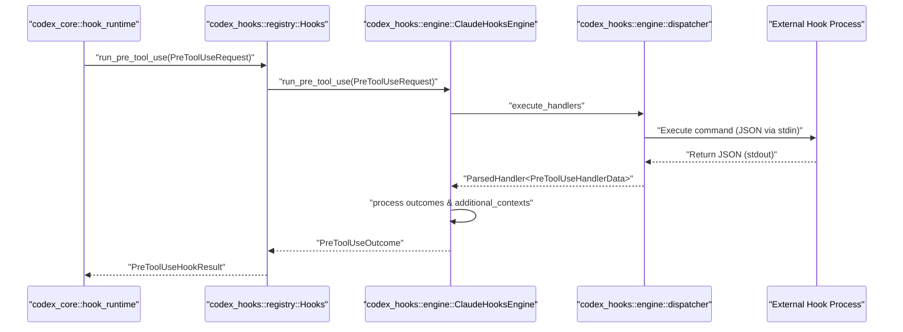
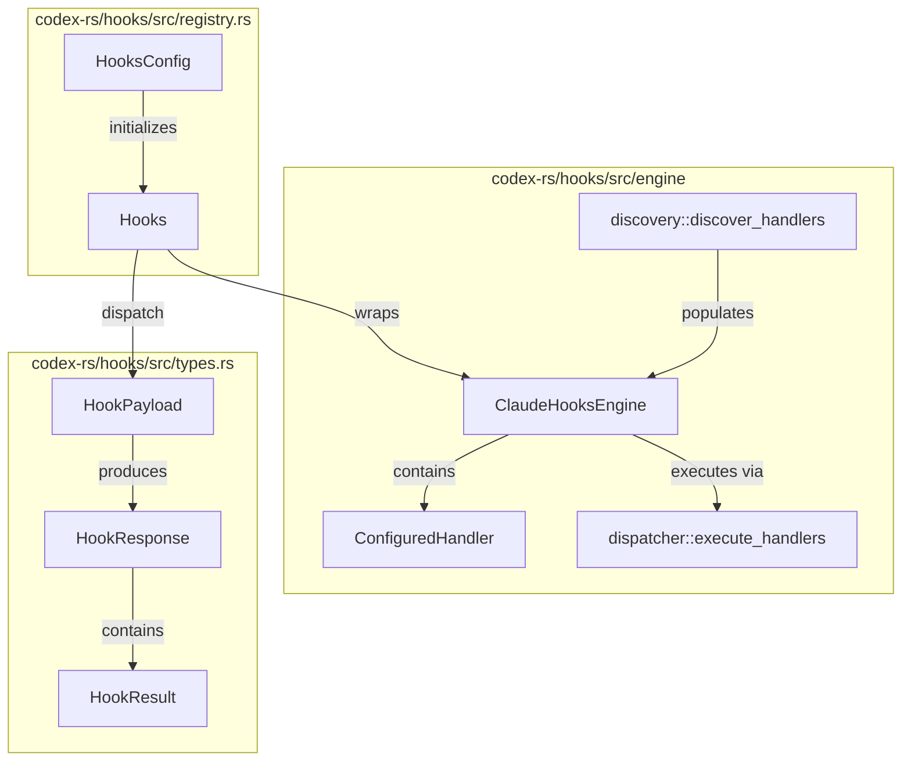

# Hooks 시스템

관련 소스 파일

다음 파일들은 이 위키 페이지를 생성하기 위한 컨텍스트로 사용되었습니다.

- [codex-rs/app-server-protocol/schema/json/v2/HookCompletedNotification.json](codex-rs/app-server-protocol/schema/json/v2/HookCompletedNotification.json)
- [codex-rs/app-server-protocol/schema/json/v2/HookStartedNotification.json](codex-rs/app-server-protocol/schema/json/v2/HookStartedNotification.json)
- [codex-rs/core/src/hook_runtime.rs](codex-rs/core/src/hook_runtime.rs)
- [codex-rs/core/tests/suite/hooks.rs](codex-rs/core/tests/suite/hooks.rs)
- [codex-rs/hooks/schema/generated/permission-request.command.input.schema.json](codex-rs/hooks/schema/generated/permission-request.command.input.schema.json)
- [codex-rs/hooks/schema/generated/permission-request.command.output.schema.json](codex-rs/hooks/schema/generated/permission-request.command.output.schema.json)
- [codex-rs/hooks/schema/generated/post-compact.command.input.schema.json](codex-rs/hooks/schema/generated/post-compact.command.input.schema.json)
- [codex-rs/hooks/schema/generated/post-tool-use.command.input.schema.json](codex-rs/hooks/schema/generated/post-tool-use.command.input.schema.json)
- [codex-rs/hooks/schema/generated/post-tool-use.command.output.schema.json](codex-rs/hooks/schema/generated/post-tool-use.command.output.schema.json)
- [codex-rs/hooks/schema/generated/pre-compact.command.input.schema.json](codex-rs/hooks/schema/generated/pre-compact.command.input.schema.json)
- [codex-rs/hooks/schema/generated/pre-tool-use.command.input.schema.json](codex-rs/hooks/schema/generated/pre-tool-use.command.input.schema.json)
- [codex-rs/hooks/schema/generated/pre-tool-use.command.output.schema.json](codex-rs/hooks/schema/generated/pre-tool-use.command.output.schema.json)
- [codex-rs/hooks/schema/generated/session-start.command.output.schema.json](codex-rs/hooks/schema/generated/session-start.command.output.schema.json)
- [codex-rs/hooks/schema/generated/subagent-start.command.output.schema.json](codex-rs/hooks/schema/generated/subagent-start.command.output.schema.json)
- [codex-rs/hooks/schema/generated/user-prompt-submit.command.input.schema.json](codex-rs/hooks/schema/generated/user-prompt-submit.command.input.schema.json)
- [codex-rs/hooks/schema/generated/user-prompt-submit.command.output.schema.json](codex-rs/hooks/schema/generated/user-prompt-submit.command.output.schema.json)
- [codex-rs/hooks/src/engine/discovery.rs](codex-rs/hooks/src/engine/discovery.rs)
- [codex-rs/hooks/src/engine/dispatcher.rs](codex-rs/hooks/src/engine/dispatcher.rs)
- [codex-rs/hooks/src/engine/mod.rs](codex-rs/hooks/src/engine/mod.rs)
- [codex-rs/hooks/src/engine/mod_tests.rs](codex-rs/hooks/src/engine/mod_tests.rs)
- [codex-rs/hooks/src/engine/output_parser.rs](codex-rs/hooks/src/engine/output_parser.rs)
- [codex-rs/hooks/src/events/common.rs](codex-rs/hooks/src/events/common.rs)
- [codex-rs/hooks/src/events/compact.rs](codex-rs/hooks/src/events/compact.rs)
- [codex-rs/hooks/src/events/permission_request.rs](codex-rs/hooks/src/events/permission_request.rs)
- [codex-rs/hooks/src/events/post_tool_use.rs](codex-rs/hooks/src/events/post_tool_use.rs)
- [codex-rs/hooks/src/events/pre_tool_use.rs](codex-rs/hooks/src/events/pre_tool_use.rs)
- [codex-rs/hooks/src/events/session_start.rs](codex-rs/hooks/src/events/session_start.rs)
- [codex-rs/hooks/src/events/stop.rs](codex-rs/hooks/src/events/stop.rs)
- [codex-rs/hooks/src/events/user_prompt_submit.rs](codex-rs/hooks/src/events/user_prompt_submit.rs)
- [codex-rs/hooks/src/legacy_notify.rs](codex-rs/hooks/src/legacy_notify.rs)
- [codex-rs/hooks/src/lib.rs](codex-rs/hooks/src/lib.rs)
- [codex-rs/hooks/src/registry.rs](codex-rs/hooks/src/registry.rs)
- [codex-rs/hooks/src/schema.rs](codex-rs/hooks/src/schema.rs)
- [codex-rs/hooks/src/types.rs](codex-rs/hooks/src/types.rs)

Hooks 시스템은 에이전트의 생명주기를 가로채고 보강하도록 설계된 Claude 스타일 엔진입니다. 도구 사용 전후, 세션 시작/중지 시점, 사용자 프롬프트 제출 시점 같은 중요한 경계에서 사용자 정의 로직을 실행하는 구조화된 방법을 제공합니다. hooks 엔진은 생명주기 가로채기를 처리하지만, 안전을 강제하고 컨텍스트 피드백을 제공하기 위해 핵심 에이전트 시스템과 함께 작동합니다.

## 개요와 목적

이 시스템은 Codex core가 주요 실행 루프에서 부수 효과와 외부 알림을 분리할 수 있게 합니다. Hooks는 로깅, 감사, 외부 시스템 알림, 모델 기록에 추가 컨텍스트 주입 등에 사용할 수 있습니다. 구현은 `codex-hooks` crate를 중심으로 하며, `codex-core`의 도구 실행 및 세션 생명주기에 통합되어 있습니다.

### 핵심 기능
*   **가로채기**: Hooks는 실행되기 전에 작업을 검사할 수 있습니다. 예를 들어 `run_pre_tool_use`는 도구 dispatch 전에 실행됩니다 [codex-rs/hooks/src/engine/mod.rs:183-189]().
*   **보강**: Hooks는 세션 기록에 기록되는 `additional_contexts`를 반환할 수 있습니다 [codex-rs/hooks/src/engine/mod.rs:177-179]().
*   **의사결정**: Hooks는 작업을 차단하거나(예: `PreToolUseOutcome`이 차단을 신호할 수 있음), 특정 권한 결정을 제공할 수 있습니다 [codex-rs/hooks/src/engine/mod.rs:11-12](), [codex-rs/hooks/src/engine/mod.rs:193-198]().
*   **발견**: 시스템은 로컬 설정, 프로젝트 수준 `.codex` 폴더, 설치된 plugins에서 hooks를 자동으로 발견합니다 [codex-rs/hooks/src/engine/discovery.rs:62-67]().

출처: [codex-rs/hooks/src/engine/mod.rs:107-206](), [codex-rs/hooks/src/engine/discovery.rs:62-67]().

---

## Hook 이벤트 유형

시스템은 설정과 JSON payload에 나타나는 여러 이벤트 이름을 정의합니다 [codex-rs/hooks/src/lib.rs:19-30]().

| 이벤트 유형 | 설명 |
| :--- | :--- |
| `SessionStart` | 새 세션 또는 스레드가 초기화될 때 트리거됩니다 [codex-rs/hooks/src/lib.rs:25](). |
| `UserPromptSubmit` | 사용자가 프롬프트를 제출한 직후, 모델 처리 전에 트리거됩니다 [codex-rs/hooks/src/lib.rs:26](). |
| `PreToolUse` | 도구가 실행되기 전에 트리거되며, 실행을 차단하거나 입력을 재작성할 수 있습니다 [codex-rs/hooks/src/lib.rs:20](). |
| `PostToolUse` | 도구 실행이 완료된 후 트리거되며, 피드백을 제공할 수 있습니다 [codex-rs/hooks/src/lib.rs:22](). |
| `PermissionRequest`| 도구가 명시적인 사용자 또는 시스템 승인을 요구할 때 트리거됩니다 [codex-rs/hooks/src/lib.rs:21](). |
| `Stop` | 에이전트가 턴을 완료하거나 인터럽트될 때 트리거됩니다 [codex-rs/hooks/src/lib.rs:29](). |
| `PreCompact` / `PostCompact` | 대화 기록 compaction 중에 트리거됩니다 [codex-rs/hooks/src/lib.rs:23-24](). |
| `SubagentStart` / `SubagentStop` | Reviewer 같은 sub-agent가 생성되거나 제거될 때 트리거됩니다 [codex-rs/hooks/src/lib.rs:27-28](). |

출처: [codex-rs/hooks/src/lib.rs:19-30](), [codex-rs/hooks/src/engine/mod.rs:64-77]().

---

## 아키텍처와 발견

`ClaudeHooksEngine`은 hook 로직의 중앙 dispatcher 역할을 합니다. feature flag, config layer, plugin source를 포함하는 `HooksConfig`를 통해 초기화됩니다 [codex-rs/hooks/src/registry.rs:30-39](), [codex-rs/hooks/src/engine/mod.rs:100-105]().

### 발견 파이프라인
`discovery::discover_handlers` 함수는 설정 스택(User, Project, System layer)과 plugin source를 스캔하여 사용 가능한 hook script를 식별합니다 [codex-rs/hooks/src/engine/discovery.rs:62-82](). 이들은 실행할 command, timeout, regex matcher를 포함하는 `ConfiguredHandler` 인스턴스로 변환됩니다 [codex-rs/hooks/src/engine/mod.rs:42-52]().

### Hook 실행 시퀀스
다음 다이어그램은 도구 실행 이벤트가 core를 통해 흐르고 hook engine과 상호작용하는 방식을 보여 줍니다.

**Hook Dispatch 시퀀스**

출처: [codex-rs/hooks/src/registry.rs:145-147](), [codex-rs/hooks/src/engine/mod.rs:183-191](), [codex-rs/hooks/src/engine/dispatcher.rs:1-20](), [codex-rs/core/src/hook_runtime.rs:162-194]().

### 코드 엔티티 매핑: 발견에서 Dispatch까지
이 다이어그램은 "Discovery"와 "Dispatch"라는 자연어 개념을 `codex-hooks` crate의 특정 Rust 엔티티에 매핑합니다.

**Discovery 및 Dispatch 매핑**

출처: [codex-rs/hooks/src/registry.rs:30-82](), [codex-rs/hooks/src/engine/mod.rs:100-138](), [codex-rs/hooks/src/types.rs:62-81]().

---

## 설정과 신뢰

Hooks는 `config.toml` 또는 `hooks.json` 파일에 정의됩니다. 각 handler는 특정 도구나 이벤트로 실행을 제한하기 위해 `matcher`(regex)를 지정할 수 있습니다 [codex-rs/hooks/src/engine/mod.rs:44]().

### Matcher 로직
`matches_matcher` 함수는 `tool_name` 또는 `matcher_aliases`를 기준으로 hook을 실행해야 하는지 판단합니다 [codex-rs/hooks/src/events/common.rs:129-144]().
*   **정확 일치**: `Bash`는 Bash 도구에만 매치됩니다 [codex-rs/hooks/src/events/common.rs:206]().
*   **파이프 대안**: `Edit|Write`는 두 도구 중 하나에 매치됩니다 [codex-rs/hooks/src/events/common.rs:197-202]().
*   **Regex**: `^mcp__.*`는 모든 MCP 도구에 매치됩니다 [codex-rs/hooks/src/events/common.rs:220]().

### 신뢰 시스템
`bypass_hook_trust`가 활성화되지 않은 한 hooks는 실행되기 위해 "trusted" 상태여야 합니다 [codex-rs/hooks/src/engine/mod.rs:110](). 신뢰 상태는 `HookTrustStatus`를 통해 추적됩니다 [codex-rs/hooks/src/engine/mod.rs:96]().
*   **관리형 Hooks**: 시스템 수준 requirements 또는 MDM을 통해 제공되는 hooks는 `managed_hooks`에 설정되어 있으면 자동으로 신뢰됩니다 [codex-rs/hooks/src/engine/discovery.rs:178-200]().
*   **사용자 Hooks**: 설정에 명시적인 trust marker가 필요합니다 [codex-rs/hooks/src/engine/discovery.rs:114]().

출처: [codex-rs/hooks/src/engine/mod.rs:42-97](), [codex-rs/hooks/src/engine/discovery.rs:51-210](), [codex-rs/hooks/src/events/common.rs:129-165]().

---

## 구현 세부 사항

### Hook 결과 처리
각 hook 이벤트에는 대응하는 `Outcome` 구조체(예: `PreToolUseOutcome`, `SessionStartOutcome`)가 있습니다. 이 구조체들은 다음을 집계합니다.
*   **결정**: 차단할지, 허용할지, 계속할지 여부입니다 [codex-rs/hooks/src/engine/mod.rs:15-22]().
*   **추가 컨텍스트**: 에이전트의 프롬프트에 주입될 텍스트 조각입니다 [codex-rs/hooks/src/engine/mod.rs:177-180]().
*   **입력 재작성**: `PreToolUse` hooks는 도구에 전달되는 인자를 수정하기 위해 `updated_input`을 반환할 수 있습니다 [codex-rs/hooks/src/events/pre_tool_use.rs:43](). 여러 hooks가 업데이트를 제공하면 가장 마지막에 완료된 것이 적용됩니다 [codex-rs/hooks/src/events/pre_tool_use.rs:148-162]().

### 런타임 통합(codex-core)
`codex-core`의 `hook_runtime.rs` 모듈은 에이전트의 턴 실행과 hooks engine을 연결합니다.
*   **세션 시작**: `run_pending_session_start_hooks`는 스레드가 초기화되거나 sub-agent가 생성될 때 hooks를 실행합니다 [codex-rs/core/src/hook_runtime.rs:102-155]().
*   **도구 사용 전**: `run_pre_tool_use_hooks`는 모든 도구 실행 전에 호출됩니다. hook이 차단하면 도구는 실행되지 않고, 차단 이유가 모델에 반환됩니다 [codex-rs/core/src/hook_runtime.rs:162-205]().

### 출력 Spilling
hook이 `additional_contexts`에 많은 양의 텍스트를 반환하면, `HookOutputSpiller`는 메모리나 프로토콜 메시지가 과도하게 커지는 것을 피하기 위해 이 데이터를 임시 파일로 옮길 수 있습니다 [codex-rs/hooks/src/engine/mod.rs:104](), [codex-rs/hooks/src/engine/mod.rs:177-179]().

### 설정에서 Hooks 발견
발견 파이프라인은 `ConfigLayerStack`을 존중하며, 특히 requirements layer 안의 `ManagedHooksRequirementsToml`을 확인합니다 [codex-rs/hooks/src/engine/discovery.rs:178-180](). 이를 통해 엔터프라이즈 관리형 hooks가 우선권을 갖고 `allow_managed_hooks_only` 정책을 강제할 수 있습니다 [codex-rs/hooks/src/engine/discovery.rs:73-82]().

출처: [codex-rs/hooks/src/engine/mod.rs:104-180](), [codex-rs/core/src/hook_runtime.rs:102-205](), [codex-rs/hooks/src/events/pre_tool_use.rs:148-162](), [codex-rs/hooks/src/engine/discovery.rs:73-180]().
