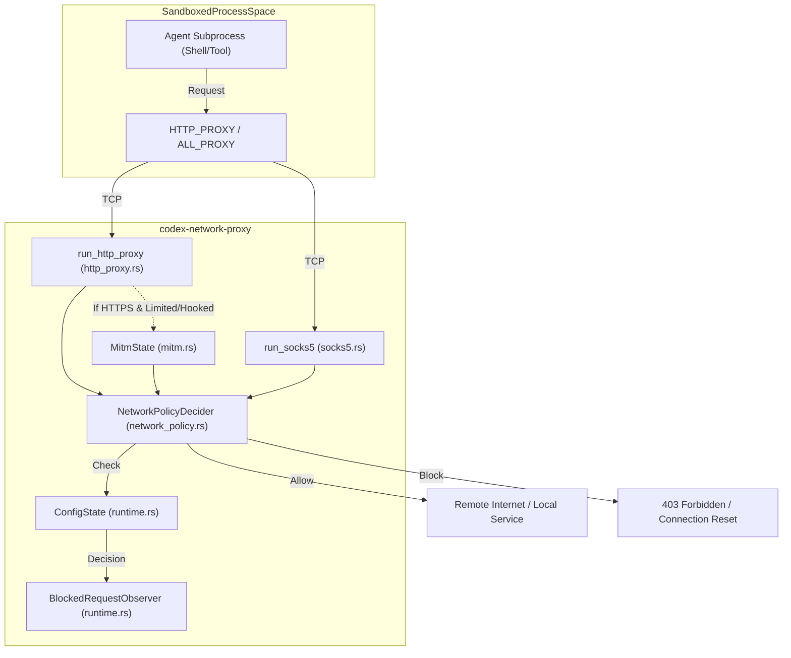
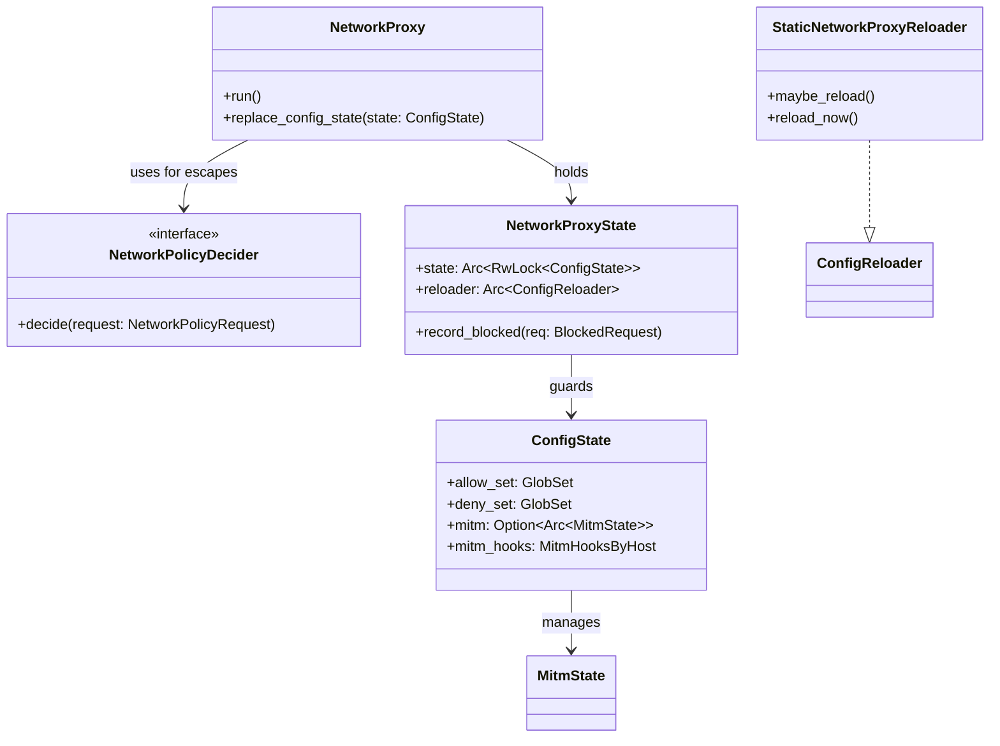

# 네트워크 프록시

<details>
<summary>관련 소스 파일</summary>

다음 파일들은 이 위키 페이지를 생성하기 위한 컨텍스트로 사용되었습니다.

- [codex-rs/config/Cargo.toml](codex-rs/config/Cargo.toml)
- [codex-rs/config/src/permissions_toml.rs](codex-rs/config/src/permissions_toml.rs)
- [codex-rs/core/src/config/network_proxy_spec.rs](codex-rs/core/src/config/network_proxy_spec.rs)
- [codex-rs/core/src/config/permissions.rs](codex-rs/core/src/config/permissions.rs)
- [codex-rs/core/src/config/permissions_tests.rs](codex-rs/core/src/config/permissions_tests.rs)
- [codex-rs/core/src/network_proxy_loader.rs](codex-rs/core/src/network_proxy_loader.rs)
- [codex-rs/network-proxy/Cargo.toml](codex-rs/network-proxy/Cargo.toml)
- [codex-rs/network-proxy/README.md](codex-rs/network-proxy/README.md)
- [codex-rs/network-proxy/src/config.rs](codex-rs/network-proxy/src/config.rs)
- [codex-rs/network-proxy/src/http_proxy.rs](codex-rs/network-proxy/src/http_proxy.rs)
- [codex-rs/network-proxy/src/lib.rs](codex-rs/network-proxy/src/lib.rs)
- [codex-rs/network-proxy/src/mitm.rs](codex-rs/network-proxy/src/mitm.rs)
- [codex-rs/network-proxy/src/mitm_tests.rs](codex-rs/network-proxy/src/mitm_tests.rs)
- [codex-rs/network-proxy/src/network_policy.rs](codex-rs/network-proxy/src/network_policy.rs)
- [codex-rs/network-proxy/src/policy.rs](codex-rs/network-proxy/src/policy.rs)
- [codex-rs/network-proxy/src/proxy.rs](codex-rs/network-proxy/src/proxy.rs)
- [codex-rs/network-proxy/src/reasons.rs](codex-rs/network-proxy/src/reasons.rs)
- [codex-rs/network-proxy/src/responses.rs](codex-rs/network-proxy/src/responses.rs)
- [codex-rs/network-proxy/src/runtime.rs](codex-rs/network-proxy/src/runtime.rs)
- [codex-rs/network-proxy/src/socks5.rs](codex-rs/network-proxy/src/socks5.rs)
- [codex-rs/network-proxy/src/state.rs](codex-rs/network-proxy/src/state.rs)
- [codex-rs/protocol/src/permissions.rs](codex-rs/protocol/src/permissions.rs)

</details>


`codex-network-proxy` crate는 에이전트 프로세스를 sandbox하기 위해 설계된 로컬 네트워크 정책 강제 엔진입니다. Codex 환경 안에서 도구나 shell command가 시작하는 모든 outbound 네트워크 트래픽의 gatekeeper 역할을 합니다. HTTP와 SOCKS5 프록시 인터페이스를 모두 제공함으로써, sandbox된 프로세스가 활성 [Permissions Profile](2.4. Sandbox and Approval Policies)에 정의된 보안 제약을 준수하도록 보장합니다.

## 개요와 목적

프록시는 세 가지 주요 기능을 수행합니다.
1.  **정책 강제**: hostname과 IP 주소에 대한 allow/deny 모델을 구현합니다 [codex-rs/network-proxy/README.md:50-53]().
2.  **트래픽 격리**: 프록시 자체에 대한 무단 외부 접근을 방지하기 위해 기본적으로 network listener를 loopback으로 제한합니다 [codex-rs/network-proxy/README.md:32-34]().
3.  **감사**: 모든 정책 결정에 대해 구조화된 OpenTelemetry(OTEL) 이벤트를 내보내고, `BlockedRequest` buffer에서 위반 사항을 추적합니다 [codex-rs/network-proxy/src/runtime.rs:90-104]().

### 핵심 기능
*   **프록시 모드**: `Full`(읽기/쓰기) 및 `Limited`(읽기 전용) 네트워크 모드를 지원합니다 [codex-rs/network-proxy/src/runtime.rs:60-65]().
*   **MITM 종료**: HTTPS `CONNECT` tunnel을 검사하고 method 수준 정책(예: limited mode에서 `POST` 차단)을 강제하기 위한 선택적 Man-in-the-Middle(MITM) 기능입니다 [codex-rs/network-proxy/README.md:36-37]().
*   **MITM Hooks**: host와 path match를 기준으로 header를 제거하거나 주입하는 등(예: 인증 토큰 추가) HTTPS 트래픽을 세밀하게 조작할 수 있습니다 [codex-rs/network-proxy/src/lib.rs:29-33]().
*   **Unix Socket Proxying**: (macOS 전용) `x-unix-socket` header를 통해 로컬 unix socket으로 proxying하는 기능을 지원합니다 [codex-rs/network-proxy/README.md:72-75]().

---

## 아키텍처와 데이터 흐름

프록시는 일반적으로 `codex-core`가 관리하며, 세션 설정에서 파생된 `NetworkProxySpec`을 사용해 초기화합니다 [codex-rs/core/src/config/network_proxy_spec.rs:24-30]().

### 시스템 아키텍처 다이어그램
이 다이어그램은 sandbox된 프로세스가 프록시와 상호작용하는 방식과 프록시가 `ConfigState`를 기준으로 요청을 검증하는 방식을 보여 줍니다.

Title: Network Proxy Data Flow

출처: [codex-rs/network-proxy/src/proxy.rs:167-210](), [codex-rs/network-proxy/src/http_proxy.rs:86-103](), [codex-rs/network-proxy/src/runtime.rs:206-211](), [codex-rs/network-proxy/src/socks5.rs:63-78]()

---

## 설정과 정책

프록시 설정은 `config.toml`의 `permissions` table 안에 중첩됩니다. 정책은 `build_config_state`에서 초기화 중 고성능 matching을 위해 `GlobSet` 구조로 컴파일됩니다 [codex-rs/network-proxy/src/state.rs:64-94]().

### 정책 설정 예시
```toml
[permissions.workspace.network]
enabled = true
mode = "limited"  # Only GET/HEAD/OPTIONS allowed
mitm = true       # Required for method enforcement on HTTPS
allow_local_binding = false

[permissions.workspace.network.domains]
"*.openai.com" = "allow"
"github.com" = "allow"
"malicious.site" = "deny"

[[permissions.workspace.network.mitm_hooks]]
host = "api.github.com"
matcher = { methods = ["POST"], path_prefixes = ["/repos/openai/"] }
actions = { strip_request_headers = ["authorization"] }
```
출처: [codex-rs/network-proxy/README.md:18-75](), [codex-rs/network-proxy/src/config.rs:121-146]()

### 정책 로직
정책 평가는 다음 계층 구조에 따라 요청의 운명을 결정합니다.
1.  **Denylist**: host가 `deny_set`의 pattern에 match하면 `HostBlockReason::Denied`로 즉시 차단됩니다 [codex-rs/network-proxy/src/runtime.rs:61-65]().
2.  **Allowlist**: host가 `allow_set`에 match하면 허용됩니다 [codex-rs/network-proxy/src/runtime.rs:84-87]().
3.  **로컬 보호**: `allow_local_binding`이 false이면 hostname으로 allowlist에 있더라도 public이 아닌 IP로 resolve되는 모든 요청이 차단됩니다 [codex-rs/network-proxy/README.md:41-44]().
4.  **Method Guard**: `Limited` mode에서는 MITM hook이 명시적으로 허용하지 않는 한 safe하지 않은 method(POST, PUT, DELETE)가 차단됩니다 [codex-rs/network-proxy/src/socks5.rs:104-108]().

---

## 구현 세부 사항

### 핵심 엔티티와 클래스

| 엔티티 | 파일 경로 | 역할 |
| :--- | :--- | :--- |
| `NetworkProxy` | [codex-rs/network-proxy/src/proxy.rs:219]() | 프록시 서버의 주요 handle이며, listener 생명주기를 관리합니다. |
| `ConfigState` | [codex-rs/network-proxy/src/runtime.rs:160]() | allow/deny rule을 위한 컴파일된 `GlobSet`, MITM 상태, hook config를 포함합니다. |
| `NetworkPolicyDecider` | [codex-rs/network-proxy/src/lib.rs:36]() | allowlist miss를 override하기 위한 custom logic trait입니다(approval flow에 사용). |
| `NetworkProxyBuilder` | [codex-rs/network-proxy/src/proxy.rs:95]() | 특정 listener와 policy로 `NetworkProxy`를 초기화하기 위한 builder입니다. |
| `BlockedRequest` | [codex-rs/network-proxy/src/runtime.rs:90]() | 정책 위반을 나타내는 struct이며, 감사와 UI notification에 사용됩니다. |
| `NetworkProxyState` | [codex-rs/network-proxy/src/runtime.rs:206]() | `ConfigState`와 `ConfigReloader`를 보관하는 thread-safe shared state입니다. |

### Core 시스템과의 통합
`codex-core`는 layer 설정 시스템을 기반으로 프록시를 초기화하기 위해 `NetworkProxySpec`을 사용합니다 [codex-rs/core/src/config/network_proxy_spec.rs:24-30](). 여기에는 system/managed layer에서 온 trusted constraint를 강제하는 것도 포함됩니다 [codex-rs/core/src/config/network_proxy_spec.rs:111-120]().

Title: Code Entity Relationship: Core to Proxy

출처: [codex-rs/core/src/config/network_proxy_spec.rs:51-74](), [codex-rs/network-proxy/src/proxy.rs:219-230](), [codex-rs/network-proxy/src/runtime.rs:160-169](), [codex-rs/network-proxy/src/runtime.rs:206-211]()

---

## 프록시 모드와 MITM

### Limited Mode
`NetworkMode::Limited`에서 프록시는 읽기 전용 정책을 강제합니다. `GET`, `HEAD`, `OPTIONS` method만 허용됩니다 [codex-rs/network-proxy/README.md:110-112](). 제한 모드에서는 SOCKS5 UDP와 HTTPS가 아닌 SOCKS5 TCP가 차단됩니다 [codex-rs/network-proxy/src/socks5.rs:104-107](). HTTPS 트래픽의 경우 프록시가 TLS 연결을 종료하지 않고는 암호화된 `CONNECT` tunnel 내부의 HTTP method를 볼 수 없기 때문에 `mitm = true`가 필요합니다 [codex-rs/network-proxy/src/http_proxy.rs:130-141]().

### MITM 구현
MITM 시스템은 유효한 crypto provider가 존재하도록 `codex-utils-rustls-provider` crate를 통해 `rustls`를 사용합니다 [codex-rs/network-proxy/src/http_proxy.rs:120]().
*   **종료**: MITM이 활성화되어 있거나 hook이 설정된 경우 프록시는 upgrade된 CONNECT stream을 종료합니다 [codex-rs/network-proxy/src/http_proxy.rs:130-141]().
*   **Hook 평가**: 요청을 전달하기 전에 프록시는 `mitm_hooks`를 평가하여 header를 주입할지 또는 요청을 수정할지 결정합니다 [codex-rs/network-proxy/src/runtime.rs:165]().

---

## 런타임 관리

### 시작 시퀀스
1.  **해결**: `NetworkProxySpec::from_config_and_constraints`는 사용자 설정과 constraint를 병합합니다 [codex-rs/core/src/config/network_proxy_spec.rs:89-121]().
2.  **Binding**: `NetworkProxyBuilder::build()`는 loopback port를 예약합니다. Windows에서는 특정 loopback address로 제한하고 [codex-rs/network-proxy/src/proxy.rs:181-192](), 다른 platform에서는 ephemeral port를 사용합니다 [codex-rs/network-proxy/src/proxy.rs:194-195]().
3.  **실행**: `run_http_proxy`와 `run_socks5`가 예약된 listener에서 traffic serving을 시작합니다 [codex-rs/network-proxy/src/http_proxy.rs:86-103](), [codex-rs/network-proxy/src/socks5.rs:63-78]().

### 동적 Reloading
프록시는 `NetworkProxy::replace_config_state`를 통해 listener를 재시작하지 않고도 동적 정책 업데이트를 지원합니다 [codex-rs/network-proxy/src/proxy.rs:263](). `codex-core`의 `NetworkProxySpec`은 sandbox policy나 exec policy가 변경될 때 이러한 업데이트를 트리거할 수 있습니다 [codex-rs/core/src/config/network_proxy_spec.rs:180-192]().

출처: [codex-rs/core/src/config/network_proxy_spec.rs:123-152](), [codex-rs/network-proxy/src/proxy.rs:263-270](), [codex-rs/network-proxy/src/runtime.rs:172-181]()
